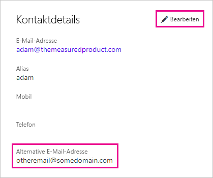

# <a name="use-an-alternate-email-address"></a>Verwenden einer alternativen E-Mail-Adresse

Wenn Sie sich für Power BI registrieren, müssen Sie eine E-Mail-Adresse angeben. Power BI verwendet diese Adresse standardmäßig, um Ihnen Updates zu den Aktivitäten in diesem Dienst zu senden. Wenn Ihnen beispielsweise ein Benutzer eine Freigabeeinladung sendet, wird diese Adresse verwendet.

Es gibt jedoch Fälle, in denen diese E-Mails an eine andere als die bei der Registrierung verwendete Adresse gesendet werden sollen. In diesem Artikel wird erläutert, wie Sie eine alternative E-Mail-Adresse in Microsoft 365 und PowerShell angeben. In diesem Artikel wird außerdem beschrieben, wie eine E-Mail-Adresse in Azure Active Directory (Azure AD) aufgelöst wird.

> [!NOTE]
> Die Angabe einer alternativen Adresse wirkt sich nicht auf die E-Mail-Adresse aus, die Power BI für Dienstupdates, Newsletter und andere Werbekommunikation verwendet. Diese Informationen werden immer an die E-Mail-Adresse gesendet, die Sie beim Registrieren für Power BI angegeben haben.

## <a name="use-microsoft-365"></a>Verwenden von Microsoft 365

Führen Sie die folgenden Schritte aus, um eine alternative E-Mail-Adresse in Microsoft 365 anzugeben.

1. Öffnen Sie die Seite [Persönliche Informationen](https://portal.office.com/account/#personalinfo) Ihres Kontos. Wenn die App Sie dazu auffordert, melden Sie sich mit der E-Mail-Adresse und dem Kennwort an, die Sie für Power BI verwenden.

1. Wählen Sie im linken Menü **Persönliche Informationen** aus.

1. Klicken Sie im Abschnitt mit den **Kontaktdetails** auf **Bearbeiten**.

    Wenn Sie die Informationen nicht bearbeiten können, bedeutet dies, dass Ihre E-Mail-Adresse von Ihrem Administrator verwaltet wird. Wenden Sie sich an Ihren Administrator, um Ihre E-Mail-Adresse zu aktualisieren.

    

1. Geben Sie im Feld **Alternative E-Mail-Adresse** die E-Mail-Adresse ein, die Microsoft 365 für Power BI-Updates verwenden soll.

## <a name="use-powershell"></a>Verwenden von PowerShell

Um in PowerShell eine alternative Adresse anzugeben, verwenden Sie den Befehl [Set-AzureADUser](/powershell/module/azuread/set-azureaduser/).

```powershell
Set-AzureADUser -ObjectId john@contoso.com -OtherMails "otheremail@somedomain.com"
```

## <a name="email-address-resolution-in-azure-ad"></a>Auflösung der E-Mail-Adresse in Azure AD

Bei der Erfassung eines integrierten Azure AD-Tokens für Power BI können Sie einen von drei verschiedenen E-Mail-Adresstypen verwenden:

* Die Haupt-E-Mail-Adresse, die dem Azure AD-Konto eines Benutzers zugeordnet ist

* Die UPN-E-Mail-Adresse (UserPrincipalName)

* Das Attribut für das Array *Andere E-Mail-Adresse*

Power BI wählt anhand der folgenden Kriterien (in der angegebenen Reihenfolge) aus, welche E-Mail-Adresse verwendet werden soll:

1. Wenn das E-Mail-Attribut im Azure AD-Benutzerobjekt vorhanden ist, verwendet Power BI dieses E-Mail-Attribut für die E-Mail-Adresse.

1. Wenn es sich bei der UPN-E-Mail-Adresse *nicht* um eine E-Mail-Adresse der Domäne **\*.onmicrosoft.com** handelt (die Informationen hinter dem Symbol „\@“), verwendet Power BI dieses E-Mail-Attribut für die E-Mail-Adresse.

1. Wenn das Attribut für das Array *Andere E-Mail-Adresse* im Azure AD-Benutzerobjekt vorhanden ist, verwendet Power BI die erste E-Mail-Adresse in dieser Liste (dieses Attribut kann eine Liste mit E-Mail-Adressen enthalten).

1. Wenn keine der oben genannten Bedingungen erfüllt ist, verwendet Power BI wird die UPN-Adresse.

Weitere Fragen? [Wenden Sie sich an die Power BI-Community](https://community.powerbi.com/)