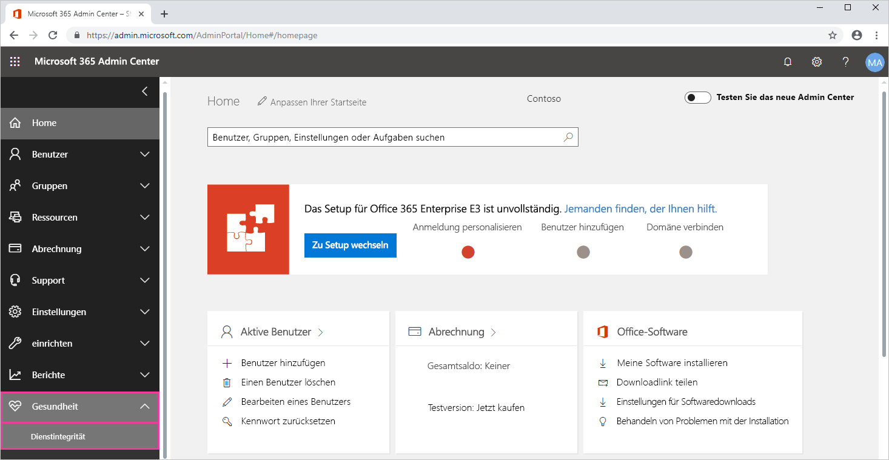
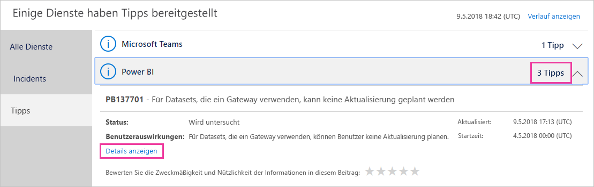
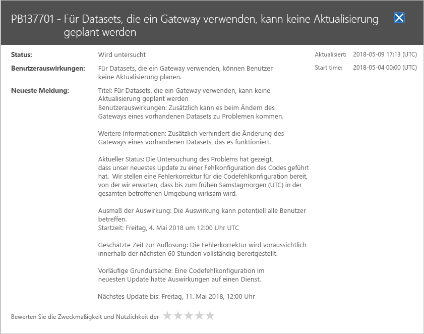

# Nachverfolgen des Power BI-Dienststatus in Microsoft 365

Das Microsoft 365 Admin Center stellt wichtige Tools für Power BI-Administratoren bereit. Die Tools umfassen aktuelle und Verlaufsinformationen zur Dienstintegrität. Um auf Dienstintegritätsinformationen zuzugreifen, müssen Sie eine der folgenden Rollen besitzen:

* Power BI-Dienstadministrator

* Globaler Administrator

Weitere Informationen zu Rollen finden Sie unter [Administratorrollen in Zusammenhang mit Power BI](service-admin-administering-power-bi-in-your-organization.md#administrator-roles-related-to-power-bi).

1. Melden Sie sich beim [Microsoft 365 Admin Center](https://portal.office.com/adminportal) an.

1. Wählen Sie im Navigationsbereich **Alle anzeigen** > **Integrität** > **Dienstintegrität** aus. Die Seite „Dienstintegrität“ wird angezeigt:

    

1. Wählen Sie in der Liste **Alle Dienste** die Option **Empfehlungen** oder **Vorfälle** aus, und sehen Sie sich die Ergebnisse an. Im folgenden Screenshot sehen Sie eine der drei aktiven Empfehlungen.

    

1. Um weitere Informationen zu einem Element anzuzeigen, wählen Sie **Details anzeigen** aus. Im folgenden Screenshot sehen Sie zusätzliche Details, einschließlich kürzlich erfolgter Statusupdates.

    

    Scrollen Sie nach unten, um weitere Informationen anzuzeigen, und schließen Sie den Bereich, wenn Sie fertig sind.

1. Um Verlaufsinformationen für alle Dienste anzuzeigen, wählen Sie oben rechts auf der Seite **Dienstintegrität** die Option **Verlauf anzeigen** aus. Wählen Sie dann **Letzte 7 Tage** oder **Letzte 30 Tage** aus. 

1. Um zum aktuellen Dienststatus zurückzukehren, wählen Sie **Aktuellen Status anzeigen** aus.