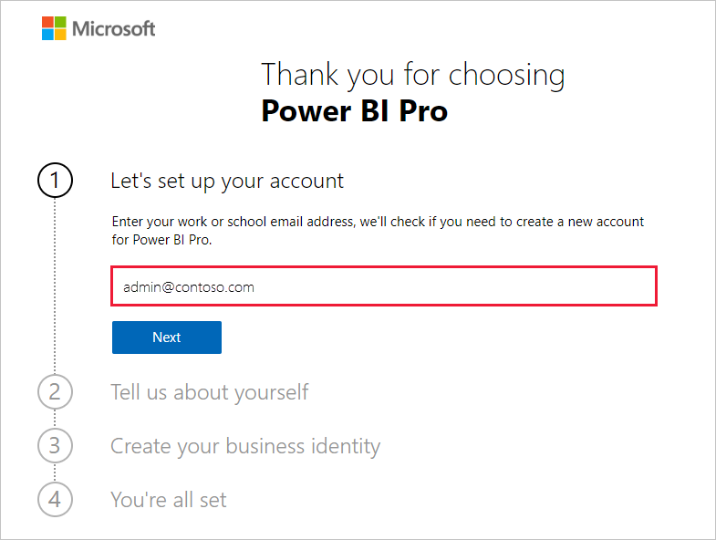

# Erwerb eines Power BI-Abonnements für Ihre Organisation

Administratoren können sich über die Seite **Dienste kaufen** im Microsoft 365 Admin Center für Power BI registrieren. Wenn sich Administratoren für Power BI registrieren, können sie Benutzern, die Zugriff erhalten sollten, Lizenzen zuweisen.

Benutzer in Ihrer Organisation können sich über die Power BI-Website für Power BI registrieren. Wenn ein Benutzer in Ihrer Organisation sich für Power BI registriert, wird ihm automatisch eine Power BI-Lizenz zugewiesen. Wenn Sie diese Self-Service-Funktionen deaktivieren möchten, befolgen Sie die Schritte unter [Aktivieren oder Deaktivieren von Self-Service-Registrierung und -Käufen](service-admin-disable-self-service.md).

## Registrieren über Microsoft 365

Wenn Sie ein globaler Administrator oder Abrechnungsadministrator sind, können Sie ein Power BI-Abonnement für Ihre Organisation erwerben. Weitere Informationen finden Sie unter [Wer kann Lizenzen erwerben und zuweisen?](service-admin-licensing-organization.md#who-can-purchase-and-assign-licenses).

> [!NOTE]
>
> Ein Microsoft 365 E5-Abonnement enthält bereits Power BI Pro-Lizenzen. Informationen zum Verwalten von Lizenzen finden Sie unter [Anzeigen und Verwalten von Benutzerlizenzen](service-admin-manage-licenses.md).
>
>

Führen Sie diese Schritte aus, um Power BI Pro-Lizenzen im Microsoft 365 Admin Center zu erwerben:

1. Melden Sie sich beim [Microsoft 365 Admin Center](https://admin.microsoft.com) an.

2. Klicken Sie im Navigationsmenü auf **Abrechnung** > **Dienste erwerben**.
  
   

3. Suchen Sie das Abonnement, oder scrollen Sie zu dem Abonnement, das Sie erwerben möchten. Sie finden **Power BI** unter **Weitere Kategorien, die Sie interessieren könnten** im unteren Bereich der Seite. Klicken Sie auf den Link, um die für Ihre Organisation verfügbaren Power BI-Abonnements anzuzeigen.

4. Wählen Sie ein Angebot wie Power BI Pro aus.

5. Klicken Sie auf der Seite **Dienste erwerben** auf **Kaufen**. Sie können mit einer kostenlosen Testversion für Power BI Pro beginnen, wenn sie noch keines verwendet haben. Diese umfasst 25 Lizenzen und läuft nach einem Monat ab.

   

6. Wählen Sie je nach bevorzugter Zahlungsart **Monatlich bezahlen** oder **Für ein volles Jahr bezahlen** aus.

7. Geben Sie unter **Wie viele Benutzerlizenzen möchten Sie erwerben?** die gewünschte Anzahl von Lizenzen ein, und klicken Sie dann auf **Jetzt auschecken**, um die Transaktion abzuschließen.

8. Um Ihren Kauf zu bestätigen, wechseln Sie zu **Abrechnung** > **Produkte und Dienste**, und suchen Sie nach **Power BI Pro**.

Weitere Informationen darüber, wie Ihre Organisation den Power BI-Dienst kontrollieren und erwerben kann, finden Sie unter [Power BI in Ihrer Organisation](https://docs.microsoft.com/microsoft-365/admin/misc/power-bi-in-your-organization?view=o365-worldwide).

## Weitere Methoden zum Erhalten von Power BI für Ihre Organisation

Wenn Sie noch kein Microsoft 365-Abonnement sind, verwenden Sie die Schritte unten, um eine Power BI Pro-Testversion für Ihre Organisation zu erhalten. Alternativ können Sie sich [für eine neue Microsoft 365-Testversion registrieren](service-admin-signing-up-for-power-bi-with-a-new-office-365-trial.md) und dann Power BI hinzufügen, indem Sie die Schritte im vorherigen Abschnitt ausführen.

Sie benötigen ein Geschäfts-, Schul- oder Unikonto, um sich für ein Power BI-Abonnement zu registrieren. Es werden keine E-Mail-Adressen unterstützt, die von E-Mail-Diensten für Endkunden oder von Telekommunikationsanbietern zur Verfügung gestellt werden. Wenn Sie kein Geschäfts-, Schul- oder Unikonto besitzen, können Sie bei der Registrierung ein Konto erstellen.

Folgende Schritte sind für die Registrierung erforderlich:

1. Rufen Sie die [Power BI Pro-Registrierung](https://signup.microsoft.com/create-account/signup?OfferId=d59682f3-3e3b-4686-9c00-7c7c1c736085&ali=1&products=d59682f3-3e3b-4686-9c00-7c7c1c736085) auf. 

2. Geben Sie Ihre Geschäfts-, Schul- oder Uni-E-Mail-Adresse ein, und klicken Sie dann auf **Weiter**. Sie können auch eine E-Mail-Adresse eingeben, die nicht als Geschäfts-, Schul- oder Uni-E-Mail-Adresse angesehen wird. Beim Erstellen Ihrer Geschäftsidentität wird ein neues Konto für Sie eingerichtet.

   

3. Wir führen eine schnelle Überprüfung durch, um festzustellen, ob Sie ein neues Konto erstellen müssen. Klicken Sie auf **Konto einrichten**, um mit dem Registrierungsprozess fortzufahren.

   > [!NOTE]
   >Wenn Ihre E-Mail-Adresse bereits für einen anderen Microsoft-Dienst verwendet wird, können Sie auf **Anmelden** klicken oder **ein neues Konto erstellen**. Wenn Sie sich dazu entscheiden, ein neues Konto zu erstellen, führen Sie die folgenden Einrichtungsschritte aus.
>
>
 
4. Füllen Sie das Formular mit Informationen zu Ihrer Person aus. Achten Sie darauf, dass Sie das richtige Land bzw. die richtige Region auswählen. Das ausgewählte Land bestimmt, wo Ihre Daten gespeichert werden. Dies wird unter [Bestimmen des Standorts Ihres Power BI-Mandanten](service-admin-where-is-my-tenant-located.md#how-to-determine-where-your-power-bi-tenant-is-located) erläutert.

   

5. Wählen Sie **Weiter** aus. Wir müssen einen Prüfcode an Sie senden, um Ihre Identität zu verifizieren. Geben Sie eine Telefonnummer an, über die wir Sie per Textnachricht oder Anruf kontaktieren können. Klicken Sie dann auf **Prüfcode senden**.

6. Geben Sie den Prüfcode ein, und fahren Sie dann mit dem **Erstellen Ihrer Geschäftsidentität** fort.

   

    Geben Sie einen Kurznamen für Ihr Geschäft ein. Zunächst wird überprüft, ob dieser verfügbar ist. Dieser Kurzname wird zum Erstellen Ihres Organisationsnamen im Rechenzentrum als Unterdomäne von onmicrosoft.com verwendet. Sie können später Ihre eigene Geschäftsdomäne hinzufügen. Machen Sie sich keine Gedanken darüber, wenn Ihr gewünschter Kurzname bereits vergeben ist. Wahrscheinlich hat jemand mit einem ähnlichen Unternehmensnamen bereits denselben Kurznamen gewählt. Versuchen Sie einfach eine andere Variation. Wählen Sie **Weiter** aus.
    
7. Erstellen Sie Ihre Benutzer-ID und Ihr Kennwort, mit denen Sie sich bei Ihrem Konto anmelden. Klicken Sie abschließend auf **Registrieren**.

Das Konto, das Sie soeben erstellt haben, ist nun der globale Administrator eines neuen Power BI Pro-Testmandanten. Sie können Sie beim [Microsoft 365 Admin Center](https://admin.microsoft.com) anmelden, um weitere Benutzer hinzuzufügen, eine benutzerdefinierte Domäne einzurichten, weitere Dienste zu erwerben und Ihr Power BI-Abonnement zu verwalten.

## Nächste Schritte

- [Anzeigen und Verwalten von Benutzerlizenzen](service-admin-manage-licenses.md)
- [Aktivieren oder Deaktivieren von Self-Service-Registrierung und -Käufen](service-admin-disable-self-service.md)
- [Dokumentation zu Business-Abonnements und Abrechnung](https://docs.microsoft.com/microsoft-365/commerce/?view=o365-worldwide)
