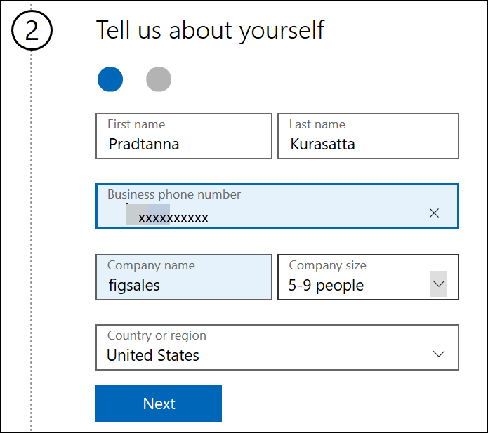

# Registrieren für Power BI mit einer neuen Microsoft 365-Testversion

In diesem Artikel wird eine alternative Methode für die Registrierung für Power BI beschrieben, wenn Sie nicht bereits über eine Geschäfts-, Schul- oder Uni-E-Mail-Adresse verfügen.

Wenn Sie Probleme damit haben, sich mit Ihrer E-Mail-Adresse für Power BI zu registrieren, stellen Sie zunächst sicher, dass [die E-Mail-Adresse mit Power BI verwendet werden kann](../fundamentals/service-self-service-signup-for-power-bi.md#supported-email-addresses). Wenn das nicht funktioniert, registrieren Sie sich für eine Microsoft 365-Testversion, und erstellen Sie ein Geschäftskonto. Verwenden Sie dann das neue Geschäftskonto, um sich für den Power BI-Dienst zu registrieren. Sie können Power BI auch dann weiter verwenden, wenn die Microsoft 365-Testversion abgelaufen ist.

> [!NOTE]
> Office 365 wurde vor kurzem in Microsoft 365 umbenannt. Bis alle Artikel aktualisiert wurden, sehen Sie möglicherweise weiterhin die Bezeichnung Office 365.

## Registrieren für Microsoft 365-Testversion von Office
Melden Sie sich [auf der Microsoft 365-Website](https://www.microsoft.com/microsoft-365/business/compare-more-office-365-for-business-plans) für eine Microsoft 365-Testversion an. Wenn Sie noch nicht über ein Konto verfügen, führt Sie Microsoft durch die Schritte zum Erstellen eines Kontos. Da kommerzielle E-Mail-Konten (wie Hotmail und Gmail) nicht mit Microsoft 365 funktionieren, erstellen Sie ein neues Konto.  Dieses E-Mail-Konto sieht in etwa wie folgt aus: *zalan@onmicrosoft.com* .

Wenn Sie die Option **Office 365 E5** auswählen, enthält die Testversion auch Power BI Pro. Die Testversion von Power BI Pro läuft am gleichen Tag wie die Testversion von Office 365 E5 ab, die derzeit 30 Tage genutzt werden kann. Wenn Sie stattdessen **Office 365 E3** auswählen, können Sie sich als Benutzer der *Free-Version* für Power BI registrieren und ein Upgrade auf die 60 Tage lang gültige **Pro-Version** durchführen. 

1. Geben Sie Ihre E-Mail-Adresse ein. Microsoft informiert Sie darüber, dass die E-Mail-Adresse mit Microsoft 365 funktioniert oder Sie eine neue E-Mail-Adresse erstellen müssen.  

    Wenn Sie eine neue E-Mail-Adresse benötigen, führt Sie Microsoft durch die einzelnen Schritte zum Erstellen der neuen Adresse. Der erste Schritt besteht darin, ein neues Konto zu erstellen. Klicken Sie auf **Konto einrichten**.

    

2. Geben Sie Details zum neuen Konto ein.

    

3. Erstellen Sie eine neue E-Mail-Adresse und ein neues Kennwort. Erstellen Sie einen neuen Anmeldenamen, der in etwa wie folgt aussieht: you@yourcompany.onmicrosoft.com. Dies ist der Anmeldename, den Sie für Ihr Office 365-Konto und Power BI verwenden.

    

4. Das ist alles.  Sie verfügen nun über eine E-Mail-Adresse, die Sie für die Registrierung für Power BI verwenden können. Fahren Sie mit dem Artikel [Registrieren für Power BI als Einzelperson](../service-self-service-signup-for-power-bi.md) fort.

     

    Möglicherweise müssen Sie warten, bis Ihr neuer Mandant erstellt wird.

## Wichtige Hinweise

Wenn beim Anmelden mit dem neuen Konto Probleme auftreten, versuchen Sie die Anmeldung in einer privaten Browsersitzung.

Mit dieser Registrierungsmethode erstellen Sie einen neuen organisatorischen Mandanten und werden zum Administrator dieses Mandanten. Weitere Informationen finden Sie unter [Was ist die Power BI-Verwaltung?](service-admin-administering-power-bi-in-your-organization.md). Sie können Ihrem Mandanten neue Benutzer hinzufügen und diesen für andere Benutzer freigeben, wie in der [Administratorhilfe zu Microsoft 365](https://support.office.com/article/Add-users-individually-to-Office-365---Admin-Help-1970f7d6-03b5-442f-b385-5880b9c256ec) beschrieben.

## Nächste Schritte

[Was ist die Power BI-Verwaltung?](service-admin-administering-power-bi-in-your-organization.md)  
[Power BI licensing in your organization (Power BI-Lizenzierung in Ihrem Unternehmen)](service-admin-licensing-organization.md)  
[Registrieren für Power BI als Einzelperson](../fundamentals/service-self-service-signup-for-power-bi.md)

Weitere Fragen? [Stellen Sie Ihre Frage in der Power BI-Community.](https://community.powerbi.com/)
