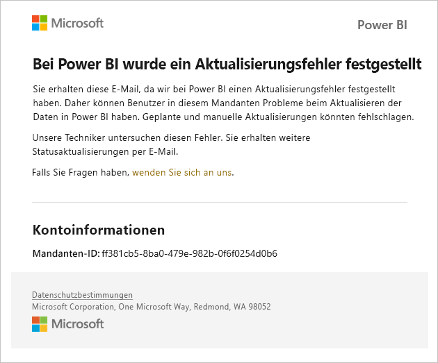
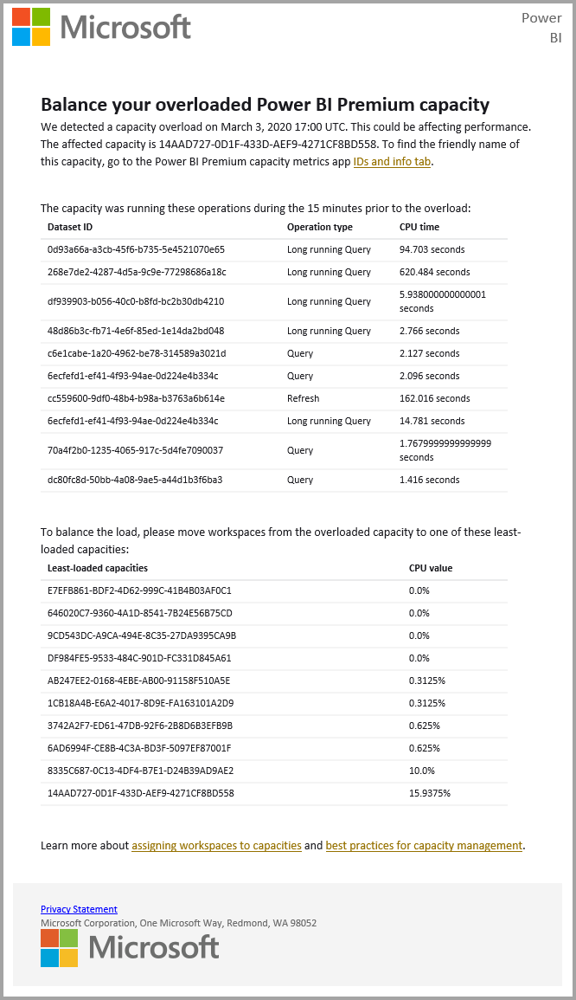
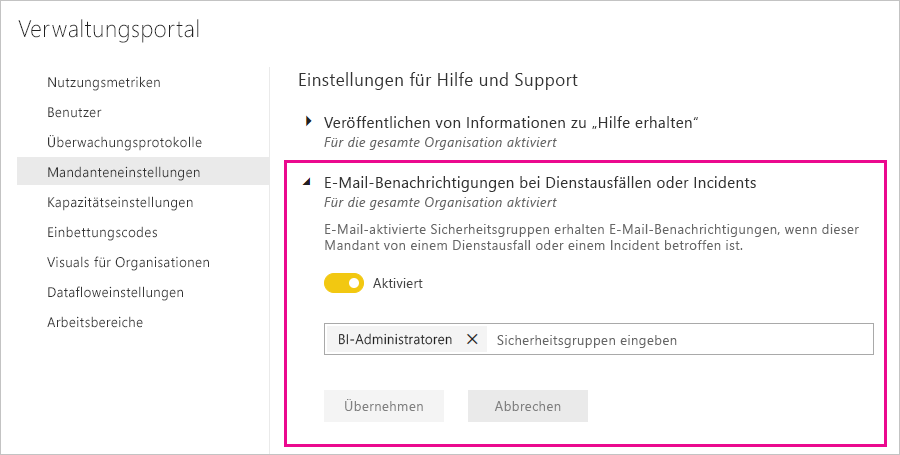

# Dienstunterbrechungsbenachrichtigungen

Es ist entscheidend, dass Sie Einblicke in die Verfügbarkeit Ihrer unternehmenskritischen Geschäftsanwendungen haben. Power BI stellt eine Benachrichtigung für Incidents bereit, sodass Sie optional E-Mails erhalten können, wenn ein Dienst unterbrochen oder beeinträchtigt ist. Auch wenn solche Incidents durch die Power BI-SLA (Vereinbarung zum Servicelevel) von 99,9 % nur selten sind, möchten wir sicherstellen, dass Sie stets informiert sind. Im folgenden Screenshot wird dargestellt, wie die E-Mail aussieht, die Sie erhalten, falls Sie die Benachrichtigungen aktivieren:

Derzeit senden wir E-Mails zu folgenden _Zuverlässigkeitsszenarios_:

- Zuverlässigkeit des Öffnens eines Berichts
- Zuverlässigkeit der Aktualisierung eines Modells
- Zuverlässigkeit der Aktualisierung einer Abfrage

Benachrichtigungen werden gesendet, wenn eine _längere Verzögerung_ bei Vorgängen wie dem Öffnen von Berichten, dem Aktualisieren von Datasets oder dem Ausführen von Abfragen eintritt. Nachdem ein Incident aufgelöst wurde, erhalten Sie erneut eine E-Mail.

> [!NOTE]
> Diese Funktion ist zurzeit nur für dedizierte Kapazitäten in Power BI Premium verfügbar. Sie ist nicht für gemeinsam genutzte oder eingebettete Kapazität verfügbar.

## Benachrichtigungen zu Kapazität und Zuverlässigkeit

Wenn eine Power BI Premium-Kapazität mehrmals über einen längeren Zeitraum hinweg einen hohen Ressourcenverbrauch aufweist, die sich potenziell auf die Zuverlässigkeit auswirkt, wird eine Benachrichtigung per E-Mail gesendet. Beispiele für solche Auswirkungen sind lange Verzögerungen bei Vorgängen wie z. B. dem Öffnen eines Berichts, dem Aktualisieren von Datasets und dem Ausführen von Abfragen. 

Die E-Mail-Benachrichtigung enthält Informationen zur Ursache des hohen Ressourcenverbrauchs, darunter Folgendes:

* Dataset-ID des verantwortlichen Datasets
* Vorgangsart
* CPU-Zeit, die dem hohen Ressourcenverbrauch zugeordnet wird

Power BI sendet auch E-Mail-Benachrichtigungen, wenn eine Überlastung in einer Power BI Premium-Kapazität erkannt wird. In der E-Mail wird die wahrscheinliche Ursache für die Überlastung erläutert und aufgeführt, welche Vorgänge die Auslastung in den letzten 10 Minuten generiert haben und wie viel Auslastung von jedem Vorgang generiert wurde. 

Wenn Sie über mehr als eine Premium-Kapazität verfügen, enthält die E-Mail Informationen zu diesen Kapazitäten im Zeitraum der Überlastung. Dadurch können Sie sich überlegen, ob Sie die Arbeitsbereiche mit ressourcenintensiven Elementen in die Kapazitäten mit der geringsten Auslastung verschieben.

E-Mail-Benachrichtigungen zu Überlastungen werden nur gesendet, wenn ein Überlastungsschwellenwert überschritten wird. Sie erhalten keine zweite E-Mail, wenn die Auslastung dieser Premium-Kapazität nicht mehr überlastet ist.

Die folgende Abbildung zeigt ein Beispiel für eine E-Mail-Benachrichtigung:

## Aktivieren von Benachrichtigungen

Ein Power BI-Mandantenadministrator aktiviert Benachrichtigungen im Verwaltungsportal:

1. Ermitteln oder erstellen Sie eine E-Mail-fähige Sicherheitsgruppe, die Benachrichtigungen erhalten soll.

1. Wählen Sie im Verwaltungsportal **Mandanteneinstellungen** aus. Erweitern Sie unter **Hilfe- und Supporteinstellungen** die Option **E-Mail-Benachrichtigungen bei Dienstausfällen oder Incidents**.

1. Aktivieren Sie die Benachrichtigungen, geben Sie eine Sicherheitsgruppe ein, und klicken Sie auf **Anwenden**.

    

> [!NOTE]
> Power BI sendet Benachrichtigungen vom Konto no-reply-powerbi@microsoft.com aus. Stellen Sie sicher, dass dieses Konto in die Whitelist aufgenommen wird, damit Benachrichtigungen nicht in einem Spam- oder Junk-Ordner landen.

## Nächste Schritte

[Power BI Pro und Power BI Premium: Supportoptionen](service-support-options.md)

Weitere Fragen? [Wenden Sie sich an die Power BI-Community](https://community.powerbi.com/)
