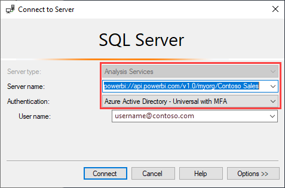

# Konnektivität mit Datasets mithilfe des XMLA-Endpunkts (Vorschau)

Power BI Premium-Arbeitsbereiche und Datasets mit dem Kompatibilitätsgrad 1500 und höher unterstützen durch die Verwendung eines *XMLA-Endpunkts* die Open Platform-Konnektivität von Microsoft- und Drittanbieter-Clientanwendungen und -tools.

> [!NOTE]
> Dieses Feature befindet sich in der **Vorschau**. Die Features in der Vorschau sollten nicht in einer Produktionsumgebung verwendet werden. Bestimmte Funktionen, der Support und die Dokumentation sind eingeschränkt.  Weitere Informationen finden Sie in den [Microsoft Online Services-Nutzungsbedingungen](https://www.microsoft.com/licensing/product-licensing/products?rtc=1).

## Was ist ein XMLA-Endpunkt?

Power BI Premium verwendet das [XML for Analysis](https://docs.microsoft.com/analysis-services/xmla/xml-for-analysis-xmla-reference?view=power-bi-premium-current)-Protokoll (XMLA) für den Datenaustausch zwischen Clientanwendungen und der Engine, die Ihre Power BI-Arbeitsbereiche und -Datasets verwaltet. Diese Kommunikationsvorgänge erfolgen über das, was allgemein als XMLA-Endpunkte bezeichnet wird. XMLA ist das gleiche Kommunikationsprotokoll, das von der Microsoft Analysis Services-Engine verwendet wird, die hinter den Kulissen arbeitet und die semantische Modellierung, die Governance, den Lebenszyklus und die Datenverwaltung von Power BI ausführt.

Standardmäßig ist die Konnektivität mit *Lesezugriff* unter Verwendung des Endpunkts für die **Datasetworkload** in einer Kapazität aktiviert. Mit schreibgeschützten Anwendungen und Tools für die Datenvisualisierung können Modelldaten, Metadaten, Ereignisse und Schemas von Datasets abgefragt werden. *Lese-/Schreibvorgänge*, die den Endpunkt verwenden, können aktiviert werden und bieten zusätzliche Funktionen für die Verwaltung von Datasets, Governance, erweiterte semantische Modellierung, Debugging und Überwachung. Mit aktiviertem Lese-/Schreibzugriff sind Power BI Premium-Datasets mit Azure Analysis Services- und SQL Server Analysis Services-Tools und Prozessen für die tabellarische Modellierung auf Unternehmensebene gleichwertiger.

> [!NOTE]
> Es wird empfohlen, die neue Arbeitsbereichsfunktion zu verwenden, insbesondere wenn Sie eine Verbindung mit Ihren Datasets über den XMLA-Endpunkt herstellen. Vorgänge wie das Erstellen oder Löschen von Datasets werden in klassischen Arbeitsbereichen nicht unterstützt. Informationen zum Aktualisieren klassischer Arbeitsbereiche auf die moderne Darstellung finden Sie unter [Aktualisieren von klassischen Arbeitsbereichen in Power BI](../collaborate-share/service-upgrade-workspaces.md).

## Tools für Datenmodellierung und -verwaltung

Dies sind einige der am häufigsten verwendeten Tools, die mit Azure Analysis Services und SQL Server Analysis Services verwendet werden und nun von Power BI Premium-Datasets unterstützt werden:

**Visual Studio mit Analysis Services-Projekten**  – Auch als SQL Server Data Tools oder einfach **SSDT** bezeichnet, ist ein Modellierungstool zur Erstellung von tabellarischen Analysis Services-Modellen auf Unternehmensebene. Analysis Services-Projekterweiterungen werden von allen Visual Studio 2017- und späteren Editionen unterstützt, wie z.B. der kostenlosen Community-Edition. Für die Bereitstellung von tabellarischen Modellen in einem Premium-Arbeitsbereich ist die Erweiterungsversion 2.9.6 oder höher erforderlich. Beim Einsatz in einem Premium-Arbeitsbereich muss das Modell den Kompatibilitätsgrad 1500 oder höher aufweisen. Für die Datasets ist XMLA-Lese-/Schreibzugriff erforderlich. Weitere Informationen finden Sie unter [Tools für Analysis Services](https://docs.microsoft.com/analysis-services/tools-and-applications-used-in-analysis-services?view=power-bi-premium-current).

**SQL Server Management Studio (SSMS)**   – unterstützt DAX-, MDX- und XMLA-Abfragen. Führen Sie mit der [Tabular Model Scripting Language](https://docs.microsoft.com/analysis-services/tmsl/tabular-model-scripting-language-tmsl-reference) (TMSL) präzise Aktualisierungsvorgänge und Skripterstellungen für Datasetmetadaten durch. Für Abfragevorgänge ist Lesezugriff erforderlich. Für das Erstellen von Metadatenskripts ist Lese-/Schreibzugriff erforderlich. Erfordert die SSMS-Version 18.4 oder höher.  [Hier](https://docs.microsoft.com/sql/ssms/download-sql-server-management-studio-ssms) herunterladen.

**SQL Server Profiler**  – Dieses mit SSMS installierte Tool ermöglicht das Verfolgen und Debuggen von Datasetereignissen. Trotz der offiziellen Einstufung als veraltet für SQL Server ist der Profiler auch weiterhin in SSMS enthalten und wird für Analysis Services und Power BI Premium weiterhin unterstützt. XMLA-Lesezugriff ist erforderlich. Weitere Informationen finden Sie unter  [SQL Server Profiler für Analysis Services](https://docs.microsoft.com/analysis-services/instances/use-sql-server-profiler-to-monitor-analysis-services?view=power-bi-premium-current).

**Bereitstellungs-Assistent für Analysis Services**  – Dieses mit SSMS installierte Tool ermöglicht die Bereitstellung von mit Visual Studio erstellten Projekten mit tabellarischen Modellen in Analysis Services und Power BI Premium-Arbeitsbereichen. Er kann interaktiv oder über die Befehlszeile zur automatischen Ausführung gestartet werden. XMLA-Schreib-/Lesezugriff ist erforderlich. Weitere Informationen finden Sie unter [Bereitstellungs-Assistent für Analysis Services](https://docs.microsoft.com/analysis-services/deployment/deploy-model-solutions-using-the-deployment-wizard?view=power-bi-premium-current).

**PowerShell-Cmdlets**  – Analysis Services-Cmdlets können zur Automatisierung von Dataset-Verwaltungsaufgaben wie Aktualisierungsvorgängen verwendet werden. XMLA-Schreib-/Lesezugriff ist erforderlich. Version **21.1.18221** oder höher des [SqlServer-PowerShell-Moduls](https://www.powershellgallery.com/packages/SqlServer/) ist erforderlich. Die Azure Analysis Services-Cmdlets im Az.AnalysisServices-Modul werden für Power BI Premium nicht unterstützt. Einzelheiten dazu finden Sie unter [PowerShell-Referenz zu Analysis Services](https://docs.microsoft.com/analysis-services/powershell/analysis-services-powershell-reference?view=power-bi-premium-current).

**Power BI-Berichts-Generator**  – Ein Tool, das für das Erstellen von paginierten Berichten verwendet wird. Erstellen Sie eine Berichtsdefinition, die angibt, welche Daten abgerufen werden sollen, wo Sie abgerufen werden können und wie sie angezeigt werden sollen. Sie können eine Vorschau Ihres Berichts im Berichts-Generator anzeigen und dann im Power BI-Dienst veröffentlichen. XMLA-Lesezugriff ist erforderlich. Weitere Informationen finden Sie unter  [Power BI-Berichts-Generator](https://docs.microsoft.com/power-bi/report-builder-power-bi).

**Tabellen-Editor** – Ein Open-Source-Tool zur Erstellung, Bearbeitung und Verwaltung tabellarischer Modelle mit einem intuitiven, benutzerfreundlichen Editor. Eine hierarchische Ansicht zeigt alle Objekte in Ihrem tabellarischen Modell. Objekte sind in Anzeigeordnern mit Unterstützung für die Bearbeitung mehrerer ausgewählter Eigenschaften und die Hervorhebung der DAX-Syntax organisiert. Für Abfragevorgänge ist XMLA-Lesezugriff erforderlich. Für Metadatenvorgänge ist Lese-/Schreibzugriff erforderlich. Weitere Informationen erhalten Sie unter [tabulareditor.github.io](https://tabulareditor.github.io/).

**DAX Studio**  – Ein Open-Source-Tool für die Erstellung, Diagnose, Leistungsoptimierung und Analyse von DAX. Zu den Features gehören Objektsuche, Integrierte Ablaufverfolgung, Aufschlüsselung der Abfrageausführung mit detaillierten Statistiken, Hervorhebung und Formatierung der DAX-Syntax. Für Abfragevorgänge ist XMLA-Lesezugriff erforderlich. Weitere Informationen finden Sie unter  [daxstudio.org](https://daxstudio.org/).

**ALM-Toolkit** – Ein Open-Source-Schemavergleichstool für Power BI-Datasets, das am häufigsten für ALM-Szenarios (Application Lifecycle Management) verwendet wird. Führen Sie die Bereitstellung in verschiedenen Umgebungen durch und behalten Sie die inkrementelle Aktualisierung der Verlaufsdaten bei. Vergleichen Sie Metadatendateien, Branches und Repositorys und führen Sie sie zusammen. Verwenden Sie gängige Definitionen zwischen den einzelnen Datasets wieder. Für Abfragevorgänge ist Lesezugriff erforderlich. Für Metadatenvorgänge ist Lese-/Schreibzugriff erforderlich. Weitere Informationen finden Sie unter  [alm-toolkit.com](http://alm-toolkit.com/).

**Microsoft Excel**  – Excel-Pivottabellen sind eines der gängigsten Tools, mit denen Sie Übersichtsdaten aus Power BI-Datasets zusammenfassen, analysieren, untersuchen und darstellen können. Für Abfragevorgänge ist Lesezugriff erforderlich. Klick-und-Los-Version 16.0.11326.10000 oder höher von Office ist erforderlich.

**Drittanbieter**  – Dazu gehören Clientanwendungen zur Datenvisualisierung und Tools, mit denen Verbindungen zu Datasets in Power BI Premium hergestellt, diese abgefragt und verbraucht werden können. Für die meisten Tools sind die aktuellsten Versionen der MSOLAP-Clientbibliotheken erforderlich, für einige jedoch möglicherweise ADOMD. Der XMLA-Endpunkt mit Lese- oder Lese-/Schreibzugriff hängt von den Vorgängen ab.

### Clientbibliotheken

Clientanwendungen kommunizieren nicht direkt mit dem XMLA-Endpunkt. Stattdessen verwenden sie *Clientbibliotheken* als Abstraktionsschicht. Dies sind die gleichen Clientbibliotheken, die von den Anwendungen zur Verbindung mit Azure Analysis Services und SQL Server Analysis Services verwendet werden. Microsoft-Anwendungen wie Excel, SQL Server Management Studio (SSMS) und Analysis Services-Projekterweiterungen für Visual Studio installieren alle drei Clientbibliotheken und aktualisieren sie im Rahmen der regulären Anwendungs- und Erweiterungsupdates. Entwickler können auch die Clientbibliotheken verwenden, um benutzerdefinierte Anwendungen zu erstellen. In manchen Fällen, insbesondere bei der Arbeit mit Drittanbieteranwendungen, müssen möglicherweise neuere Versionen der Clientbibliotheken installiert werden, falls diese nicht mit der Anwendung installiert wurden. Clientbibliotheken werden monatlich aktualisiert. Weitere Informationen finden Sie unter  [Clientbibliotheken zum Herstellen einer Verbindung mit Analysis Services](https://docs.microsoft.com/azure/analysis-services/analysis-services-data-providers).

## Unterstützte Schreibvorgänge

Die Datasetmetadaten werden über die Clientbibliotheken auf der Grundlage des TOM (Tabellenobjektmodell) verfügbar gemacht, damit Entwickler benutzerdefinierte Anwendungen erstellen können. So können Visual Studio und Open-Source-Communitytools wie der Tabellen-Editor zusätzliche Datenmodellierungs- und Bereitstellungsfunktionen bieten, die von der Analysis Services-Engine, aber noch nicht in Power BI Desktop unterstützt werden. Zu den zusätzlichen Funktionen für die Datenmodellierung gehören Folgende:

- [Berechnungsgruppen](https://docs.microsoft.com/analysis-services/tabular-models/calculation-groups?view=power-bi-premium-current) für die erneute Verwendung von Berechnungen und die vereinfachte Nutzung komplexer Modelle.

- [Metadatenübersetzungen](https://docs.microsoft.com/analysis-services/tabular-models/translations-in-tabular-models-analysis-services?view=power-bi-premium-current), um mehrsprachige Berichte und Datasets zu unterstützen.

- [Perspektiven](https://docs.microsoft.com/analysis-services/tabular-models/perspectives-ssas-tabular?view=power-bi-premium-current), um fokussierte, unternehmensspezifische Ansichten von Datasetmetadaten zu definieren.

Sicherheit auf Objektebene (OLS) wird in Power BI Premium-Datasets noch nicht unterstützt.

## Optimieren von Datasets für Schreibvorgänge

Es wird empfohlen, bei der Verwendung des XMLA-Endpunkts für die Verwaltung von Datasets mit Schreibvorgängen das Dataset für große Modelle zu aktivieren. Dadurch wird der Aufwand von Schreibvorgängen reduziert, wodurch diese erheblich beschleunigt werden. Bei Datasets mit einer Größe von mehr als 1 GB (nach der Komprimierung) kann dies einen erheblichen Unterschied ausmachen. Weitere Informationen finden Sie unter [Große Modelle in Power BI Premium](service-premium-large-models.md).

## Aktivieren von XMLA-Lese-/Schreibzugriff

Standardmäßig ist bei einer Premium-Kapazität die Einstellung der Eigenschaften für XMLA-Endpunkte auf Lesezugriff gesetzt. Das bedeutet, dass Anwendungen nur ein Dataset abfragen können. Damit Anwendungen Schreibvorgänge ausführen können, muss für den XMLA-Endpunkt der Lese-/Schreibzugriff zunächst über die Eigenschaft aktiviert werden. Die Einstellung der Eigenschaft für den XMLA-Endpunkt für diese Kapazität können Sie in der **Datasetworkload** vornehmen. Die Einstellung des XMLA-Endpunkts gilt für *alle Arbeitsbereiche und Datasets*, die dieser Kapazität zugewiesen sind.

### So aktivieren Sie den Lese-/Schreibzugriff für eine Kapazität

1. Klicken Sie im Verwaltungsportal auf **Kapazitätseinstellungen** > **Power BI Premium**, und wählen Sie dann den Kapazitätsnamen aus.
2. Erweitern Sie **Workloads**. Wählen Sie in der Einstellung **XMLA-Endpunkt** die Option **Lesen Schreiben** aus.

    

## Herstellen einer Verbindung mit einem Premium-Arbeitsbereich

Arbeitsbereiche, die einer dedizierten Kapazität zugewiesen sind, weisen eine Verbindungszeichenfolge im URL-Format auf, z.B. `powerbi://api.powerbi.com/v1.0/[tenant name]/[workspace name]`.

Anwendungen, die eine Verbindung mit dem Arbeitsbereich herstellen, verwenden die URL gewissermaßen als Analysis Services-Servernamen. Beispiel: `powerbi://api.powerbi.com/v1.0/contoso.com/Sales Workspace`.

Benutzer mit UPNs im gleichen Mandanten (nicht B2B) können den Namen des Mandanten durch `myorg` ersetzen. Beispiel:  `powerbi://api.powerbi.com/v1.0/myorg/Sales Workspace`.

### So rufen Sie die Arbeitsbereichverbindungs-URL ab

Klicken Sie im Arbeitsbereich auf **Einstellungen** > **Premium** > **Arbeitsbereichsverbindung** und dann auf **Kopieren**.

## Verbindungsanforderungen

### Anfangskatalog

Bei einigen Tools, wie etwa SQL Server Profiler, müssen Sie möglicherweise einen *Anfangskatalog* angeben. Geben Sie ein Dataset (eine Datenbank) in Ihrem Arbeitsbereich an. Geben Sie im Dialogfeld **Mit Server verbinden** unter **Optionen** > **Verbindungseigenschaften** > **Mit Datenbank verbinden** den Namen des Datasets ein.

### Doppelte Arbeitsbereichsnamen

[Neue Arbeitsbereiche](../collaborate-share/service-new-workspaces.md) (erstellt mithilfe der neuen Arbeitsbereichsfunktion) in Power BI erzwingen eine Prüfung, um das Erstellen oder Umbenennen von Arbeitsbereichen mit doppelten Namen zu unterbinden. Arbeitsbereiche, die nicht migriert wurden, können zu doppelten Namen führen. Beim Herstellen einer Verbindung mit einem Arbeitsbereich, der den gleichen Namen wie ein anderer Arbeitsbereich aufweist, wird möglicherweise der folgende Fehler angezeigt:

**Verbindung zu „powerbi://api.powerbi.com/v1.0/[Name des Mandanten]/[Name des Arbeitsbereichs] kann nicht hergestellt werden.“**

Um diesen Fehler zu umgehen, geben Sie über den Namen des Arbeitsbereichs hinaus die ObjectIDGuid ein, die Sie aus der objectID des Arbeitsbereichs in die URL kopieren können. Fügen Sie die objectID an die Verbindungs-URL an. Beispiel:  
„powerbi://api.powerbi.com/v1.0/myorg/Contoso Vertrieb - 9d83d204-82a9-4b36-98f2-a40099093830“

### Doppelter Datasetname

Beim Herstellen der Verbindung mit einem Dataset mit dem gleichen Namen wie ein weiteres Dataset im selben Arbeitsbereich fügen Sie die Dataset-Guid an den Namen des Datasets an. Sie können sowohl den Namen des Datasets als auch seine GUID abrufen, wenn eine Verbindung mit dem Arbeitsbereich in SSMS besteht.

### Verzögerung bei der Anzeige von Datasets

Bei Verbindungen mit einem Arbeitsbereich kann es bis zu 5 Minuten dauern, bis Änderungen aus neuen, gelöschten und umbenannten Datasets angezeigt werden.

### Nicht unterstützte Datasets

Auf die folgenden Datasets kann nicht von XMLA-Endpunkten aus zugegriffen werden. Diese Datasets werden in SSMS oder anderen Tools nicht unter dem Arbeitsbereich angezeigt:

- Datasets, die auf einer Liveverbindung mit einem Azure Analysis Services- oder SQL Server Analysis Services-Modell basieren. 
- Datasets, die auf einer Liveverbindung mit einem Power BI-Dataset in einem anderen Arbeitsbereich basieren. Weitere Informationen finden Sie unter [Einführung in die Verwendung von Datasets in mehreren Arbeitsbereichen](../connect-data/service-datasets-across-workspaces.md).
- Datasets mit Push-Datenübertragung mithilfe der REST-API.
- Datasets in Excel-Arbeitsmappen.

## Sicherheit

Zusätzlich zur Aktivierung der Eigenschaft des XMLA-Endpunkts durch den Kapazitätsadministrator muss die Einstellung **Daten exportieren** auf Mandantenebene im Power BI-Verwaltungsportal, die auch für die Analyse in Excel erforderlich ist, aktiviert werden.

Beim Zugriff über den XMLA-Endpunkt wird die auf Arbeitsbereichs-/Anwendungsebene festgelegte Mitgliedschaft in der Sicherheitsgruppe berücksichtigt.

Mitwirkende im Arbeitsbereich und höhere Berechtigungen haben Schreibzugriff auf das Dataset und sind daher mit den Analysis Services-Datenbankadministratoren gleichgestellt. Sie können neue Datasets aus Visual Studio bereitstellen und TMSL-Skripts in SSMS ausführen.

Vorgänge, die Analysis Services Server-Administrationsberechtigungen (statt Datenbankadministration) erfordern, wie z.B. Ablaufverfolgung auf Serverebene und Identitätswechsel von Benutzern unter Verwendung der Eigenschaft [EffectiveUserName](https://docs.microsoft.com/analysis-services/instances/connection-string-properties-analysis-services?view=power-bi-premium-current#bkmk_auth) für Verbindungszeichenfolgen, werden derzeit in Power BI Premium nicht unterstützt.

Andere Benutzer, die über eine [Berechtigung „Erstellen“](../connect-data/service-datasets-build-permissions.md) für ein Dataset verfügen, sind mit Analysis Services-Datenbanklesern gleichgestellt. Sie können eine Verbindung mit Datasets herstellen und Daten für die Nutzung und Visualisierung durchsuchen. Regeln für die Sicherheit auf Zeilenebene (Row-Level Security, RLS) werden berücksichtigt, und es werden keine internen Datasetmetadaten angezeigt.

### Modellrollen

Über den XMLA-Endpunkt können Datasetmetadaten Modellrollen aus einem Dataset erstellen, ändern oder löschen, einschließlich der Einstellung von Filtern für Sicherheit auf Zeilenebene (RLS). Modellrollen in Power BI werden nur für RLS verwendet. Verwenden Sie das Power BI-Sicherheitsmodell, um Berechtigungen über RLS hinaus zu steuern.

Beim Arbeiten mit Datasetrollen über den XMLA-Endpunkt gelten die folgenden Einschränkungen:

- **Während der Public Preview-Phase können Sie mithilfe des XMLA-Endpunkts keine Rollenmitgliedschaften für ein Dataset angeben.** Geben Sie stattdessen auf der Seite für die Sicherheit auf Zeilenebene Rollenmitglieder für ein Dataset im Power BI-Dienst an.
- Die einzige Berechtigung für eine Rolle, die für Power BI-Datasets festgelegt werden kann, ist die Leseberechtigung. Für den Lesezugriff über den XMLA-Endpunkt ist eine Berechtigung zum Erstellen eines Datasets erforderlich, unabhängig davon, ob Datasetrollen vorhanden sind. Verwenden Sie das Power BI-Sicherheitsmodell, um Berechtigungen über RLS hinaus zu steuern.
- Regeln für die Sicherheit auf Objektebene (Object-Level Security, OLS) werden in Power BI derzeit nicht unterstützt.

### Festlegen der Anmeldeinformationen für Datenquellen

Über den XMLA-Endpunkt spezifizierte Metadaten können Verbindungen zu Datenquellen herstellen, aber keine Anmeldeinformationen für die Datenquellen festlegen. Stattdessen können die Anmeldeinformationen auf der Seite für die Dataseteinstellungen im Power BI-Dienst festgelegt werden.

### Dienstprinzipale

Während der Public Preview-Phase wird die Verbindung mit dem XMLA-Endpunkt unter Verwendung eines [Dienstprinzipals](https://docs.microsoft.com/azure/active-directory/develop/app-objects-and-service-principals) für Automatisierungsszenarios noch nicht unterstützt.

## Bereitstellen von Modellprojekten aus Visual Studio (SSDT)

Die Bereitstellung eines tabellarischen Modellprojekts in Visual Studio für einen Power BI Premium-Arbeitsbereich entspricht in etwa der Bereitstellung auf einem Azure- oder SQL Server Analysis Services-Server. Die einzigen Unterschiede bestehen in der für das Projekt angegebenen Bereitstellungsservereigenschaft und darin, wie die Anmeldeinformationen für die Datenquelle angegeben werden, damit Verarbeitungsvorgänge Daten aus Datenquellen in das neue Dataset im Arbeitsbereich importieren können.

> [!IMPORTANT]
> Während der Public Preview-Phase können Rollenmitgliedschaften nicht von Tools über den XMLA-Endpunkt festgelegt werden. Wenn die Bereitstellung des Modellprojekts fehlschlägt, stellen Sie sicher, dass keine Benutzer in Rollen angegeben sind. Nachdem das Modell erfolgreich bereitgestellt wurde, geben Sie im Power BI-Dienst Benutzer für Datasetrollen an. Weitere Informationen finden Sie weiter oben in diesem Artikel unter [Modellrollen](#model-roles).

Um ein in Visual Studio erstelltes tabellarisches Modellprojekt bereitzustellen, müssen Sie zunächst die Verbindungs-URL des Arbeitsbereichs in der Eigenschaft **Bereitstellungsserver** des Projekts festlegen. Klicken Sie in Visual Studio im **Projektmappen-Explorer** mit der rechten Maustaste auf das Projekt, und wählen Sie **Eigenschaften** aus. Fügen Sie in der Eigenschaft **Server** die Arbeitsbereichverbindungs-URL ein.

Wenn die Eigenschaft „Bereitstellungsserver“ angegeben wurde, kann das Projekt bereitgestellt werden.

**Bei der erstmaligen Bereitstellung** wird im Arbeitsbereich mithilfe von Metadaten aus der model.bim-Datei ein Dataset erstellt. Im Rahmen des Bereitstellungsvorgangs schlägt nach der Erstellung des Datasets im Arbeitsbereich aus den Modell-Metadaten die Verarbeitung zum Laden von Daten aus Datenquellen in das Dataset fehl.

Bei der Verarbeitung tritt ein Fehler auf, da bei der Bereitstellung in einer Azure- oder SQL Server Analysis-Serverinstanz, wo die Anmeldeinformationen für die Datenquelle als Teil des Bereitstellungsvorgangs abgefragt werden, im Gegensatz zur Bereitstellung in einem Premium-Arbeitsbereich die Anmeldeinformationen für die Datenquelle nicht als Teil des Bereitstellungsvorgangs angegeben werden können. Stattdessen werden nach der erfolgreichen Bereitstellung von Metadaten und der Erstellung des Datasets die Anmeldeinformationen für die Datenquelle im Power BI-Dienst in den Einstellungen des Datasets angegeben. Klicken Sie im Arbeitsbereich auf **Datasets** > **Einstellungen** > **Anmeldeinformationen für Quelle** > **Anmeldeinformationen bearbeiten**.

Wenn die Anmeldeinformationen für die Datenquelle festgelegt sind, können Sie dann das Dataset im Power BI-Dienst aktualisieren, die zeitgesteuerte Aktualisierung konfigurieren oder die Verarbeitung über SQL Server Management Studio durchführen, um Daten in das Dataset zu laden.

Die im Projekt in Visual Studio spezifizierte Bereitstellungseigenschaft **Verarbeitungsoption** wird berücksichtigt. Wenn jedoch für eine Datenquelle noch keine Anmeldeinformationen im Power BI-Dienst angegeben wurden, schlägt die Verarbeitung selbst dann fehl, wenn die Bereitstellung der Metadaten erfolgreich ist. Sie können die Eigenschaft auf **Nicht verarbeiten** setzen, wodurch ein Versuch der Verarbeitung im Rahmen der Bereitstellung verhindert wird. Sie können die Eigenschaft jedoch auch wieder auf **Standard** setzen, da die Verarbeitung im Rahmen nachfolgender Bereitstellungsvorgänge erfolgreich ist, sobald die Anmeldeinformationen für die Datenquelle in deren Einstellungen für das neue Dataset angegeben sind.

## Herstellen einer Verbindung mit SSMS

Die Verwendung von SSMS zur Verbindung mit einem Arbeitsbereich ähnelt einer Verbindung mit einem Azure- oder SQL Server Analysis Services-Server. Der einzige Unterschied besteht darin, dass Sie die Arbeitsbereichs-URL im Servernamen angeben, und Sie müssen die Authentifizierung **Active Directory: universell mit MFA** verwenden.

### Herstellen einer Verbindung mit einem Arbeitsbereich mithilfe von SSMS

1. Klicken Sie in SQL Server Management Studio auf **Verbinden** > **Verbindung mit Server herstellen**.

2. Wählen Sie unter **Servertyp** die Option **Analysis Services** aus. Geben Sie in **Servername** die Arbeitsbereichs-URL ein. Wählen Sie in **Authentifizierung** die Option **Active Directory: universell mit MFA** aus, und geben Sie dann in **Benutzername** Ihre Organisationsbenutzer-ID ein.

    

Bei hergestellter Verbindung wird der Arbeitsbereich als Analysis Services-Server angezeigt, und im Arbeitsbereich vorhandene Datasets werden als Datenbanken angezeigt.  

Weitere Informationen über die Verwendung von SSMS zur Erstellung von Metadaten finden Sie unter [Erstellen von Analysis Services-Skripts](https://docs.microsoft.com/analysis-services/instances/create-analysis-services-scripts-in-management-studio?view=power-bi-premium-current) und [Tabular Model Scripting Language (TMSL)](https://docs.microsoft.com/analysis-services/tmsl/tabular-model-scripting-language-tmsl-reference?view=power-bi-premium-current).

## Datasetaktualisierung

Der XMLA-Endpunkt ermöglicht eine Vielzahl von Szenarios für detaillierte Aktualisierungsfunktionen mit SSMS, Automatisierung mit PowerShell, [Azure Automation](https://docs.microsoft.com/azure/automation/automation-intro) und [Azure Functions](https://docs.microsoft.com/azure/azure-functions/functions-overview) mit TOM. Sie können z.B. bestimmte [inkrementelle Aktualisierungen](service-premium-incremental-refresh.md) von historischen Partitionen vornehmen, ohne alle Verlaufsdaten neu laden zu müssen.

Anders als bei der Konfiguration von Aktualisierungen im Power BI-Dienst sind Aktualisierungsvorgänge über den XMLA-Endpunkt nicht auf 48 Aktualisierungen pro Tag beschränkt. Außerdem gilt der [Timeout für geplante Aktualisierungen](../connect-data/refresh-troubleshooting-refresh-scenarios.md#scheduled-refresh-timeout) nicht.

## Dynamische Verwaltungssichten (Dynamic Management Views, DMVs)

Analysis Services [DMVs](https://docs.microsoft.com/analysis-services/instances/use-dynamic-management-views-dmvs-to-monitor-analysis-services) ermöglichen die Sichtbarkeit von Metadaten, der Datenherkunft und der Ressourcennutzung von Datensets. DMVs, die für Abfragen in Power BI über den XMLA-Endpunkt verfügbar sind, beschränken sich höchstens auf diejenigen, die Datenbankadministratorberechtigungen erfordern. Auf manche DMVs kann beispielsweise nicht zugegriffen werden, weil sie Administratorberechtigungen für Analysis Services-Server benötigen.

## Erstellte Power BI Desktop-Datasets

### Erweiterte Metadaten

XMLA-Schreibvorgänge für Datasets, die in Power BI Desktop erstellt und in einem Premium-Arbeitsbereich veröffentlicht wurden und erweiterte Metadaten erfordern, sind aktiviert. Weitere Informationen finden Sie unter [Aktivieren erweiterter Datasetmetadaten](../connect-data/desktop-enhanced-dataset-metadata.md).

> [!CAUTION]
> Zu diesem Zeitpunkt verhindert ein Schreibvorgang für ein in Power BI Desktop erstelltes Dataset, dass es als PBIX-Datei wieder heruntergeladen wird. Stellen Sie sicher, dass Sie die ursprüngliche PBIX-Datei beibehalten.

### Datenquellendeklaration

Bei der Verbindung mit Datenquellen und der Abfrage von Daten verwendet Power BI Desktop Power Query M-Ausdrücke als Inline-Datenquellendeklarationen. Zwar wird die Inline-Datenquellendeklaration von Power Query M in Power BI Premium-Arbeitsbereichen unterstützt, jedoch nicht von Azure Analysis Services oder SQL Server Analysis Services. Stattdessen erstellen Analysis Services-Datenmodellierungstools wie Visual Studio Metadaten mithilfe von *strukturierten* und/oder *Anbieter*-Datenquellendeklarationen. Mit dem XMLA-Endpunkt unterstützt Power BI Premium auch strukturierte und Anbieterdatenquellen, jedoch nicht als Teil von Power Query M-Inline-Datenquellendeklarationen in Power BI Desktop-Modellen. Weitere Informationen finden Sie unter [Grundlegendes zu Anbietern](https://docs.microsoft.com/azure/analysis-services/analysis-services-datasource#understanding-providers).

### Power BI Desktop im Liveverbindungsmodus

Power BI Desktop kann über eine Liveverbindung mit einem Power BI Premium-Dataset verbunden werden. Wird eine Liveverbindung verwendet, müssen die Daten nicht lokal repliziert werden. Dadurch wird es für Benutzer einfacher, Semantikmodelle zu verwenden. Es gibt zwei Möglichkeiten, wie Benutzer eine Verbindung herstellen können:

Durch Auswählen von **Power BI-Datasets** und dann Auswählen eines Datasets, um einen Bericht zu erstellen. Dies ist die **empfohlene** Vorgehensweise für Benutzer, um Liveverbindungen mit Datasets herzustellen. Diese Methode bietet eine verbesserte Erkundungsumgebung, die den Zustimmungsgrad von Datasets zeigt. Benutzer müssen keine Arbeitsbereichs-URLs finden und nachverfolgen. Um ein Dataset zu finden, geben Benutzer einfach den Datasetnamen ein, oder sie scrollen, bis sie das gesuchte Dataset gefunden haben.

Die andere Möglichkeit zur Herstellung einer Verbindung besteht darin, **Daten abrufen** > **Analysis Services** zu verwenden, den Namen eines Power BI Premium-Arbeitsbereichs als URL anzugeben, **Live verbinden** auszuwählen und dann im Navigator ein Dataset auszuwählen. In diesem Fall verwendet Power BI Desktop den XMLA-Endpunkt, um eine Liveverbindung mit dem Dataset so herzustellen, als wäre dieses ein Analysis Services-Datenmodell. 

Organisationen, in denen mit Berichten gearbeitet wird, die über Liveverbindungen mit Analysis Services-Datenmodellen verbunden sind, und die beabsichtigen, zu Power BI Premium-Datasets zu migrieren, müssen nur die Servername-URL in **Daten transformieren** > **Datenquelleneinstellungen** ändern.

> [!NOTE]
> Wird während der öffentlichen XMLA-Vorschau mit Lese-/Schreibzugriff Power BI Desktop verwendet, um über **Daten abrufen** > **Analysis Services** und Auswählen der Option **Live verbinden** eine Verbindung mit einem Power BI Premium-Dataset herzustellen, wird ein Veröffentlichen eines Berichts im Power BI-Dienst noch nicht unterstützt.

## Überwachungsprotokolle

Wenn Anwendungen eine Verbindung mit einem Arbeitsbereich herstellen, wird der Zugriff über XMLA-Endpunkte in den Power BI-Überwachungsprotokollen mit den folgenden Vorgängen protokolliert:

|Anzeigename für Vorgang   |Vorgangsname   |
|---------|---------|
|Verbunden mit Power BI-Dataset aus einer externen Anwendung      |  ConnectFromExternalApplication        |
|Aktualisierung von mit Power BI-Dataset aus einer externen Anwendung angefordert      | RefreshDatasetFromExternalApplication        |
|Power BI-Dataset aus einer externen Anwendung erstellt      |  CreateDatasetFromExternalApplication        |
|Power BI-Dataset aus einer externen Anwendung bearbeitet     |  EditDatasetFromExternalApplication        |
|Power BI-Dataset aus einer externen Anwendung gelöscht      |  DeleteDatasetFromExternalApplication        |

Weitere Informationen finden Sie unter  [Power BI-Überwachung](service-admin-auditing.md).

## Siehe auch

Weitere Fragen? [Stellen Sie Ihre Frage in der Power BI-Community.](https://community.powerbi.com/)

