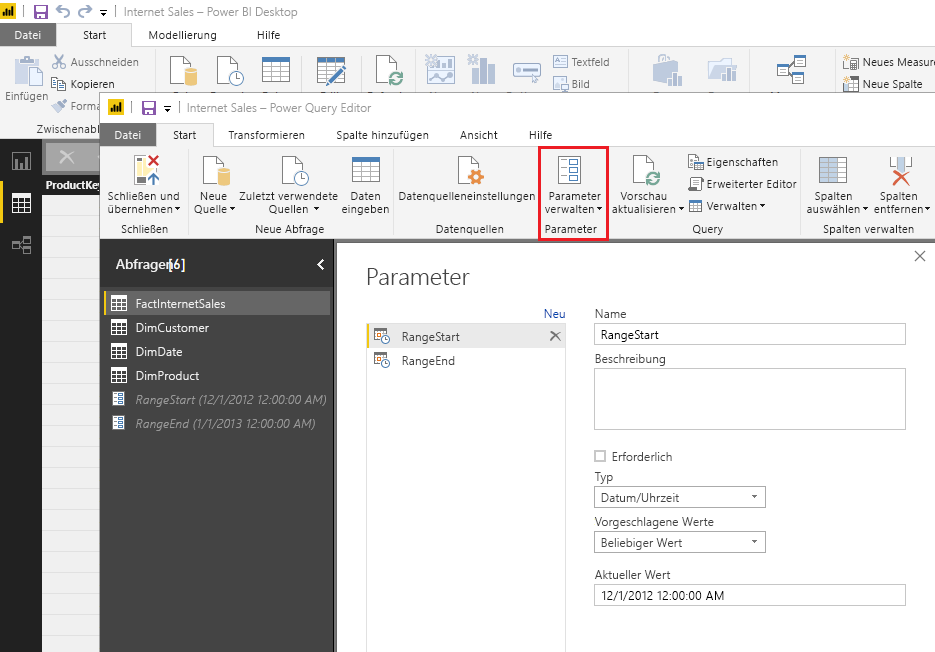
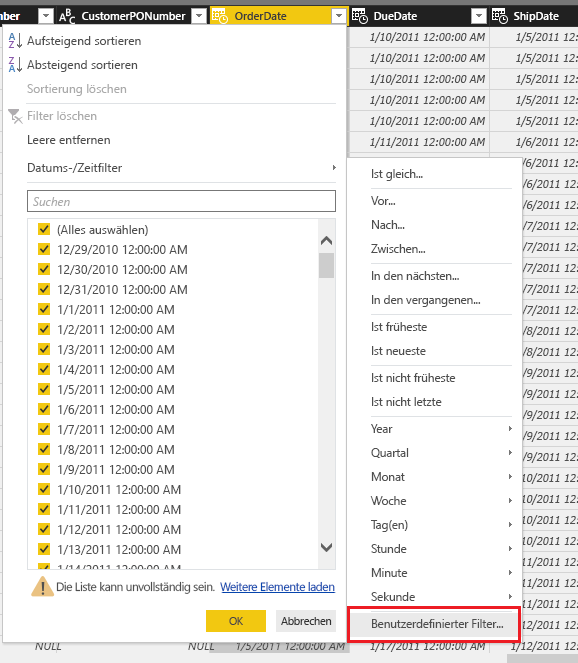
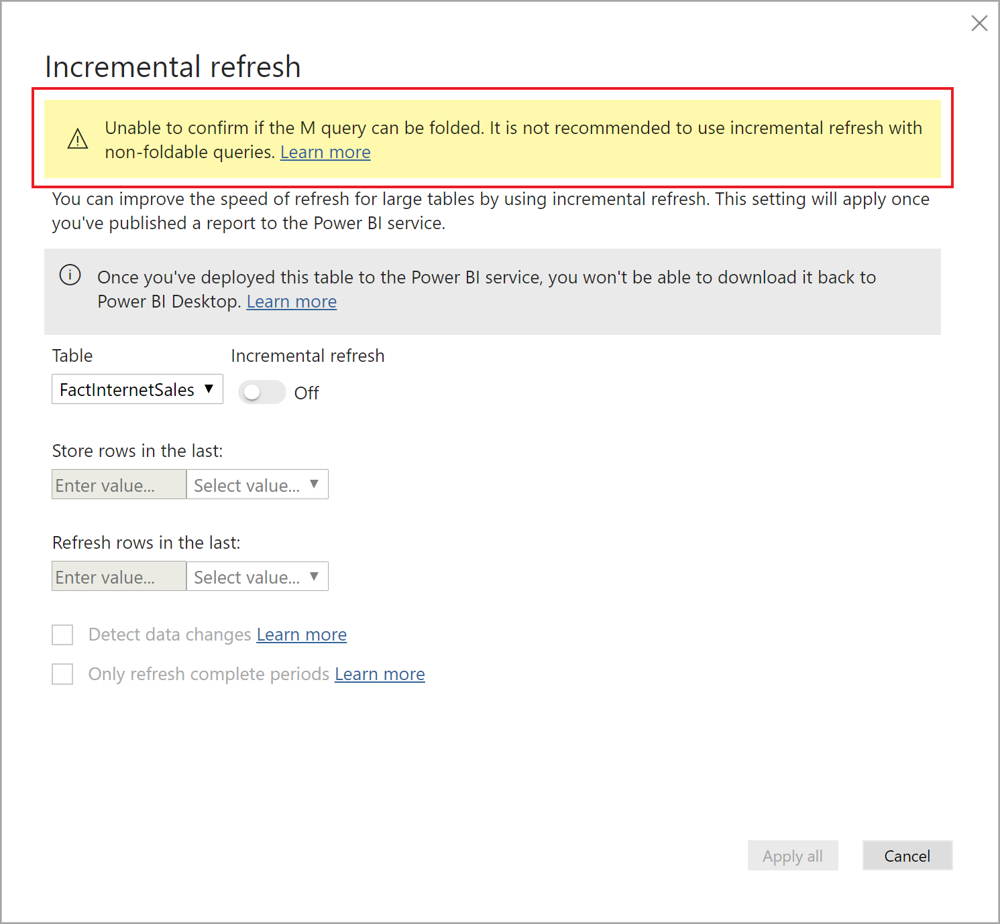
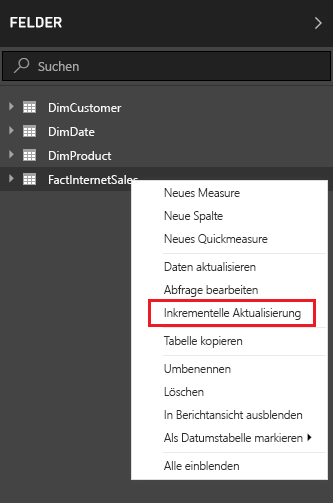
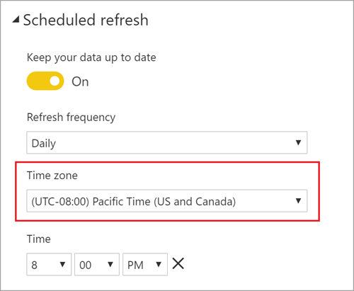
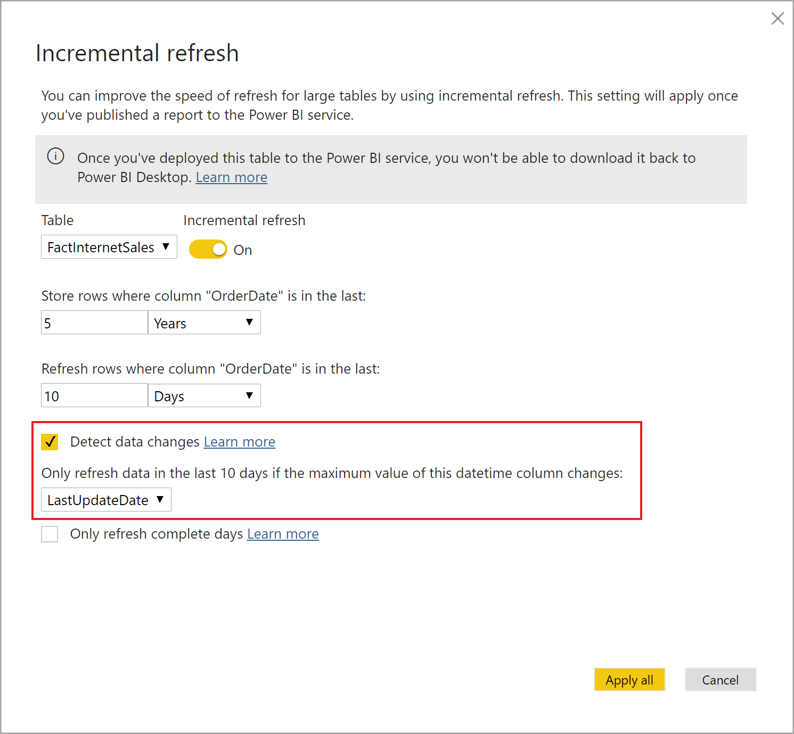
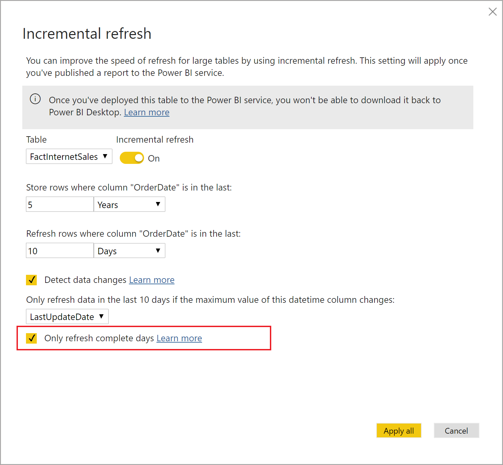

# <a name="incremental-refresh-in-power-bi"></a>Inkrementelle Aktualisierung in Power BI

Die inkrementelle Aktualisierung bietet in Power BI für sehr große Datasets die folgenden Vorteile:

> [!div class="checklist"]
> * **Schnellere Aktualisierungen:** Nur Daten, die geändert wurden, müssen aktualisiert werden. Aktualisieren Sie beispielsweise nur die letzten fünf Tage eines zehn Jahre alten Datasets.
> * **Zuverlässigere Aktualisierungen:** Es ist nicht mehr notwendig, Verbindungen mit langer Ausführungsdauer mit flüchtigen Quellsystemen herzustellen.
> * **Reduzierter Ressourcenverbrauch:** Dank weniger zu aktualisierender Daten wird der Gesamtbedarf an Arbeitsspeicher und anderen Ressourcen reduziert.

> [!NOTE]
> Die inkrementelle Aktualisierung ist jetzt für Power BI Pro, Power BI Premium und gemeinsame Abonnements und Datasets verfügbar. 

## <a name="configure-incremental-refresh"></a>Konfigurieren inkrementeller Aktualisierungen

Die Richtlinien für die inkrementelle Aktualisierung werden in Power BI Desktop definiert und bei Veröffentlichung auf den Power BI-Dienst angewendet.


### <a name="filter-large-datasets-in-power-bi-desktop"></a>Filtern großer Datasets in Power BI Desktop

Große Datasets mit potenziell Milliarden von Zeilen werden möglicherweise von einem Power BI Desktop-Modell nicht unterstützt, da die PBIX-Datei durch die auf dem Desktopcomputer des Benutzers verfügbaren Speicherressourcen begrenzt wird. Daher werden solche Datensätze üblicherweise beim Import gefiltert. Diese Art der Filterung gilt unabhängig davon, ob die inkrementelle Aktualisierung verwendet wird oder nicht. Für die inkrementelle Aktualisierung filtern Sie mithilfe von Datums- und Uhrzeitparametern von Power Query.

#### <a name="rangestart-and-rangeend-parameters"></a>Die Parameter „RangeStart“ und „RangeEnd“

Für die inkrementelle Aktualisierung werden Datasets unter Verwendung von Datums- und Uhrzeitparametern von Power Query, mit den reservierten Namen **RangeStart** und **RangeEnd** mit Berücksichtigung von Groß- und Kleinschreibung, gefiltert. Diese Parameter werden verwendet, um die in Power BI Desktop importierten Daten zu filtern und die Daten dynamisch in Bereiche zu partitionieren nachdem sie im Power BI-Dienst veröffentlicht wurden. Zum Filtern nach den einzelnen Partitionen werden die Parameterwerte vom Dienst ersetzt. Eine Festlegung in den Dataseteinstellungen des Diensts ist nicht erforderlich. Nach Veröffentlichung werden die Parameterwerte vom Power BI-Dienst automatisch überschrieben.

Um die Parameter mit Standardwerten zu definieren, wählen Sie im Power Query-Editor **Parameter verwalten** aus.



Nach der Definition der Parameter können Sie den Filter anwenden, indem Sie für eine Spalte den Menüpunkt **Benutzerdefinierter Filter** auswählen.



Stellen Sie sicher, dass Zeilen gefiltert werden, bei denen der Spaltenwert *nach oder gleich* **RangeStart** und *vor* **RangeEnd** ist. Andere Filterkombinationen können dazu führen, dass Zeilen doppelt gezählt werden.


> [!IMPORTANT]
> Stellen Sie sicher, dass Abfragen ein Gleichheitszeichen („=“) bei **RangeStart** oder **RangeEnd** aufweisen, aber nicht bei beiden. Wenn das Gleichheitszeichen („=“) bei beiden Parametern vorhanden ist, könnte eine Zeile die Bedingungen beider Abfragen erfüllen, was wiederum zu doppelten Daten im Modell führen könnte. Beispiel:  
> \#"Filtered Rows" = Table.SelectRows(dbo_Fact, each [OrderDate] **>= RangeStart** and [OrderDate] **<= RangeEnd**) könnte zu doppelten Daten führen.

> [!TIP]
> Zwar muss der Datentyp der Parameter „Datum/Uhrzeit“ sein, aber es ist möglich, diesen an die Anforderungen der Datenquelle anzupassen. Beispielsweise konvertiert die folgende Power Query-Funktion einen Datums-/Uhrzeitwert als ganze Zahl in einen Ersatzschlüssel der Form *JJJJMMDD*, die für Data Warehouses üblich ist. Die Funktion kann vom Filterschritt aufgerufen werden.
>
> `(x as datetime) => Date.Year(x)*10000 + Date.Month(x)*100 + Date.Day(x)`

Wählen Sie im Power Query-Editor **Schließen und übernehmen** aus. Eine Teilmenge des Datasets sollte in Power BI Desktop vorhanden sein.

#### <a name="filter-date-column-updates"></a>Filtern von Updates der Datumsspalte

Der Filter für die Datumsspalte wird verwendet, um die Daten im Power BI-Dienst dynamisch in Bereiche zu partitionieren. Die inkrementelle Aktualisierung ist nicht für die Unterstützung in Fällen vorgesehen, in denen die gefilterte Datenspalte im Quellsystem aktualisiert wird. Eine Aktualisierung wird als Einfüge- und Löschvorgang interpretiert, nicht als eigentliche Aktualisierung. Erfolgt der Löschvorgang im historischen und nicht im inkrementellen Bereich, wird er nicht berücksichtigt. Das kann zu Fehlern bei der Datenaktualisierung führen, die durch Konflikte bei Partitionsschlüssel entstehen.

#### <a name="query-folding"></a>Abfragefaltung

Es ist wichtig, dass die Partitionsfilter per Push an das Quellsystem übertragen werden, wenn Abfragen für Aktualisierungsvorgänge übermittelt werden. Dies bedeutet, dass die Datenquelle die Abfragefaltung unterstützen muss. Die meisten Datenquellen, die SQL-Abfragen unterstützen, unterstützen auch die Abfragefaltung. Datenquellen wie Flatfiles, Blobs oder Webquellen unterstützen das Query Folding in der Regel nicht. Wenn der Filter vom Datenquellen-Back-End nicht unterstützt wird, kann er nicht mithilfe von Push übertragen werden. Diese Fälle werden von der Mashup-Engine ausgeglichen, die den Filter lokal anwendet. Es kann sein, dass dafür das komplette Dataset von der Datenquelle abgerufen werden muss. Dadurch kann die inkrementelle Aktualisierung verlangsamt werden, und es kann sein, dass dem Prozess im Power BI-Dienst oder im lokalen Datengateway nicht ausreichend Ressourcen zur Verfügung stehen.

In Anbetracht der unterschiedlichen Unterstützungsebenen der Abfragefaltung für jede Datenquelle sollte eine Überprüfung durchgeführt werden, um sicherzustellen, dass die Filterlogik in die Quellabfragen eingeschlossen wurde. Um dies einfacher zu gestalten, versucht Power BI Desktop, diese Überprüfung für Sie durchzuführen. Falls eine Überprüfung nicht möglich ist, wird eine Warnung im Dialogfeld „Inkrementelle Aktualisierung“ angezeigt, wenn die Richtlinie für die inkrementelle Aktualisierung definiert wird. Für SQL-basierte Datenquellen wie SQL, Oracle und Teradata ist diese Warnung verlässlich. Für die Überprüfung durch andere Datenquellen kann eine Ablaufverfolgung von Abfragen erforderlich sein. Falls eine Bestätigung durch Power BI Desktop nicht möglich ist, wird die folgende Warnung angezeigt: Wenn diese Warnung angezeigt wird und Sie überprüfen möchten, ob das notwendige Query Folding durchgeführt wird, können Sie das Abfragediagnosefeature verwenden oder die von der Quelldatenbank empfangenen Abfragen nachverfolgen.

 

### <a name="define-the-refresh-policy"></a>Definieren der Aktualisierungsrichtlinie

Die inkrementelle Aktualisierung ist mit Ausnahme von Liveverbindungsmodellen im Kontextmenü für Tabellen verfügbar.



#### <a name="incremental-refresh-dialog"></a>Dialogfeld „Inkrementelle Aktualisierung“

Das Dialogfeld „Inkrementelle Aktualisierung“ wird angezeigt. Aktivieren Sie das Dialogfeld mithilfe der Umschaltfläche.


> [!NOTE]
> Wenn sich der Power Query-Ausdruck für die Tabelle nicht auf die Parameter mit reservierten Namen bezieht, ist die Umschaltmöglichkeit deaktiviert.

Im Text der Kopfzeile wird Folgendes erläutert:

- Aktualisierungsrichtlinien werden in Power BI Desktop definiert und über Aktualisierungsvorgänge im Dienst angewendet.

- Wenn Sie die PBIX-Datei mit einer enthaltenen inkrementellen Aktualisierungsrichtlinie aus dem Power BI-Dienst herunterladen können, kann sie nicht in Power BI Desktop geöffnet werden. Auch wenn dies in Zukunft möglicherweise unterstützt wird, denken Sie daran, dass diese Datasets so groß werden können, dass sie nicht mehr heruntergeladen und auf einem typischen Desktopcomputer geöffnet werden können.

#### <a name="refresh-ranges"></a>Aktualisierungsbereiche

Im folgenden Beispiel werden Aktualisierungsrichtlinien zum Speichern der Daten für fünf gesamte Kalenderjahre sowie Daten des laufenden Jahres bis zum aktuellen Datum und zum inkrementellen Aktualisieren der Daten von zehn Tagen definiert. Der erste Aktualisierungsvorgang lädt Verlaufsdaten. Die folgenden Aktualisierungen sind inkrementell, und sie führen die folgenden Vorgänge aus, wenn sie täglich ausgeführt werden:

- Die Daten eines neuen Tages werden hinzugefügt.

- Daten der letzten zehn Tage bis zum aktuellen Datum werden aktualisiert.

- Kalenderjahre, die bezogen auf das aktuelle Datum älter als fünf Jahre sind, werden entfernt. Wenn das aktuelle Datum der 1. Januar 2019 ist, wird z.B. das Jahr 2013 entfernt.

Die erste Aktualisierung im Power BI-Dienst kann länger dauern, da fünf gesamte Kalenderjahre importiert werden. Nachfolgende Aktualisierungen werden möglicherweise in einem Bruchteil der Zeit abgeschlossen.


#### <a name="current-date"></a>Aktuelles Datum

Das *aktuelle Datum* basiert auf dem Systemdatum, an dem die Aktualisierung durchgeführt wurde. Wenn eine geplante Aktualisierung für das Dataset im Power BI-Dienst aktiviert ist, wird die angegebene Zeitzone bei der Bestimmung des aktuellen Datums berücksichtigt. Sowohl bei manuell gestarteten als auch bei geplanten Aktualisierungen wird die Zeitzone berücksichtig, falls diese verfügbar ist. Wenn beispielsweise um 20 Uhr in der Zeitzone Pacific Standard Time (USA und Kanada) eine Aktualisierung durchgeführt wird und die Zeitzone angegeben ist, wird das aktuelle Datum anhand der Zone Pacific Standard Time anstatt der Zone Greenwich Mean Time (in diesem Fall der nächste Tag) ermittelt.



> [!NOTE]
> Die Definition dieser Bereiche reicht ggf. schon aus. In diesem Fall können Sie direkt zum folgenden Veröffentlichungsschritt übergehen. Die zusätzlichen Dropdownlisten sind für erweiterte Funktionen vorgesehen.

### <a name="advanced-policy-options"></a>Erweiterte Richtlinienoptionen

#### <a name="detect-data-changes"></a>Datenänderungen erkennen

Eine inkrementelle Aktualisierung der Daten von zehn Tagen ist effizienter als eine vollständige Aktualisierung von fünf Jahren. Es geht jedoch noch etwas besser. Wenn Sie das Kontrollkästchen **Datenänderungen erkennen** aktivieren, können Sie eine Datum-/Uhrzeit-Spalte auswählen, um nur die Tage zu bestimmen und zu aktualisieren, an denen sich die Daten geändert haben. Dies setzt voraus, dass eine solche Spalte im Quellsystem vorhanden ist, die typischerweise zu Prüfzwecken dient. **Hierbei darf es sich nicht um dieselbe Spalte handeln, die zum Partitionieren der Daten mit den RangeStart/RangeEnd-Parametern verwendet wird.** Der Maximalwert dieser Spalte wird für jeden der Zeiträume im Inkrementbereich ausgewertet. Wenn sie sich seit der letzten Aktualisierung nicht geändert hat, muss der Zeitraum nicht aktualisiert werden. Im Beispiel kann dies die Anzahl der Tage, die inkrementell aktualisiert werden, von zehn auf etwa zwei weitere verringern.



> [!TIP]
> Das aktuelle Design erfordert, dass die Spalte zur Erkennung von Datenänderungen beibehalten und im Arbeitsspeicher zwischengespeichert wird. Sie können eine der folgenden Techniken in Betracht ziehen, um die Kardinalität und den Arbeitsspeicherbedarf zu reduzieren.
>
> Behalten Sie nur den Maximalwert dieser Spalte zum Zeitpunkt der Aktualisierung bei, eventuell mithilfe einer Power Query-Funktion.
>
> Reduzieren Sie die Genauigkeit auf ein Niveau, das angesichts Ihrer Anforderungen an die Aktualisierungsfrequenz vertretbar ist.
>
> Definieren Sie eine benutzerdefinierte Abfrage zum Erkennen von Datenänderungen, indem Sie den XMLA-Endpunkt verwenden. So vermeiden Sie die vollständige Beibehaltung des Spaltenwerts. Weitere Informationen finden Sie weiter unten im Abschnitt „Benutzerdefinierte Abfragen zum Erkennen von Datenänderungen“.

#### <a name="only-refresh-complete-periods"></a>Nur vollständige Zeiträume aktualisieren

Angenommen, Ihre Aktualisierung ist für 4:00 Uhr morgens geplant. Wenn während dieser 4 Stunden Daten im Quellsystem auftauchen, möchten Sie diese möglicherweise nicht berücksichtigen. Einige betriebswirtschaftliche Metriken – wie Fässer pro Tag in der Öl- und Gasindustrie – ergeben bei Teiltagen keinen Sinn.

Ein weiteres Beispiel ist das Aktualisieren von Daten in einem Finanzsystem, bei dem die Daten des Vormonats am 12. Kalendertag des Monats freigegeben werden. Legen Sie in diesem Fall den Inkrementbereich auf 1 Monat fest, und planen Sie die Aktualisierung für den 12. Tag des Monats. Wenn diese Option aktiviert ist, werden z.B. die Daten vom Januar am 12. Februar aktualisiert.



> [!NOTE]
> Aktualisierungsvorgänge im Dienst erfolgen gemäß der UTC-Zeit. Dies kann den Stichtag bestimmen und sich auf ganze Zeiträume auswirken. Wir planen, die Möglichkeit hinzuzufügen, den Stichtag für eine Aktualisierung zu überschreiben.

## <a name="publish-to-the-service"></a>Veröffentlichen im Dienst

Sie können das Modell nun aktualisieren. Die erste Aktualisierung kann aufgrund des Imports der Verlaufsdaten länger dauern. Nachfolgende Aktualisierungen sind wesentlich schneller, da sie inkrementell erfolgen.

## <a name="query-timeouts"></a>Zeitüberschreitungen bei Abfragen

Im Artikel [Problembehandlung bei Aktualisierungsszenarios](../connect-data/refresh-troubleshooting-refresh-scenarios.md) wird erklärt, dass es bei Aktualisierungsvorgängen im Power BI-Dienst zu Zeitüberschreitungen kommt. Abfragen können auch durch die standardmäßige Zeitüberschreitung für die Datenquelle eingeschränkt werden. Die meisten relationalen Datenquellen erlauben das Überschreiben von Zeitüberschreitungen im Ausdruck „M“. Zum Beispiel wird im folgenden Ausdruck die [SQL Server-Datenzugriffsfunktion](https://docs.microsoft.com/powerquery-m/sql-database) verwendet, um sie auf 2 Stunden festzulegen. Jeder durch die Richtlinienbereiche definierte Zeitraum sendet eine Abfrage unter Einhaltung der Einstellung für die Befehlszeitüberschreitung.

```powerquery-m
let
    Source = Sql.Database("myserver.database.windows.net", "AdventureWorks", [CommandTimeout=#duration(0, 2, 0, 0)]),
    dbo_Fact = Source{[Schema="dbo",Item="FactInternetSales"]}[Data],
    #"Filtered Rows" = Table.SelectRows(dbo_Fact, each [OrderDate] >= RangeStart and [OrderDate] < RangeEnd)
in
    #"Filtered Rows"
```

## <a name="xmla-endpoint-benefits-for-incremental-refresh"></a>Vorteile von XMLA-Endpunkten für die inkrementelle Aktualisierung

Der [XMLA-Endpunkt](service-premium-connect-tools.md) für Datasets in einer Premium-Kapazität kann für Lese-/Schreibvorgänge aktiviert werden, was zu erheblichen Vorteilen bei der inkrementellen Aktualisierung führen kann. Aktualisierungsvorgänge über den XMLA-Endpunkt sind nicht auf [48 Aktualisierungen pro Tag](../connect-data/refresh-data.md#data-refresh) beschränkt. Außerdem gilt der [Timeout für geplante Aktualisierungen](../connect-data/refresh-troubleshooting-refresh-scenarios.md#scheduled-refresh-timeout) nicht, was in Szenarios mit inkrementeller Aktualisierung hilfreich sein kann.

### <a name="refresh-management-with-sql-server-management-studio-ssms"></a>Aktualisieren der Verwaltung mit SQL Server Management Studio

Wurde der XMLA-Endpunkt für Lese-/Schreibvorgänge aktiviert, können Sie mit SQL Server Management Studio (SSMS) die Partitionen anzeigen und verwalten, die durch die Anwendung von Richtlinien für die inkrementelle Aktualisierung generiert wurden.


#### <a name="refresh-historical-partitions"></a>Aktualisieren von historischen Partitionen

So können Sie beispielsweise eine bestimmte historische Partition außerhalb des inkrementellen Bereichs aktualisieren, um eine rückwirkende Aktualisierung ohne gleichzeitige Aktualisierung aller Verlaufsdaten auszuführen.

#### <a name="override-incremental-refresh-behavior"></a>Überschreiben des Verhaltens bei der inkrementellen Aktualisierung

Mit SSMS können Sie den Aufruf inkrementeller Aktualisierungen mithilfe der [Tabular Model Scripting Language (TMSL)](https://docs.microsoft.com/analysis-services/tmsl/tabular-model-scripting-language-tmsl-reference?view=power-bi-premium-current) und des [Tabellenobjektmodells (TOM)](https://docs.microsoft.com/analysis-services/tom/introduction-to-the-tabular-object-model-tom-in-analysis-services-amo?view=power-bi-premium-current) auch besser kontrollieren. Klicken Sie beispielsweise in SSMS im Objekt-Explorer mit der rechten Maustaste auf eine Tabelle, und wählen Sie anschließend die Menüoption **Tabelle verarbeiten** aus. Klicken Sie auf die Schaltfläche **Skript**, um einen TMSL-Refresh-Befehl zu generieren.


Sie können die folgenden Parameter in den TMSL-Refresh-Befehl einfügen, um das Standardverhalten bei der inkrementellen Aktualisierung zu überschreiben.

- **applyRefreshPolicy**: Wurde für eine Tabelle eine Richtlinie für die inkrementelle Aktualisierung definiert, wird mit „applyRefreshPolicy“ festgelegt, ob die Richtlinie angewendet wird. Wird die Richtlinie nicht angewendet, bleiben bei einem vollständigen Verarbeitungsvorgang die Partitionsdefinitionen unverändert, und alle Partitionen in der Tabelle werden vollständig aktualisiert. Der Standardwert ist true.

- **effectiveDate**: Wird eine Richtlinie für die inkrementelle Aktualisierung angewendet, muss das aktuelle Datum bekannt sein, damit Gleitfensterbereiche für den historischen und den inkrementellen Bereich bestimmt werden können. Mit dem Parameter „effectiveDate“ können Sie das aktuelle Datum überschreiben. Dies ist nützlich für Tests, Demos und Geschäftsszenarios, in denen Daten inkrementell bis zu einem Datum in der Vergangenheit oder in der Zukunft aktualisiert werden (z. B. für künftige Budgets). Der Standardwert ist das [aktuelle Datum](#current-date).

```json
{ 
  "refresh": {
    "type": "full",

    "applyRefreshPolicy": true,
    "effectiveDate": "12/31/2013",

    "objects": [
      {
        "database": "IR_AdventureWorks", 
        "table": "FactInternetSales" 
      }
    ]
  }
}
```

### <a name="custom-queries-for-detect-data-changes"></a>Benutzerdefinierte Abfragen zum Erkennen von Datenänderungen

Mit TMSL und/oder TOM können Sie ein erkanntes Datenänderungsverhalten überschreiben. Damit können Sie etwa vermeiden, dass die Spalte „Letzte Aktualisierung“ im In-Memory-Cache beibehalten wird. Des Weiteren werden Szenarios ermöglicht, in denen mit ETL-Vorgängen eine Konfigurations-/Anweisungstabelle vorbereitet wird, durch die nur diejenigen Partitionen gekennzeichnet werden, die aktualisiert werden müssen. Dies ermöglicht einen effizienteren Ablauf der inkrementellen Aktualisierung, da nur die benötigten Zeiträume aktualisiert werden, unabhängig vom Zeitpunkt der zuletzt durchgeführten Datenaktualisierung.

Der Parameter „pollingExpression“ soll als einfacher M-Ausdruck oder Name einer anderen M-Abfrage dienen. Er gibt einen Skalarwert zurück und wird für jede Partition ausgeführt. Unterscheidet sich der zurückgegebene Wert vom Wert der letzten inkrementellen Aktualisierung, wird die Partition für eine vollständige Verarbeitung gekennzeichnet.

Das folgende Beispiel umfasst alle 120 Monate des historischen Bereichs für rückwirkende Änderungen. Durch die Angabe von 120 Monaten anstelle von 10 Jahren ist die Datenkomprimierung möglicherweise weniger effizient. Doch damit wird verhindert, dass ein gesamtes historisches Jahr aktualisiert werden muss, was teurer wäre, wenn auch ein Monat für eine rückwirkende Änderung ausreichend wäre.

```json
"refreshPolicy": {
    "policyType": "basic",
    "rollingWindowGranularity": "month",
    "rollingWindowPeriods": 120,
    "incrementalGranularity": "month",
    "incrementalPeriods": 120,
    "pollingExpression": "<M expression or name of custom polling query>",
    "sourceExpression": [
    "let ..."
    ]
}
```

## <a name="metadata-only-deployment"></a>Reine Metadatenbereitstellung

Wenn Sie eine neue Version einer PBIX-Datei aus Power BI Desktop in einem Arbeitsbereich im Power BI-Dienst veröffentlichen und ein Dataset mit demselben Namen bereits vorhanden ist, werden Sie dazu aufgefordert, das vorhandene Dataset zu ersetzen.


In einigen Fällen möchten Sie das Dataset eventuell nicht ersetzen, insbesondere bei der inkrementellen Aktualisierung. Das Dataset in Power BI Desktop könnte viel kleiner sein als das Dataset im Power BI-Dienst. Gilt für das Dataset im Power BI-Dienst eine Richtlinie für die inkrementelle Aktualisierung, enthält es möglicherweise mehrere Jahre zurückreichende Verlaufsdaten, die beim Ersetzen des Datasets verloren gingen. Das Aktualisieren aller Verlaufsdaten könnte Stunden dauern und zu Systemausfallzeiten beim Benutzer führen.

Besser geeignet ist in solchen Fällen eine reine Metadatenbereitstellung. Damit können neue Objekte bereitgestellt werden, ohne die Verlaufsdaten zu verlieren. Wenn Sie beispielsweise einige Measures hinzugefügt haben, können Sie nur diese bereitstellen, ohne gleichzeitig die Daten zu aktualisieren. So sparen Sie eine Menge Zeit.

Wurde der XMLA-Endpunkt für Lese-/Schreibvorgänge konfiguriert, ist er kompatibel mit Tools für eben diese Vorgänge. Das ALM-Toolkit ist beispielsweise ein Schemavergleichstool für Power BI-Datasets, das für eine reine Metadatenbereitstellung verwendet werden kann.

Laden Sie die neueste Version des ALM-Toolkits aus dem [Analysis Services-Git-Repository](https://github.com/microsoft/Analysis-Services/releases) herunter, und installieren Sie diese. Dokumentationslinks und Informationen zur Unterstützung finden Sie über das Menüband „Hilfe“. Führen Sie für eine reine Metadatenbereitstellung einen Vergleich aus. Wählen Sie dabei die aktuell ausgeführte Instanz von Power BI Desktop als Quelle und das vorhandene Dataset im Power BI-Dienst als Ziel aus. Sehen Sie sich die angezeigten Unterschiede an. Überspringen Sie die Aktualisierung der Tabelle mit Partitionen für die inkrementelle Aktualisierung, oder behalten Sie Partitionen zur Tabellenaktualisierung mithilfe des Dialogfelds „Optionen“ bei. Überprüfen Sie die Auswahl, um die Integrität des Zielmodells sicherzustellen. Führen Sie anschließend die Aktualisierung aus.


## <a name="see-also"></a>Siehe auch

[Konnektivität mit Datasets mithilfe des XMLA-Endpunkts](service-premium-connect-tools.md)   
[Problembehandlung bei Aktualisierungsszenarios](../connect-data/refresh-troubleshooting-refresh-scenarios.md)   
