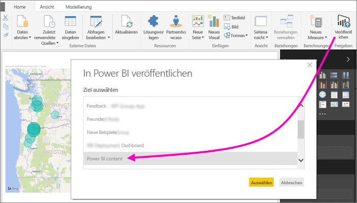
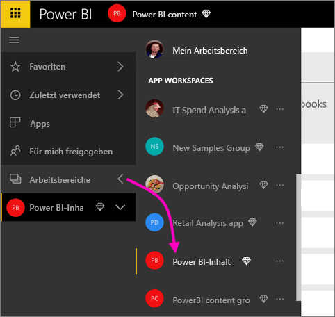
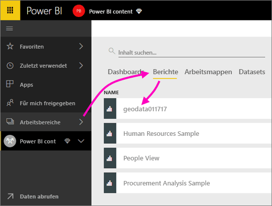
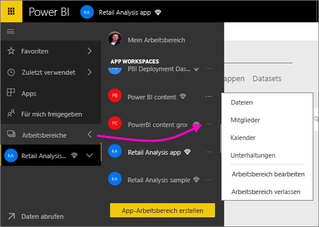
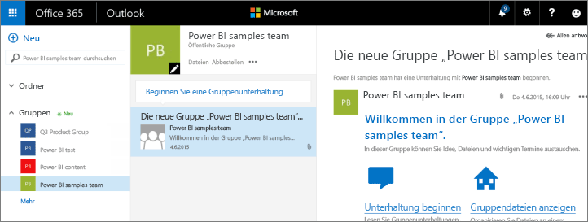
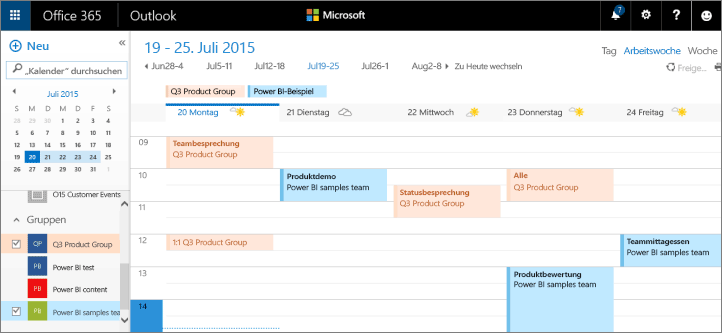

# Zusammenarbeiten in einem klassischen Arbeitsbereich
Power BI-Arbeitsbereiche stellen einen hervorragenden Ort für die Zusammenarbeit mit Ihren Kollegen an Dashboards, Berichten und Datasets dar, um *Apps* zu erstellen. Dieser Artikel befasst sich mit den ursprünglichen, *klassischen* Arbeitsbereichen.  

Die Zusammenarbeit endet jedoch nicht bei Arbeitsbereichen in Power BI. Wenn Sie einen klassischen Arbeitsbereich in Power BI erstellen, wird dabei automatisch im Hintergrund eine Microsoft 365-Gruppe erstellt. Microsoft 365 bietet weitere Gruppendienste, z. B. das Freigeben von Dateien in OneDrive for Business, Unterhaltungen in Exchange sowie freigegebene Kalender und Aufgaben. Erfahren Sie mehr über [Gruppen in Microsoft 365](https://support.office.com/article/Create-a-group-in-Office-365-7124dc4c-1de9-40d4-b096-e8add19209e9).

> [!NOTE]
> Mit den neuen Arbeitsbereichen ändert sich die Beziehung zwischen Power BI-Arbeitsbereichen und Microsoft 365-Gruppen. Wenn Sie einen neuen Arbeitsbereich in Power BI erstellen, wird im Hintergrund nicht mehr automatisch eine Microsoft 365-Gruppe erstellt. Weitere Informationen finden Sie unter [Erstellen der neuen Arbeitsbereiche in Power BI](service-create-the-new-workspaces.md).

Sie benötigen eine [Power BI Pro-Lizenz](../fundamentals/service-features-license-type.md), um einen Arbeitsbereich zu erstellen.

## Zusammenarbeit an Power BI Desktop-Dateien in einem Arbeitsbereich
Sobald Sie eine Power BI Desktop-Datei erstellt haben, können Sie diese in einem Arbeitsbereich veröffentlichen, damit alle Mitglieder des Arbeitsbereichs an dieser Datei zusammenarbeiten können.

1. Wählen Sie in Power BI Desktop im Menüband **Start** die Option **Veröffentlichen** aus, und wählen Sie dann im Feld **Ziel auswählen** Ihren Arbeitsbereich aus.
   
    
2. Klicken Sie im Power BI-Dienst auf den Pfeil neben **Arbeitsbereiche**, und wählen Sie Ihren Arbeitsbereich aus.
   
    
3. Wählen Sie die Registerkarte **Berichte** aus, und wählen Sie dann den Bericht aus.
   
    
   
    Ab hier gehen Sie wie bei jedem anderen Bericht in Power BI vor. Sie und andere Personen in Ihrem Arbeitsbereich können den Bericht ändern und Kacheln in einem Dashboard Ihrer Wahl speichern.

## Zusammenarbeiten in Microsoft 365
Ausgangspunkt der Zusammenarbeit in Microsoft 365 ist der klassische Arbeitsbereich in Power BI.

1. Klicken Sie im Power BI-Dienst auf den Pfeil neben **Arbeitsbereiche**, und klicken Sie dann neben dem Namen des Arbeitsbereichs auf **Weitere Optionen** (...). 
   
   
2. Über dieses Menü können Sie auf verschiedene Arten mit Ihrer Gruppe zusammenarbeiten: 
   
   * Führen einer [Gruppenunterhaltung in Microsoft 365](#have-a-group-conversation-in-microsoft-365)
   * [Planen eines Ereignisses](#schedule-an-event-on-the-group-workspace-calendar) im Gruppenkalender des Arbeitsbereichs
   
   Beim ersten Aufrufen Ihres Gruppenarbeitsbereichs in Microsoft 365 müssen Sie möglicherweise ein wenig warten. Lassen Sie sich 15 bis 30 Minuten Zeit, und aktualisieren Sie dann Ihren Browser.

## Führen einer Gruppenunterhaltung in Microsoft 365
1. Klicken Sie neben dem Namen des Arbeitsbereichs auf **Weitere Optionen** (...) \> **Unterhaltungen**. 
   
    
   
   Daraufhin wird die E-Mail- und Unterhaltungswebsite für den Gruppenarbeitsbereich in Outlook für Microsoft 365 geöffnet.
   
   
2. Erfahren Sie mehr über [Gruppenunterhaltungen in Outlook für Microsoft 365](https://support.office.com/Article/Have-a-group-conversation-a0482e24-a769-4e39-a5ba-a7c56e828b22).

## Planen eines Ereignisses im Gruppenarbeitsbereichskalender
1. Klicken Sie neben dem Namen des Arbeitsbereichs auf **Weitere Optionen** (...) \> **Kalender**. 
   
   
   
   Daraufhin wird der Kalender für den Gruppenarbeitsbereich in Outlook für Microsoft 365 geöffnet.
   
   
2. Erfahren Sie mehr über [Gruppenkalender in Outlook für Microsoft 365](https://support.office.com/Article/Add-edit-and-subscribe-to-group-events-0cf1ad68-1034-4306-b367-d75e9818376a).

## Verwalten eines klassischen Arbeitsbereichs
Wenn Sie Besitzer oder Administrator eines Arbeitsbereichs sind, können Sie auch Arbeitsbereichsmitglieder hinzufügen oder entfernen. Erfahren Sie mehr über das [Verwalten von Power BI-Arbeitsbereichen](service-manage-app-workspace-in-power-bi-and-office-365.md).

## Nächste Schritte
* [Veröffentlichen von Apps in Power BI](service-create-distribute-apps.md)
* Weitere Fragen? [Wenden Sie sich an die Power BI-Community](https://community.powerbi.com/).
* Feedback? Besuchen Sie [Power BI Ideas](https://ideas.powerbi.com/forums/265200-power-bi).
