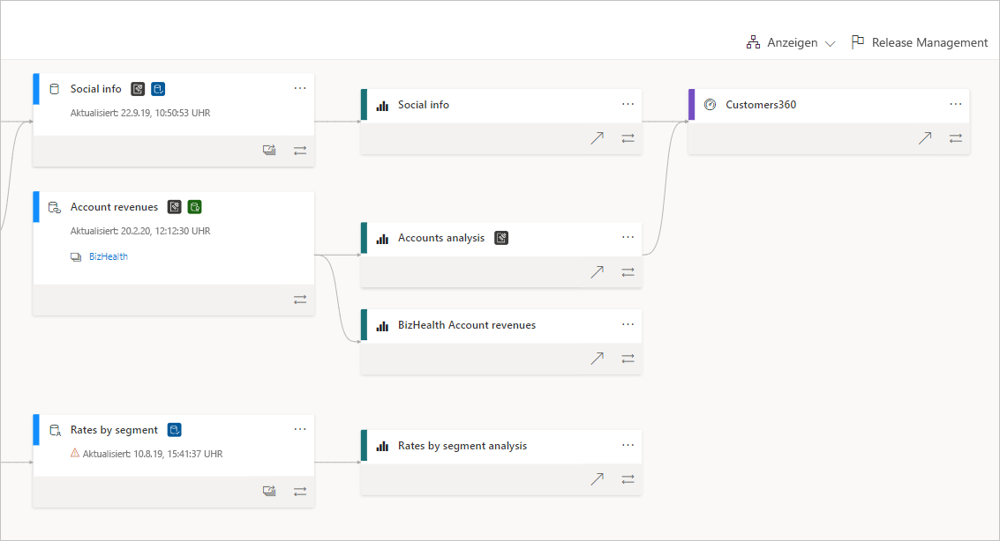
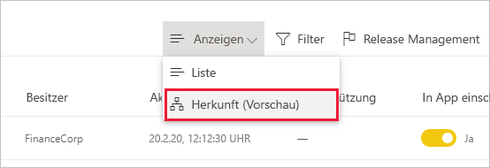
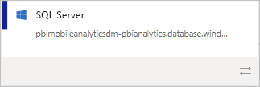
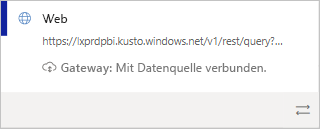
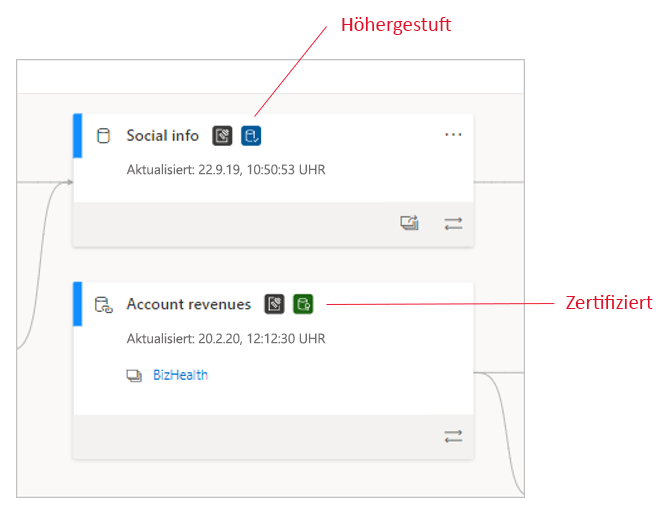
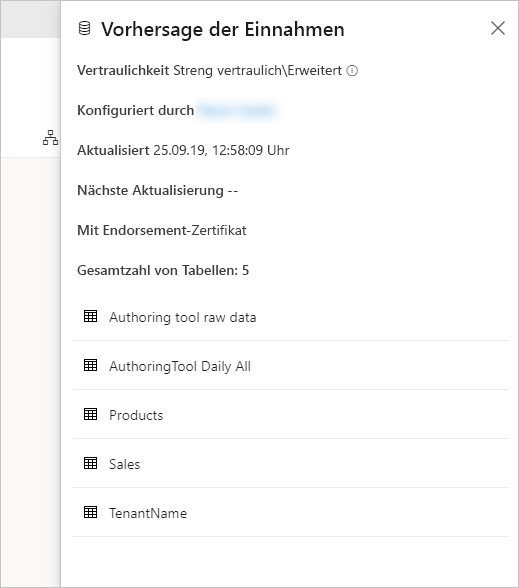
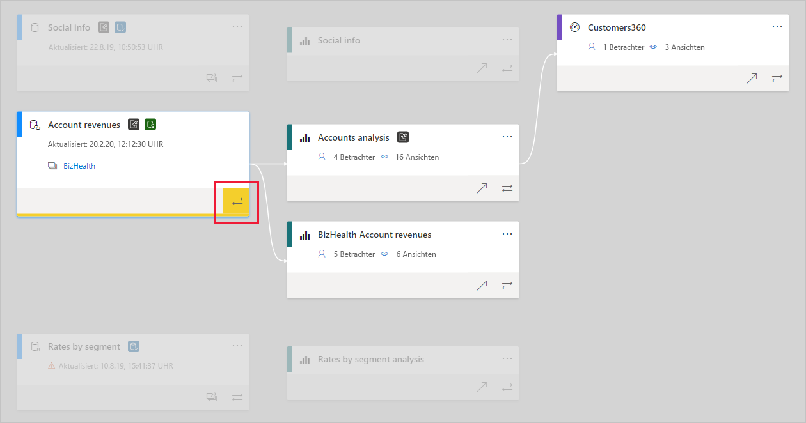

# Datenherkunft
In Projekten mit moderner Business Intelligence (BI) kann es eine Herausforderung sein, den Datenfluss von der Datenquelle bis zum Ziel zu verstehen. Die Herausforderung ist noch größer, wenn Sie erweiterte analytische Projekte erstellt haben, die mehrere Datenquellen, Artefakte und Abhängigkeiten umfassen. Es kann schwierig sein, Fragen wie „Was geschieht, wenn ich diese Daten ändere?“ oder „Warum ist dieser Bericht nicht auf dem neusten Stand?“ zu beantworten. Sie benötigen möglicherweise ein Team von Experten oder eine umfassende Untersuchung, um das zu verstehen. Wir haben die Datenherkunftsansicht entworfen, um Sie beim Beantworten dieser Fragen zu unterstützen.

 
Power BI verfügt über mehrere Artefakttypen, z. B. Dashboards, Berichte, Datasets und Dataflows. Viele Datasets und Dataflows stellen eine Verbindung mit externen Datenquellen wie SQL Server und externen Datasets in anderen Arbeitsbereichen her. Wenn ein Dataset für einen eigenen Arbeitsbereich extern ist, befindet es sich möglicherweise in einem Arbeitsbereich, der jemandem aus der IT oder einem anderen Analysten gehört. Externe Datenquellen und Datasets erschweren es, zu wissen, woher die Daten letztlich stammen. Für komplexe und für einfachere Projekte wird die Herkunftsansicht eingeführt.

In der Herkunftsansicht sehen Sie die Herkunftsbeziehungen zwischen allen Artefakten in einem Arbeitsbereich und alle externen Abhängigkeiten. Sie zeigt Verbindungen zwischen allen Arbeitsbereichsartefakten, einschließlich sowohl Upstream- als auch Downstreamverbindungen mit Dataflows.

## Erkunden der Herkunftsansicht

Jeder Arbeitsbereich, egal ob neu oder klassisch, hat automatisch eine Herkunftsansicht. Sie benötigen mindestens eine „Mitwirkender“-Rolle im Arbeitsbereich, um sie anzuzeigen. Weitere Informationen finden Sie in diesem Artikel unter [Berechtigungen](#permissions).

* Wechseln Sie zur Listenansicht des Arbeitsbereichs, um auf die Herkunftsansicht zuzugreifen. Tippen Sie auf den Pfeil neben **Listenansicht**, und wählen Sie **Herkunftsansicht** aus.

   

In dieser Ansicht werden alle Arbeitsbereichsartefakte und der Datenfluss von einem Artefakt zum anderen gezeigt.

**Datenquellen**

Die Datenquellen, aus denen die Datasets und Dataflows abgerufen werden, werden angezeigt. Auf den Datenquellenkarten finden Sie weitere Informationen, die Ihnen beim Identifizieren der Quelle helfen können. Beispielsweise wird für Azure SQL Server auch der Datenbankname angezeigt.

 
**Gateways**

Wenn eine Datenquelle über ein lokales Gateway verbunden ist, werden die Gatewayinformationen der Datenquellenkarte hinzugefügt. Wenn Sie über Berechtigungen als Gatewayadministrator oder als Datenquellenbenutzer verfügen, werden weitere Informationen angezeigt, z.B. der Gatewayname.

**Datasets und Dataflows**
 
Bei Datasets und Dataflows wird der Zeitpunkt der letzten Aktualisierung angezeigt. Außerdem sehen Sie, ob das Dataset oder der Dataflow zertifiziert oder höher gestuft ist.

 
Wenn ein Bericht im Arbeitsbereich auf einem Dataset oder Dataflow in einem anderen Arbeitsbereich basiert, wird der Name des Quellarbeitsbereichs auf der Karte des jeweiligen Datasets oder Dataflows angezeigt. Wählen Sie den Namen des Quellarbeitsbereichs aus, um zu diesem Arbeitsbereich zu wechseln.

* Wählen Sie für ein Artefakt **Weitere Optionen (...)** aus, um das Optionsmenü zu öffnen. Dieses Menü enthält alle Aktionen, die auch in der Listenansicht verfügbar sind.

Um weitere Metadaten zu einem Artefakt anzuzeigen, wählen Sie die Karte des Artefakts aus. Die zusätzlichen Informationen zum Artefakt werden in einem Seitenbereich angezeigt. Das Bild unten zeigt, wie die Metadaten eines ausgewählten Datasets im Seitenbereich angezeigt werden.

 
## Anzeigen der Herkunft für ein beliebiges Artefakt 

Nehmen wir an, Sie möchten die Herkunft für ein bestimmtes Artefakt sehen.

* Wählen Sie die Doppelpfeile unter dem Artefakt aus.

   

   Power BI hebt alle Artefakte hervor, die sich auf dieses Artefakt beziehen, und verdunkelt den Rest. 

## Navigation und Vollbild 

Die Herkunftsansicht ist eine interaktive Canvas. Mit der Maus und dem Touchpad können Sie in der Canvas navigieren und diese vergrößern oder verkleinern.

* Zum Vergrößern und Verkleinern verwenden Sie entweder das Menü in der unteren rechten Ecke oder die Maus oder das Touchpad.
* Verwenden Sie die Vollbildoption in der unteren rechten Ecke, um mehr Platz für das Diagramm zu erhalten. 

    

## Berechtigungen

* Sie benötigen eine Power BI Pro-Lizenz, um die Herkunftsansicht anzuzeigen.
* Die Herkunftsansicht steht nur Benutzern mit Zugriff auf den Arbeitsbereich zur Verfügung.
* Benutzer müssen über eine Administrator-, eine Mitglieds- oder eine „Mitwirkender“-Rolle im Arbeitsbereich verfügen. Benutzer mit der Rolle „Viewer“ (Anzeigender Benutzer) können nicht zur Herkunftsansicht wechseln.

## Überlegungen und Einschränkungen

- Die Herkunftsansicht ist in Internet Explorer nicht verfügbar. Weitere Informationen finden Sie unter [Unterstützte Browser für Power BI](../power-bi-browsers.md).

## Nächste Schritte

* [Einführung in die Verwendung von Datasets in mehreren Arbeitsbereichen (Vorschau)](../service-datasets-across-workspaces.md)
* [Datasetauswirkungsanalyse](service-dataset-impact-analysis.md)
