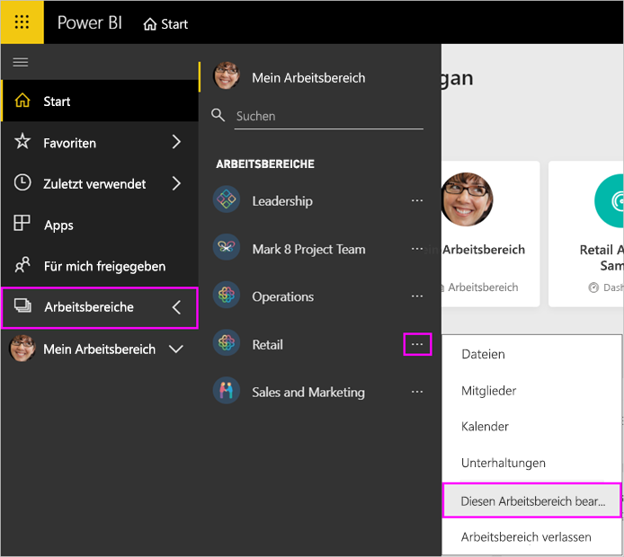
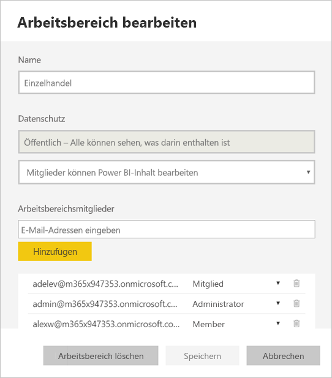
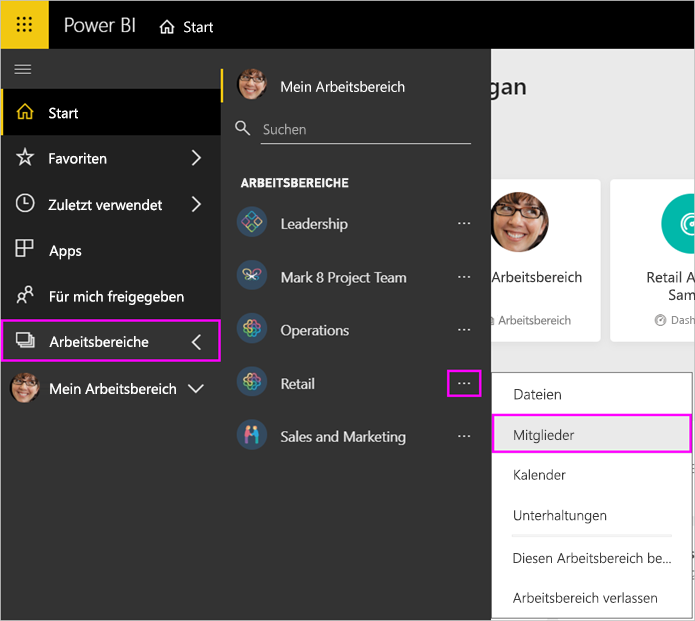
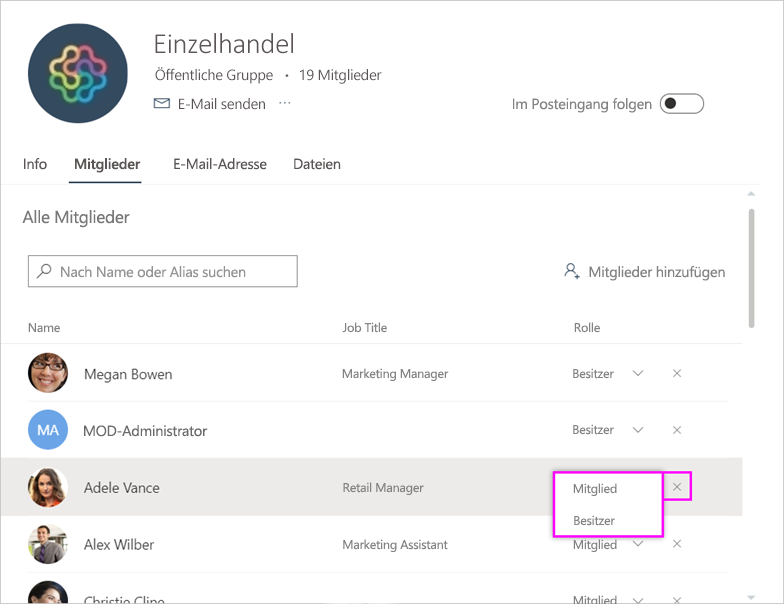
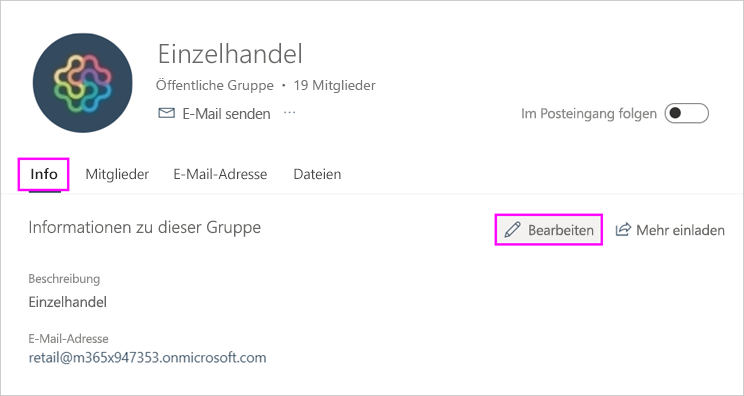
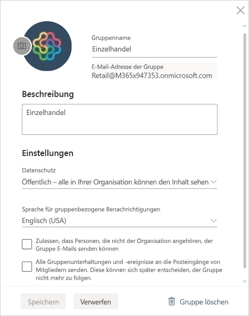

# Verwalten von Arbeitsbereichen in Power BI und Microsoft 365

Als Ersteller oder Administrator eines [Arbeitsbereichs in Power BI](service-create-distribute-apps.md) oder in Microsoft 365 verwalten Sie einige Aspekte des Arbeitsbereichs in Power BI. Andere Aspekte werden in Microsoft 365 verwaltet.

> [!NOTE]
> Mit den neuen Arbeitsbereichen ändert sich die Beziehung zwischen Power BI-Arbeitsbereichen und Microsoft 365-Gruppen. Sie erstellen nicht jedes Mal automatisch eine Microsoft 365-Gruppe, wenn Sie einen der neuen Arbeitsbereiche erstellen. Erfahren Sie mehr über das [Erstellen der neuen Arbeitsbereiche](service-create-the-new-workspaces.md).

In **Power BI** können Sie die folgenden Aktionen ausführen:

* Hinzufügen oder Entfernen von Arbeitsbereichsmitgliedern, einschließlich Festlegen eines Mitglieds als Administrators
* Bearbeiten des Arbeitsbereichsnamens
* Löschen des Arbeitsbereichs und damit einhergehend Löschen der Microsoft 365-Gruppe

Folgendes ist in **Microsoft 365** möglich:

* Hinzufügen oder Entfernen von Gruppenmitgliedern im Arbeitsbereich und Festlegen eines Mitglieds als Besitzer
* Bearbeiten des Gruppennamens, des Images, der Beschreibung und anderer Einstellungen.
* Anzeigen der E-Mail-Adresse der Gruppe
* Löschen der Gruppe

Sie benötigen eine [Power BI Pro](../fundamentals/service-features-license-type.md)-Lizenz, damit Sie Administrator oder Mitglied eines Arbeitsbereichs sein können. Ihre App-Benutzer benötigen ebenfalls eine Power BI Pro-Lizenz, es sei denn, der Arbeitsbereich befindet sich in einer Power BI Premium-Kapazität. Details finden Sie unter [Was ist Power BI Premium?](../admin/service-premium-what-is.md).

## Bearbeiten von Arbeitsbereichen in Power BI

1. Klicken Sie im Power BI-Dienst auf den Pfeil neben **Arbeitsbereiche**, wählen Sie die Auslassungspunkte (...) für **Weitere Optionen** neben dem Namen Ihres Arbeitsbereichs und anschließend **Arbeitsbereich bearbeiten** aus.

   

   > [!NOTE]
   > Die Option **Diesen Arbeitsbereich bearbeiten** wird nur dann angezeigt, wenn Sie ein Administrator des Arbeitsbereichs sind.

1. Hier können Sie den Arbeitsbereich umbenennen, hinzufügen oder entfernen bzw. den Arbeitsbereich löschen.

   

1. Wählen Sie **Speichern** oder **Abbrechen**aus.

## Bearbeiten von Eigenschaften des Power BI-Arbeitsbereichs in Microsoft 365

Sie können bestimmte Aspekte eines Arbeitsbereichs auch direkt in Outlook für Microsoft 365 bearbeiten.

### Bearbeiten der Mitglieder der Arbeitsbereichsgruppe

1. Klicken Sie im Power BI-Dienst auf den Pfeil neben **Arbeitsbereiche**, wählen Sie die Auslassungspunkte (...) für **Weitere Optionen** neben dem Namen des Arbeitsbereichs aus, und klicken Sie dann auf **Mitglieder**.

   

   Daraufhin wird die Outlook für Microsoft 365-Gruppenansicht Ihres Arbeitsbereichs geöffnet. Sie müssen sich möglicherweise mit Ihrem Geschäftskonto anmelden.

1. Wählen Sie die Rolle neben dem Namen eines Teamkollegen aus, um die Person als **Mitglied** oder **Besitzer** festzulegen. Wählen Sie das **X** aus, um die Person aus der Gruppe zu entfernen.

   

### Hinzufügen eines Bilds und Festlegen anderer Eigenschaften des Arbeitsbereichs

Wenn Sie Ihre App über den Arbeitsbereich verteilen, ist das Bild, das Sie hier hinzufügen, das Bild für Ihre App. Weitere Informationen finden Sie unter [Hinzufügen eines Bilds zu Ihrem Microsoft 365-Arbeitsbereich](service-create-workspaces.md#add-an-image-to-your-microsoft-365-workspace-optional) im Artikel **Erstellen der neuen Arbeitsbereiche**.

1. Navigieren Sie in der Outlook für Microsoft 365-Ansicht Ihres Arbeitsbereichs zur Registerkarte **Info**, und klicken Sie auf **Bearbeiten**.

    
1. Sie können den Namen, die Beschreibung und die Sprache für gruppenbezogene Benachrichtigungen bearbeiten. Sie können hier auch ein Bild hinzufügen und andere Eigenschaften festlegen.

   

1. Wählen Sie **Speichern** oder **Verwerfen**.

## Nächste Schritte

* [Veröffentlichen einer App in Power BI](service-create-distribute-apps.md)

* Weitere Fragen? [Wenden Sie sich an die Power BI-Community](https://community.powerbi.com/)
