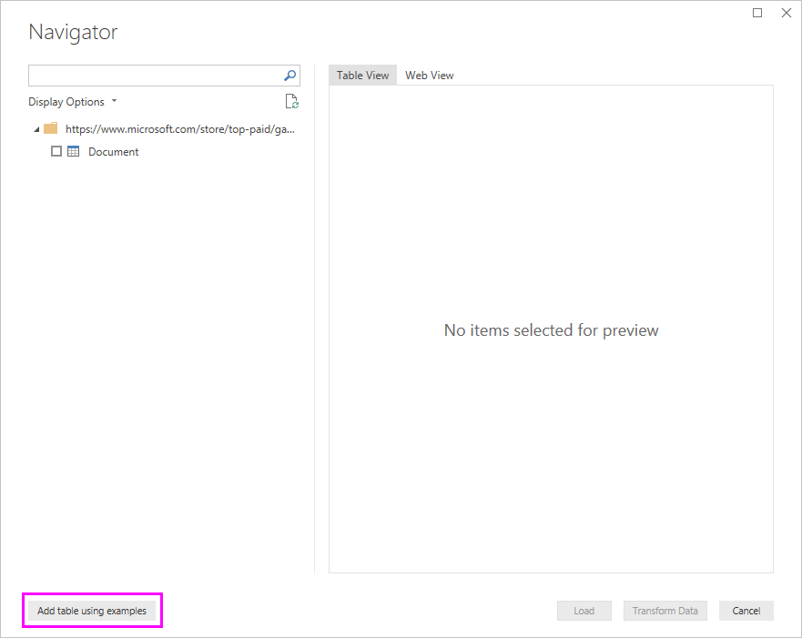
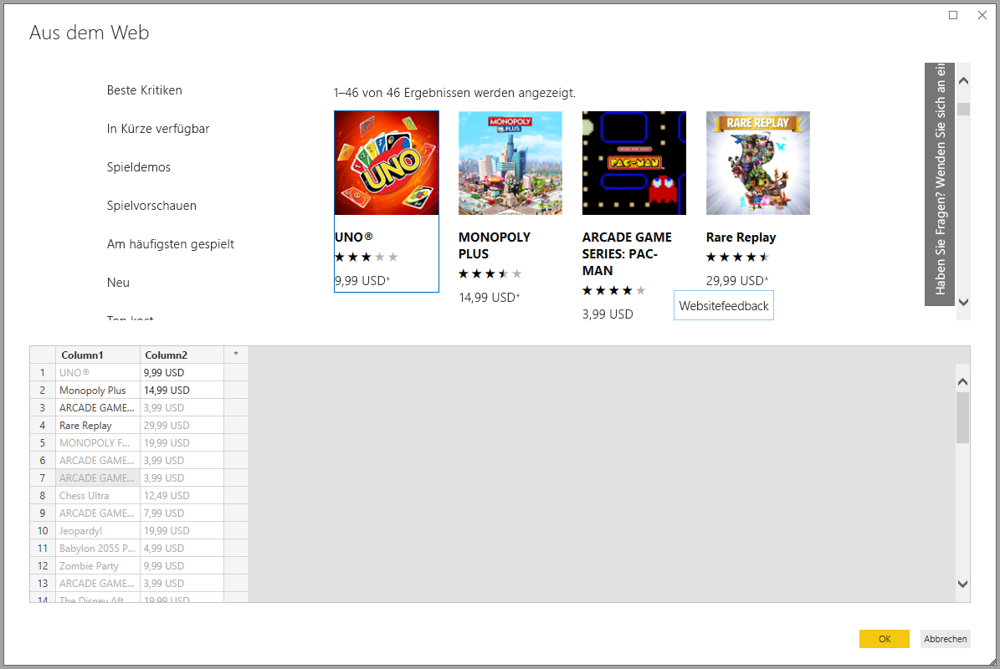
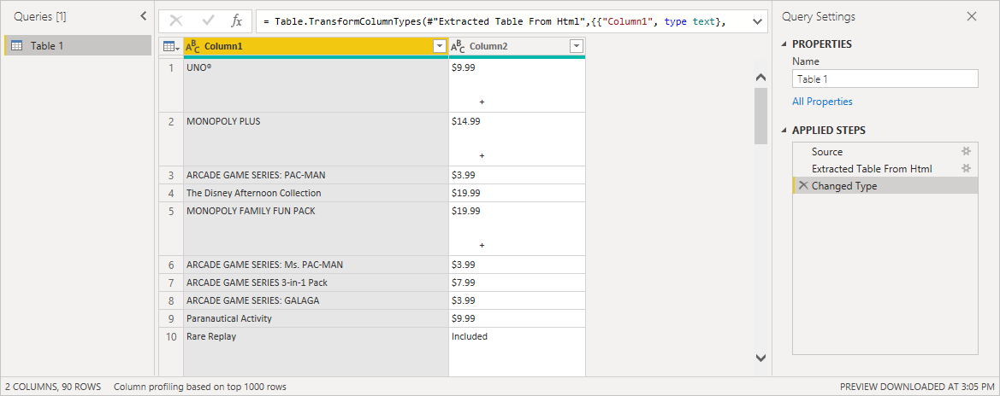

# Abrufen von Webseitendaten durch Angeben von Beispielen

Durch Abrufen von Daten aus einer Webseite können Benutzer Daten ganz einfach aus Webseiten extrahieren und in *Power BI Desktop* importieren. Häufig befinden sich die Daten auf Webseiten jedoch nicht in aufgeräumten Tabellen, die leicht zu extrahieren sind. Daten aus solchen Seiten zu erhalten, kann eine Herausforderung sein, selbst wenn die Daten strukturiert und konsistent sind.

Es gibt jedoch eine Lösung: Mit dem Feature *Get Data from Web by example* (Daten per Beispiel aus dem Web holen) können Sie grundlegend Power BI Desktop zeigen, welche Daten Sie extrahieren möchten, indem Sie ein oder mehrere Beispiele im Connectordialogfeld bereitstellen. Power BI Desktop sammelt andere Daten auf der Seite, die Ihren Beispielen entsprechen. Mit dieser Lösung können Sie alle Arten von Daten aus Webseiten extrahieren, also Daten in Tabellen *und* Daten, die sich nicht in Tabellen befinden.

Die Preise in den Abbildungen dienen nur als Beispiel.

## Verwenden von „Daten anhand von Beispielen aus dem Web abrufen“

Klicken Sie im Menüband **Start** auf **Daten abrufen**. Wählen Sie im angezeigten Dialogfeld **Andere** aus den Kategorien im linken Bereich aus, und wählen Sie dann **Web** aus. Klicken Sie auf **Verbinden**, um den Vorgang fortzusetzen.

Geben Sie in **Aus dem Web** die URL der Webseite ein, aus der Sie Daten extrahieren möchten. In diesem Artikel wird die Microsoft Store-Webseite verwendet, und es wird gezeigt, wie dieser Connector funktioniert.

Wenn Sie das Prozedere nachvollziehen möchten, können Sie die gleiche [Microsoft Store-URL](https://www.microsoft.com/store/top-paid/games/xbox?category=classics) verwenden wie in diesem Artikel:

    https://www.microsoft.com/store/top-paid/games/xbox?category=classics

Wenn Sie auf **OK** klicken, werden Sie zum Dialogfeld **Navigator** weitergeleitet, in dem alle automatisch erkannten Tabellen der Webseite angezeigt werden. In dem in der Abbildung unten gezeigten Fall wurden keine Tabellen gefunden. Wählen Sie **Tabelle anhand von Beispielen hinzufügen** aus, um Beispiele bereitzustellen.

**Tabelle anhand von Beispielen hinzufügen** zeigt ein interaktives Fenster, in dem Sie den Inhalt der Webseite vorher anzeigen können. Geben Sie Beispielwerte der Daten ein, die Sie extrahieren möchten.

In diesem Beispiel extrahieren wir den *Namen* und den *Preis* für jedes Spiel auf der Seite. Das können wir tun, indem wir für jede Spalte einige Beispiele von der Seite angeben. Bei der Eingabe von Beispielen extrahiert *Power Query* mithilfe intelligenter Datenextraktionsalgorithmen Daten, die dem Muster der Beispieleinträge entsprechen.

> [!NOTE]
> In Wertvorschläge sind nur Werte enthalten, die höchstens 128 Zeichen umfassen.

Wenn Sie mit den aus der Webseite extrahierten Daten zufrieden sind, wählen Sie **OK** aus, um zum Power Query-Editor zu gelangen. Sie können weitere Transformationen anwenden oder die Daten erstellen, wie z. B. diese Daten mit anderen Daten aus unseren Quellen zu kombinieren.

Nun können Sie Visuals erstellen oder die Webseitendaten auf andere Weise nutzen, wenn Sie Ihre Power BI Desktop-Berichte erstellen.

## Weitere Schritte

Sie können mithilfe von Power BI Desktop eine Verbindung mit Daten jeglicher Art herstellen. Weitere Informationen zu Datenquellen finden Sie in folgenden Ressourcen:

* [Hinzufügen einer Spalte aus einem Beispiel in Power BI Desktop](../create-reports/desktop-add-column-from-example.md)
* [Verbinden mit Webseiten von Power BI Desktop](desktop-connect-to-web.md)
* [Datenquellen in Power BI Desktop](desktop-data-sources.md)
* [Strukturieren und Kombinieren von Daten in Power BI Desktop](desktop-shape-and-combine-data.md)
* [Verbinden mit Excel in Power BI Desktop](desktop-connect-excel.md)
* [Verbinden mit CSV-Dateien in Power BI Desktop](desktop-connect-csv.md)
* [Eingeben von Daten direkt in Power BI Desktop](desktop-enter-data-directly-into-desktop.md)
