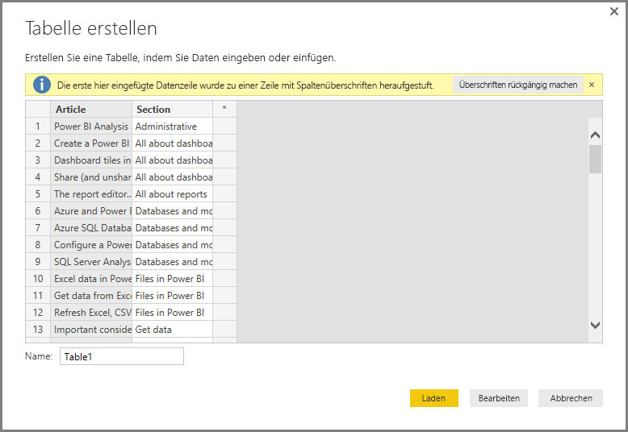

# Enter data directly into Power BI Desktop (Direktes Eingeben von Daten in Power BI Desktop)

Mit Power BI Desktop können Sie Daten direkt eingeben und diese Daten in Ihren Berichten und Visualisierungen verwenden. Beispielsweise können Sie Teile einer Arbeitsmappe oder einer Webseite kopieren und anschließend in Power BI Desktop einfügen.

Um Daten direkt in Power BI Desktop in Form einer neuen Tabelle einzugeben, wählen Sie im Menüband **Start** die Option **Daten eingeben** aus.

Power BI Desktop versucht möglicherweise kleinere Transformationen der Daten vorzunehmen, wie es beim Laden von Daten aus einer beliebigen Quelle der Fall ist. Im folgenden Fall wurde beispielsweise die erste Datenzeile zu Überschriften heraufgestuft.

Wenn Sie die eingegebenen oder eingefügten Daten anpassen möchten, wählen Sie **Bearbeiten** aus, um den **Abfrage-Editor** zu öffnen. Sie können Daten anpassen und transformieren, bevor sie sie in Power BI Desktop laden. Wählen Sie **Laden** aus, um die Daten wie angezeigt zu importieren.

Wenn Sie **Laden** auswählen, erstellt Power BI Desktop eine neue Tabelle aus Ihren Daten und stellt diese im Bereich **Felder** zur Verfügung. In der folgenden Abbildung zeigt Power BI Desktop die neue Tabelle (als *Tabelle1* benannt) und die zwei neu erstellten Felder in der Tabelle an.

Und das ist auch schon alles! So einfach ist es, Daten in Power BI Desktop einzugeben.

Sie können die Daten jetzt in Power BI Desktop verwenden. Erstellen Sie Visualisierungen oder Berichte, oder interagieren Sie mit anderen Daten, die Sie möglicherweise verknüpfen und importieren möchten, z. B. Excel-Arbeitsmappen, Datenbanken oder beliebige andere Datenquellen.

## Weitere Schritte

Sie können mithilfe von Power BI Desktop eine Verbindung mit Daten jeglicher Art herstellen. Weitere Informationen zu Datenquellen finden Sie in folgenden Ressourcen:

* [Was ist Power BI Desktop?](../fundamentals/desktop-what-is-desktop.md)
* [Datenquellen in Power BI Desktop](desktop-data-sources.md)
* [Strukturieren und Kombinieren von Daten mit Power BI Desktop](desktop-shape-and-combine-data.md)
* [Verbinden mit Excel in Power BI Desktop](desktop-connect-excel.md)
* [Verbinden mit CSV-Dateien in Power BI Desktop](desktop-connect-csv.md)
