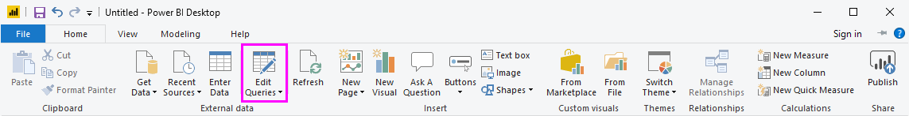
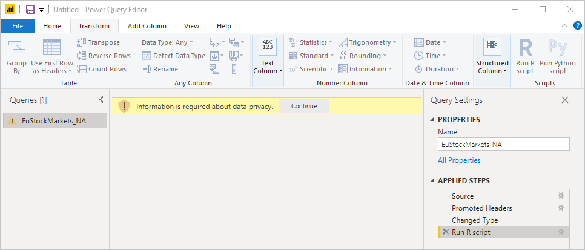

# <a name="use-r-in-power-query-editor"></a>Verwenden von R im Power Query-Editor

[R](https://mran.microsoft.com/documents/what-is-r) ist eine leistungsfähige Programmiersprache, die von vielen Statistikern, Data Scientists und Data Analysts verwendet wird. Mit R können Sie im Power Query-Editor von Power BI Desktop folgende Aufgaben durchführen:

* Vorbereiten von Datenmodellen

* Erstellen von Berichten

* Bereinigen von Daten, Strukturieren von Daten mit modernen Methoden und Analysieren von Datasets, was auch die Vervollständigung fehlender Daten, Vorhersagen, Clustering und vieles mehr einschließt  

## <a name="install-r"></a>Installieren von R

Sie können R kostenlos über die [Downloadseite von Revolution Open](https://mran.revolutionanalytics.com/download/) und aus dem [CRAN-Repository](https://cran.r-project.org/bin/windows/base/) herunterladen.

## <a name="install-mice"></a>Installieren von „mice“

Als Voraussetzung müssen Sie die [mice-Bibliothek](https://www.rdocumentation.org/packages/mice/versions/3.5.0/topics/mice) in Ihrer R-Umgebung herunterladen. Ohne mice wird der Code im Beispielskript nicht richtig ausgeführt. Im mice-Paket ist eine Methode zum Umgang mit fehlenden Daten implementiert.

So installieren Sie die mice-Bibliothek:

1. Starten Sie das Programm „R. exe“ (z. B. unter C:\Programme\Microsoft\R Open\R-3.5.3\bin\R.exe).  

2. Führen Sie in der R-Eingabeaufforderung den install-Befehl aus:

   ``` 
   install.packages('mice') 
   ```

## <a name="use-r-in-power-query-editor"></a>Verwenden von R im Power Query-Editor

Im Folgenden wird demonstriert, wie Sie R im Power Query-Editor verwenden können. Dazu nutzen Sie ein Beispieldataset, das sich in einer CSV-Datei befindet und Börsendaten enthält, und führen die folgenden Schritte aus:

1. [Laden Sie die Datei EuStockMarkets_NA.csv herunter](https://download.microsoft.com/download/F/8/A/F8AA9DC9-8545-4AAE-9305-27AD1D01DC03/EuStockMarkets_NA.csv). Merken Sie sich, wo Sie sie gespeichert haben.

1. Laden Sie Daten in Power BI Desktop. Klicken Sie auf der Registerkarte **Start** auf **Daten abrufen**  >  **Text/CSV**.

   

1. Wählen Sie die Datei EuStockMarkets_NA.csv aus, und klicken Sie dann auf **Öffnen**. Die CSV-Daten werden im Dialogfeld **Text/CSV file** (Text/CSV-Datei) angezeigt.

   

1. Klicken Sie auf **Laden**, um die Daten aus der Datei zu laden. Nachdem die Daten in Power BI geladen wurden, wird im Bereich **Felder** eine neue Tabelle angezeigt.

   

1. Klicken Sie im Menüband **Start** auf **Abfragen bearbeiten**, um den Power Query-Editor zu öffnen.

   

1. Klicken Sie auf der Registerkarte **Transformieren** auf **R-Skript ausführen**. Der Editor **R-Skript ausführen** wird angezeigt. In den Zeilen 15 und 20 sowie in weiteren Zeilen, die nicht auf dem Screenshot zu sehen sind, fehlen Daten. Die unten aufgeführten Schritte verdeutlichen, wie R diese Zeilen automatisch vervollständigt.

   

1. Geben Sie für dieses Beispiel den folgenden Skriptcode im Fenster **R-Skript ausführen** in das Feld **Skript** ein. Ersetzen Sie *&lt;Your File Path&gt;* durch den Pfad zu EuStockMarkets_NA.csv auf Ihrem lokalen Dateisystem. Dieser könnte z. B. wie folgt aussehen: C:/Benutzer/John Doe/Dokumente/Microsoft/EuStockMarkets_NA.csv.

    ```r
       dataset <- read.csv(file="<Your File Path>/EuStockMarkets_NA.csv", header=TRUE, sep=",")
       library(mice)
       tempData <- mice(dataset,m=1,maxit=50,meth='pmm',seed=100)
       completedData <- complete(tempData,1)
       output <- dataset
       output$completedValues <- completedData$"SMI missing values"
    ```

    > [!NOTE]
    > Möglicherweise müssen Sie eine Variable mit dem Namen *output* überschreiben, damit das neue Dataset mit den angewendeten Filtern ordnungsgemäß erstellt wird.

7. Wählen Sie **OK** aus. Im Power Query-Editor wird dann ein Hinweis zum Datenschutz angezeigt.

   
8. Klicken Sie neben der Warnung auf **Fortsetzen**. Legen Sie im angezeigten Dialogfeld **Datenschutzebenen** für alle Datenquellen für R-Skripts **Öffentlich** fest, damit sie im Power BI-Dienst ordnungsgemäß funktionieren. 

   

   Weitere Informationen zu den Datenschutzeinstellungen und deren Bedeutung finden Sie unter [Power BI Desktop – Datenschutzebenen](../admin/desktop-privacy-levels.md).

 9. Klicken Sie auf **Erstellen**, um das Skript auszuführen. 

   Im Bereich **Felder** wird eine neue Spalte mit dem Namen **completedValues** angezeigt. In dieser Spalte fehlen einige Datenelemente, z. B. in Zeile 15 und 18. Im nächsten Abschnitt sehen Sie, wie dies von R behandelt wird.

   Mit einigen wenigen Zeilen R-Skript konnte der Power Query-Editor die fehlenden Werte anhand eines Vorhersagemodells einfügen.

## <a name="create-visuals-from-r-script-data"></a>Erstellen von Visuals aus Daten in R-Skripts

Sie können nun ein Visual erstellen, um zu zeigen, wie der R-Skriptcode zusammen mit der mice-Bibliothek die fehlenden Werte vervollständigt.


Sie können die vollständigen Visuals in einer Power BI Desktop-Datei im PBIX-Format speichern und das Datenmodell sowie die zugehörigen R-Skripts im Power BI-Dienst verwenden.

> [!NOTE]
> Sie können eine [PBIX-Datei herunterladen](https://download.microsoft.com/download/F/8/A/F8AA9DC9-8545-4AAE-9305-27AD1D01DC03/Complete%20Values%20with%20R%20in%20PQ.pbix), in der diese Schritte bereits ausgeführt wurden.

Nachdem Sie die PBIX-Datei in den Power BI-Dienst hochgeladen haben, müssen Sie zusätzliche Schritte ausführen, um die Aktualisierung der Dienstdaten und die aktualisierten Visuals zu aktivieren:  

* **Aktivieren der geplanten Aktualisierung für das Dataset:** Weitere Informationen zur Verwendung des R-Skripts zum Aktivieren der geplanten Aktualisierung für die Arbeitsmappe, die Ihr Dataset enthält, finden Sie im Artikel [Konfigurieren von geplanten Aktualisierungen](refresh-scheduled-refresh.md). Dieser Artikel enthält außerdem Informationen zu persönlichen Gateways.

* **Installieren des persönlichen Gateways:** Auf dem Computer, auf dem sich die Datei und R befinden, muss ein persönliches Gateway installiert sein. Der Power BI-Dienst greift auf diese Arbeitsmappe zu und rendert alle aktualisierten Visuals neu. Weitere Informationen finden Sie im Artikel [Verwenden persönlicher Gateways in Power BI](service-gateway-personal-mode.md).

## <a name="limitations"></a>Einschränkungen

Für Abfragen, die im Power Query-Editor erstellte R-Skripts enthalten, gelten einige Einschränkungen:

* Für alle R-Datenquellen muss die Einstellung **Öffentlich** festgelegt werden. Dasselbe gilt auch für alle anderen Schritte einer Abfrage im Power Query-Editor. 

   Klicken Sie in Power BI Desktop auf **Datei**  >  **Optionen und Einstellungen**  >  **Datenquelleneinstellungen**.

   

   Wählen Sie im Dialogfeld **Datenquelleneinstellungen** eine oder mehrere Datenquellen aus, und klicken Sie dann auf **Berechtigungen bearbeiten**. Legen Sie für **Datenschutzebene** die Einstellung **Öffentlich** fest.

     
  
* Wenn Sie geplante Aktualisierungen der R-Visuals oder des Datasets zulassen möchten, müssen Sie geplante Aktualisierungen aktivieren. Auf dem Computer, auf dem sich die Arbeitsmappe und die R-Installation befinden, muss außerdem ein persönliches Gateway installiert sein. 

Für R und benutzerdefinierte Abfragen gibt es viele verschiedene Verwendungsmöglichkeiten. Analysieren Sie Ihre Daten, und stellen Sie sie in genau der Form dar, die für Sie am geeignetsten ist.

## <a name="next-steps"></a>Nächste Schritte

* [Einführung in R](https://mran.microsoft.com/documents/what-is-r) 

* [Ausführen von R-Skripts in Power BI Desktop](desktop-r-scripts.md) 

* [Verwenden einer externen R-IDE mit Power BI](desktop-r-ide.md) 

* [Erstellen von visuellen Elementen mithilfe von R-Paketen im Power BI-Dienst](service-r-packages-support.md)
