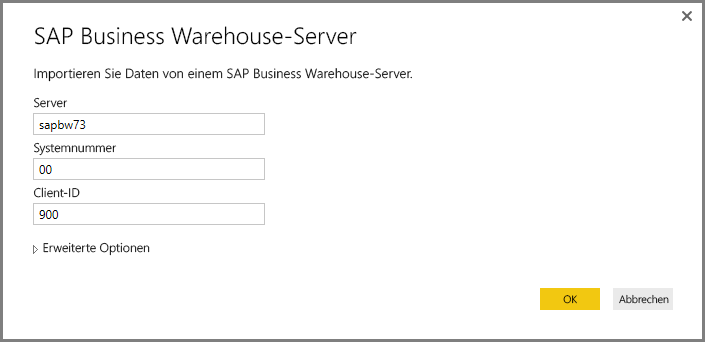
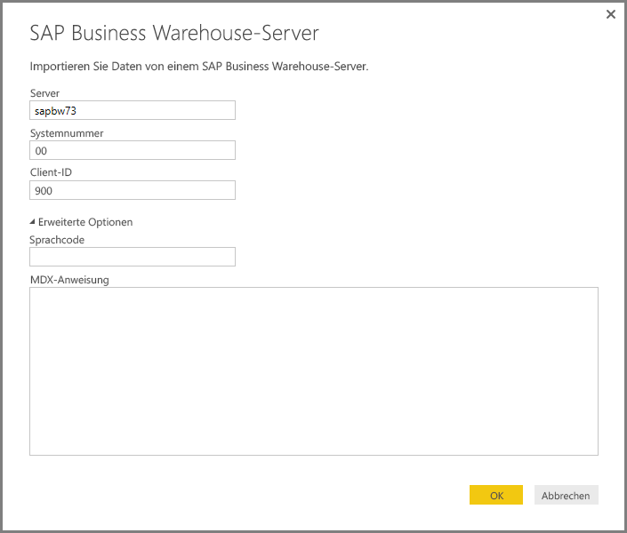
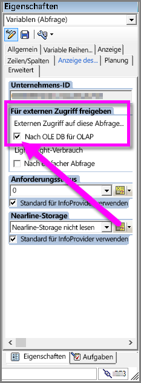

# <a name="use-the-sap-business-warehouse-connector-in-power-bi-desktop"></a>Verwendung des SAP Business Warehouse-Connectors in Power BI Desktop

Mit Power BI Desktop können Sie auf Daten aus *SAP Business Warehouse (BW)* zugreifen.

Weitere Informationen darüber, wie SAP-Kunden von der Verknüpfung von Power BI mit ihren vorhandenen SAP BW-Systemen (BW) profitieren können, finden Sie im [Whitepaper von Power BI und SAP](https://aka.ms/powerbiandsapbw). Weitere Informationen zur Verwendung von DirectQuery mit SAP BW finden Sie unter [DirectQuery und SAP Business Warehouse (BW)](desktop-directquery-sap-bw.md).

Seit dem Power BI Desktop-Release vom Juni 2018 (allgemein verfügbar im Oktober 2018) können Sie den *SAP BW-Connector* mit einer Implementierung nutzen, die die Leistung und die Funktionen erheblich verbessert. Microsoft hat *Implementierung 2.0* für den SAP BW-Connector entwickelt. Sie können entweder Version 1 des SAP BW-Connectors oder die Implementierung 2.0 des SAP-Connectors verwenden. In den folgenden Abschnitten wird die Installation der einzelnen Versionen beschrieben. Sie können den einen oder den anderen Connector auswählen, wenn Sie über Power BI Desktop eine Verbindung zu SAP BW herstellen.

Es wird empfohlen, nach Möglichkeit die Implementierung 2.0 des SAP-Connectors zu verwenden.

## <a name="installation-of-version-1-of-the-sap-bw-connector"></a>Installation von Version 1 des SAP BW-Connectors

Es wird empfohlen, nach Möglichkeit die Implementierung 2.0 des SAP-Connectors zu verwenden. Dieser Abschnitt beschreibt die Installation von Version 1 des SAP BW-Connectors.

1. Installieren Sie die *SAP NetWeaver*-Bibliothek auf Ihrem lokalen Computer. Sie erhalten die SAP NetWeaver-Bibliothek von Ihrem SAP-Administrator oder direkt über das [SAP Software Download Center](https://support.sap.com/swdc). Da die Struktur des SAP Software Download Center regelmäßig überarbeitet wird, können wir keine genaueren Angaben zu dieser Website machen. Diese SAP NetWeaver-Bibliothek ist in der Regel auch in der Installation der SAP Client Tools enthalten.

   Sie können nach *SAP-Hinweis 1025361* suchen, um den Downloadpfad für die neueste Version zu ermitteln. Stellen Sie sicher, dass die Architektur für die SAP NetWeaver-Bibliothek (32 Bit oder 64 Bit) Ihrer Installation von Power BI Desktop entspricht. Installieren Sie alle im *SAP NetWeaver RFC SDK* enthaltenen Dateien gemäß SAP-Hinweis.
2. Wählen Sie in Power BI Desktop **Daten abrufen** aus. Zu den Optionen in der Kategorie **Daten abrufen** gehören *SAP Business Warehouse-Anwendungsserver* und *SAP Business Warehouse-Nachrichtenserver*.

   

## <a name="installation-of-implementation-20-sap-connector"></a>Installation der Implementierung 2.0 des SAP-Connectors

Die Implementierung 2.0 des SAP-Connectors erfordert den SAP .NET Connector 3.0. Um auf den Download zugreifen zu können, ist ein gültiger S-User erforderlich. Wenden Sie sich an Ihr SAP Basis-Team, um den SAP .NET Connector 3.0 anzufordern.

Sie können den [SAP .NET Connector 3.0](https://support.sap.com/en/product/connectors/msnet.html) von der SAP-Website herunterladen.

Der Connector wird in einer 32-Bit- und einer 64-Bit-Version bereitgestellt. Installieren Sie die Version, die Ihrer Power BI Desktop-Installation entspricht. Aktuell werden auf der Website zwei Versionen für .NET Framework 4.0 aufgeführt:

* SAP-Connector für Microsoft .NET 3.0.22.0 für Windows 32-Bit (x86) als ZIP-Datei (6.896 KB), 1. Juni 2019
* SAP-Connector für Microsoft .NET 3.0.22.0 für Windows 64-Bit (x64) als ZIP-Datei (7.180 KB), 1. Juni 2019

Wählen Sie bei der Installation unter **Optionale Setupschritte** die Option *Assemblys im GAC installieren* aus.


> [!NOTE]
> Für die erste Version der SAP BW-Implementierung wurden NetWeaver-DLLs benötigt. Wenn Sie stattdessen die Implementierung 2.0 des SAP-Connectors verwenden, sind die NetWeaver-DLLs nicht notwendig.

## <a name="version-1-sap-bw-connector-features"></a>Features von Version 1 des SAP BW-Connectors

Mit Version 1 des SAP BW-Connectors in Power BI Desktop können Sie Daten aus Ihren Cubes im *SAP Business Warehouse-Server* importieren oder DirectQuery verwenden.

Weitere Informationen zum SAP BW-Connector und seiner Verwendung mit DirectQuery finden Sie unter [DirectQuery und SAP Business Warehouse (BW)](desktop-directquery-sap-bw.md).

Geben Sie bei der Verbindungsherstellung Werte für **Server**, **Systemnummer** und **Client-ID** an.



Ferner können Sie zwei zusätzliche **erweiterte Optionen** angeben: **Sprachcode** und eine benutzerdefinierte **MDX-Anweisung** zur Ausführung auf dem angegebenen Server.



Wenn Sie keine MDX-Anweisung angeben, wird in der Verbindungseinstellung die Liste der Cubes angezeigt, die auf dem Server verfügbar sind. Sie können einen Drilldown durchführen und Elemente aus den verfügbaren Cubes auswählen, Dimensionen und Measures eingeschlossen. Power BI macht Abfragen und Cubes verfügbar, die wiederum über [Open Analysis Interface](https://help.sap.com/saphelp_nw70/helpdata/en/d9/ed8c3c59021315e10000000a114084/content.htm) verfügbar gemacht wurden.

Wenn Sie mindestens ein Element auf dem Server auswählen, wird im Dialogfeld „Navigator“ eine Vorschau der Ausgabetabelle erstellt.


Im Dialogfeld **Navigator** werden außerdem die folgenden Anzeigeoptionen bereitgestellt:

* **Nur ausgewählte Elemente anzeigen**. Im Dialogfeld **Navigator** werden standardmäßig alle Elemente angezeigt.  Diese Option ist zum Überprüfen des endgültigen Satzes ausgewählter Elemente nützlich. Eine alternative Möglichkeit zur Darstellung der ausgewählten Elemente besteht darin, die Spaltennamen im Vorschaubereich auszuwählen.
* **Datenvorschau aktivieren**. Dies ist der Standardwert. Hiermit wird eine Datenvorschau angezeigt. Das Deaktivieren der Datenvorschau verringert die Anzahl von Serveraufrufen, weil keine Daten für die Vorschau mehr angefordert werden.
* **Technische Namen**. SAP BW unterstützt das Konzept von *technischen Namen* für Objekte innerhalb eines Cubes. Durch technische Namen kann ein Cube-Besitzer *Anzeigenamen* für Cubeobjekte verfügbar machen, statt nur die *physischen Namen* für diese Objekte im Cube bereitzustellen.


Nachdem Sie alle erforderlichen Objekte ausgewählt haben, können Sie entscheiden, was als Nächstes zu tun ist. Wählen Sie hierzu eine der folgenden Optionen aus:

* Wählen Sie die Option **Laden** aus, um den gesamten Zeilensatz für die Ausgabetabelle in das Power BI Desktop-Datenmodell zu laden. Die Ansicht **Bericht** wird geöffnet. Mithilfe der Ansichten **Daten** oder **Beziehungen** können Sie mit der Visualisierung der Daten beginnen oder weitere Änderungen vornehmen.
* Klicken Sie auf **Bearbeiten**, um den **Abfrage-Editor** zu öffnen. Im Abfrage-Editor können Sie zusätzliche Schritte zur Datentransformation und zum Filtern ausführen, bevor der gesamte Zeilensatz in das Datenmodell für Power BI Desktop geladen wird.

Zusätzlich zum Importieren von Daten aus SAP BW Cubes können Sie Daten aus einer Vielzahl weiterer Datenquellen in Power BI Desktop importieren und diese dann zu einem einzelnen Bericht zusammenfassen. Hierdurch werden zahlreiche interessante Szenarien für die Berichterstellung und Analyse auf der Basis von SAP BW-Daten unterstützt.

## <a name="using-implementation-20-sap-bw-connector"></a>Verwenden der Implementierung 2.0 des SAP BW-Connectors

Erstellen Sie eine neue Verbindung, um die Implementierung 2.0 des SAP BW-Connectors zu verwenden. Gehen Sie wie folgt vor, um die neue Verbindung herzustellen:

1. Wählen Sie **Daten abrufen** aus. Wählen Sie entweder **SAP Business Warehouse-Anwendungsserver** oder **SAP Business Warehouse-Nachrichtenserver** aus.

2. Wählen Sie im neuen Verbindungsdialogfeld die Implementierung aus. Wenn Sie sich für die **Implementierung** **2.0** entscheiden (wie in der folgenden Abbildung gezeigt), werden die Optionen **Ausführungsmodus**, **Batchgröße** und **Charakteristische Strukturen aktivieren** aktiviert.

    

3. Wählen Sie **OK** aus. Ab hier entspricht die Vorgehensweise derjenigen, die in [Features von Version 1 des SAP BW-Connectors](#version-1-sap-bw-connector-features) für den SAP BW-Connector der Version 1 beschrieben ist.

### <a name="new-options-for-implementation-20"></a>Neue Optionen für die Implementierung 2.0

Die Implementierung 2.0 unterstützt die folgenden Optionen:

* *ExecutionMode* gibt die MDX-Schnittstelle an, mit der Abfragen auf dem Server ausgeführt werden. Gültige Optionen:

  * `SapBusinessWarehouseExecutionMode.BasXml`
  * `SapBusinessWarehouseExecutionMode.BasXmlGzip`
  * `SapBusinessWarehouseExecutionMode.DataStream`

    Der Standardwert ist `SapBusinessWarehouseExecutionMode.BasXmlGzip`.

    Die Verwendung von `SapBusinessWarehouseExecutionMode.BasXmlGzip` kann die Leistung bei hoher Latenz für große Datasets steigern.

* *BatchSize* gibt die maximale Anzahl von Zeilen an, die während der Ausführung einer MDX-Anweisung gemeinsam abgerufen werden. Eine geringe Anzahl von Zeilen bedeutet mehr Aufrufe des Servers, wenn ein großes Dataset abgerufen wird. Ist die Anzahl der Zeilen groß, kann es zu einer Leistungssteigerung kommen. Gleichzeitig können jedoch Speicherprobleme auf dem SAP BW-Server auftreten. Der Standardwert sind 50.000 Zeilen.

* *EnableStructures* ist ein logischer Wert, der angibt, ob charakteristische Strukturen erkannt werden. Der Standardwert für diese Option ist FALSE. Er beeinflusst die Liste der zur Auswahl stehenden Objekte und wird im Modus für native Abfragen nicht unterstützt.

Die Option *ScaleMeasures* ist seit dieser Implementierung veraltet. Ihr Verhalten entspricht jetzt der Festlegung von *ScaleMeasures* auf FALSE – d. h., es werden immer nicht skalierte Werte angezeigt.

### <a name="additional-improvements-for-implementation-20"></a>Zusätzliche Verbesserungen für die Implementierung 2.0

In der folgenden Liste werden einige der Verbesserungen beschrieben, die in der neuen Implementierung enthalten sind:

* Verbesserte Leistung.
* Möglichkeit zum Abrufen mehrerer Millionen Datenzeilen und Feinabstimmung mithilfe des Batchgrößenparameters.
* Wechseln der Ausführungsmodi.
* Unterstützung für den komprimierten Modus. Besonders nützlich bei Verbindungen mit hoher Latenzzeit oder großen Datasets.
* Verbesserte Erkennung von `Date`-Variablen.
* [Experimentell]: `Date`- (ABAP-Typ: DATS) und `Time`-Dimensionen (ABAP-Typ: TIMS) können als Datumsangaben und Uhrzeiten statt als Textwerte verfügbar gemacht werden.
* bessere Ausnahmebehandlung. Fehler in BAPI-Aufrufen werden jetzt gemeldet.
* Spaltenfaltung in den Modi „BasXml“ und „BasXmlGzip“. Wenn eine generierte MDX-Abfrage beispielsweise 40 Spalten abruft, die aktuelle Auswahl aber nur 10 benötigt, wird diese Anforderung an den Server übergeben, damit sie ein kleineres Dataset abruft.

### <a name="changing-existing-reports-to-use-implementation-20"></a>Ändern vorhandener Berichte zur Verwendung der Implementierung 2.0

Das Ändern vorhandener Berichte zur Verwendung der Implementierung 2.0 ist nur im Importmodus möglich. Folgen Sie diesen Schritten:

1. Öffnen Sie einen vorhandenen Bericht, wählen Sie im Menüband **Abfragen bearbeiten** und dann die SAP Business Warehouse-Abfrage aus, die aktualisiert werden soll.

1. Klicken Sie mit der rechten Maustaste auf die Abfrage, und wählen Sie **Erweiterter Editor** aus.

1. Ändern Sie im Fenster **Erweiterter Editor** den `SapBusinessWarehouse.Cubes`-Aufruf wie folgt:

    Bestimmen Sie, ob die Abfrage bereits einen Optionsdatensatz enthält, z. B. wie im folgenden Beispiel:

    

    Falls dies zutrifft, fügen Sie die `Implementation` 2.0-Option hinzu, und entfernen Sie die `ScaleMeasures`-Option (sofern vorhanden):

    

    Wenn die Abfrage noch keinen Optionsdatensatz enthält, fügen Sie ihn einfach hinzu. Für die folgende Option:

    

    Ändern Sie ihn einfach in:

    

Es wurden sämtliche Anstrengungen unternommen, damit die Implementierung 2.0 des SAP BW-Connectors mit Version 1 kompatibel ist. Aufgrund der verschiedenen verwendeten SAP BW-MDX-Ausführungsmodi kann es jedoch Unterschiede geben. Versuchen Sie, zwischen den Ausführungsmodi zu wechseln, um Inkompatibilitäten zu beheben.

## <a name="troubleshooting"></a>Problembehandlung

In diesem Abschnitt werden Fehlerbehebungsszenarien (und Lösungen) für die Arbeit mit dem SAP BW-Connector vorgestellt.

1. Bei numerischen Daten aus SAP BW werden als Dezimaltrennzeichen Punkte anstelle von Kommas zurückgegeben. Beispielsweise wird 1,000,000 als 1.000.000 zurückgegeben.

   SAP BW gibt Dezimaldaten entweder mit `,` (Komma) oder mit `.` (Punkt) als Dezimaltrennzeichen zurück. Um anzugeben, welches dieser Zeichen von SAP BW als Dezimaltrennzeichen verwendet werden soll, ruft der von Power BI Desktop verwendete Treiber `BAPI_USER_GET_DETAIL` auf. Dieser Aufruf gibt eine Struktur mit dem Namen `DEFAULTS` zurück, die das Feld `DCPFM` enthält, in dem das *Format für die Dezimalschreibweise* gespeichert wird. Das Feld akzeptiert einen der folgenden Werte:

   * ' ' (Leerzeichen) = Komma als Dezimaltrennzeichen: N.NNN,NN
   * 'X' = Punkt als Dezimaltrennzeichen: N,NNN.NN
   * 'Y' = Leerzeichen als Tausendertrennzeichen und Komma als Dezimaltrennzeichen: N NNN NNN,NN

   Kunden, die dieses Problem gemeldet haben, stellten fest, dass der Aufruf von `BAPI_USER_GET_DETAIL` für einen bestimmten Benutzer (den Benutzer, für den die falschen Daten angezeigt werden) mit einer Fehlermeldung wie der folgenden abgebrochen wird:

   ```xml
    You are not authorized to display users in group TI:
        <item>
            <TYPE>E</TYPE>
            <ID>01</ID>
            <NUMBER>512</NUMBER>
            <MESSAGE>You are not authorized to display users in group TI</MESSAGE>
            <LOG_NO/>
            <LOG_MSG_NO>000000</LOG_MSG_NO>
            <MESSAGE_V1>TI</MESSAGE_V1>
            <MESSAGE_V2/>
            <MESSAGE_V3/>
            <MESSAGE_V4/>
            <PARAMETER/>
            <ROW>0</ROW>
            <FIELD>BNAME</FIELD>
            <SYSTEM>CLNTPW1400</SYSTEM>
        </item>
   ```

   Um diesen Fehler zu beheben, müssen Benutzer den SAP-Administrator bitten, dem in Power BI verwendeten SAPBW-Benutzer das Recht zum Ausführen von `BAPI_USER_GET_DETAIL` zu gewähren. Außerdem sollten Sie sicherstellen, dass der Benutzer über den erforderlichen `DCPFM`-Wert verfügt, wie weiter oben in dieser Problembehandlungslösung beschrieben.

2. Konnektivität für SAP BEx-Abfragen
   
   Sie können BEx-Abfragen in Power BI Desktop ausführen, indem Sie eine bestimmte Eigenschaft aktivieren, wie in folgender Abbildung dargestellt:
   
   
   
3. Das Fenster **Navigator** zeigt keine Datenvorschau an, sondern gibt diese Fehlermeldung aus: *Der Objektverweis ist nicht auf eine Instanz eines Objekts festgelegt.*
   
   SAP-Benutzer müssen auf bestimmte BAPI-Funktionsmodule zugreifen, um Metadaten und Daten aus InfoProvider-Objekten von SAP BW abzurufen. Hierzu gehören die folgenden Module:

   * BAPI_MDPROVIDER_GET_CATALOGS
   * BAPI_MDPROVIDER_GET_CUBES
   * BAPI_MDPROVIDER_GET_DIMENSIONS
   * BAPI_MDPROVIDER_GET_HIERARCHYS
   * BAPI_MDPROVIDER_GET_LEVELS
   * BAPI_MDPROVIDER_GET_MEASURES
   * BAPI_MDPROVIDER_GET_MEMBERS
   * BAPI_MDPROVIDER_GET_VARIABLES
   * BAPI_IOBJ_GETDETAIL

   Um dieses Problem zu beheben, überprüfen Sie, ob der Benutzer auf die verschiedenen MDPROVIDER-Module und `BAPI_IOBJ_GETDETAIL` zugreifen kann. Zur weiteren Behandlung dieses Problems oder ähnlicher Probleme können Sie die Ablaufverfolgung aktivieren. Wählen Sie **Datei** > **Optionen und Einstellungen** > **Optionen** aus. Klicken Sie in **Optionen** auf **Diagnose**, und wählen Sie dann **Ablaufverfolgung aktivieren** aus. Versuchen Sie bei aktivierter Ablaufverfolgung erneut, Daten aus SAP BW abzurufen, und untersuchen Sie die Ablaufverfolgungsdatei auf weitere Details.

## <a name="sap-bw-connection-support"></a>Unterstützung der SAP BW-Verbindung

In der folgenden Tabelle wird die aktuelle Unterstützung für SAP BW veranschaulicht.

|Product  |Modus  |Authentifizierung  |Connector  |SNC-Bibliothek  |Unterstützt  |
|---------|---------|---------|---------|---------|---------|
|Power BI Desktop     |Beliebig         | Benutzer/Kennwort  | Anwendungsserver | N/V  | Ja  |
|Power BI Desktop     |Beliebig         | Windows          | Anwendungsserver | sapcrypto + gsskrb5/gx64krb5  | Ja  |
|Power BI Desktop     |Beliebig         | Windows per Identitätswechsel | Anwendungsserver | sapcrypto + gsskrb5/gx64krb5  | Ja  |
|Power BI Desktop     |Beliebig         | Benutzer/Kennwort        | Nachrichtenserver | N/V  | Ja  |
|Power BI Desktop     |Beliebig         | Windows        | Nachrichtenserver | sapcrypto + gsskrb5/gx64krb5  | Ja  |
|Power BI Desktop     |Beliebig         | Windows per Identitätswechsel | Nachrichtenserver | sapcrypto + gsskrb5/gx64krb5  | Ja  |
|Power BI Gateway     |Importieren      | Identisch mit Power BI Desktop |         |   |   |
|Power BI Gateway     |DirectQuery | Benutzer/Kennwort        | Anwendungsserver | N/V  | Ja  |
|Power BI Gateway     |DirectQuery | Windows per Identitätswechsel (fester Benutzer, kein SSO) | Anwendungsserver | sapcrypto + gsskrb5/gx64krb5  | Ja  |
|Power BI Gateway     |DirectQuery | SSO über Kerberos für DirectQuery-Abfragen verwenden | Anwendungsserver | sapcrypto + gsskrb5/gx64krb5   | Ja  |
|Power BI Gateway     |DirectQuery | Benutzer/Kennwort        | Nachrichtenserver | N/V  | Ja  |
|Power BI Gateway     |DirectQuery | Windows per Identitätswechsel (fester Benutzer, kein SSO) | Nachrichtenserver | sapcrypto + gsskrb5/gx64krb5  | Ja  |
|Power BI Gateway     |DirectQuery | SSO über Kerberos für DirectQuery-Abfragen verwenden | Nachrichtenserver | gsskrb5/gx64krb5  | Nein  |
|Power BI Gateway     |DirectQuery | SSO über Kerberos für DirectQuery-Abfragen verwenden | Nachrichtenserver | sapcrypto  | Ja  |

## <a name="next-steps"></a>Nächste Schritte

Weitere Informationen zu SAP und DirectQuery finden Sie in den folgenden Ressourcen:

* [DirectQuery und SAP HANA](desktop-directquery-sap-hana.md)
* [DirectQuery und SAP Business Warehouse (BW)](desktop-directquery-sap-bw.md)
* [Verwendung von DirectQuery in Power BI](desktop-directquery-about.md)
* [Power BI-Datenquellen](power-bi-data-sources.md)
* [Whitepaper von Power BI und SAP BW](https://aka.ms/powerbiandsapbw)
