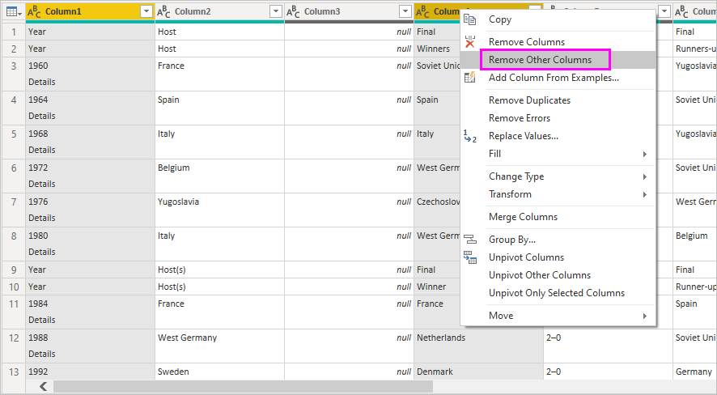
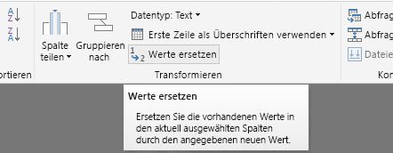
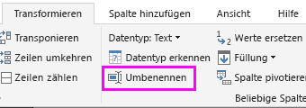
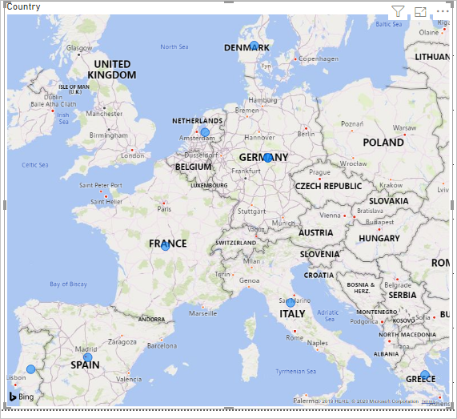

# Tutorial: Analysieren von Webseitendaten mit Power BI Desktop

Wenn Sie Fußballfan sind, möchten Sie vielleicht eine Übersicht über alle Europameister der vergangenen Jahre erstellen. Mit Power BI Desktop können Sie diese Daten von einer Webseite in einen Bericht importieren und Visualisierungen erstellen, um die Daten anzuzeigen. In diesem Tutorial erfahren Sie, wie Sie Power BI Desktop für Folgendes verwenden:

- Herstellen einer Verbindung mit einer Webdatenquelle und Navigieren in den zugehörigen verfügbaren Tabellen
- Strukturieren und Transformieren von Daten im Power Query-Editor
- Benennen einer Abfrage und Importieren der Abfrage in einen Power BI Desktop-Bericht
- Erstellen und Anpassen einer Visualisierung auf einer Karte und in einem Kreisdiagramm

## Herstellen einer Verbindung mit einer Webdatenquelle

Sie können die Daten zu den Europameistern aus der Ergebnistabelle auf der Wikipedia-Seite zur UEFA-Fußball-Europameisterschaft unter https://en.wikipedia.org/wiki/UEFA_European_Football_Championship abrufen. 

Webverbindungen werden nur mithilfe der Standardauthentifizierung hergestellt. Websites, die eine Authentifizierung erfordern, funktionieren möglicherweise nicht ordnungsgemäß mit dem Web-Connector.

So importieren Sie die Daten:

1. Klicken Sie auf der Registerkarte **Start** des Power BI Desktop-Menübands auf den nach unten weisenden Pfeil neben **Daten abrufen**, und wählen Sie **Web** aus.

    

   >[!NOTE]
   >Sie können das Element **Daten abrufen** auch selbst auswählen. Alternativ dazu können Sie im Power BI Desktop-Dialogfeld „Erste Schritte“ auf **Daten abrufen** klicken und dann im Dialogfeld **Daten abrufen** im Abschnitt **Alle** oder **Sonstige** auf **Web** klicken und danach **Verbinden** auswählen.

1. Fügen Sie im Dialogfeld **Aus dem Web** die URL `https://en.wikipedia.org/wiki/UEFA_European_Football_Championship` in das Textfeld **URL** ein, und klicken Sie dann auf **OK**.

    

   Wenn die Verbindung mit der Wikipedia-Webseite hergestellt wurde, zeigt das Dialogfeld **Navigator** eine Liste aller verfügbaren Tabellen auf dieser Seite an. Sie können jeden beliebigen Tabellennamen auswählen, um eine Vorschau der Tabellendaten anzuzeigen. Die Tabelle **Results[edit]** enthält die gewünschten Daten, allerdings nicht exakt in der Struktur, die Sie anstreben. Sie werden die Daten neu strukturieren und bereinigen, bevor Sie sie in Ihren Bericht laden.

   

   >[!NOTE]
   >Der Bereich **Vorschau** zeigt die zuletzt ausgewählte Tabelle an, es werden aber alle ausgewählten Tabellen in den Power Query-Editor geladen, wenn Sie auf **Daten transformieren** oder **Laden** klicken.

1. Wählen Sie die **Results[edit]** -Tabelle in der **Navigator**-Liste aus, und klicken Sie auf **Daten transformieren**.

   Eine Vorschau der Tabelle wird im **Power Query-Editor** geöffnet, in dem Sie Transformationen zum Bereinigen der Daten anwenden können.

   

## Strukturieren von Daten im Power Query-Editor

Um eine bessere Übersicht über die Daten zu ermöglichen, möchten Sie nur die Jahre und die Sieger anzeigen. Um diese Schritte zur Datenstrukturierung und -bereinigung auszuführen, können Sie den Power Query-Editor verwenden.

Entfernen Sie zunächst alle Spalten bis auf zwei aus der Tabelle. Benennen Sie diese Spalten im weiteren Verlauf in *Year* (Jahr) und *County* (Land/Region) um.

1. Wählen Sie die Spalten im **Power Query-Editor**-Raster aus. Drücken Sie die STRG-Taste, um mehrere Elemente auszuwählen.

1. Klicken Sie mit der rechten Maustaste, und wählen Sie **Andere Spalten entfernen** aus, oder wählen Sie alternativ dazu auf der Menübandregisterkarte **Start** aus der Gruppe **Spalten verwalten** die Optionen **Spalten entfernen** > **Andere Spalten entfernen** aus, um alle weiteren Spalten aus der Tabelle zu entfernen.

   

   oder

   

Entfernen Sie als Nächstes das überflüssige Wort *Details* aus den ersten Spaltenzellen.

1. Wählen Sie die erste Spalte aus.

1. Klicken Sie mit der rechten Maustaste, und wählen Sie **Werte ersetzen** aus, oder wählen Sie auf der Menübandregisterkarte **Start** aus der Gruppe **Transformieren** die Option **Werte ersetzen** aus. Diese Option befindet sich auch in der Gruppe **Beliebige Spalte** auf der Registerkarte **Transformieren**.

    

   oder

   

1. Geben Sie im Dialogfeld **Werte ersetzen** im Textfeld **Zu suchender Wert** den Wert **Details** ein. Lassen Sie das Textfeld **Ersetzen durch** leer, und klicken Sie auf **OK**, um das Wort *Details* aus dieser Spalte zu löschen.

   

Einige Zellen enthalten nur das Wort „Year“, aber keine Jahreszahlenwerte. Sie können die Spalte „Year“ filtern, um nur Zeilen anzuzeigen, die nicht das Wort „Year“ enthalten.

1. Klicken Sie in der Spalte „Year“ (Jahr) auf den Dropdownpfeil zur Filterung.

1. Scrollen Sie im Dropdownmenü nach unten, deaktivieren Sie das Kontrollkästchen neben der Option **Year** (Jahr), und klicken Sie dann auf **OK**.

   

Da Sie nur die Sieger betrachten, können Sie diese Spalte in **Country** (Land/Region) umbenennen. So benennen Sie die Spalte um:

1. Doppelklicken Sie auf die zweite Spaltenüberschrift, oder klicken Sie darauf und halten die Maustaste gedrückt.
   - Sie können auch mit der rechten Maustaste auf die Spaltenüberschrift klicken und **Umbenennen** auswählen.
   - Alternativ dazu wählen Sie die *Spalte aus und wählen dann auf der Menübandregisterkarte **Transformieren** aus der Gruppe **Beliebige Spalte** die Option **Umbenennen** aus.

    
  
   oder

   

1. Geben Sie in der Kopfzeile **Country** ein, und drücken Sie die **EINGABETASTE**, um die Spalte umzubenennen.

Sie möchten auch Zeilen wie „2020“ herausfiltern, die in der Spalte **Country** null-Werte aufweisen. Dafür können Sie das Filtermenü verwenden, wie bei den **Year**-Werten. Es gibt aber auch diese Möglichkeiten:

1. Klicken Sie mit der rechten Maustaste auf die Zelle **Country** in der Zeile **2020**, die den Wert *null* aufweist.

1. Wählen Sie im Kontextmenü die Option **Textfilter** > **Ist nicht gleich** aus, um alle Zeilen zu entfernen, die den Wert dieser Zelle enthalten.

   

## Importieren der Abfrage in die Berichtsansicht

Nachdem Sie die Daten wie gewünscht strukturiert haben, können Sie Ihre Abfrage „Euro Cup Winners“ nennen und in Ihren Bericht importieren.

1. Geben Sie im Bereich **Abfrageeinstellungen** im Feld **Name** die Zeichenfolge **Euro Cup Winners**ein.

   

1. Klicken Sie auf der Registerkarte **Home** des Menübands auf die Option **Schließen und anwenden** > **Schließen und Anwenden**.

   

Die Abfrage wird in die *Berichtsansicht* von Power BI Desktop geladen. Dort können Sie sie im Bereich **Felder** anzeigen.

   

>[!TIP]
>Sie können jederzeit zum Power Query-Editor zurückkehren und Ihre Abfrage mithilfe einer dieser Optionen bearbeiten und optimieren:
>- Klicken Sie im Bereich **Felder** neben **Euro Cup Winners** (Europameister) auf **Weitere Optionen** ( **...** ), und wählen Sie **Abfrage bearbeiten** aus.
>- Wählen Sie auf der Menübandregisterkarte **Start** der Ansicht „Bericht“ in der Gruppe **Externe Daten** nacheinander die Optionen **Abfragen bearbeiten** > **Abfragen bearbeiten** aus. 

## Erstellen einer Visualisierung

So erstellen Sie eine Visualisierung basierend auf Ihren Daten:

1. Wählen Sie im Bereich **Felder** das Feld **Country** aus, oder ziehen Sie es auf die Berichtscanvas. Power BI Desktop erkennt die Daten als Ländernamen und erstellt automatisch eine **Kartenvisualisierung**.

   

1. Vergrößern Sie die Karte, indem Sie an den Ziehpunkten in den Ecken ziehen, sodass alle Ländernamen von Europameistern sichtbar sind.  

   

1. Die Karte zeigt für alle Länder, die eine EM gewonnen haben, identische Datenpunkte. Um die Größe der Datenpunkte so anzupassen, dass sie angeben, wie häufig ein Land gewonnen hat, ziehen Sie das Feld **Year** im unteren Teil des Bereichs **Visualisierungen** auf **Datenfelder hierher ziehen** (unter **Größe**). Das Feld ändert sich automatisch in den Messwert **Count of Year**, und die Kartenvisualisierung zeigt jetzt größere Datenpunkte für Länder, die das Turnier häufiger gewonnen haben.

   

## Anpassen der Visualisierung

Wie Sie sehen, ist es sehr einfach, Visualisierungen basierend auf Ihren Daten zu erstellen. Es ist auch einfach, Ihre Visualisierungen anzupassen, sodass sie die Daten genau so anzeigen, wie Sie es wünschen.

### Formatieren der Karte

Sie können die Darstellung einer Visualisierung ändern, indem Sie die Visualisierung auswählen und dann im Bereich **Visualisierungen** auf das Symbol **Formatieren** (Farbrolle) klicken. Ein Beispiel: Die Datenpunkte für Deutschland können etwas irreführend sein, da Westdeutschland vor der Wiedervereinigung zweimal Europameister wurde und Deutschland nach der Wiedervereinigung einmal. Auf der Karte werden die beiden Punkte übereinander angezeigt, anstatt sie zu addieren oder getrennt anzuzeigen. Sie können diese beiden Punkte farblich kennzeichnen, um auf diesen Umstand hinzuweisen. Sie können die Karte auch mit einem aussagekräftigeren und attraktiveren Titel versehen.

1. Wählen Sie die Visualisierung aus, klicken Sie auf das Symbol **Formatieren**, und klicken Sie dann auf **Datenfarben**, um die Optionen für Datenfarben zu erweitern.

   

1. Legen Sie **Alle anzeigen** auf **Ein** fest, wählen Sie dann das Dropdownmenü neben **West Germany** (Westdeutschland) aus, und wählen Sie eine gelbe Farbe.

   

1. Klicken Sie auf **Titel**, um die Titeloptionen zu erweitern, und geben Sie im Feld **Titeltext** anstelle des aktuellen Titels **Euro Cup Winners** ein.

1. Ändern Sie die **Schriftfarbe** zu Rot, die **Textgröße** zu **12** und die **Schriftfamilie** zu **Segoe (Fett)** .

   

Ihre Kartenvisualisierung sieht jetzt folgendermaßen aus:

### Ändern des Visualisierungstyps

Sie können den Typ einer Visualisierung ändern, indem Sie die Visualisierung auswählen und oben im Bereich **Visualisierung** ein anderes Symbol auswählen. Beispielsweise fehlen auf Ihrer Kartenvisualisierung die Daten für die Sowjetunion und die Tschechoslowakei, weil es diese Länder auf der Weltkarte nicht mehr gibt. Möglicherweise sind andere Arten von Visualisierungen wie z.B. eine Treemap oder ein Kreisdiagramm präziser, da diese alle Werte anzeigen.

Um die Karte in ein Kreisdiagramm zu ändern, wählen Sie die Karte aus und klicken dann im Bereich **Visualisierung** auf das Symbol **Kreisdiagramm**.

>[!TIP]
>- Sie können die Formatierungsoptionen **Datenfarben** verwenden, um „Germany“ und „West Germany“ mit der gleichen Farbe anzuzeigen. 
>- Um die Länder mit den meisten Siegen im Kreisdiagramm zu gruppieren, klicken Sie oben rechts in der Visualisierung auf die Auslassungspunkte ( **...** ) und wählen anschließend **Nach Anzahl der Jahre sortieren** aus.

Power BI Desktop bietet ein nahtloses End-to-End-Erlebnis, das vom Abrufen der Daten aus einer Vielzahl von Datenquellen über die Strukturierung der Daten für Analysezwecke bis zur Visualisierung dieser Daten auf umfassende und interaktive Weise reicht. Nachdem Ihr Bericht fertig ist, können Sie ihn [in Power BI hochladen](../create-reports/desktop-upload-desktop-files.md) und auf seiner Grundlage Dashboards erstellen, die Sie für andere Power BI-Benutzer freigeben können.

## Siehe auch

* [Weitere Tutorials zu Power BI Desktop lesen](/power-bi/guided-learning/)
* [Videos zu Power BI Desktop ansehen](../fundamentals/desktop-videos.md)
* [Power BI-Forum besuchen](https://go.microsoft.com/fwlink/?LinkID=519326)
* [Power BI-Blog lesen](https://go.microsoft.com/fwlink/?LinkID=519327)
