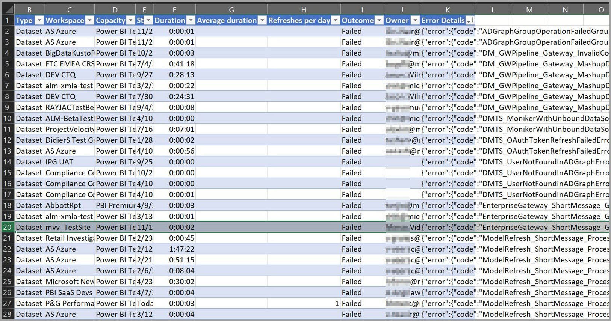
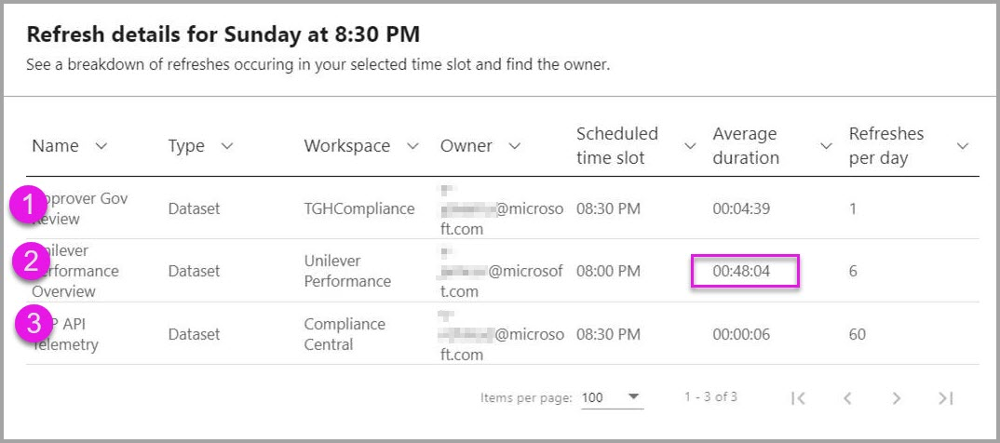

# Aktualisierungszusammenfassungen in Power BI

Die Seite **Zusammenfassung aktualisieren** im Power BI-Verwaltungsportal bietet Kontrolle und Informationen über Ihre Aktualisierungszeitpläne, Kapazitäten und potenzielle Überschneidungen von Aktualisierungszeitplänen. Mit dieser Seite können Sie überprüfen, ob Sie Aktualisierungszeitpläne anpassen sollten. Außerdem können Sie dort Fehlercodes für Aktualisierungsprobleme herausfinden und die Datenaktualisierungsplanung ordnungsgemäß verwalten. 

Sie verfügt über zwei Ansichten:

* **Verlauf:** Hier wird der Verlauf der Aktualisierungszusammenfassungen für Power BI Premium-Kapazitäten mit Ihnen als Administrator angezeigt.

* **Zeitplan:** Hierbei handelt es sich um die Zeitplanansicht für geplante Aktualisierungen. Anhand dieser Ansicht können auch Probleme aufgrund von überbelegten Zeiträumen entdeckt werden.

Sie können auch Informationen über ein Aktualisierungsereignis in eine CSV-Datei exportieren. Diese kann wichtige Informationen enthalten und Aufschluss geben über Aktualisierungsereignisse und Fehler, die sich auf die Leistung oder den Abschluss geplanter Aktualisierungsereignisse auswirken können.

In den folgenden Abschnitten werden diese beiden Ansichten jeweils näher betrachtet. 

## Verlauf aktualisieren

Sie können zur Ansicht **Verlauf** wechseln, indem Sie auf der Seite „Zusammenfassung aktualisieren“ auf **Verlauf** klicken.

Der Verlauf vermittelt einen Überblick über die Ergebnisse der kürzlich geplanten Aktualisierungen für die Kapazitäten, für die Sie über Administratorberechtigungen verfügen. Durch Klicken auf eine Spaltenüberschrift werden die Einträge in der Ansicht anhand der entsprechenden Spalte sortiert. Sie können die Einträge dabei aufsteigend, absteigend oder mithilfe von Textfiltern sortieren.

In der Verlaufsansicht basieren die Daten für eine bestimmte Aktualisierung jeweils auf den letzten bis zu 60 Einträgen für jede geplante Aktualisierung.

Sie können auch Informationen über eine geplante Aktualisierung in eine CSV-Datei exportieren. Diese Datei enthält ausführliche Informationen über alle Aktualisierungsereignisse, z. B. Fehlermeldungen. Das Exportieren in eine CSV-Datei ermöglicht es Ihnen unter anderem, diese Datei nach einer beliebigen Spalte zu sortieren, nach Wörtern zu suchen und nach Fehlercodes oder Besitzern zu sortieren. Die folgende Abbildung zeigt ein Beispiel für eine exportierte CSV-Datei. 

Mit den Informationen in der exportierten Datei können Sie die Kapazität und Dauer sowie alle für die entsprechende Aktualisierungsinstanz aufgezeichneten Fehlermeldungen überprüfen. 

## Aktualisierungszeitplan

Sie können zur Ansicht **Zeitplan** wechseln, indem Sie auf der Seite „Zusammenfassung aktualisieren“ auf **Zeitplan** klicken. In der Zeitplanansicht werden Zeitplaninformationen für die jeweilige Woche in 30-Minuten-Blöcken angezeigt. 

Die Zeitplanansicht ist sehr nützlich, um zu überprüfen, ob die Abstände zwischen den geplanten Aktualisierungsereignissen groß genug sind, sodass alle Aktualisierungen ohne Überschneidungen vollständig ausgeführt werden können, oder geplante Aktualisierungsereignisse zu lange dauern und Ressourcenkonflikte verursachen. Wenn Sie solche Ressourcenkonflikte feststellen, sollten Sie die Aktualisierungszeitpläne so anpassen, dass Konflikte oder Überschneidungen vermieden werden. Dadurch können Ihre geplanten Aktualisierungen erfolgreich abgeschlossen werden. 

Bei dem Wert in der Spalte *Refresh time booked (minutes)* (Gebuchte Aktualisierungszeit (Minuten)) handelt es sich um den aus bis zu 60 Einträgen für jedes zugehörige Dataset errechneten Durchschnitt. Der numerische Wert für jeden 30-Minuten-Block ist die berechnete Gesamtanzahl von Minuten für alle geplanten Aktualisierungen, die in diesem Zeitraum starten sollen, **und** die, die im *vorherigen* Zeitraum starten sollen, deren durchschnittliche Dauer aber länger als der ausgewählte Zeitraum ist.

Sie können einen Zeitraum auswählen und dann auf die jeweilige Schaltfläche **Details** klicken, um die geplanten Aktualisierungsereignisse anzuzeigen, aus denen sich die gebuchte Aktualisierungszeit berechnet, sowie deren Besitzer und Dauer.

Dies soll anhand eines Beispiels veranschaulicht werden. Das folgende Dialogfeld wird angezeigt, wenn der Block am Sonntag ab 20:30 Uhr ausgewählt und auf **Details** geklickt wird.

In diesem Zeitraum finden drei geplante Aktualisierungsereignisse statt. 

Wie Sie dem Wert in der Spalte **Geplantes Zeitfenster** entnehmen können, sind die Aktualisierungen 1 und 3 für diesen Zeitraum geplant. Die durchschnittliche Dauer beträgt 4:39 bzw. sechs Sekunden (0:06). Hier ist alles in Ordnung.

Aktualisierung 2 ist für den Zeitraum ab 20:00 Uhr geplant. Da die durchschnittliche Dauer allerdings mehr als 48 Minuten beträgt (siehe Spalte **Durchschnittliche Dauer**), dauert der Aktualisierungsvorgang auch im nächsten 30-Minuten-Block noch an. 

Das ist nicht gut. Der Administrator sollte in diesem Fall die Besitzer dieser Instanz für eine geplante Aktualisierung kontaktieren und eine Verschiebung in einen anderen Block vorschlagen. Alternativ kann er die anderen Aktualisierungen verschieben, sodass es keine Überschneidungen gibt, oder Überschneidungen durch andere Lösungen vermeiden. 

## Nächste Schritte

- [Aktualisieren von Daten in Power BI](refresh-data.md)  
- [Power BI Gateway – Personal](service-gateway-personal-mode.md)  
- [Lokales Datengateway (persönlicher Modus)](service-gateway-onprem.md)  
- [Problembehandlung beim lokalen Datengateway](service-gateway-onprem-tshoot.md)  
- [Problembehandlung für Power BI Gateway – Personal](service-admin-troubleshooting-power-bi-personal-gateway.md)  

Weitere Fragen? [Stellen Sie Ihre Frage in der Power BI-Community.](https://community.powerbi.com/)