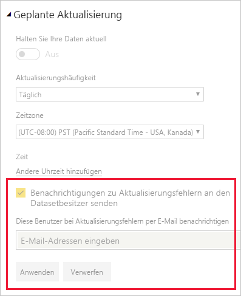

# Problembehandlung bei Aktualisierungsszenarios

Hier finden Sie Informationen zu verschiedenen Szenarios, auf die Sie möglicherweise stoßen, wenn Daten innerhalb des Power BI-Diensts aktualisiert werden.

> [!NOTE]
> Sie können auf der [Community-Website](https://community.powerbi.com/) nach Hilfe fragen oder ein [Supportticket](https://powerbi.microsoft.com/support/) erstellen, wenn Ihnen ein nicht hier aufgelistetes Szenario Probleme bereitet.
>
>

## E-Mail-Benachrichtigungen

Wenn Sie über eine E-Mail-Benachrichtigung zu diesem Artikel gelangt sind und Sie keine E-Mails über Aktualisierungsprobleme mehr erhalten möchten, wenden Sie sich an Ihren Power BI-Administrator. Bitten Sie ihn, Ihre E-Mail-Adresse oder eine E-Mail-Liste, die Sie abonniert haben, aus den entsprechenden Datasets in Power BI zu entfernen. Dies kann im folgenden Bereich im Power BI-Verwaltungsportal erfolgen.

## Die Aktualisierung mit Web-Connector funktioniert nicht richtig

Wenn in einem Web Connector-Skript die [**Web.Page**](/powerquery-m/web-page)-Funktion verwendet wird und Sie Ihr Dataset oder einen Bericht nach dem 18. November 2016 aktualisiert haben, müssen Sie für eine ordnungsgemäße Aktualisierung ein Gateway verwenden.

## Nicht unterstützte Datenquelle für die Aktualisierung

Wenn Sie ein Dataset konfigurieren, erhalten Sie möglicherweise eine Fehlermeldung, die besagt, dass das Dataset eine nicht unterstützte Datenquelle für die Aktualisierung verwendet. Ausführliche Informationen finden Sie unter [Troubleshooting unsupported data source for refresh (Problembehandlung bei nicht unterstützter Datenquelle für die Aktualisierung)](service-admin-troubleshoot-unsupported-data-source-for-refresh.md).

## Das Dashboard spiegelt nach der Aktualisierung keine Änderungen wider.

Warten Sie ca. 10 bis 15 Minuten, bis eine Aktualisierung auf den Dashboardkacheln berücksichtigt wird. Wenn sie dennoch nicht angezeigt wird, heften Sie die Visualisierung erneut an das Dashboard an.

## „GatewayNotReachable“ beim Festlegen von Anmeldeinformationen

Beim Festlegen der Anmeldeinformationen für eine Datenquelle könnte der Fehler `GatewayNotReachable` auftreten. Dies ist möglicherweise das Ergebnis eines veralteten Gateways. Installieren Sie das neueste Gateway und versuchen Sie es erneut.

## Verarbeitungsfehler: Der folgende Systemfehler ist aufgetreten: Typenkonflikt

Hierbei könnte es sich um ein Problem mit dem Skript „M“ in Ihrer Power BI Desktop-Datei oder einer Excel-Arbeitsmappe handeln. Er könnte auch durch eine veraltete Version von Power BI Desktop verursacht werden.

## Fehler bei der Kachelaktualisierung

Eine Liste von Fehlern, die mit Dashboardkacheln auftreten können, und die passenden Erklärungen, finden Sie unter [Problembehandlung für Kachelfehler](refresh-troubleshooting-tile-errors.md).

## Aktualisierungsfehler beim Aktualisieren von Daten aus Quellen, die AAD-OAuth verwenden

Das von vielen verschiedenen Datenquellen verwendete Azure Active Directory-OAuth-Token (**AAD**) läuft in ca. einer Stunde ab. Es kann die Situation eintreten, dass das Token abläuft, bevor alle Daten geladen wurden (Zeitraum von mehr als einer Stunde), da der Power BI-Dienst beim Laden von Daten bis zu zwei Stunden wartet. In diesem Fall kann das Laden von Daten mit einem Anmeldeinformationsfehler fehlschlagen.

Zu den Datenquellen, die AAD-OAuth verwenden, gehören **Microsoft Dynamics CRM Online**, **SharePoint Online** (SPO) und weitere. Wenn Sie mit solchen Datenquellen eine Verbindung herstellen und ein Fehler mit den Anmeldeinformationen auftritt, wenn das Laden von Daten länger als eine Stunde dauert, kann dies die Ursache sein.

Microsoft untersucht eine Lösung, bei der der Datenladevorgang das Token aktualisieren und fortgesetzt werden kann. Wenn Ihre Dynamics CRM Online- oder SharePoint Online-Instanz (oder eine andere AAD-OAuth-Datenquelle) jedoch so groß ist, dass der Zwei-Stunden-Schwellenwert für das Laden von Daten erreicht werden kann, kann im Power BI-Dienst auch ein Timeout auftreten.

Beachten Sie, dass Sie zum ordnungsgemäßen Aktualisieren Ihrer Arbeit beim Herstellen einer Verbindung mit einer **SharePoint Online**-Datenquelle mit AAD-OAuth das Konto verwenden müssen, mit dem Sie sich beim **Power BI-Dienst** angemeldet haben.

## Grenzwerte für nicht komprimierte Daten für Aktualisierung

Ein Dataset, das in den **Power BI-Dienst** importiert wird, darf maximal 1 GB groß sein. Diese Datasets werden stark komprimiert, um eine hohe Leistung sicherzustellen. Im Modus „Gemeinsam genutzte Kapazität“ legt der Dienst außerdem einen Grenzwert von 10 GB für die Menge nicht komprimierter Daten fest, die während der Aktualisierung verarbeitet werden. Für diesen Grenzwert wird die Komprimierung berücksichtigt, weshalb er viel größer ist als 1 GB. Für Datasets in Power BI Premium gilt dieser Grenzwert nicht. Schlägt eine Aktualisierung im Power BI-Dienst aus diesem Grund fehl, verringern Sie die Menge der Daten, die in Power BI importiert werden, und wiederholen Sie den Vorgang.

## Timeout der geplanten Aktualisierung

Das Timeout geplanter Aktualisierungen für importierte Datasets erfolgt nach zwei Stunden. Für Datasets in **Premium**-Arbeitsbereichen erhöht sich dieses Timeout auf fünf Stunden. Reduzieren Sie die Größe oder Komplexität des Datasets, oder teilen Sie das Dataset in kleinere Datasets auf, wenn dieses Limit auftritt.

## Fehler bei der geplanten Aktualisierung

Wenn bei einer geplanten Aktualisierung viermal hintereinander Fehler auftreten, wird die Aktualisierung von Power BI deaktiviert. Beheben Sie das Problem, und aktivieren Sie noch mal die geplante Aktualisierung.

## Der Zugriff auf die Ressource ist untersagt  

Dieser Fehler kann auftreten, wenn die zwischengespeicherten Anmeldeinformationen angelaufen sind. Löschen Sie den Cache Ihres Browsers. Melden Sie sich dazu in Power BI an, und navigieren Sie zu `https://app.powerbi.com?alwaysPromptForContentProviderCreds=true`. Dadurch wird eine Aktualisierung Ihrer Anmeldeinformationen erzwungen.

## Fehler beim Aktualisieren der Daten, weil das Kennwort geändert wurde oder die Anmeldeinformationen abgelaufen sind

Es kann beim Aktualisieren der Daten zu einem Fehler kommen, wenn die zwischengespeicherten Anmeldeinformationen abgelaufen sind. Löschen Sie den Cache Ihres Browsers. Melden Sie sich dazu in Power BI an, und navigieren Sie zu `https://app.powerbi.com?alwaysPromptForContentProviderCreds=true`. Dadurch wird eine Aktualisierung Ihrer Anmeldeinformationen erzwungen.

## Nächste Schritte

- [Aktualisieren von Daten in Power BI](refresh-data.md)  
- [Problembehandlung beim lokalen Datengateway](service-gateway-onprem-tshoot.md)  
- [Problembehandlung für Power BI Gateway – Personal](service-admin-troubleshooting-power-bi-personal-gateway.md)  

Weitere Fragen? [Stellen Sie Ihre Frage an die Microsoft Power BI-Community.](https://community.powerbi.com/)
