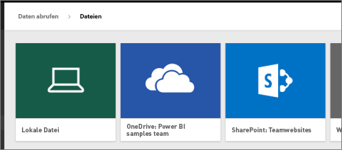
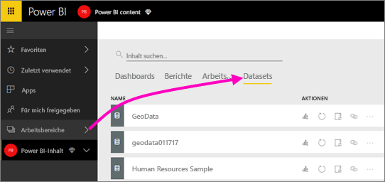
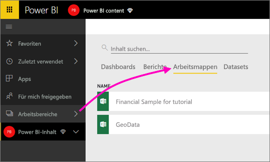

# Herstellen einer Verbindung mit in OneDrive gespeicherten Dateien für Ihren Power BI-Arbeitsbereich
Nachdem Sie einen [Arbeitsbereich in Power BI erstellt haben](../collaborate-share/service-create-distribute-apps.md), können Sie Ihre Excel-, CSV- und Power BI Desktop-Dateien in OneDrive for Business für Ihren Power BI-Arbeitsbereich speichern. Sie können die Dateien, die Sie auf OneDrive speichern, weiterhin aktualisieren. Diese Aktualisierungen werden automatisch in den auf diesen Dateien basierenden Power BI-Berichten und -Dashboards widergespiegelt. 

> [!NOTE]
> Die Funktionsweise der neuen Arbeitsbereiche ändert die Beziehung zwischen Power BI-Arbeitsbereichen und Office 365-Gruppen. Office 365-Gruppen werden nicht jedes Mal automatisch erstellt, wenn Sie einen dieser neuen Arbeitsbereiche erstellen. Erfahren Sie mehr über das [Erstellen der neuen Arbeitsbereiche](../collaborate-share/service-create-the-new-workspaces.md).

Das Hinzufügen von Dateien zu Ihrem Power BI-Arbeitsbereich erfolgt in zwei Schritten: 

1. Zunächst [laden Sie Dateien in OneDrive for Business](service-connect-to-files-in-app-workspace-onedrive-for-business.md#1-upload-files-to-the-onedrive-for-business-for-your-workspace) für Ihren Arbeitsbereich hoch.
2. Anschließend [stellen Sie eine Verbindung mit diesen Dateien aus Power BI her](service-connect-to-files-in-app-workspace-onedrive-for-business.md#2-import-excel-files-as-datasets-or-as-excel-online-workbooks).

> [!NOTE]
> Arbeitsbereiche sind nur in [Power BI Pro](../fundamentals/service-features-license-type.md) verfügbar.
> 

## 1\. Hochladen von Dateien in OneDrive for Business für Ihren Arbeitsbereich
1. Wählen Sie im Power BI-Dienst den Pfeil neben „Arbeitsbereiche“ aus, und wählen Sie dann die Auslassungspunkte ( **...** ) neben dem Namen Ihres Arbeitsbereichs aus. 
   
   
2. Wählen Sie **Dateien** aus, um OneDrive for Business für Ihren Arbeitsbereich in Office 365 zu öffnen.
   
   > [!NOTE]
   > Wenn **Dateien** im Menü des Arbeitsbereichs nicht angezeigt wird, wählen Sie **Mitglieder** aus, um OneDrive for Business für den Arbeitsbereich zu öffnen. Wählen Sie dort **Dateien**aus. Office 365 richtet einen OneDrive-Speicherort für die Dateien des Gruppenarbeitsbereichs Ihrer App ein. Dieser Vorgang kann eine Weile dauern. 
   > 
   > 
3. Hier können Sie Ihre Dateien in OneDrive for Business für Ihren Arbeitsbereich hochladen. Wählen Sie **Hochladen**aus, und navigieren Sie zu Ihren Dateien.
   
   

## 2\. Importieren von Excel-Dateien als Datasets oder Excel Online-Arbeitsmappen
Jetzt, da sich die Dateien im OneDrive for Business Ihres Arbeitsbereichs befinden, haben Sie zwei Möglichkeiten. Sie haben folgende Möglichkeiten: 

* [Die Daten aus der Excel-Arbeitsmappe als DataSet importieren](service-get-data-from-files.md). Anschließend verwenden Sie die Daten zum Erstellen von Berichten und Dashboards, die Sie in einem Webbrowser und auf mobilen Geräten anzeigen können.
* Oder [eine Verbindung mit einer kompletten Excel-Arbeitsmappe in Power BI herstellen](service-excel-workbook-files.md) und sie genauso anzeigen, wie sie in Excel Online dargestellt wird.

### Importieren von Dateien in Ihrem Arbeitsbereich oder Herstellen einer Verbindung mit diesen Dateien
1. Wechseln Sie in Power BI zum Arbeitsbereich, sodass der Name des Arbeitsbereichs oben links angezeigt wird. 
2. Wählen Sie unten im Navigationsbereich **Daten abrufen** aus. 
   
   
3. Wählen Sie im Feld **Dateien** die Option **Abrufen** aus.
   
   
4. Wählen Sie **OneDrive** - *Name Ihres Arbeitsbereichs* aus.
   
    
5. Wählen Sie die gewünschte Datei und dann **Verbinden** aus.
   
    An diesem Punkt entscheiden Sie, ob Sie die [Daten aus der Excel-Arbeitsmappe importieren](service-get-data-from-files.md) oder [eine Verbindung mit den kompletten Excel-Arbeitsmappen herstellen](service-excel-workbook-files.md).
6. Wählen Sie **Importieren** oder **Verbinden**aus.
   
    
7. Wenn Sie **Importieren** auswählen, wird die Arbeitsmappe auf der Registerkarte **Datasets** angezeigt. 
   
    
   
    Wenn Sie **Verbinden** auswählen, wird die Arbeitsmappe auf der Registerkarte **Arbeitsmappen** angezeigt.
   
    

## Weitere Schritte
* [Erstellen von Apps und Arbeitsbereichen in Power BI](../collaborate-share/service-create-distribute-apps.md)
* [Importieren von Daten aus Excel-Arbeitsmappen](service-get-data-from-files.md)
* [Verbinden mit gesamten Excel-Arbeitsmappen](service-excel-workbook-files.md)
* Weitere Fragen? [Wenden Sie sich an die Power BI-Community](https://community.powerbi.com/)
* Feedback? Besuchen Sie [Power BI Ideas](https://ideas.powerbi.com/forums/265200-power-bi).
