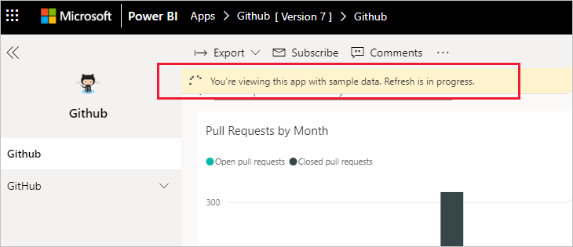

# Herstellen einer Verbindung mit GitHub mithilfe von Power BI
In diesem Artikel wird Schritt für Schritt erläutert, wie Sie Ihre Daten aus Ihrem GitHub-Konto mit einer Power BI-Vorlagen-App abrufen. Die Vorlagen-App generiert einen Arbeitsbereich mit einem Dashboard, einer Reihe von Berichten und einem Dataset, mit deren Hilfe Sie Ihre GitHub-Daten untersuchen können. Die GitHub-App für Power BI bietet Ihnen Einblicke in Ihr GitHub-Repository mit Daten zu Beiträgen, Problemen, Pullanforderungen und aktiven Benutzern.

Nachdem Sie die Vorlagen-App installiert haben, können Sie das Dashboard und den Bericht ändern. Anschließend können Sie sie als App an Kollegen in Ihrer Organisation verteilen.

Stellen Sie eine Verbindung mit der [GitHub-Vorlagen-App](https://app.powerbi.com/groups/me/getapps/services/pbi-contentpacks.pbiapps-github) her, oder erfahren Sie mehr über die [GitHub-Integration](https://powerbi.microsoft.com/integrations/github) in Power BI.

Sie können auch das [GitHub-Tutorial](service-tutorial-connect-to-github.md) verwenden. Es installiert echte GitHub-Daten zum öffentlichen Repository für die Power BI-Dokumentation.

>[!NOTE]
>Diese Vorlagen-App erfordert, dass das GitHub-Konto auf das Repository zugreifen kann. Es folgen weitere Informationen zu den Anforderungen.
>
>Diese Vorlagen-App bietet keine Unterstützung für GitHub Enterprise.

## Installieren der App

1. Klicken Sie auf den folgenden Link, um die App zu erhalten: [GitHub-Vorlagen-App](https://app.powerbi.com/groups/me/getapps/services/pbi-contentpacks.pbiapps-github)

1. Klicken Sie auf der AppSource-Seite für die App auf [**JETZT HOLEN**](https://app.powerbi.com/groups/me/getapps/services/pbi-contentpacks.pbiapps-github).

    

1. Wählen Sie **Installieren** aus. 

    

    Nachdem die App installiert wurde, wird sie auf der Seite „Apps“ angezeigt.

   

## Verbinden mit Datenquellen

1. Klicken Sie auf das Symbol auf der Seite „Apps“, um die App zu öffnen.

1. Klicken Sie auf dem Begrüßungsbildschirm auf **App erkunden**.

   

   Die App wird geöffnet, und es werden Beispieldaten angezeigt.

1. Klicken Sie auf dem Banner oben auf der Seite auf **Ihre Daten verbinden**.

   

1. Geben Sie im daraufhin angezeigten Dialogfeld den Namen des Repositorys und den Besitzer des Repositorys an. Nachstehend finden Sie weitere Informationen zum [Suchen dieser Parameter](#FindingParams). Klicken Sie anschließend auf **Weiter**.

   

1. Stellen Sie im nächsten Dialogfeld sicher, dass die Authentifizierungsmethode **OAuth2** festgelegt ist. Sie müssen nichts an den Datenschutzeinstellungen ändern. Klicken Sie abschließend auf **Anmelden**.

   

1. Geben Sie Ihre GitHub-Anmeldeinformationen ein, und führen Sie den GitHub-Authentifizierungsprozess durch (dieser Schritt kann übersprungen werden, wenn Sie bereits mit Ihrem Browser angemeldet sind).

   

Nachdem Sie sich angemeldet haben, stellt der Bericht eine Verbindung mit den Datenquellen her und wird mit aktuellen Daten befüllt. Währenddessen verändert sich der Aktivitätsmonitor.

Ihre Berichtsdaten werden automatisch einmal täglich aktualisiert, es sei denn, Sie haben dies während des Anmeldeprozesses deaktiviert. Sie können auch [Ihren eigenen Aktualisierungsplan einrichten](./refresh-scheduled-refresh.md), um die Berichtsdaten bei Bedarf auf dem neuesten Stand zu halten.

## Anpassen und freigeben

Klicken Sie in der oberen rechten Ecke der Seite auf das Stiftsymbol, um Ihre App anzupassen und freizugeben.

Weitere Informationen zum Bearbeiten von Artefakten im Arbeitsbereich finden Sie unter den folgenden Links:
* [Einführung in den Berichts-Editor in Power BI](../create-reports/service-the-report-editor-take-a-tour.md)
* [Grundlegende Konzepte für Designer im Power BI-Dienst](../fundamentals/service-basic-concepts.md)

Wenn Sie alle gewünschten Änderungen an den Artefakten im Arbeitsbereich vorgenommen haben, können Sie die App veröffentlichen und freigeben. Weitere Informationen hierzu finden Sie unter [Veröffentlichen der App](../collaborate-share/service-create-distribute-apps.md#publish-your-app).

## Was ist in der App enthalten?
Die folgenden Daten sind über GitHub in Power BI verfügbar:     

| Tabellenname | Beschreibung |
| --- | --- |
| Beiträge |Die Tabelle für „Beiträge“ bietet die vom Mitwirkenden erstellten gesamten Zugänge, Abgänge und Commits, die wöchentlich aggregiert werden. Die Top 100-Mitwirkenden sind inklusive. |
| Probleme |Listet alle Probleme für das ausgewählte Repository auf und enthält Berechnungen wie die gesamte und durchschnittliche Zeit zum Schließen eines Problems, die Gesamtzahl offener Probleme sowie die Gesamtzahl geschlossener Probleme. Diese Tabelle ist leer, wenn im Repository keine Probleme vorliegen. |
| Pullanforderungen |Diese Tabelle enthält alle Pullanforderungen für das Repository und die Information, welcher Benutzer den Pullvorgang für die Anforderung ausgeführt hat. Sie enthält auch Berechnungen dazu, wie viele geöffnete, geschlossene und insgesamt verfügbare Pullanforderungen vorliegen, und wie lange die Pullanforderungen und die durchschnittliche Pullanforderung gedauert haben. Diese Tabelle ist leer, wenn im Repository keine Probleme vorliegen. |
| Benutzer |Diese Tabelle enthält eine Liste von GitHub-Benutzern oder Mitwirkenden, die Beiträge geleistet, Probleme gemeldet oder Pullanforderungen für das ausgewählte Repository gelöst haben. |
| Meilensteine |Diese Tabelle enthält alle Meilensteine für das ausgewählte Repository. |
| DateTable |Diese Tabelle enthält Datumsangaben von heute und für vergangene Jahre, die es Ihnen ermöglichen, Ihre GitHub-Daten nach Datum zu analysieren. |
| ContributionPunchCard |Diese Tabelle kann als Lochkarte für Beiträge für das ausgewählte Repository verwendet werden. Es zeigt die Commits nach Wochentag und Tagesstunde an. Diese Tabelle ist nicht mit anderen Tabellen im Modell verbunden. |
| RepoDetails |Diese Tabelle enthält die Details für das ausgewählte Repository. |

## Systemanforderungen
* Das GitHub-Konto, das Zugriff auf das Repository hat  
* Berechtigung für die Power BI für GitHub-App während der erstmaligen Anmeldung Nachstehend finden Sie Details zum Sperren des Zugriffs.  
* Ausreichende Anzahl verfügbarer API-Aufrufe zum Abrufen und Aktualisieren der Daten
>[!NOTE]
>Diese Vorlagen-App bietet keine Unterstützung für GitHub Enterprise.

### Aufheben der Autorisierung von Power BI
Sie können den Zugriff in GitHub widerrufen, um die Autorisierung von Power BI zur Verbindung mit Ihrem GitHub-Repository aufzuheben. Weitere Informationen finden Sie unter diesem [GitHub-Hilfethema](https://help.github.com/articles/keeping-your-ssh-keys-and-application-access-tokens-safe/#reviewing-your-authorized-applications-oauth).

## Suchen von Parametern
Sie können den Besitzer und das Repository ermitteln, indem Sie das Repository in GitHub betrachten:

Der erste Teil „Azure“ ist der Besitzer und der zweite Teil „azure-sdk-for-php“ ist das Repository selbst.  Dieselben beiden Elemente werden in der URL des Repositorys angezeigt:

    <https://github.com/Azure/azure-sdk-for-php> .

## Problembehandlung
Bei Bedarf können Sie Ihre GitHub-Anmeldeinformationen überprüfen.  

1. Navigieren Sie in einem anderen Browserfenster zur GitHub-Website, und melden Sie sich bei GitHub an. Sie können in der oberen rechten Ecke der GitHub-Website sehen, dass Sie angemeldet sind.    
2. Navigieren Sie in GitHub zur URL des Repositorys, auf das Sie in Power BI zugreifen möchten. Beispiel: https://github.com/dotnet/corefx  
3. Versuchen Sie anschließend in Power BI, die Verbindung zu GitHub herzustellen. Verwenden Sie im Dialogfeld zum Konfigurieren von GitHub den Namen und Besitzer des Repositorys für dasselbe Repository.  

## Nächste Schritte

* [Tutorial: Herstellen einer Verbindung mit einem GitHub-Repository mit Power BI](service-tutorial-connect-to-github.md)
* [Erstellen der neuen Arbeitsbereiche in Power BI](../collaborate-share/service-create-the-new-workspaces.md)
* [Installieren und Verwenden von Apps in Power BI](../consumer/end-user-apps.md)
* [Herstellen einer Verbindung mit Power BI-Apps für externe Dienste](service-connect-to-services.md)
* Haben Sie Fragen? [Stellen Sie Ihre Frage in der Power BI-Community.](https://community.powerbi.com/)
