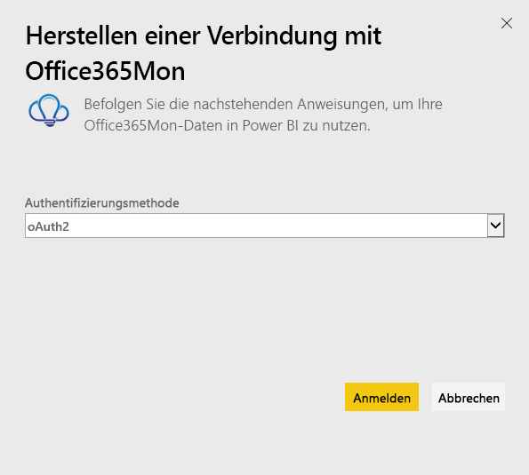
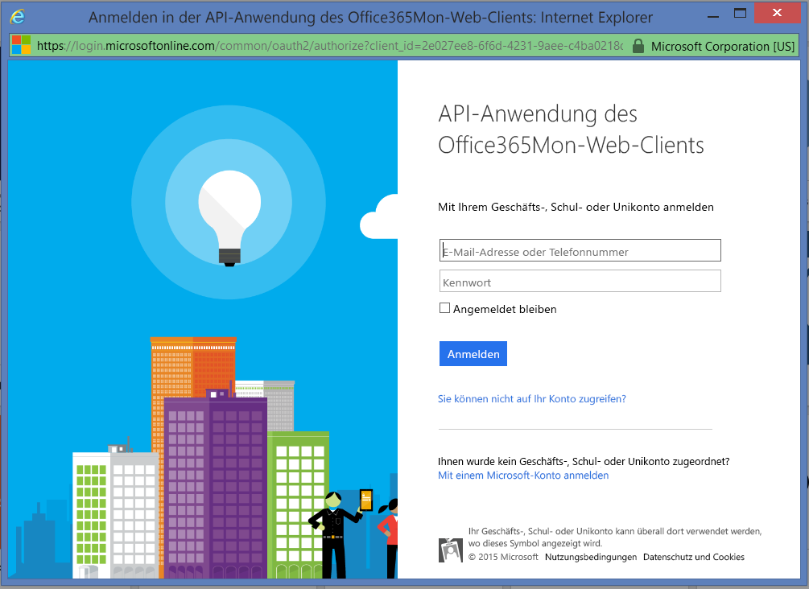
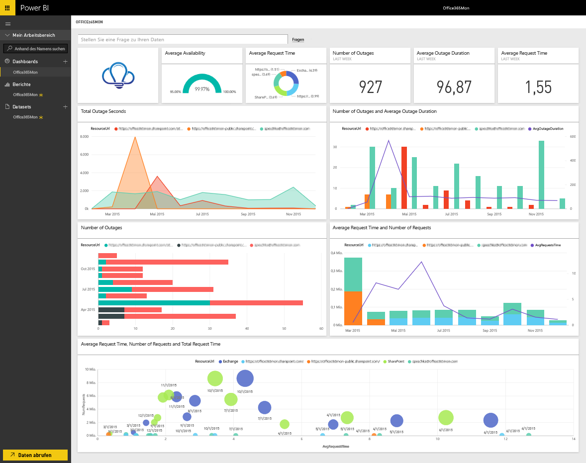

# Herstellen einer Verbindung mit Office365Mon mithilfe von Power BI
Die Analyse von Ausfällen und Integritätsdaten von Office 365 ist mit Power BI und der Office365Mon-Vorlagen-App ein Kinderspiel. Power BI ruft Ihre Daten ab – Stichprobendaten zu Ausfällen und Integrität eingeschlossen –, und erstellt basierend auf diesen Daten ein Dashboard und Berichte.

Stellen Sie eine Verbindung mit der [Office365Mon-Vorlagen-App](https://msit.powerbi.com/groups/me/getapps/services/office365mon.office365mon_powerbi_v3) für Power BI her.

>[!NOTE]
>Zum Herstellen der Verbindung und Laden der Power BI-Vorlagen-App ist ein Office365Mon-Administratorkonto erforderlich.

## Herstellen der Verbindung
1. Wählen Sie unten im Navigationsbereich **Daten abrufen** aus.
   
   
2. Wählen Sie im Feld **Dienste** die Option **Abrufen**aus.
   
    
3. Wählen Sie **Office365Mon** \> **Abrufen** aus.
   
   
4. Wählen Sie für die Authentifizierungsmethode **oAuth2** \> **Anmelden** aus.
   
   Wenn Sie dazu aufgefordert werden, geben Sie Ihre Office365Mon-Administratoranmeldeinformationen ein, und führen Sie den Authentifizierungsvorgang aus.
   
   
   
   
5. Nachdem die Daten von Power BI importiert wurden, werden im Navigationsbereich ein neues Dashboard, ein Bericht und ein Dataset angezeigt. Neue Elemente sind mit einem gelben Sternchen (\*) markiert. Wählen Sie den Eintrag „Office365Mon“ aus.
   
   

**Was nun?**

* Versuchen Sie, am oberen Rand des Dashboards [im Q&A-Feld eine Frage zu stellen](../consumer/end-user-q-and-a.md).
* [Ändern Sie die Kacheln](../create-reports/service-dashboard-edit-tile.md) im Dashboard.
* [Wählen Sie eine Kachel aus](../consumer/end-user-tiles.md), um den zugrunde liegenden Bericht zu öffnen.
* Zwar ist Ihr Dataset auf tägliche Aktualisierung festgelegt, jedoch können Sie das Aktualisierungsintervall ändern oder über **Jetzt aktualisieren** nach Bedarf aktualisieren.

## Problembehandlung
Wenn nach dem Eingeben Ihrer Office365Mon-Abonnementsanmeldeinformationen zur Anmeldung der **Anmeldefehler** gemeldet wird, verfügt das verwendete Konto nicht über die erforderlichen Berechtigungen, um die Office365Mon-Daten aus Ihrem Konto abzurufen. Überprüfen Sie, ob es sich um ein Administratorkonto handelt, und versuchen Sie es erneut.

## Nächste Schritte
[Was ist Power BI?](../fundamentals/power-bi-overview.md)

[Abrufen von Daten in Power BI](service-get-data.md)
