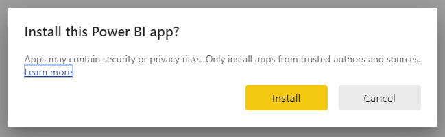
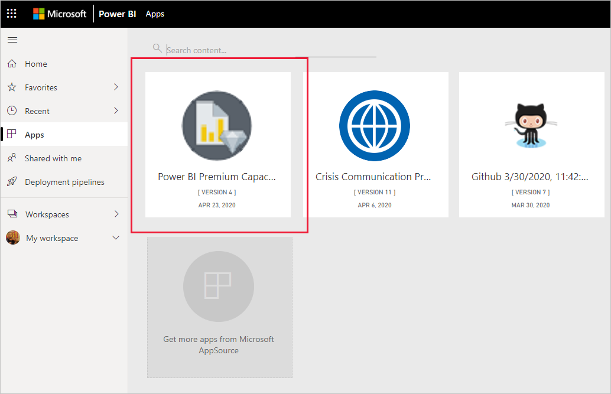

# Herstellen einer Verbindung mit Power BI Premium Capacity Metrics
Die Überwachung Ihrer Kapazitäten ist entscheidend für das Treffen fundierter Entscheidungen zur optimalen Nutzung Ihrer Premium-Kapazitäten. Die Power BI Premium Capacity Metrics-App stellt ausführliche Informationen zur Leistung Ihrer Kapazitäten bereit.

In diesem Artikel wird beschrieben, wie Sie die App installieren und eine Verbindung mit Datenquellen herstellen. Informationen über die Inhalte und Verwendung des Berichts finden Sie unter [Überwachen von Premium-Kapazitäten über die App](../service-admin-premium-monitor-capacity.md) und im [Blogbeitrag zur Premium Capacity Metrics-App](https://powerbi.microsoft.com/blog/premium-capacity-metrics-app-new-health-center-with-kpis-to-explore-relevant-metrics-and-steps-to-mitigate-issues/).

Nachdem Sie die App installiert und eine Verbindung mit den Datenquellen hergestellt haben, können Sie den Bericht gemäß Ihren Anforderungen anpassen. Sie können sie dann an Ihre Kollegen in Ihrer Organisation verteilen.

> [!NOTE]
> Für das Installieren von Vorlagen-Apps sind [Berechtigungen](./service-template-apps-install-distribute.md#prerequisites) erforderlich. Wenden Sie sich an Ihren Mandantenadministrator, wenn Sie nicht über ausreichende Berechtigungen verfügen.

## Installieren der App

1. Klicken Sie auf den folgenden Link, um die App zu erhalten: [Power BI Premium Capacity Metrics-Vorlagen-App](https://app.powerbi.com/groups/me/getapps/services/pbi_pcmm.capacity-metrics-dxt)

1. Klicken Sie auf der AppSource-Seite für die App auf [**JETZT HOLEN**](https://app.powerbi.com/groups/me/getapps/services/pbi_pcmm.capacity-metrics-dxt).

    

1. Wählen Sie **Installieren** aus. 

    

    > [!NOTE]
    > Wenn Sie die App bereits installiert haben, werden Sie gefragt, ob Sie [diese Installation überschreiben](./service-template-apps-install-distribute.md#update-a-template-app) oder die Installation in einem neuen Arbeitsbereich durchführen möchten.

    Nachdem die App installiert wurde, wird sie auf der Seite „Apps“ angezeigt.

   

## Verbinden mit Datenquellen

1. Klicken Sie auf das Symbol auf der Seite „Apps“, um die App zu öffnen.

1. Klicken Sie auf dem Begrüßungsbildschirm auf **Erkunden**.

   

   Die App wird geöffnet, und es werden Beispieldaten angezeigt.

1. Klicken Sie auf dem Banner oben auf der Seite auf **Ihre Daten verbinden**.

   

1. Legen Sie im angezeigten Dialogfeld die UTC-Abweichung fest, dies ist der Unterschied zwischen der koordinierten Weltzeit (UTC) und der Uhrzeit an Ihrem Standort in Stunden. Klicken Sie dann auf **Weiter**.
  
   

1. Im nächsten Dialogfeld, das angezeigt wird, müssen Sie keine Änderungen vornehmen. Klicken Sie einfach auf **Anmelden**.

   

1. Melden Sie sich auf dem Microsoft-Anmeldebildschirm bei Power BI an.

   

   Nachdem Sie sich angemeldet haben, stellt der Bericht eine Verbindung mit den Datenquellen her und wird mit aktuellen Daten befüllt. Währenddessen verändert sich der Aktivitätsmonitor.

   

   Ihre Berichtsdaten werden automatisch einmal täglich aktualisiert, es sei denn, Sie haben dies während des Anmeldeprozesses deaktiviert. Sie können auch [Ihren eigenen Aktualisierungsplan einrichten](./refresh-scheduled-refresh.md), um die Berichtsdaten bei Bedarf auf dem neuesten Stand zu halten.

## Anpassen und freigeben

Klicken Sie in der oberen rechten Ecke auf das Stiftsymbol, um die App anzupassen.

 

Weitere Informationen finden Sie unter [Anpassen und Freigeben der App](./service-template-apps-install-distribute.md#customize-and-share-the-app).

## Nächste Schritte
* [Überwachen von Premium-Kapazitäten über die App](../admin/service-admin-premium-monitor-capacity.md)
* [Blogbeitrag zur Premium Capacity Metrics-App](https://powerbi.microsoft.com/blog/premium-capacity-metrics-app-new-health-center-with-kpis-to-explore-relevant-metrics-and-steps-to-mitigate-issues/)
* [Was sind Power BI-Vorlagen-Apps?](./service-template-apps-overview.md)
* [Installieren und Verteilen von Vorlagen-Apps in Ihrer Organisation](./service-template-apps-install-distribute.md)
* Haben Sie Fragen? [Stellen Sie Ihre Frage in der Power BI-Community.](https://community.powerbi.com/)