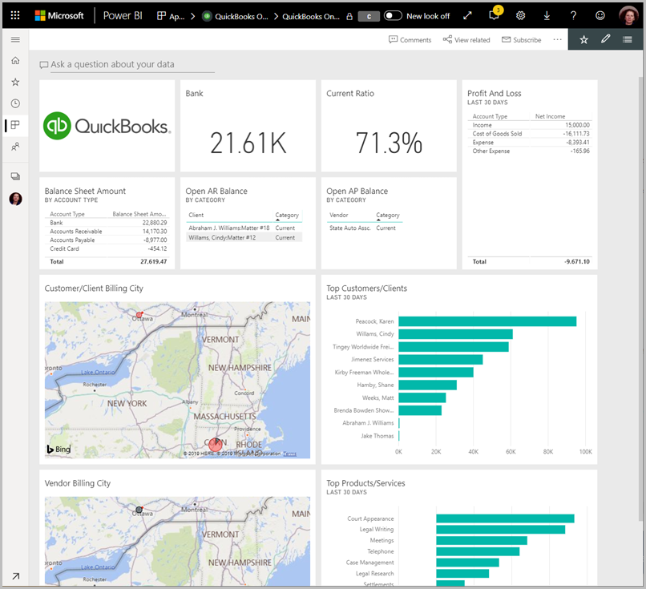

# Herstellen einer Verbindung mit QuickBooks Online mithilfe von Power BI
Wenn Sie über Power BI eine Verbindung mit Ihren QuickBooks Online-Daten herstellen, erhalten Sie sofort ein Power BI-Dashboard und Power BI-Berichte, die Rückschlüsse auf Cashflows im Unternehmen, Rentabilität, Kunden und weitere Informationen bereitstellen. Sie können die bereitgestellten Dashboards und Berichte unverändert verwenden oder sie anpassen, um die für Sie wichtigsten Informationen hervorzuheben. Die Daten werden automatisch einmal täglich aktualisiert.

Stellen Sie die Verbindung mit der [QuickBooks Online-Vorlagen-App](https://dxt.powerbi.com/getdata/services/quickbooks-online) für Power BI her.

>[!NOTE]
>Damit Sie die QuickBooks Online-Daten in Power BI importieren können, müssen Sie für Ihr QuickBooks Online-Konto über Administratorrechte verfügen und sich mit Ihren Administratoranmeldeinformationen anmelden. Sie können diesen Connector mit QuickBooks Desktop-Software verwenden. 

## Herstellen der Verbindung

[!INCLUDE [powerbi-service-apps-get-more-apps](../includes/powerbi-service-apps-get-more-apps.md)]

3. Wählen Sie **QuickBooks Online** und dann **Abrufen** aus.
   
   

4. Wählen Sie unter **Diese Power BI-App installieren?** die Option **Installieren** aus.

    

4. Wählen Sie im Bereich **Apps** die Kachel **QuickBooks** aus.

   

6. Klicken Sie im Fenster **Erste Schritte mit Ihrer neuen App** auf **Verbinden**.

    

4. Wählen Sie als Authentifizierungsmethode die Option **oAuth2** und dann **Anmelden**aus. 
5. Geben Sie bei der entsprechenden Aufforderung Ihre QuickBooks Online-Anmeldeinformationen ein, und führen Sie den QuickBooks Online-Authentifizierungsprozess aus. Wenn Sie in Ihrem Browser bereits bei QuickBooks Online angemeldet sind, werden Sie möglicherweise nicht zur Eingabe von Anmeldeinformationen aufgefordert.
   >[!NOTE]
   >Für Ihr QuickBooks Online-Konto benötigen Sie Administratoranmeldeinformationen.
6. Wählen Sie auf dem nächsten Bildschirm das Unternehmen aus, das Sie mit Power BI verbinden möchten.
   
   

7. Wählen Sie auf dem nächsten Bildschirm **Autorisieren** aus, um den Importvorgang zu starten. Der Vorgang kann je nach Umfang Ihrer Unternehmensdaten einige Minuten dauern. 
   
   
   
8. Nachdem Power BI die Daten importiert hat, sehen Sie die Inhaltsliste für Ihre QuickBooks App: ein neues Dashboard, einen neuen Bericht und ein neues Dataset.
9. Wählen Sie das Dashboard QuickBooks aus, um den Erkundungsprozess zu starten. Power BI hat dieses Dashboard automatisch erstellt, um Ihre importierten Daten anzuzeigen.

    

**Was nun?**

* Versuchen Sie, am oberen Rand des Dashboards [im Q&A-Feld eine Frage zu stellen](../consumer/end-user-q-and-a.md).
* [Ändern Sie die Kacheln](../create-reports/service-dashboard-edit-tile.md) im Dashboard.
* [Wählen Sie eine Kachel aus](../consumer/end-user-tiles.md), um den zugrunde liegenden Bericht zu öffnen.
* Zwar ist Ihr Dataset auf tägliche Aktualisierung festgelegt, jedoch können Sie das Aktualisierungsintervall ändern oder über **Jetzt aktualisieren** nach Bedarf aktualisieren.

## Problembehandlung
**„Es ist ein Fehler aufgetreten“**

Wenn Sie diese Meldung nach der Auswahl von **Autorisieren**erhalten:

„Es ist ein Fehler aufgetreten“ Schließen Sie dieses Fenster, und versuchen Sie es erneut.

Die Anwendung wurde für dieses Unternehmen bereits von einem anderen Benutzer abonniert. Wenden Sie sich an [Admin-E-Mail], um Änderungen an diesem Abonnement vorzunehmen.“

... dieser Fehler bedeutet, dass bereits ein anderer Administrator in Ihrem Unternehmen mit Power BI eine Verbindung mit den Unternehmensdaten hergestellt hat. Bitten Sie diesen Administrator, das Dashboard für Sie freizugeben. Derzeit kann jeweils nur ein Administratorbenutzer mit Power BI eine Verbindung zu einem bestimmten QuickBooks Online-Unternehmensdataset herstellen. Nachdem das Dashboard von Power BI erstellt wurde, kann es der Administrator für mehrere Kollegen im selben Power BI-Mandanten freigeben.

**„Diese Anwendung wurde nicht dafür konfiguriert, dass Verbindungen aus Ihrem Land zulässig sind“**

Derzeit unterstützt Power BI nur US-Versionen von QuickBooks Online. 

## Nächste Schritte
[Was ist Power BI?](../fundamentals/power-bi-overview.md)

[Grundlegende Konzepte für Designer im Power BI-Dienst](../fundamentals/service-basic-concepts.md)
