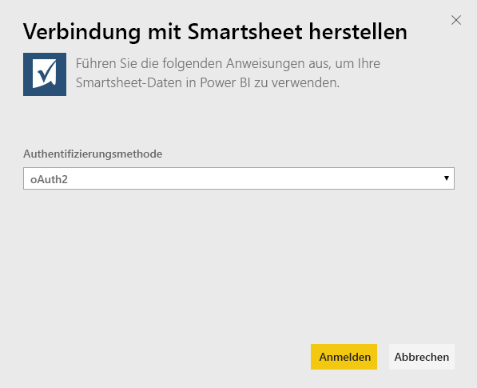
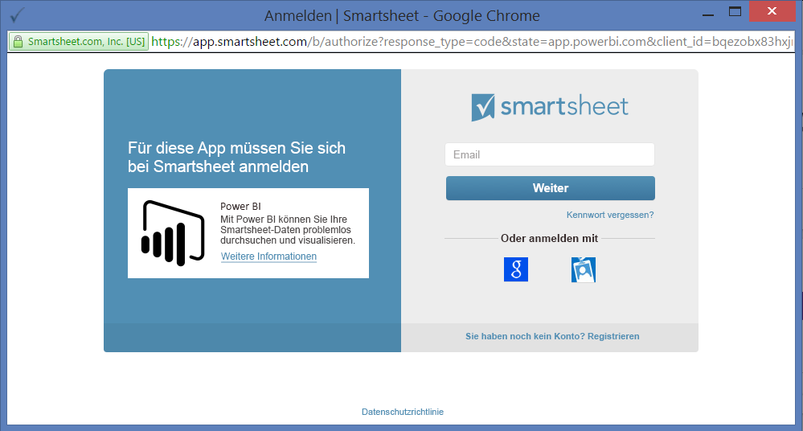
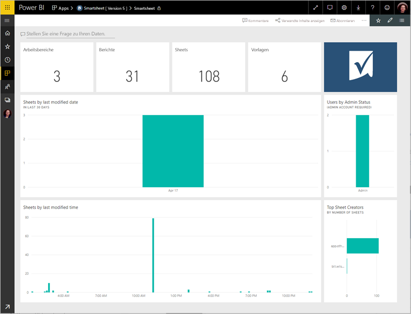
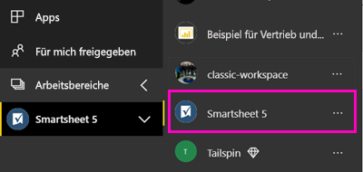

# Herstellen einer Verbindung mit Smartsheet mithilfe von Power BI
In diesem Artikel wird Schritt für Schritt erläutert, wie Sie Ihre Daten aus Ihrem Smartsheet-Konto mit einer Power BI-Vorlagen-App abrufen. Smartsheet bietet eine einfache Plattform für Zusammenarbeit und Dateifreigabe. Die Smartsheet-Vorlagen-App für Power BI bietet ein Dashboard, Berichte und ein Dataset mit einer Übersicht über Ihr Smartsheet-Konto. Sie können sich auch über [Power BI Desktop](desktop-connect-to-data.md) direkt mit einzelnen Blättern in Ihrem Konto verbinden. 

Nachdem Sie die Vorlagen-App installiert haben, können Sie das Dashboard und den Bericht ändern. Anschließend können Sie sie als App an Kollegen in Ihrer Organisation verteilen.

Stellen Sie eine Verbindung mit der [Smartsheet-Vorlagen-App](https://app.powerbi.com/groups/me/getapps/services/pbi-contentpacks.pbiapps-smartsheet) für Power BI her.

>[!NOTE]
>Ein Smartsheet-Administratorkonto wird für das Herstellen einer Verbindung und das Laden der Power BI-Vorlagen-App bevorzugt, da es über zusätzliche Zugriffsrechte verfügt.

## Herstellen der Verbindung

[!INCLUDE [powerbi-service-apps-get-more-apps](../includes/powerbi-service-apps-get-more-apps.md)]

3. Wählen Sie **Smartsheet** \> **Jetzt anfordern** aus.
4. Wählen Sie unter **Diese Power BI-App installieren?** die Option **Installieren** aus.
4. Wählen Sie im Bereich **Apps** die Kachel **Smartsheet** aus.

    

6. Klicken Sie im Fenster **Erste Schritte mit Ihrer neuen App** auf **Verbinden**.

    

4. Wählen Sie für die Authentifizierungsmethode **oAuth2 \> Anmelden** aus.
   
   Geben Sie bei der entsprechenden Aufforderung Ihre Smartsheet-Anmeldeinformationen ein, und führen Sie den Authentifizierungsvorgang aus.
   
   
   
   

5. Nachdem Power BI die Daten importiert hat, wird die neue Smartsheet-Kachel geöffnet.
   
   

## Ändern und Verteilen der App

Sie haben die Smartsheet-Vorlagen-App installiert. Das bedeutet, dass Sie auch den Arbeitsbereich der Smartsheet-App erstellt haben. Im Arbeitsbereich können Sie den Bericht und das Dashboard ändern und dann als *App* an Kollegen in Ihrer Organisation verteilen. 

1. Klicken Sie im Navigationsbereich auf **Arbeitsbereiche** > **Smartsheet**, um den gesamten Inhalt Ihres neuen Smartsheet-Arbeitsbereichs anzuzeigen. 

    

    Diese Ansicht ist die Inhaltsliste für den Arbeitsbereich. In der oberen rechten Ecke wird **App aktualisieren** angezeigt. Wenn Sie bereit sind, die App an Ihre Kollegen zu verteilen, beginnen Sie hier damit. 

    

2. Wählen Sie **Berichte** und **Datasets** aus, um die anderen Elemente im Arbeitsbereich anzuzeigen.

    Informieren Sie sich über das [Verteilen von Apps](../collaborate-share/service-create-distribute-apps.md) an Ihre Kollegen.

## Inhalt
Die Smartsheet-Vorlagen-App für Power BI enthält einen Überblick über Ihr Smartsheet-Konto, z. B. die Anzahl von Arbeitsbereichen, Berichten und Blättern, über die Sie verfügen, wann sie geändert wurden usw. Benutzer mit Administratorrechten sehen auch einige Informationen über die Benutzer in Ihrem System wie diejenigen, die die meisten Blätter erstellt haben.  

Sie können sich über den Smartsheet-Connector in [Power BI Desktop](desktop-connect-to-data.md) direkt mit einzelnen Blättern in Ihrem Konto verbinden.  

## Nächste Schritte

* [Erstellen der neuen Arbeitsbereiche in Power BI](../collaborate-share/service-create-the-new-workspaces.md)
* [Installieren und Verwenden von Apps in Power BI](../consumer/end-user-apps.md)
* [Herstellen einer Verbindung mit Power BI-Apps für externe Dienste](service-connect-to-services.md)
* Haben Sie Fragen? [Stellen Sie Ihre Frage in der Power BI-Community.](https://community.powerbi.com/)