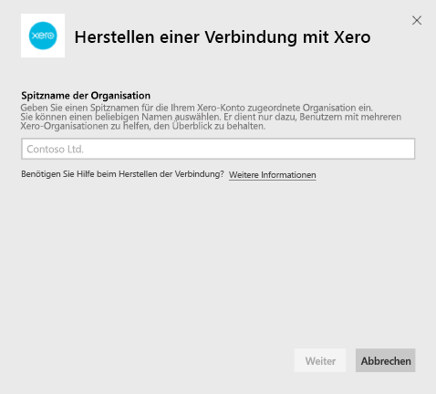
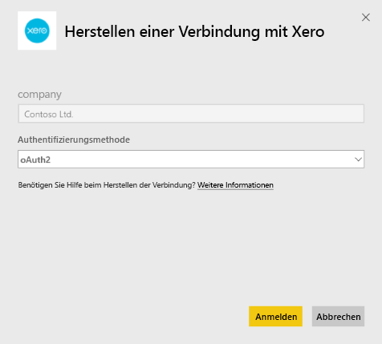
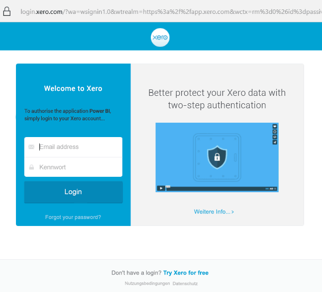

# Herstellen einer Verbindung mit Xero mithilfe von Power BI
Xero ist eine einfach zu verwendende Online-Buchhaltungssoftware, die speziell auf kleine Unternehmen zugeschnitten ist. Erstellen Sie mit dieser Power BI-Vorlagen-App ansprechende Visualisierungen basierend auf Ihren Xero-Finanzdaten. Ihr Standarddashboard umfasst viele Metriken für Kleinunternehmen, wie z. B. cash position, revenue vs. expenses, profit loss trend, debtor days und return on investment.

Stellen Sie eine Verbindung mit der [Xero-Vorlagen-App](https://app.powerbi.com/getdata/services/xero) für Power BI her, oder erfahren Sie mehr über die Integration von [Xero und Power BI](https://help.xero.com/Power-BI).

## Herstellen der Verbindung

[!INCLUDE [powerbi-service-apps-get-more-apps](../includes/powerbi-service-apps-get-more-apps.md)]

3. Wählen Sie **Xero** \> **Jetzt anfordern** aus.
4. Wählen Sie unter **Diese Power BI-App installieren?** die Option **Installieren** aus.

    

4. Wählen Sie im Bereich **Apps** die Kachel **Xero** aus.

   

6. Klicken Sie im Fenster **Erste Schritte mit Ihrer neuen App** auf **Verbinden**.

    

4. Geben Sie einen Spitznamen für die Ihrem Xero-Konto zugeordnete Organisation ein. Der Name kann beliebig sein und dient nur dazu, Benutzern mit mehreren Xero-Organisationen zu helfen, den Überblick zu behalten. Weiter unten in diesem Artikel finden Sie weitere Informationen zum [Finden dieser Parameter](#FindingParams).

    

5. Wählen Sie **OAuth** als **Authentifizierungsmethode** aus. Melden Sie sich nach Aufforderung bei Ihrem Xero-Konto an, und wählen Sie die Organisation aus, mit der Sie eine Verbindung herstellen möchten. Sobald die Anmeldeinformationen eingegeben sind, wählen Sie **Anmelden** aus, um den Ladevorgang zu starten.
   
    
   
    
6. Nach der Genehmigung wird der Importvorgang automatisch gestartet. Nach Abschluss des Vorgangs werden im Navigationsbereich ein neues Dashboard, ein Bericht und ein Modell angezeigt. Wählen Sie das Dashboard aus, um die importierten Daten anzuzeigen.
   
     

**Was nun?**

* Versuchen Sie, am oberen Rand des Dashboards [im Q&A-Feld eine Frage zu stellen](../consumer/end-user-q-and-a.md).
* [Ändern Sie die Kacheln](../create-reports/service-dashboard-edit-tile.md) im Dashboard.
* [Wählen Sie eine Kachel aus](../consumer/end-user-tiles.md), um den zugrunde liegenden Bericht zu öffnen.
* Zwar ist Ihr Dataset auf tägliche Aktualisierung festgelegt, jedoch können Sie das Aktualisierungsintervall ändern oder über **Jetzt aktualisieren** nach Bedarf aktualisieren.

## Inhalt
Die Vorlagen-App des Dashboard enthält Kacheln und Metriken, die verschiedene Bereiche abdecken, mit entsprechenden Berichten, um mehr zu erfahren:  

| Fläche | Dashboard Tiles | Bericht |
| --- | --- | --- |
| Cash |Daily cash flow  Cash in  Cash out  Closing balance by account  Closing balance today |Bank Accounts |
| Kunde |Invoiced sales  Invoiced sales by customer  Invoiced sales growth trend  Invoices due  Outstanding receivables  Overdue receivables |Kunde  Bestand |
| Supplier |Billed purchases  Billed purchases by supplier  Billed purchases growth trend   Bills due  Outstanding payables  Overdue payables |Suppliers  Bestand |
| Bestand |Monthly sales amount by product |Bestand |
| Profit and loss |Monthly profit and loss  Net profit this fiscal year  Net profit this month  Top expense accounts |Profit and Loss |
| Balance sheet |Total assets  Total liabilities  Equity |Balance Sheet |
| Gesundheit |Current ratio  Gross profit percentage   Return on total assets  Total liabilities to equity ratio |Gesundheit  Glossar und technische Hinweise |

Das Dataset enthält außerdem die folgenden Tabellen, mit denen Sie Ihre Berichte und Dashboards anpassen können:  

* Addresses  
* Warnungen  
* Bank Statement Daily Balance  
* Bank Statements  
* Kontakte  
* Expense Claims  
* Invoice Line Items  
* Invoices  
* Items  
* Month End  
* Organisation  
* Trial Balance  
* Xero Accounts

## Systemanforderungen
Die folgenden Rollen sind für den Zugriff auf die Xero-Vorlagen-App erforderlich: „Standard + Berichte“ oder „Advisor“.

## Suchen von Parametern
Geben Sie einen Namen für Ihre Organisation an, um sie in Power BI zu verfolgen. Mithilfe eines bestimmten Namens können Sie eine Verbindung mit mehreren Organisationen herstellen. Sie können nicht mehrmals eine Verbindung mit derselben Organisation herstellen, da dies Auswirkungen auf die geplante Aktualisierung hat.   

## Problembehandlung
* Xero-Benutzer benötigen die folgenden Rollen für den Zugriff auf die Xero-Vorlagen-App für Power BI: „Standard + Berichte“ oder „Advisor“: „Standard + Berichte“ oder „Advisor“. Die Vorlagen-App beruht auf den benutzerbasierten Berechtigungen für den Zugriff auf Berichtsdaten über Power BI.
* Während des Ladens befinden sich die Kacheln auf dem Dashboard in einem generischen Ladezustand. Sie bleiben so, bis der gesamte Ladevorgang abgeschlossen ist. Wenn Sie über den Abschluss des Ladevorgangs benachrichtigt werden, aber die Kacheln sich noch immer im Ladezustand befinden, aktualisieren Sie die Dashboardkacheln mit dem „...“ in der oberen rechten Ecke des Dashboards.
* Wenn Ihre Vorlagen-App nicht aktualisiert wird, überprüfen Sie, ob Sie mit derselben Organisation in Power BI mehr als einmal eine Verbindung hergestellt haben. Xero lässt nur eine einzige aktive Verbindung mit einer Organisation zu. Wenn Sie mit derselben Organisation mehr als einmal eine Verbindung herstellen, wird eine Fehlermeldung angezeigt, die angibt, dass Ihre Anmeldeinformationen ungültig sind.  
* Bei Problemen mit der Verbindung mit der Xero-Vorlagen-App für Power BI, wie z. B. Fehlermeldungen oder langsamen Ladezeiten, löschen Sie zunächst den Cache/die Cookies. Starten Sie den Browser neu, und stellen Sie anschließend erneut eine Verbindung mit Power BI her.  

Bei anderen Problemen füllen Sie unter https://support.powerbi.com ein Ticket aus, falls das Problem weiterhin besteht.

## Nächste Schritte
[Erste Schritte mit Power BI](../fundamentals/service-get-started.md)

[Abrufen von Daten in Power BI](service-get-data.md)
