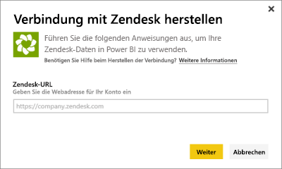
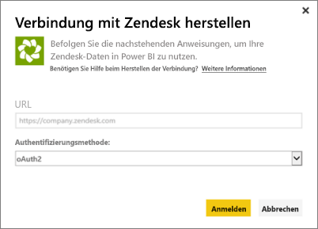
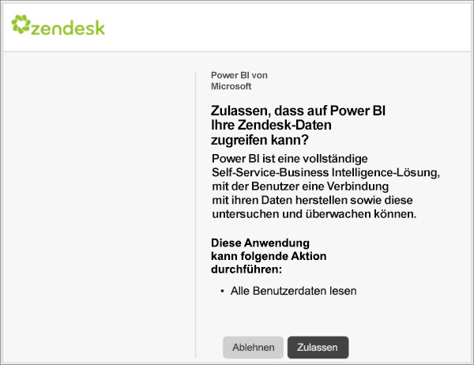
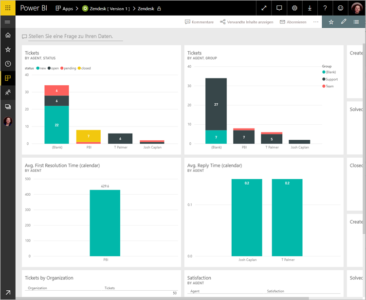
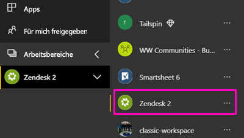
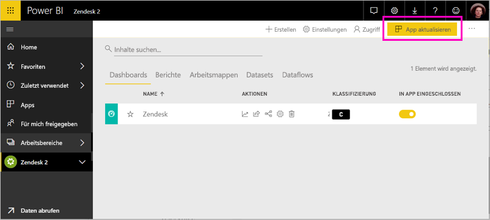

# Herstellen einer Verbindung mit Zendesk mithilfe von Power BI

In diesem Artikel wird Schritt für Schritt erläutert, wie Sie Ihre Daten aus Ihrem Zendesk-Konto mit einer Power BI-Vorlagen-App abrufen. Die Zendesk-App bietet ein Power BI-Dashboard und eine Reihe von Power BI-Berichten, die Einblicke in Ihr Ticketaufkommen und die Leistung der Agenten bieten. Die Daten werden automatisch einmal täglich aktualisiert. 

Nachdem Sie die Vorlagen-App installiert haben, können Sie das Dashboard und den Bericht so anpassen, dass die Informationen hervorgehoben werden, die Ihnen am wichtigsten sind. Anschließend können Sie sie als App an Kollegen in Ihrer Organisation verteilen.

Stellen Sie eine Verbindung mit der [Zendesk-Vorlagen-App](https://app.powerbi.com/getdata/services/zendesk) her, oder erfahren Sie mehr über die [Zendesk-Integration](https://powerbi.microsoft.com/integrations/zendesk) in Power BI.

Nachdem Sie die Vorlagen-App installiert haben, können Sie das Dashboard und den Bericht ändern. Anschließend können Sie sie als App an Kollegen in Ihrer Organisation verteilen.

>[!NOTE]
>Für das Herstellen einer Verbindung ist ein Zendesk-Administratorkonto erforderlich. Weitere Informationen zu den [Anforderungen](#system-requirements) finden Sie unten.

## Herstellen der Verbindung

[!INCLUDE [powerbi-service-apps-get-more-apps](../includes/powerbi-service-apps-get-more-apps.md)]

3. Wählen Sie **Zendesk** \> **Jetzt anfordern** aus.
4. Wählen Sie unter **Diese Power BI-App installieren?** die Option **Installieren** aus.
4. Wählen Sie im Bereich **Apps** die Kachel **Zendesk** aus.

    

6. Klicken Sie im Fenster **Erste Schritte mit Ihrer neuen App** auf **Verbinden**.

    

4. Stellen Sie die Ihrem Konto zugeordnete URL bereit. Die URL hat das Format **https://company.zendesk.com** . Nachstehend finden Sie weitere Informationen zum [Suchen dieser Parameter](#finding-parameters).
   
   

5. Wenn Sie dazu aufgefordert werden, geben Sie Ihre Zendesk-Anmeldeinformationen ein.  Wählen Sie **oAuth 2** als Authentifizierungsmechanismus aus, und klicken Sie dann auf **Anmelden**. Befolgen Sie die Anweisungen bei der Zendesk-Authentifizierung. (Wenn Sie in Ihrem Browser bereits bei Zendesk angemeldet sind, werden Sie möglicherweise nicht zur Eingabe von Anmeldeinformationen aufgefordert.)
   
   > [!NOTE]
   > Diese Vorlagen-App erfordert, dass Sie eine Verbindung mit einem Zendesk-Administratorkonto herstellen. 
   > 
   
   
6. Klicken Sie auf **Zulassen** , um Power BI den Zugriff auf Ihre Zendesk-Daten zu gewähren.
   
   
7. Klicken Sie auf **Verbinden**, um den Importvorgang zu starten. 
8. Nachdem Power BI die Daten importiert hat, sehen Sie die Inhaltsliste für Ihre Zendesk-App: ein neues Dashboard, einen neuen Bericht und ein neues Dataset.
9. Wählen Sie das Dashboard aus, um den Erkundungsprozess zu starten.

    
   
## Ändern und Verteilen der App

Sie haben die Zendesk-Vorlagen-App installiert. Das bedeutet, dass Sie auch den Zendesk-Arbeitsbereich erstellt haben. Im Arbeitsbereich können Sie den Bericht und das Dashboard ändern und dann als *App* an Kollegen in Ihrer Organisation verteilen. 

1. Klicken Sie im Navigationsbereich auf **Arbeitsbereiche** > **Zendesk**, um den gesamten Inhalt Ihres neuen Zendesk-Arbeitsbereichs anzuzeigen. 

    

    Diese Ansicht ist die Inhaltsliste für den Arbeitsbereich. In der oberen rechten Ecke wird **App aktualisieren** angezeigt. Wenn Sie bereit sind, die App an Ihre Kollegen zu verteilen, beginnen Sie hier damit. 

    

2. Wählen Sie **Berichte** und **Datasets** aus, um die anderen Elemente im Arbeitsbereich anzuzeigen.

    Informieren Sie sich über das [Verteilen von Apps](../collaborate-share/service-create-distribute-apps.md) an Ihre Kollegen.

## Systemanforderungen
Ein Zendesk-Administratorkonto ist erforderlich, um auf die Zendesk-Vorlagen-App zuzugreifen. Wenn Sie ein Agent oder Endbenutzer sind und Ihre Zendesk-Daten anzeigen möchten, fügen Sie einen Vorschlag hinzu, und überprüfen Sie den Zendesk-Connector in [Power BI Desktop](desktop-connect-to-data.md).

## Suchen von Parametern
Ihre Zendesk-URL stimmt mit der URL überein, die Sie zum Anmelden bei Ihrem Zendesk-Konto verwenden. Wenn Sie Ihre Zendesk-URL nicht kennen, können Sie die [Hilfe bei der Anmeldung](https://www.zendesk.com/login/) von Zendesk nutzen.

## Problembehandlung
Wenn Sie beim Herstellen einer Verbindung Probleme auftreten, überprüfen Sie Ihre Zendesk-URL, und bestätigen Sie, dass Sie ein Zendesk-Administratorkonto verwenden.

## Nächste Schritte

* [Erstellen der neuen Arbeitsbereiche in Power BI](../collaborate-share/service-create-the-new-workspaces.md)
* [Installieren und Verwenden von Apps in Power BI](../consumer/end-user-apps.md)
* [Herstellen einer Verbindung mit Power BI-Apps für externe Dienste](service-connect-to-services.md)
* Haben Sie Fragen? [Stellen Sie Ihre Frage in der Power BI-Community.](https://community.powerbi.com/)
