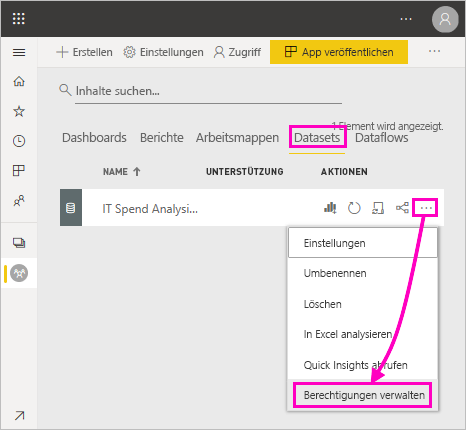
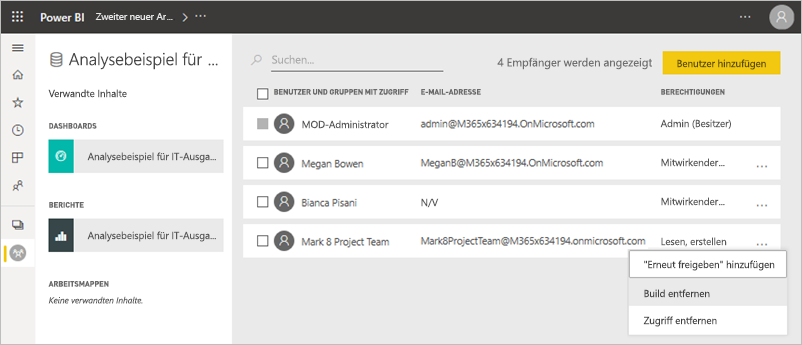
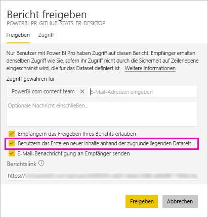
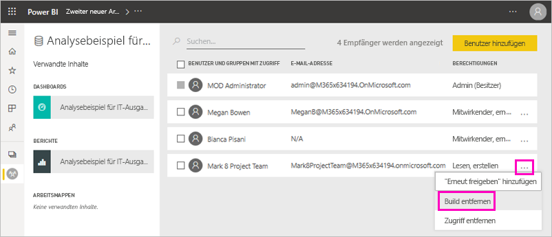
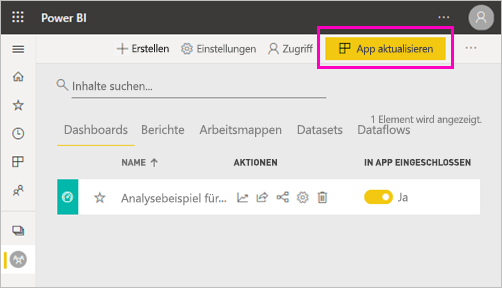
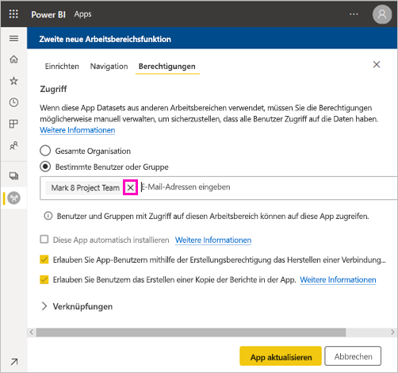
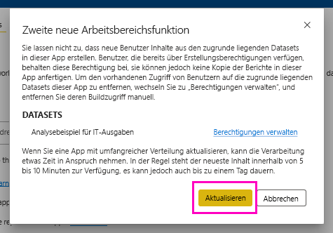

# Die Berechtigung „Erstellen“ für freigegebene Datasets (Vorschau)

Wenn Sie einen Bericht in Power BI Desktop erstellen, werden die Daten in diesem Bericht in einem *Datenmodell* gespeichert. Wenn Sie die Berichte im dem Power BI-Dienst veröffentlichen, werden die Daten auch als *Dataset* veröffentlicht. Sie können anderen die *Berechtigung „Erstellen“* für diesen Bericht erteilen, damit diese das freigegebene Dataset suchen und wieder verwenden können. In diesem Artikel wird erläutert, wie Sie mithilfe der Berechtigung „Erstellen“ den Zugriff auf die Daten steuern können.

Die Berechtigung „Erstellen“ gilt für Datasets. Wenn Sie Benutzern die Berechtigung „Erstellen“ erteilen, können diese neue Inhalte für Ihr Dataset erstellen. Dazu gehören z. B. Berichte, Dashboards, angeheftete Kacheln aus dem Bereich „Fragen und Antworten“ und gewonnene Erkenntnisse. 

Benutzer benötigen die Berechtigung „Erstellen“ auch zum Arbeiten mit den Daten *außerhalb* von Power BI:

- Exportieren der zugrunde liegenden Daten
- Erstellen neuer Inhalte für das Dataset (z. B. mit [In Excel analysieren](../collaborate-share/service-analyze-in-excel.md))
- Zugreifen auf die Daten über den XMLA-Endpunkt

## Möglichkeiten zum Erteilen der Berechtigung „Erstellen“

Es gibt verschiedene Möglichkeiten zum Erteilen der Berechtigung „Erstellen“:

- Mitglieder eines Arbeitsbereichs mit mindestens der Rolle „Mitwirkender“ haben automatisch die Berechtigung „Erstellen“ für Datasets in diesem Arbeitsbereich und die Berechtigung zum Kopieren eines Berichts.
 
- Mitglieder des Arbeitsbereichs, in dem sich das Dataset befindet, können die Berechtigung im Berechtigungscenter bestimmten Benutzern oder Sicherheitsgruppen zuweisen. Wenn Sie Mitglied des Arbeitsbereichs sind, klicken Sie auf **Weitere Optionen** (…) neben einem Dataset und dann auf **Berechtigungen verwalten**.

    

    Dadurch wird das Berechtigungscenter für das Dataset geöffnet, in dem Sie Berechtigungen festlegen und ändern können.

    

- Ein Administrator oder Mitglied des Arbeitsbereichs, in dem das Dataset gespeichert ist, kann während des Veröffentlichens einer App entscheiden, dass Benutzer mit Berechtigung für die App außerdem die Erstellungsberechtigung für die zugrundeliegenden Datasets erhalten. Weitere Informationen finden Sie unter [Freigeben eines Datasets](service-datasets-share.md).

- Angenommen, Sie haben die Berechtigungen „Erneut freigeben“ und „Erstellen“ für ein Dataset. Beim Freigeben eines Berichts oder eines Dashboards, der bzw. das auf Grundlage dieses Datasets erstellt wurde, können Sie angeben, dass die Empfänger außerdem die Berechtigung „Erstellen“ für das zugrundeliegende Dataset erhalten sollen.

    

Sie können einer Person die Berechtigung „Erstellen“ für ein Dataset entziehen. Wenn Sie dies tun, können die betroffenen Personen immer noch den auf dem freigegebenen Dataset erstellten Bericht anzeigen, sie können ihn aber nicht mehr ändern. Weitere Informationen finden Sie im nächsten Abschnitt.

## Entziehen der Berechtigung „Erstellen“ für ein Dataset

Es ist möglich, dass Sie irgendwann Benutzern eines freigegebenen Datensatzes die Berechtigung „Erstellen“ entziehen müssen. 

1. Wechseln Sie in einem Arbeitsbereich zur Listenseite **Datasets**. 
1. Klicken Sie neben dem Dataset auf **Weitere Optionen** (...) und dann auf **Berechtigungen verwalten**.

    

1. Wählen Sie neben einem Namen **Weitere Optionen**  (...) und dann **Build entfernen** aus.

    

    Anschließend können die betroffenen Benutzer immer noch den anhand des freigegebenen Datasets erstellten Bericht anzeigen, ihn aber nicht mehr ändern.

### Berechtigung „Erstellen“ entziehen für ein Dataset in einer App

Angenommen, Sie haben eine App aus einem Arbeitsbereich an eine Gruppe von Benutzern verteilt. Später beschließen Sie, einigen Benutzern den Zugriff auf die App zu entziehen. Durch das Entziehen des Zugriffs auf die App werden die Berechtigungen „Erstellen“ und „Erneut freigeben“ nicht automatisch aufgehoben. Dies erfordert einen zusätzlichen Schritt. 

1. Klicken Sie auf einer Listenseite im Arbeitsbereich auf **App aktualisieren**. 

    

1. Klicken Sie auf der Registerkarte **Berechtigungen** auf **X**, um die Person oder Gruppe zu löschen. 

    
1. Klicken Sie auf **App aktualisieren**.

    Sie erhalten die Meldung, dass Sie zu **Berechtigungen verwalten** wechseln müssen, um die Berechtigung „Erstellen“ Benutzern mit vorhandenem Zugriff zu entziehen. 

    

1. Klicken Sie auf **Aktualisieren**.

1. Wechseln Sie im Arbeitsbereich zur Listenseite **Datasets**. 
1. Klicken Sie neben dem Dataset auf **Weitere Optionen** (...) und dann auf **Berechtigungen verwalten**.

    

1. Wählen Sie neben ihrem Namen **Weitere Optionen**  (...) und dann **Build entfernen** aus.

    

    Anschließend können die betroffenen Benutzer immer noch den anhand des freigegebenen Datasets erstellten Bericht anzeigen, ihn aber nicht mehr ändern.

## Feiner abgestimmte Berechtigungen

In Power BI wurde die Berechtigung „Erstellen“ im Juni 2019 als Ergänzung der vorhandenen Berechtigungen „Lesen“ und „Erneut freigeben“ eingeführt. Alle Benutzer, die zu diesem Zeitpunkt über App-Berechtigungen, Freigabe oder Arbeitsbereichszugriff bereits über die Berechtigung „Lesen“ für Datasets verfügten, erhielten für die gleichen Datasets außerdem die Berechtigung „Erstellen“. Sie erhielten die Erstellungsberechtigung automatisch, da ihnen die Leseberechtigung bereits das Recht zum Erstellen neuer Inhalte auf der Grundlage des Datasets einräumte, durch Verwendung von „In Excel analysieren“ oder Exportieren.

Mit dieser feiner abgestimmten Erstellungsberechtigung können Sie jetzt wählen, wer nur die Inhalte im vorhandenen Bericht oder Dashboard anzeigen und wer Inhalte erstellen kann, die mit den zugrundeliegenden Datasets verbunden sind.

Wenn Ihr Dataset von einem Bericht außerhalb des Arbeitsbereichs des Datasets verwendet wird, können Sie das Dataset nicht löschen. Stattdessen wird eine Fehlermeldung angezeigt.

Sie können die Berechtigung „Erstellen“ entziehen. In diesem Fall können die Personen, deren Berechtigungen Sie widerrufen haben, den Bericht immer noch anzeigen, ihn aber nicht mehr bearbeiten oder dessen zugrunde liegenden Daten exportieren. Benutzer, die nur über Leseberechtigung verfügen, können zusammengefasste Daten weiterhin exportieren. 

## Weitere Schritte

- [Verwenden von Datasets in mehreren Arbeitsbereichen (Vorschau)](service-datasets-across-workspaces.md)
- Fragen? [Stellen Sie Ihre Frage in der Power BI-Community.](https://community.powerbi.com/)
