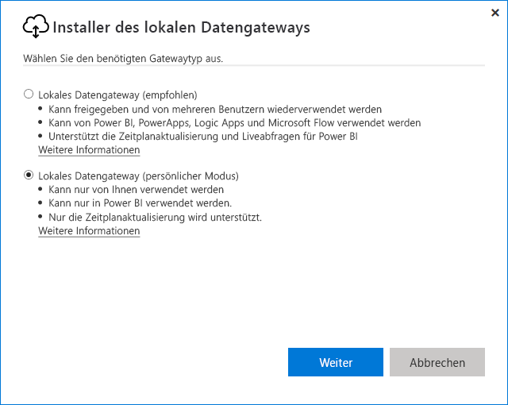
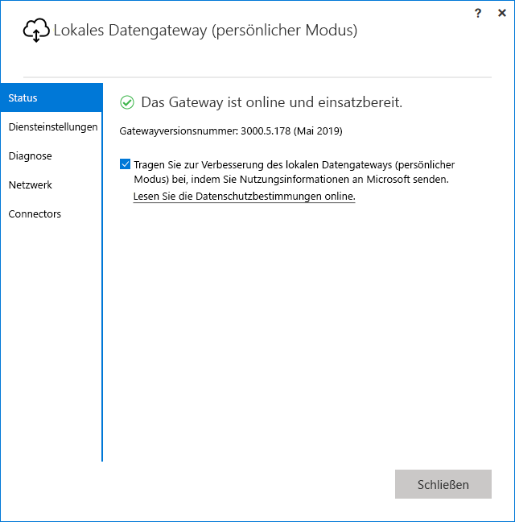

# <a name="use-personal-gateways-in-power-bi"></a>Verwenden persönlicher Gateways in Power BI

[!INCLUDE [gateway-rewrite](../includes/gateway-rewrite.md)]

Das lokale Datengateway (persönlicher Modus) ist eine Version des lokalen Datengateways, das nur mit Power BI funktioniert. Sie können ein persönliches Gateway verwenden, um ein Gateway auf Ihrem eigenen Computer zu installieren und Zugriff auf lokale Daten zu erhalten.

> [!NOTE]
> Sie können für jeden Power BI-Benutzer nur ein Gateway im persönlichen Modus ausführen. Wenn Sie ein weiteres Gateway im persönlichen Modus für denselben Benutzer installieren (selbst wenn dies auf einem anderen Computer geschieht), ersetzt die neueste Installation die vorhandene vorherige Installation.

## <a name="on-premises-data-gateway-vs-on-premises-data-gateway-personal-mode"></a>Lokales Datengateway und lokales Datengateway (persönlicher Modus) im Vergleich

In der folgenden Tabelle werden die Unterschiede zwischen einem lokalen Datengateway und einem lokalen Datengateway (persönlicher Modus) beschrieben.

|   |Lokales Datengateway | Lokales Datengateway (persönlicher Modus) |
| ---- | ---- | ---- |
|Unterstützte Clouddienste |Power BI, PowerApps, Azure Logic Apps, Power Automate, Azure Analysis Services, Datenflüsse |Power BI |
|Ausführung |Wie vom Benutzer konfiguriert, der Zugriff auf das Gateway hat |Wie für Ihre Windows-Authentifizierung und andere Authentifizierungstypen konfiguriert |
|Kann nur als Computeradministrator installiert werden |Ja |Nein |
|Zentrales Gateway und Datenquellenverwaltung |Ja |Nein |
|Datenimport und Zeitplanaktualisierung |Ja |Ja |
|DirectQuery-Unterstützung |Ja |Nein |
|LiveConnect-Unterstützung für Analysis Services |Ja |Nein |

## <a name="install-the-on-premises-data-gateway-personal-mode"></a>Installation des lokalen Datengateways (persönlicher Modus)

So installieren Sie das lokale Datengateway (persönlicher Modus):

1. [Laden Sie das lokale Datengateway herunter.](https://go.microsoft.com/fwlink/?LinkId=820925&clcid=0x409)

2. Wählen Sie im Installationsprogramm das lokale Datengateway (persönlicher Modus) aus, und klicken Sie dann auf **Weiter**.

   

Die Gatewaydateien werden unter _%localappdata%\Microsoft\Lokales Datengateway (persönlicher Modus)_  installiert. Nachdem die Installation erfolgreich abgeschlossen wurde und Sie sich angemeldet haben, wird der folgende Bildschirm angezeigt.



## <a name="use-fast-combine-with-the-personal-gateway"></a>Verwendung von schnellem Kombinieren mit persönlichem Gateway

Mit Fast Combine auf einem persönlichen Gateway können Sie die festgelegten Datenschutzebenen beim Ausführen von Abfragen ignorieren. So können Sie Fast Combine für das lokale Datengateway (persönlicher Modus) aktivieren:

1. Öffnen Sie die folgende Datei mit dem Datei-Explorer:

   `%localappdata%\Microsoft\On-premises data gateway (personal mode)\Microsoft.PowerBI.DataMovement.Pipeline.GatewayCore.dll.config`

2. Fügen Sie am Ende der Datei den folgenden Text ein:

    ```xml
    <setting name="EnableFastCombine" serializeAs="String">
       <value>true</value>
    </setting>
    ```

3. Sobald der Vorgang abgeschlossen ist, wird die Einstellung in ungefähr einer Minute wirksam. Um zu überprüfen, ob es ordnungsgemäß funktioniert, versuchen Sie im Power BI-Dienst eine bedarfsgesteuerte Aktualisierung, um zu bestätigen, dass schnelles Kombinieren funktioniert.

## <a name="frequently-asked-questions-faq"></a>Häufig gestellte Fragen (FAQ)

**Frage:** Kann ich das lokale Datengateway (persönlicher Modus) parallel mit dem lokalen Datengateway ausführen (vormals als Enterprise-Version des Gateways bekannt)?
  
**Antwort:** Ja, beide Gateways können gleichzeitig ausgeführt werden.

**Frage:** Kann ich das lokale Datengateway (persönlicher Modus) als Dienst ausführen?
  
**Antwort:** Nein. Das lokale Datengateway (persönlicher Modus) kann nur als Anwendung ausgeführt werden. Wenn Sie das Gateway als Dienst bzw. im Administratormodus ausführen müssen, müssen Sie das [lokale Datengateway](/data-integration/gateway/service-gateway-onprem) (vormals als Enterprise-Gateway bekannt) in Betracht ziehen.

**Frage:** Wie oft wird das lokale Datengateway (persönlicher Modus) aktualisiert?
  
**Antwort:** Wir möchten das persönliche Gateway monatlich aktualisieren.

**Frage:** Warum werde ich aufgefordert, Anmeldeinformationen zu aktualisieren?
  
**Antwort:** Viele Situationen können eine Aufforderung zur Eingabe von Anmeldeinformationen auslösen. Meistens passiert dies, wenn Sie das lokale Datengateway (persönlicher Modus) auf einem anderen Computer als Ihr persönliches Gateway für Power BI neu installiert haben. Es kann auch ein Problem in der Datenquelle vorliegen und Power BI konnte keine Testverbindung herstellen, oder ein Timeout oder ein Systemfehler ist aufgetreten. Um Ihre Anmeldeinformationen im Power BI-Dienst zu aktualisieren, wählen Sie das Zahnradsymbol und dann **Einstellungen** > **Datasets** aus. Suchen Sie das betreffende Dataset, und wählen Sie **Anmeldeinformationen für die Datenquelle** aus.

**Frage:** Wie lang wird mein vorheriges persönliches Gateway während des Upgrades offline geschaltet?
  
**Antwort:** Das Upgrade des persönlichen Gateways auf die neue Version dauert nur einige Minuten.

**Frage:** Ich verwende R- und Python-Skripts. Werden sie unterstützt?
  
**Antwort:** R- und Python-Skripts werden für den persönlichen Modus unterstützt.

## <a name="next-steps"></a>Nächste Schritte

* [Konfigurieren von Proxyeinstellungen für das lokale Datengateway](/data-integration/gateway/service-gateway-proxy)  

Weitere Fragen? Wenden Sie sich an die [Power BI-Community](https://community.powerbi.com/).
