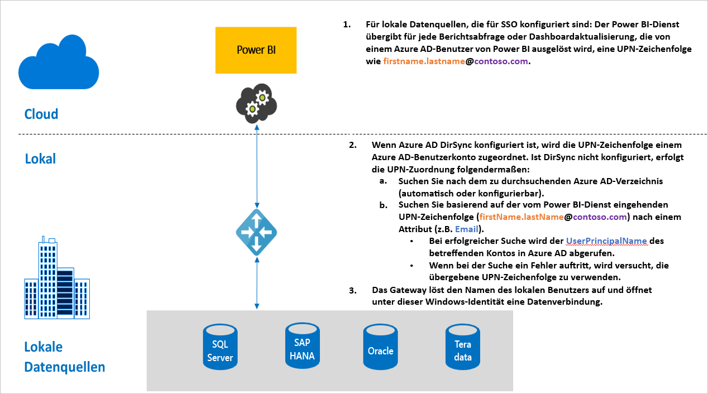

# Übersicht: Single Sign-On für Gateways in Power BI

Sie können nahtlose Verbindungen mit einmaligem Anmelden erreichen und für Power BI-Berichte und -Dashboards das Aktualisieren von lokalen Daten in Echtzeit ermöglichen, indem Sie Ihr lokales Datengateway konfigurieren. Sie haben die Option, Ihr Gateway entweder mit eingeschränkter [Kerberos](service-gateway-sso-kerberos.md)-Delegierung oder der Security Assertion Markup Language ([SAML](service-gateway-sso-saml.md)) zu konfigurieren. Das lokale Datengateway unterstützt Single Sign-On (SSO) über [DirectQuery](desktop-directquery-about.md) oder für Aktualisierungen. Damit werden Verbindungen mit lokalen Datenquellen hergestellt. 

Power BI unterstützt die folgenden Datenquellen:

* SQL Server (Kerberos)
* SAP HANA (Kerberos und SAML)
* SAP BW-Anwendungsserver (Kerberos)
* SAP BW-Nachrichtenserver (Kerberos) 
* Oracle (Kerberos) 
* Teradata (Kerberos)
* Spark (Kerberos)
* Impala (Kerberos)

Das einmalige Anmelden (SSO) für [M-Erweiterungen](https://github.com/microsoft/DataConnectors/blob/master/docs/m-extensions.md) wird derzeit nicht unterstützt.

Wenn ein Benutzer mit einem DirectQuery-Bericht im Power BI-Dienst interagiert, kann jeder Kreuzfilter-, Segmentierungs-, Sortier- und Berichtsbearbeitungsvorgang Abfragen bewirken, die live für die zugrunde liegende Datenquelle ausgeführt werden. Wenn Sie SSO für die Datenquelle konfigurieren, werden Abfragen unter der Identität des Benutzers ausgeführt, der mit Power BI interagiert (d. h. über die Webumgebung oder mobile Power BI-Apps). Daher sieht jeder Benutzer genau die Daten, für die er über Berechtigungen in der zugrunde liegenden Datenquelle verfügt. 

Sie können auch einen Bericht konfigurieren, der im Power BI-Dienst so eingerichtet ist, dass für Aktualisierungen SSO verwendet wird. Wenn Sie für diese Datenquelle SSO konfigurieren, werden Abfragen im Power BI-Dienst unter der Identität des Datasetbesitzers ausgeführt. Eine Aktualisierung erfolgt deshalb basierend auf den Berechtigungen des Datasetbesitzers für die zugrunde liegende Datenquelle. Die Aktualisierung mit SSO ist momentan nur für Datenquellen aktiviert, die die eingeschränkte [Kerberos](service-gateway-sso-kerberos.md)-Delegierung verwenden. 

## Abfrageschritte beim Ausführen von SSO

Eine mit SSO ausgeführte Abfrage umfasst drei Schritte, wie in der folgenden Abbildung veranschaulicht.

Es folgen weitere Details zu jedem Schritt:

1. Der Power BI-Dienst enthält für jede Abfrage den *Benutzerprinzipalnamen* (UPN, d. h. der voll qualifizierte Benutzernamen des Benutzers, der zurzeit beim Power BI-Dienst angemeldet ist), wenn eine Abfrageanforderung an das konfigurierte Gateway gesendet wird.

2. Das Gateway muss den Azure Active Directory-UPN einer lokalen Active Directory-Identität zuordnen.

   a. Wenn Azure AD DirSync (auch als *Azure AD Connect* bezeichnet) konfiguriert ist, erfolgt die Zuordnung automatisch im Gateway.

   b.  Andernfalls kann das Gateway den Azure AD-UPN suchen und einem lokalen AD-Benutzer zuordnen. Dies erfolgt durch eine Suche in der lokalen Active Directory-Domäne.

3. Der Prozess des Gatewaydiensts nimmt die Identität des zugeordneten lokalen Benutzers an, öffnet die Verbindung mit der zugrunde liegenden Datenbank und sendet die Abfrage. Das Gateway muss nicht auf denselben Computern wie die Datenbank installiert sein.

## Weitere Schritte

Nachdem Sie sich nun grundlegend mit der Aktivierung von SSO über das Gateway auskennen, können Sie sich ausführlichere Informationen zu Kerberos und SAML ansehen:

* [Einmaliges Anmelden (SSO): Kerberos](service-gateway-sso-kerberos.md)
* [Einmaliges Anmelden (SSO): SAML](service-gateway-sso-saml.md)
