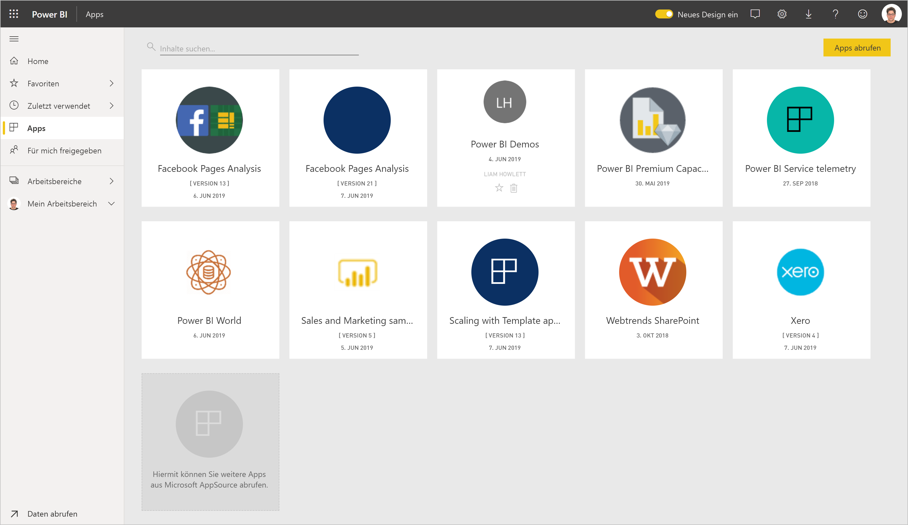
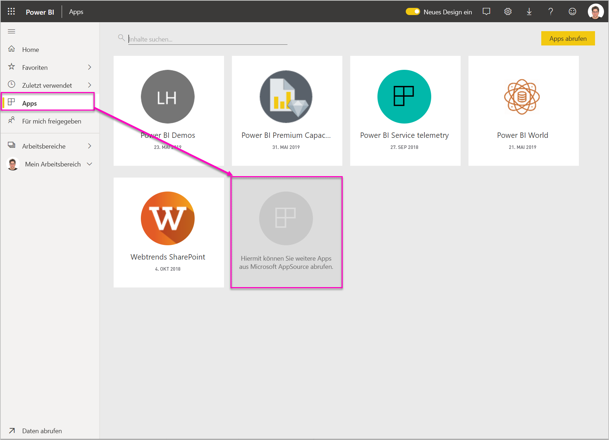
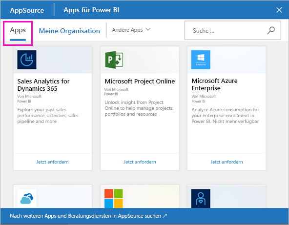
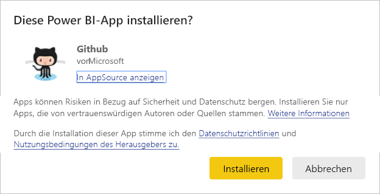
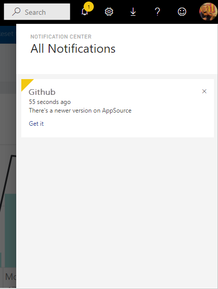
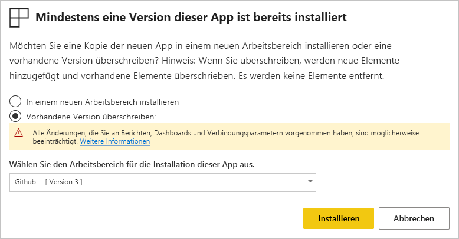
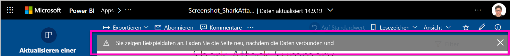

# Installieren und Verteilen von Vorlagen-Apps in Ihrer Organisation

Sind Sie Power BI-Analyst? Wenn dies der Fall ist, erfahren Sie in diesem Artikel, wie Sie [Vorlagen-Apps](service-template-apps-overview.md) installieren, um eine Verbindung mit den von Ihnen im Geschäftsalltag verwendeten Diensten wie Salesforce, Microsoft Dynamics und Google Analytics herzustellen. Anschließend können Sie die vorab erstellten Dashboards und Berichte der Vorlagen-App so ändern, dass diese den Anforderungen Ihrer Organisation entsprechen, und sie dann als [Apps](../consumer/end-user-apps.md) an Ihre Kollegen verteilen. 

Wenn Sie daran interessiert sind, Ihre eigenen Vorlagen-Apps zu erstellen und außerhalb Ihrer Organisation zu verteilen, finden Sie Informationen dazu unter [Erstellen einer Vorlagen-App in Power BI](service-template-apps-create.md). Power BI-Partner können ohne oder mit nur wenig Code Power BI-Apps erstellen und diese dann für Power BI-Kunden bereitstellen. 

## Voraussetzungen  

Sie benötigen Folgendes zum Installieren, Anpassen und Verteilen einer Vorlagen-App: 

* Eine [Power BI Pro-Lizenz](../fundamentals/service-self-service-signup-for-power-bi.md)
* Berechtigungen zum Installieren von Vorlagen-Apps in Ihrem Mandanten
* Einen gültigen Link zur Installation der App, den Sie entweder über AppSource oder den Ersteller der App erhalten
* Vertrautheit mit den [grundlegenden Konzepten von Power BI](../fundamentals/service-basic-concepts.md)

## Installieren einer Vorlagen-App

1. Klicken Sie im Navigationsbereich des Power BI-Diensts auf **Apps** > **Apps abrufen**.

    

1. Klicken Sie im angezeigten AppSource-Fenster auf **Apps**. Suchen Sie nach der gewünschten App, und klicken Sie dann auf **Jetzt herunterladen**.

    

1. Klicken Sie im angezeigten Dialogfeld auf **Installieren**.

    
    
    Die App wird mit einem zugeordneten Arbeitsbereich installiert. **Wenn Sie die App anpassen möchten, wird dies in diesem zugeordneten Arbeitsbereich gemacht**.

    > [!NOTE]
    > Wenn Sie einen Link für die Installation einer App verwenden, die nicht in AppSource aufgeführt ist, müssen Sie in einem daraufhin angezeigten Dialogfeld Ihre Auswahl bestätigen.
    >
    >Sie müssen die relevanten Berechtigungen von Ihrem Administrator anfordern, um eine Vorlagen-App installieren zu können, die nicht in AppSource aufgeführt ist. Weitere Informationen finden Sie im Power BI-Verwaltungsportal unter [Einstellungen für Vorlagen-Apps](../admin/service-admin-portal.md#template-apps-settings).

    Wenn die Installation erfolgreich abgeschlossen wurde, werden Sie in einer Benachrichtigung darüber informiert, dass Ihre neue App verwendet werden kann.

    

## Verbinden mit Daten

1. Klicken Sie auf **Go to app** (Zu App wechseln). Das Fenster **Erste Schritte mit Ihrer neuen App** wird angezeigt.

   

1. Klicken Sie auf **Verbinden**.
    
    Dadurch wird ein Dialogfeld oder eine Reihe von Dialogfeldern geöffnet, in denen Sie die Datenquelle der Beispieldaten in Ihre eigene Datenquelle ändern können. Dies bedeutet im Allgemeinen, dass Sie Datasetparameter und Datenquellenanmeldeinformationen neu definieren. Weitere Informationen finden Sie unter [Bekannte Einschränkungen](service-template-apps-overview.md#known-limitations).
    
    Im folgenden Beispiel umfasst das Herstellen einer Verbindung mit Daten zwei Dialogfelder.

   

    Nachdem Sie die Dialogfelder für die Verbindung ausgefüllt haben, wird der Verbindungsprozess gestartet. Ein Banner informiert Sie darüber, dass Sie Beispieldaten anzeigen.

    

    Warten Sie, bis die Verbindung und Aktualisierung der Daten abgeschlossen ist. Wenn Sie wissen möchten, wann dieser Vorgang abgeschlossen ist, können Sie sich die Statusanzeige der Datasetzeile (neues Design) oder der Registerkarte (altes Design) ansehen.

   Aktualisieren Sie den Browser, wenn die Verbindungs- und Datenaktualisierung abgeschlossen ist. Das Banner informiert Sie nun darüber, dass Sie die App aktualisieren müssen, um alle an der App vorgenommenen Änderungen zu übernehmen und diese freizugeben.

    

## Anpassen und Freigeben der App

Nachdem Sie den Browser nach der Verbindungs- und Datenaktualisierung aktualisiert haben, wird jetzt der Arbeitsbereich angezeigt, der der App zugeordnet ist. An diesem Punkt können Sie dort alle Artefakte wie in jedem anderen Arbeitsbereich bearbeiten. Beachten Sie jedoch, dass alle von Ihnen vorgenommenen Änderungen überschrieben werden, wenn Sie die App auf eine neuen Version aktualisieren, es sei denn, Sie speichern die Elemente, die Sie mit unterschiedlichen Namen geändert haben. [Hier finden Sie Details zum Überschreiben.](#overwrite-behavior)

Weitere Informationen zum Bearbeiten von Artefakten im Arbeitsbereich finden Sie unter den folgenden Links:
* [Einführung in den Berichts-Editor in Power BI](../create-reports/service-the-report-editor-take-a-tour.md)
* [Grundlegende Konzepte für Designer im Power BI-Dienst](../fundamentals/service-basic-concepts.md)

Wenn Sie alle gewünschten Änderungen an den Artefakten im Arbeitsbereich vorgenommen haben, können Sie die App veröffentlichen und freigeben. Weitere Informationen hierzu finden Sie unter [Veröffentlichen der App](../collaborate-share/service-create-distribute-apps.md#publish-your-app).

## Erstellen einer Vorlagen-App

Von Zeit zu Zeit veröffentlichen Ersteller von Vorlagen-Apps neue, verbesserte Versionen ihrer Vorlagen-Apps entweder über AppSource, direkte Links oder beides.

Wenn Sie die App ursprünglich aus AppSource heruntergeladen haben, werden Sie auf zwei Arten benachrichtigt, wenn eine neue Version der Vorlagen-App verfügbar geworden ist:
* Ein Aktualisierungsbanner wird im Power BI-Dienst angezeigt, in dem Ihnen mitgeteilt wird, dass eine neue App-Version verfügbar ist.
  
* Sie erhalten eine Benachrichtigung im Benachrichtigungsbereich von Power BI.

  

>[!NOTE]
>Wenn Sie die App ursprünglich über einen direkten Link anstelle von AppSource erhalten haben, können Sie lediglich den Ersteller der Vorlagen-App kontaktieren, um herauszufinden, wann eine neue Version verfügbar ist.

  Um das Update zu installieren, klicken entweder im Benachrichtigungsbanner oder in der Mitteilungszentrale auf **Abrufen**, oder suchen Sie erneut in AppSource nach der App, und klicken Sie dann auf **Jetzt abrufen**. Wenn Sie vom Ersteller der Vorlagen-App einen direkten Link für das Update erhalten haben, klicken Sie einfach auf den Link.
  
  Sie werden gefragt, ob Sie die aktuelle Version überschreiben oder die neue Version in einem neuen Arbeitsbereich installieren möchten. Standardmäßig ist „Überschreiben“ ausgewählt.

  

- **Vorhandene Version überschreiben:** Überschreibt den vorhandenen Arbeitsbereich mit der aktualisierten Version der Vorlagen-App. [Hier finden Sie Details zum Überschreiben.](#overwrite-behavior)

- **In einem neuen Arbeitsbereich installieren:** Hiermit wird eine neue Version des Arbeitsbereichs und der App installiert, die Sie neu konfigurieren müssen (d. h. Daten verbinden sowie Navigation und Berechtigungen definieren).

### Überschreibverhalten

* Durch das Überschreiben werden die Berichte, Dashboards und das Dataset im Arbeitsbereich und nicht in der App aktualisiert. Durch das Überschreiben ändert sich nichts an der Navigation, dem Setup und den Berechtigungen der App.
* Nachdem Sie den Arbeitsbereich aktualisiert haben, müssen Sie **die App aktualisieren, um die Änderungen des Arbeitsbereichs auf die App anzuwenden**.
* Beim Überschreiben werden konfigurierte Parameter und die Authentifizierung beibehalten. Nach dem Update wird eine automatische Aktualisierung des Datasets gestartet. **Während dieser Aktualisierung stellen die App, Berichte und Dashboards Beispieldaten dar.**

  

* Beim Überschreiben werden immer Beispieldaten angezeigt, bis die Aktualisierung abgeschlossen ist. Wenn der Autor der Vorlagen-App Änderungen am Dataset oder den Parametern vorgenommen hat, sehen Benutzer des Arbeitsbereichs und der App erst dann die neuen Daten, wenn die Aktualisierung abgeschlossen wurde. Stattdessen werden während dieses Zeitraums weiterhin die Beispieldaten angezeigt.
* Beim Überschreiben werden niemals neue Berichte oder Dashboards gelöscht, die Sie dem Arbeitsbereich hinzugefügt haben. Die ursprünglichen Berichte und Dashboards werden nur mit Änderungen des ursprünglichen Autors überschrieben.

>[!IMPORTANT]
>Denken Sie daran, nach dem Überschreiben [die App zu aktualisieren](#customize-and-share-the-app), um Änderungen auf die Berichte und Dashboards der Benutzer Ihrer Organisations-App anzuwenden.

## Nächste Schritte

[Gemeinsames Erstellen von Arbeitsbereichen mit Ihren Kollegen in Power BI](../collaborate-share/service-create-workspaces.md)
