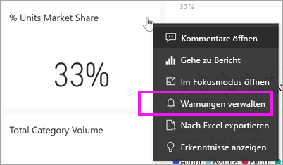
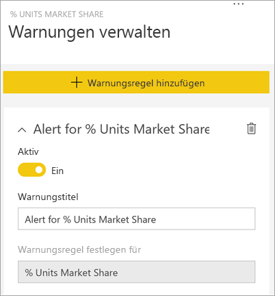
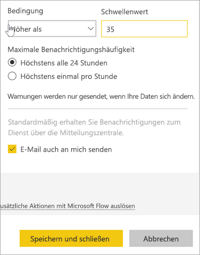
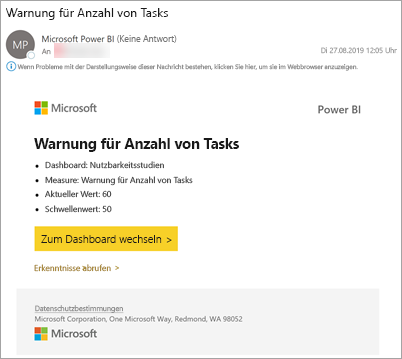
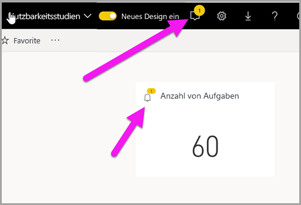
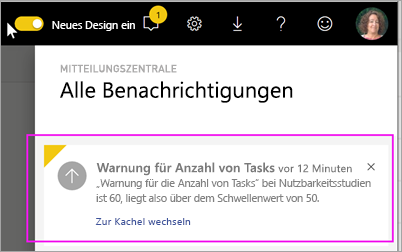
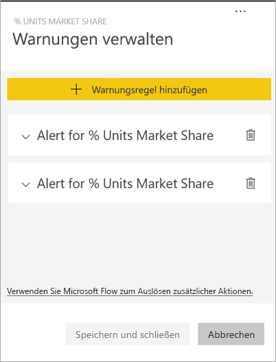
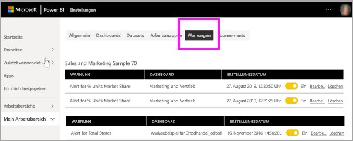

# Tutorial: Festlegen von Dashboardwarnungen auf Dashboards des Power BI-Diensts

[!INCLUDE [power-bi-service-new-look-include](../includes/power-bi-service-new-look-include.md)]

Legen Sie Warnungen fest, um Benachrichtigungen zu erhalten, wenn die Daten in den Dashboards die von Ihnen festgelegten Grenzen überschreiten. Warnungen können für Messgeräte, KPIs und Karten festgelegt werden. Da diese Funktion noch weiterentwickelt wird, sehen Sie sich den Abschnitt weiter unten zu [Tipps und Problembehandlung](#tips-and-troubleshooting) an.

Die Warnungen werden nur Ihnen angezeigt, auch wenn Sie das Dashboard freigeben. Datenwarnungen werden mit allen Plattformen synchronisiert. Sie können Datenwarnungen daher [in den mobilen Power BI-Apps](mobile/mobile-set-data-alerts-in-the-mobile-apps.md) und im Power BI-Dienst festlegen und anzeigen. 

> [!WARNING]
> Diese Warnungen enthalten Informationen zu Ihren Daten. Wenn Sie Power BI-Daten auf einem mobilen Gerät anzeigen und das Gerät gestohlen wird, sollten Sie mithilfe des Power BI-Diensts alle Warnungen deaktivieren.
> 

In diesem Tutorial werden folgende Themen behandelt:
> [!div class="checklist"]
> * Wer kann Warnungen einrichten?
> * Welche Visuals unterstützen Warnungen?
> * Wer kann meine Warnungen sehen?
> * Funktionieren Warnungen in Power BI Desktop und mobil?
> * So erstellen Sie eine Warnung
> * Wo werde ich meine Warnungen erhalten?

Wenn Sie noch nicht bei Power BI registriert sind, müssen Sie sich zuerst für eine [kostenlose Testversion registrieren](https://app.powerbi.com/signupredirect?pbi_source=web).

In diesem Beispiel wird eine Dashboardkartenkachel aus der Beispiel-App „Sales & Marketing“ verwendet. Diese App ist unter [Microsoft AppSource](https://appsource.microsoft.com) verfügbar. Hilfe zur Installation der App erhalten Sie unter [Installieren und Verwenden von Apps mit Dashboards und Berichten in Power BI](end-user-app-view.md).

1. Wählen Sie von einem Messgerät, KPI oder einer Kartenkachel eines Dashboards die Auslassungspunkte aus.
   
   
2. Wählen Sie das Glockensymbol  oder **Warnungen verwalten** aus, um eine oder mehrere Warnungen für **Filialen insgesamt** hinzuzufügen.

   

   
1. Wählen Sie **+ Warnungsregel hinzufügen** im Bereich **Warnungen verwalten** aus.  Stellen Sie sicher, dass der Schieberegler auf **Ein** festgelegt ist, und geben Sie der Warnung einen Titel. Durch Titel lassen sich Warnungen schnell einordnen.
   
   
4. Scrollen Sie nach unten, und geben Sie die Warnungsdetails ein.  In diesem Beispiel erstellen wir eine Warnung, die uns einmal täglich benachrichtigt, wenn unser Marktanteil auf 35 oder höher ansteigt. Warnungen werden in der Mitteilungszentrale angezeigt. Und außerdem lassen wir uns von Power BI eine E-Mail senden.
   
   
5. Klicken Sie auf **Speichern und schließen**.
 
   > [!NOTE]
   > Warnungen erfolgen nur für Daten, die aktualisiert werden. Wenn Daten aktualisiert werden, überprüft Power BI, ob eine Warnung für diese Daten festgelegt ist. Wenn die Daten einen Warnungsschwellenwert erreicht haben, wird eine Warnung ausgelöst. 
   > 

## Empfangen von Warnungen
Wenn die nachverfolgten Daten einen der von Ihnen festgelegten Schwellenwerte erreichen, erfolgen mehrere Aktionen. Power BI überprüft zunächst, ob seit dem Senden der letzten Warnung mehr als eine Stunde oder mehr als 24 Stunden (je nach der von Ihnen ausgewählten Option) verstrichen sind. Solange die Daten den Schwellenwert überschreiten, erhalten Sie eine Warnung.

Anschließend sendet Power BI eine Warnung an Ihre Mitteilungszentrale und optional an Ihre E-Mail-Adresse. Jede Warnung enthält einen direkten Link zu den entsprechenden Daten. Klicken Sie auf den Link, um die relevante Kachel zu sehen.  

1. Wenn Sie festgelegt haben, dass bei einer Warnung eine E-Mail an Sie gesendet wird, enthält Ihr Posteingang etwa Folgendes. Dies ist eine Warnung, die wir auf einem anderen Dashboard festlegen. Dieses Dashboard verfolgt abgeschlossene Aufgaben des Teams für Benutzerfreundlichkeit.
   
   
2. Power BI fügt der **Mitteilungszentrale** eine Nachricht und der entsprechenden Kachel das Symbol für eine neue Warnung hinzu.
   
   
3. Öffnen Sie die Mitteilungszentrale, um die Warnungsdetails anzuzeigen.
   
    
   
  

## Verwalten von Warnungen

Es gibt viele Möglichkeiten zum Verwalten von Warnungen: in der Dashboardkachel, im Menü für Power BI-Einstellungen, auf einer einzelnen Kachel in der [mobilen Power BI-App auf dem iPhone](mobile/mobile-set-data-alerts-in-the-mobile-apps.md) oder in der [mobilen Power BI-App für Windows 10](mobile/mobile-set-data-alerts-in-the-mobile-apps.md).

### In der Kachel

1. Wenn Sie eine Warnung für eine Kachel ändern oder entfernen müssen, öffnen Sie das Fenster **Warnungen verwalten** erneut, indem Sie auf das Glockensymbol  klicken. Alle Warnungen, die Sie für diese Kachel festgelegt haben, werden angezeigt.
   
    .
2. Um eine Warnung zu ändern, wählen Sie den Pfeil links neben dem Namen der Warnung.
   
    .
3. Um eine Warnung zu löschen, wählen Sie den Papierkorb rechts neben dem Namen der Warnung.
   
      

### Im Menü für Power BI-Einstellungen

1. Wählen Sie das Zahnradsymbol auf der Power BI-Menüleiste.
   
    .
2. Wählen Sie unter **Einstellungen** die Option **Warnungen** aus.
   
    
3. Hier können Sie Warnungen aktivieren und deaktivieren, das Fenster **Warnungen verwalten** öffnen, um Änderungen vorzunehmen, oder die Warnung löschen.

## Tipps und Problembehandlung 

* Warnungen können nur für Messgeräte, KPIs und Karten festgelegt werden.
* Wenn Sie für ein Messgerät, eine KPI oder eine Karte keine Warnung festlegen können, bitten Sie Ihren Systemadministrator um Hilfe. Manchmal sind Warnungen für Ihr Dashboard oder bestimmte Dashboardkacheln deaktiviert oder nicht verfügbar.
* Warnungen erfolgen nur für Daten, die aktualisiert werden. Sie können nicht für statische Daten ausgelöst werden. Die meisten der von Microsoft bereitgestellten Beispiele sind statisch. 

## Bereinigen von Ressourcen
Anleitungen zum Löschen von Warnungen sind weiter oben beschrieben. Kurz gesagt, wählen Sie das Zahnradsymbol auf der Power BI-Menüleiste. Klicken Sie unter **Einstellungen** auf **Warnungen** und löschen Sie die Warnung.

> [!div class="nextstepaction"]
> [Festlegen von Datenwarnungen auf Ihrem mobilen Gerät](mobile/mobile-set-data-alerts-in-the-mobile-apps.md)

