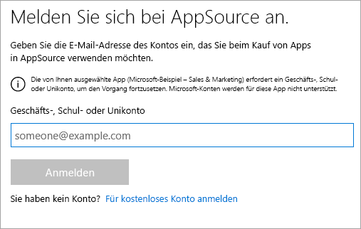
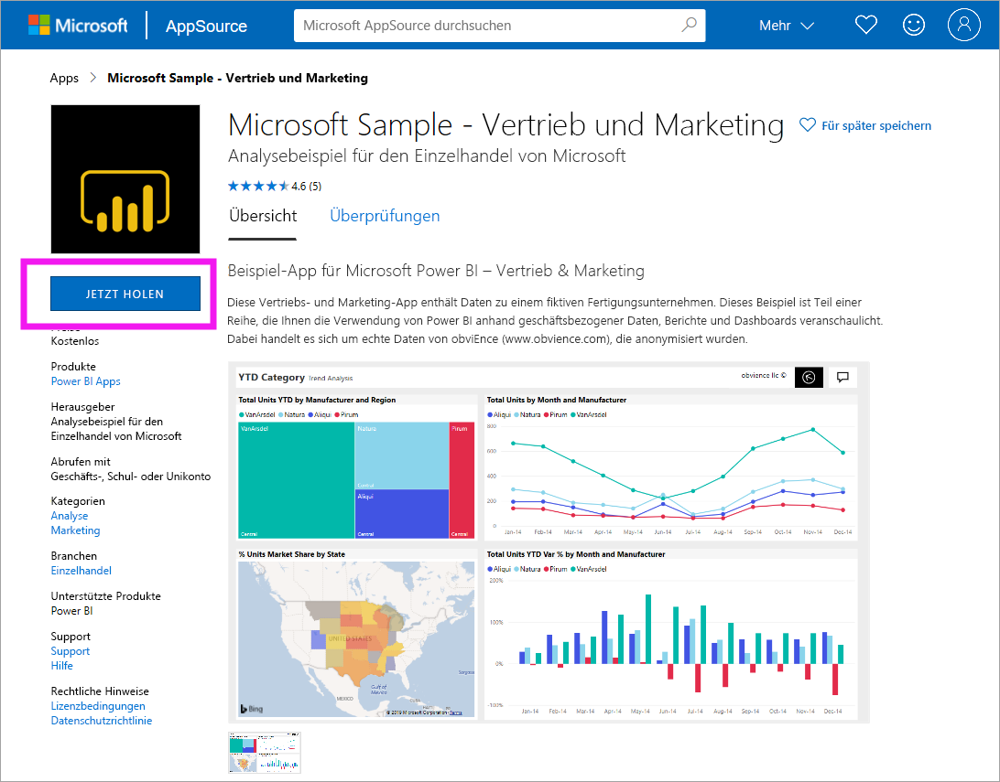
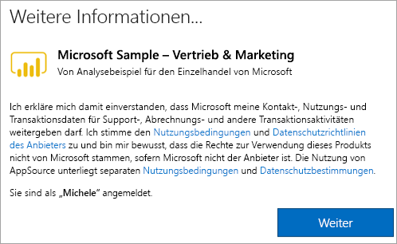
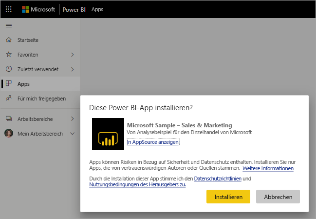
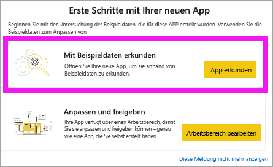

# Installieren und Verwenden der Beispiel-„Vertrieb und Marketing“-App im Power BI-Dienst

[!INCLUDE[consumer-appliesto-yyny](../includes/consumer-appliesto-yyny.md)]

Da Sie nun über [grundlegende Kenntnisse zum Erhalten von Power BI-Inhalten](end-user-app-view.md) verfügen, können Sie sich die „Vertrieb und Marketing“-App von Microsoft AppSource (appsource.com) holen. 

## Microsoft AppSource (appsource.com)
Hier finden Sie den Link zur App: [„Vertrieb und Marketing“-App](https://appsource.microsoft.com/product/power-bi/microsoft-retail-analysis-sample.salesandmarketingsample?tab=Overview). Wenn Sie diesen Link auswählen, wird die Downloadseite für diese App auf Microsoft AppSource geöffnet. 

1. Möglicherweise werden Sie aufgefordert, sich anzumelden, bevor Sie die App herunterladen können. Melden Sie sich mit derselben E-Mail-Adresse an, die Sie für Power BI verwenden. 

    

2. Wählen Sie **Jetzt anfordern** aus. 

    

3. Wenn Sie sich zum ersten Mal bei AppSource anmelden, müssen Sie den Nutzungsbedingungen zustimmen. 

    

4. Der Power BI-Dienst wird geöffnet. Bestätigen Sie, dass Sie diese App installieren möchten.

    

5. Im Power BI-Dienst wird eine Erfolgsmeldung angezeigt, sobald die App installiert wurde. Klicken Sie auf **Zu App wechseln**, um die App zu öffnen. Abhängig davon, wie der Designer die App erstellt hat, wird entweder das App-Dashboard oder der App-Bericht angezeigt.

    

    Sie können die App auch direkt über die Inhaltsliste Ihrer App öffnen, indem Sie auf **Apps** und anschließend auf **Sales & Marketing** klicken.

    

6. Wählen Sie aus, ob Sie Ihre neue App untersuchen oder anpassen und freigeben möchten. Da wir eine Beispiel-App von Microsoft ausgewählt haben, erkunden wir diese zunächst. 

    

7.  Die neue App wird mit einem Dashboard geöffnet. Der *Designer* der App hätte die App so erstellen können, dass sie stattdessen mit einem Bericht geöffnet wird.  

    

## Interagieren mit Dashboards und Berichten in der App
Nehmen Sie sich Zeit, die Daten auf den Dashboards und in den Berichten zu erkunden, aus denen die App besteht. Sie haben Zugriff auf alle standardmäßigen Power BI-Interaktionen wie Filtern, Hervorheben, Sortieren und Durchführen von Drilldowns.  Ist Ihnen der Unterschied zwischen Dashboards und Berichten noch nicht ganz klar?  Lesen Sie sich die Artikel zu [Dashboards](end-user-dashboards.md) und zu [Berichten](end-user-reports.md) durch.  

## Nächste Schritte
* [Zurück zur App-Übersicht](end-user-apps.md)
* [Anzeigen eines Power BI-Berichts](end-user-report-open.md)
* [Andere Möglichkeiten, wie Inhalte für Sie freigegeben werden](end-user-shared-with-me.md)
