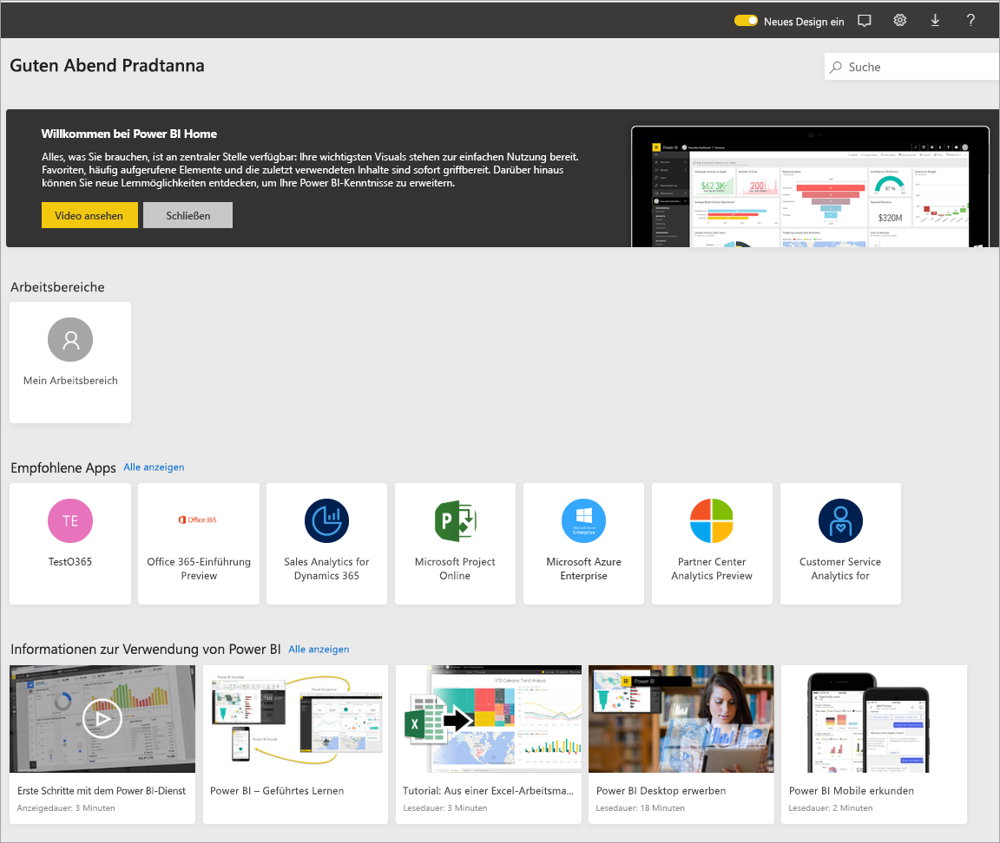
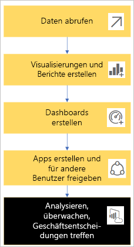
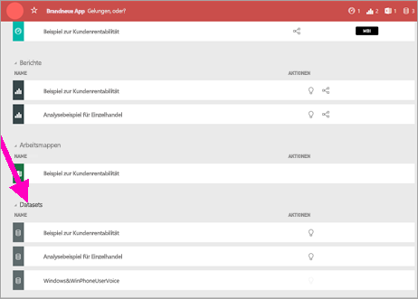
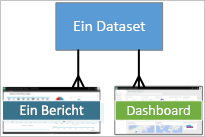
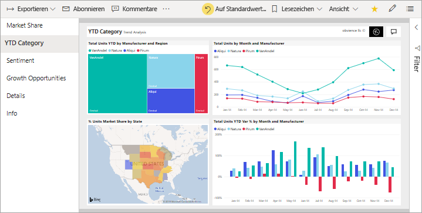
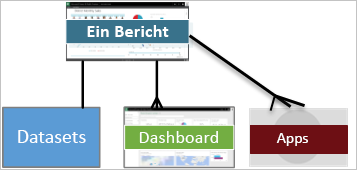
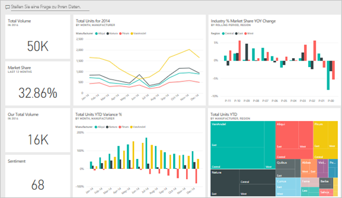
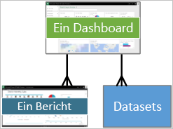
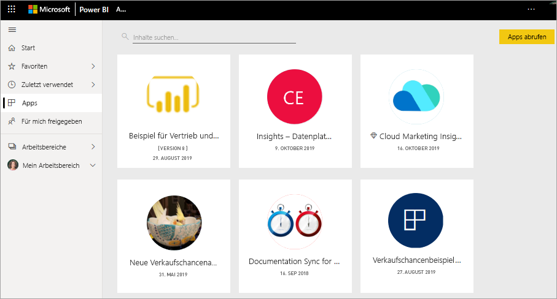
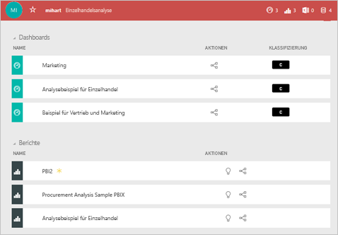

# Grundkonzepte für Benutzer des Power BI-Diensts

[!INCLUDE [power-bi-service-new-look-include](../includes/power-bi-service-new-look-include.md)]

In diesem Artikel wird davon ausgegangen, dass Sie bereits den Übersichtsartikel zu [Power BI](../fundamentals/power-bi-overview.md) gelesen haben und sich als [***Benutzer*** von Power BI](end-user-consumer.md) identifiziert haben. Benutzer erhalten Power BI-Inhalte wie Dashboards und Berichte von Kollegen. Benutzer nutzen den Power BI-Dienst, also die Website-basierte Version von Power BI.

Sie hören zweifellos den Begriff „Power BI Desktop“ oder einfach „Desktop“. Es ist das eigenständige Tool, das von *Designern* verwendet wird, die Dashboards und Berichte erstellen und mit Ihnen teilen. Sie müssen wissen, dass es andere Power BI-Tools gibt. Solange Sie ein Benutzer sind, arbeiten Sie nur mit dem Power BI-Dienst. Dieser Artikel bezieht sich nur auf den Power BI-Dienst.

## Terminologie und Konzepte

Dieser Artikel ist kein visueller Rundgang durch Power BI und auch kein praktisches Tutorial. Stattdessen ist es ein Übersichtsartikel, der Sie mit der Terminologie und den Konzepten von Power BI vertraut machen soll. Er soll Ihnen den Fachjargon und das Gelände zeigen. Eine Übersicht über den Power BI-Dienst und seine Navigation finden Sie unter [Schnellstart – Navigation im Power BI-Dienst](end-user-experience.md).

## Erstmaliges Öffnen des Power BI-Diensts

Die meisten Power BI-Benutzer nutzen den Power BI-Dienst, da 1) ihr Unternehmen Lizenzen kauft und 2) ein Administrator diese Lizenzen Mitarbeitern wie Ihnen zuweist.

Öffnen Sie als Erstes einen Browser, und geben Sie **app.powerbi.com** ein. Beim ersten Öffnen sieht der Power BI-Dienst etwa wie folgt aus:

Wenn Sie Power BI verwenden, werden Sie personalisieren, was Ihnen jedes Mal beim Öffnen der Website angezeigt wird. Manchen ist es zum Beispiel lieber, wenn Power BI mit der **Startseite** geöffnet wird, während andere lieber zuerst ein bevorzugtes Dashboard sehen möchten. Keine Sorge, in diesem Artikel erfahren Sie, wie Sie Ihre Umgebung personalisieren.

- [Einführung in Power BI Home und Globale Suche](https://powerbi.microsoft.com/blog/introducing-power-bi-home-and-global-search)

- [Ausgewählte Dashboards im Power BI-Dienst](end-user-featured.md)

Aber bevor wir fortfahren, sehen wir uns zuerst die Bausteine an, aus denen der Power BI-Dienst besteht.

_______________________________________________________

## Power BI-Inhalt

### Einführung in die Bausteine

Für Power BI-Benutzer gibt es 5 Bausteine: ***Visualisierungen***, ***Dashboards***, ***Berichte***, ***Apps*** und ***Datasets***. Diese werden manchmal als *Power BI*-***Inhalt*** bezeichnet. *Inhalt* ist in ***Arbeitsbereichen*** vorhanden. Ein typischer Workflow umfasst alle diese Bausteine: Ein Power BI-*Designer* (gelb im folgenden Diagramm) sammelt Daten aus *Datasets*, bringt sie für die Analyse in Power BI, erstellt *Berichte* voller *Visualisierungen*, die interessante Fakten und Erkenntnisse hervorheben, heftet Visualisierungen aus Berichten an ein Dashboard an und teilt die Berichte und Dashboards mit *Benutzern* wie Ihnen (schwarz im folgenden Diagramm). Der *Designer* teilt sie in Form von *Apps* oder anderen Arten freigegebener Inhalte.

Im Wesentlichen:

-  Eine ***Visualisierung*** (oder *visuelles Element*) ist ein von Power BI-*Designern* erstellter Diagrammtyp. Die visuellen Elemente zeigen die Daten aus *Berichten* und *Datasets* an. In der Regel erstellen *Designer* die Visuals in Power BI Desktop.

    Weitere Informationen finden Sie unter [Interagieren mit visuellen Elementen in Berichten, Dashboards und Apps](end-user-visualizations.md).

-  Ein *Dataset* ist ein Datencontainer. Es kann sich beispielsweise um eine Excel-Datei der Weltgesundheitsorganisation handeln. Es kann sich auch um eine firmeneigene Kundendatenbank oder eine Salesforce-Datei handeln.  

-  Ein *Dashboard* ist eine einzelne Anzeige mit interaktiven visuellen Elementen, Text und Grafiken. Ein Dashboard sammelt Ihre wichtigsten Metriken in einer Anzeige, um eine Geschichte zu erzählen oder eine Frage zu beantworten. Der Dashboardinhalt stammt aus einem oder mehreren Berichten und aus einem oder mehreren Datasets.

    Weitere Informationen finden Sie unter [Dashboards für Benutzer des Power BI-Diensts](end-user-dashboards.md).

-  Ein *Bericht* besteht aus einer oder mehreren Seiten mit interaktiven visuellen Elementen, Text und Grafiken, die gemeinsam einen Bericht bilden. Bei Power BI basiert ein Bericht auf einem einzelnen Dataset. Der Dienst arrangiert Berichtsseiten oft so, dass jede ein zentrales Interessengebiet anspricht oder eine einzelne Frage beantwortet.

    Weitere Informationen finden Sie unter [Berichte in Power BI](end-user-reports.md).

-  Mit einer *App* können *Designer* zusammengehörige Dashboards und Berichte bündeln und zusammen freigeben. *Benutzer* erhalten einige Apps automatisch, können aber nach weiteren Apps suchen, die Kollegen oder die Community erstellt haben. Zum Beispiel bieten externe Dienste wie Google Analytics und Microsoft Dynamics CRM, die Sie möglicherweise bereits verwenden, Power BI-Apps an.

Wenn Sie sich als neuer Benutzer zum ersten Mal in Power BI einloggen, sehen Sie jedoch noch keine Dashboards, Apps oder Berichte.

_______________________________________________________

## Datasets

Ein *Dataset* ist eine Sammlung von Daten, die *Designer* importieren oder zu denen sie eine Verbindung herstellen und dann damit Berichte und Dashboards erstellen. Als Benutzer werden Sie nicht direkt mit Datasets zu tun haben, aber es kann dennoch hilfreich sein zu wissen, welche Rolle sie in einem größeren Zusammenhang spielen.  

Jedes Dataset stellt eine einzelne Datenquelle dar. Die Quelle könnte z.B. eine Excel-Arbeitsmappe auf OneDrive, ein tabellarisches Dataset für lokale SQL Server Analysis Services oder ein Salesforce-Dataset sein. Power BI unterstützt viele verschiedene Datenquellen.

Wenn ein Designer eine App für Sie freigegeben hat, können Sie sehen, welche Datasets der Designer in die App einbezogen hat.

Ein Dataset...

- Kann immer wieder von einem Berichtsdesigner verwendet werden, um Dashboards und Berichte zu erstellen.

- Kann zum Erstellen vieler verschiedener Berichte verwendet werden.

- Visuelle Elemente dieses einen Datasets können auf vielen verschiedenen Dashboards angezeigt werden.

  

Weiter geht es mit dem nächsten Baustein: Visualisierungen.

_______________________________________________________

## Visualisierungen

Visualisierungen (auch als visuelle Elemente bezeichnet) zeigen Erkenntnisse an, die Power BI in den Daten ermittelt hat. Visualisierungen erleichtern das Interpretieren der Erkenntnis, da Ihr Gehirn ein Bild schneller verstehen kann als eine Tabelle mit Zahlen.

Einige der Visualisierungen, die Ihnen in Power BI begegnen, sind Wasserfalldiagramme, Bänderdiagramme, Treemaps, Kreisdiagramme, Trichterdiagramme, Karten, Punkt- und Blasendiagramme sowie Messgerätdiagramme.

   

Hier finden Sie eine vollständige Liste der [Visualisierungstypen in Power BI](../power-bi-visualization-types-for-reports-and-q-and-a.md).

Als *benutzerdefinierte visuelle Elemente* bezeichnete Visualisierungen werden auch von der Community zur Verfügung gestellt. Wenn Sie einen Bericht mit einem Visual erhalten und dieses nicht erkennen, handelt es sich wahrscheinlich um ein benutzerdefiniertes Visual. Wenn Sie Hilfe beim Interpretieren des benutzerdefinierten visuellen Elements benötigen, können Sie den Namen des *Designers* des Berichts oder Dashboards suchen und ihn oder sie kontaktieren.

Eine Visualisierung in einem Bericht...

- Kann mehrmals im gleichen Bericht angezeigt werden.

- Kann auf vielen verschiedenen Dashboards angezeigt werden.

_______________________________________________________

## Berichte

Ein Power BI-Bericht besteht aus einer oder mehreren Seiten mit Visualisierungen, Grafiken und Text. Alle Visualisierungen in einem Bericht stammen aus einem einzelnen Dataset. *Designer* geben Berichte für *Benutzer* frei, die [mit den Berichten in der *Leseansicht* interagieren](end-user-reading-view.md).

Ein Bericht...

- Kann mehreren Dashboards zugeordnet werden (die von diesem Bericht angehefteten Kacheln können auf mehrere Dashboards angezeigt werden).

- Kann mithilfe der Daten aus nur einem Dataset erstellt werden.  

- Kann Teil mehrerer Apps sein.

  

_______________________________________________________

## Dashboards

Ein Dashboard stellt eine angepasste Ansicht einer Teilmenge des/der zugrunde liegenden Datasets dar. *Designer* erstellen Dashboards und geben sie für *Benutzer* frei – entweder einzeln oder als Teil einer App. Ein Dashboard ist ein einzelner Zeichenbereich, der *Kacheln*, Grafiken und Text enthält.

  

Eine Kachel ist ein Rendering eines visuellen Elements, das ein *Designer* zum Beispiel aus einem Report an ein Dashboard *anheftet*. Jede angeheftete Kachel zeigt eine [Visualisierung](end-user-visualizations.md) an, die ein Designer aus einem Dataset erstellt und an dieses Dashboard angeheftet hat. Eine Kachel kann auch eine komplette Berichtsseite, Livestreamingdaten oder ein Video enthalten. Es gibt viele Möglichkeiten, wie *Designer* Dashboards Kacheln hinzufügen können. Es sind zu viele, um sie in diesem allgemeinen Artikel zu behandeln. Weitere Informationen finden Sie unter [Dashboardkacheln in Power BI](end-user-tiles.md).

Benutzer können keine Dashboards bearbeiten. Sie können jedoch Kommentare hinzufügen, verwandte Daten anzeigen, Dashboards als Favorit speichern, sie abonnieren und vieles mehr.

Was sind die Funktionen von Dashboards?  Hier nur einige davon:

- Sie können auf einen Blick alle Informationen erkennen, die zum Treffen von Entscheidungen erforderlich sind.

- Sie können die wichtigsten unternehmensbezogenen Informationen überwachen.

- Sie können sicherstellen, dass sich alle Kollegen auf derselben Seite befinden und dabei dieselben Informationen anzeigen und verwenden.

- Sie können die Integrität eines Geschäfts, Produkts, Unternehmensbereichs oder einer Marketingkampagne usw. überwachen.

- Sie können eine personalisierte Ansicht eines umfangreicheren Dashboards erstellen, das alle für Sie erforderlichen Metriken enthält.

**EIN** Dashboard...

- kann Visualisierungen von verschiedenen Datasets anzeigen.

- kann Visualisierungen von verschiedenen Berichten anzeigen.

- kann Visualisierungen anzeigen, die aus anderen Tools (z.B. Excel) angeheftet wurden.

  

_______________________________________________________

## Apps

Diese Sammlungen von Dashboards und Berichten organisieren verwandte Inhalte in einem einzigen Paket. Power BI-*Designer* erstellen sie und geben sie für Einzelpersonen, Gruppen, eine ganze Organisation oder öffentlich frei. Als Benutzer können Sie sich darauf verlassen, dass Sie und Ihre Kollegen mit denselben Daten arbeiten – einer einzigen vertrauenswürdigen Version der Wahrheit.

Apps lassen sich im [Power BI-Dienst](https://powerbi.com) und auf Ihrem Mobilgerät einfach finden und installieren. Nachdem Sie eine App installiert haben, müssen Sie sich nicht die Namen der vielen verschiedenen Dashboards merken. Sie sind alle zusammen in einer App, in Ihrem Browser oder auf Ihrem mobilen Gerät.

Diese App verfügt über drei verwandte Dashboards und drei verwandte Berichte, die zusammen eine App bilden.

In Apps sehen Sie bei jeder Veröffentlichung von Updates durch den Ersteller die Änderungen. Der Ersteller steuert außerdem den Zeitplan, nach dem Power BI die Daten aktualisiert. Sie müssen sich nicht darum kümmern, sie auf dem neuesten Stand zu halten.

Sie können Apps auf unterschiedliche Weise erhalten:

- Der App-Designer kann die App automatisch in Ihrem Power BI-Konto installieren.

- Der Designer einer App kann Ihnen einen direkten Link zur App senden.

- Sie können in [Microsoft AppSource](https://appsource.microsoft.com/marketplace/apps?product=power-bi) nach Apps suchen. Dort werden alle Apps angezeigt, die Sie verwenden können.

In Power BI auf Ihrem Mobilgerät können Sie Apps nur über einen Direktlink und nicht aus AppSource installieren. Wenn der Designer der App diese automatisch installiert, wird sie in der Liste der Apps angezeigt.

Sobald Sie die App installiert haben, können Sie sie einfach aus der Liste der Apps auswählen und angeben, welches Dashboard oder welcher Bericht zuerst geöffnet und erkundet werden soll.

Hoffentlich hat Ihnen dieser Artikel einen guten Einblick in die Bausteine gegeben, aus denen der Power BI-Dienst für Benutzer besteht.

## Nächste Schritte

- Das [Glossar](end-user-glossary.md) überprüfen und Lesezeichen setzen

- Sich einen [Überblick über den Power BI-Dienst](end-user-experience.md) verschaffen

- Die Übersicht [Power BI für Verbraucher](end-user-consumer.md) lesen

- Ein Video ansehen, in dem Will einen Überblick über den Power BI-Dienst gibt und die grundlegenden Konzepte erklärt.

    <iframe width="560" height="315" src="https://www.youtube.com/embed/B2vd4MQrz4M" frameborder="0" allowfullscreen></iframe>
