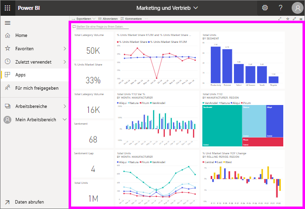

# Anzeigen eines Dashboards

[!INCLUDE[consumer-appliesto-ynny](../includes/consumer-appliesto-ynny.md)]

[!INCLUDE [power-bi-service-new-look-include](../includes/power-bi-service-new-look-include.md)]

*Benutzer* von Power BI verbringen viel Zeit damit, Dashboards anzuzeigen. Dashboards sind darauf ausgelegt, spezifische Informationen aus den zugrunde liegenden Berichten und Datasets hervorzuheben. Und Power BI-Benutzer verwenden diese Informationen zum Nachverfolgen, Überwachen, Beantworten von Fragen, zu Testzwecken und mehr – um datenbasierte Geschäftsentscheidungen zu treffen.

Sowohl für das Teilen von Dashboards als auch für das Aufrufen von geteilten Dashboards ist eine Power BI Pro- oder eine Power BI Premium-Lizenz erforderlich. [So ermitteln Sie Ihren Lizenztyp](end-user-license.md) 

## Öffnen eines Dashboards

|              |         |
|------------|--------------------------------|
|      |Dashboards lassen sich von zahlreichen Orten im Power BI-Dienst öffnen.   Suchen Sie nach diesem Dashboardsymbol. Sobald Sie ein Dashboard  gefunden haben, ist das Öffnen einfach. Klicken Sie darauf, und das Dashboard wird in Ihrer Power BI-Canvas angezeigt. |
|                    |          |

Sie können Dashboards in allen im Navigationsbereich angezeigten Containern finden. 

- **Startseite** 
- **Favoriten** – falls Sie [ein Dashboard als Favorit festgelegt haben](end-user-favorite.md).
- **Zuletzt verwendet** – falls Sie zuletzt ein Dashboard besucht haben.
- **Apps** – die meisten Apps enthalten sowohl Dashboards als auch Berichte.
- **Für mich freigegeben** – wenn ein Kollege [ein Dashboard für Sie freigegeben hat](end-user-shared-with-me.md).
- **Mein Arbeitsbereich** – wenn Sie eins der [Power BI-Beispiele](../create-reports/sample-datasets.md) heruntergeladen haben.

## Weitere Schritte
* Machen Sie sich mit Dashboards vertraut, indem Sie sich eine Tour durch eines unserer [Beispiel-Dashboards](../create-reports/sample-tutorial-connect-to-the-samples.md) ansehen.    
* Informieren Sie sich über [Dashboardkacheln](end-user-tiles.md), und erfahren Sie, wie Sie damit interagieren.
