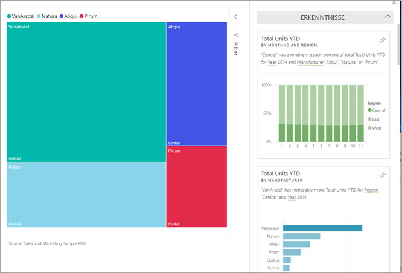
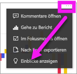
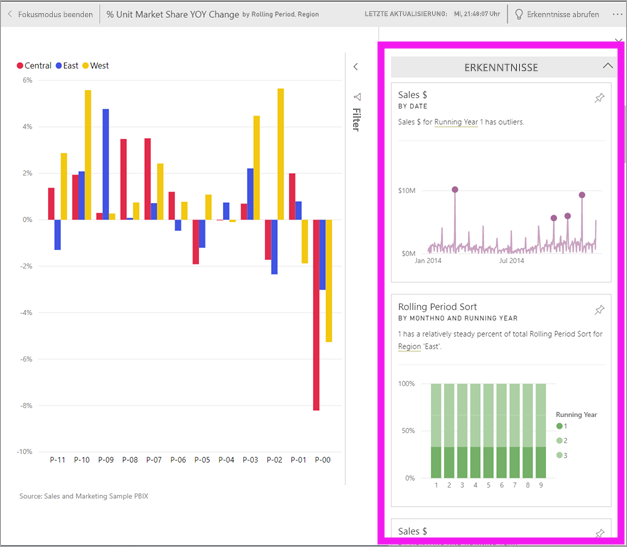
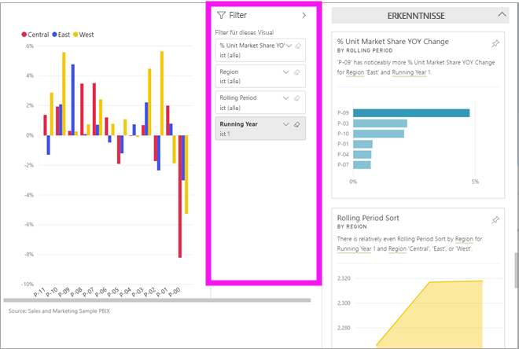
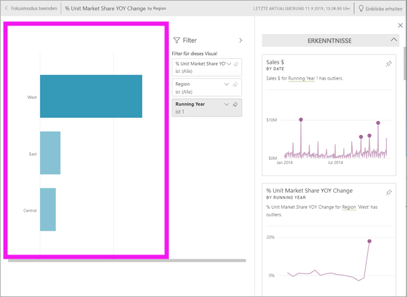
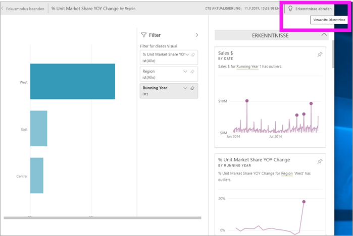

# Anzeigen von Einblicken auf Dashboardkacheldaten mit Power BI

[!INCLUDE[consumer-appliesto-yyny](../includes/consumer-appliesto-yyny.md)]

Jede [Kachel](end-user-tiles.md) eines Visuals in Ihrem Dashboard ist ein Ausgangspunkt für das Durchsuchen von Daten. Wenn Sie eine Kachel auswählen, wird ein Bericht oder [Q&A geöffnet](end-user-q-and-a.md), in dem Sie filtern und sortieren und das dem Bericht zugrunde liegende Dataset detailliert analysieren können. Und wenn Sie Einblicke ausführen, erledigt Power BI das Durchsuchen der Daten für Sie.

Führen Sie Einblicke aus, um interessante interaktive Visuals auf Grundlage Ihrer Daten zu generieren. Einblicke können für eine bestimmte Dashboardkachel ausgeführt werden, und Sie können sogar Einblicke für einen Einblick durchführen.

Das Feature „Einblicke“ basiert auf einer wachsenden [Reihe erweiterter analytischer Algorithmen](end-user-insight-types.md), die in Verbindung mit Microsoft Research entwickelt wurden. Wir möchten damit auch in Zukunft noch mehr Benutzern auf neue und intuitive Weise Einblicke in ihre Daten bieten.

## Ausführen von Einblicken auf einer Dashboardkachel
Wenn Sie Einblicke für eine Dashboardkachel ausführen, durchsucht Power BI nur die Daten, die zum Erstellen dieser einzelnen Dashboardkachel verwendet wurden. 

1. [Öffnen Sie ein Dashboard](end-user-dashboards.md).
2. Zeigen Sie auf eine Kachel. Wählen Sie **Weitere Optionen** (...) und dann **Erkenntnisse anzeigen** aus. 

    

3. Die Kachel wird im [Fokusmodus](end-user-focus.md) geöffnet. Die Einblickkarten werden rechts angezeigt.    
   
        
4. Ist einer der Einblicke für Sie interessant? Wählen Sie die entsprechende Einblickkarte aus, um weitere Informationen zu erhalten. Der ausgewählte Einblick wird auf der linken Seite angezeigt, und neue Einblickkarten (ausschließlich abhängig von den Daten in diesem Einblick) werden rechts angezeigt.    

 ## Interaktion mit Karten für Einblicke
Wenn Sie einen Einblick geöffnet haben, können Sie ihn weiter durchsuchen.

   * Filtern Sie das Visual im Zeichenbereich.  Um die Filter anzuzeigen, wählen Sie in der oberen rechten Ecke das Pfeilsymbol aus, um den Filterbereich zu erweitern.

      
   
   * Führen Sie Einblicke für die Karte „Einblick“ selbst aus. Dies wird häufig auch als **verwandte Einblicke** bezeichnet. Wählen Sie eine Insight-Karte aus, um sie zu aktivieren. Sie wird im Berichtszeichenbereich angezeigt.
   
      
   
   * Wählen Sie in der oberen rechten Ecke das Glühbirnensymbol  oder **Einblicke erhalten** aus. Der Einblick wird auf der linken Seite angezeigt, und neue Karten (ausschließlich abhängig von den Daten in diesem Einblick) werden rechts angezeigt.
     
     
     
Um zu Ihrem Bericht zurückzukehren, wählen Sie in der oberen linken Ecke **Fokusmodus beenden** aus.

## Zu beachtende Aspekte und Problembehandlung
- **Einblicke anzeigen** funktioniert nicht mit allen Arten von Dashboardkacheln. Beispielsweise ist diese Option nicht für Power BI-Visuals verfügbar.<!--[Power BI visuals](end-user-custom-visuals.md)-->

## Nächste Schritte
Erfahren Sie mehr über die [Typen verfügbarer schneller Einblicke](end-user-insight-types.md).

