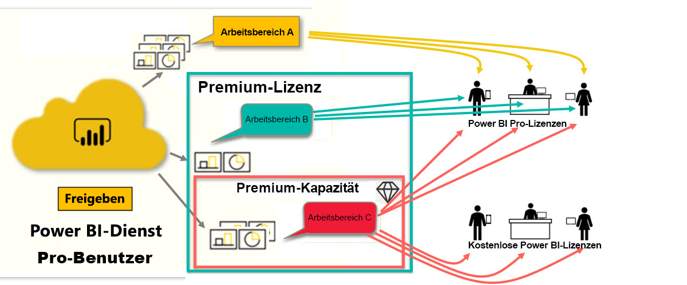

# Lizenzoptionen für Power BI
*Benutzer* verwenden den Power BI-Dienst zum Analysieren von Berichten und Dashboards, um fundierte Entscheidungen für ihr Unternehmen zu treffen. Wenn Sie schon Erfahrung im Umgang mit Power BI haben oder sich mit den *Designern* in Ihrem Unternehmen über dieses Tool unterhalten haben, ist Ihnen möglicherweise schon aufgefallen, dass es einige Features gibt, die nur mit bestimmten Lizenzen funktionieren. 

In diesem Artikel werden die Unterschiede der folgenden Lizenzoptionen und -kombinationen erläutert: Free, Pro, Premium und Premium-Kapazität. Außerdem erfahren Sie, wie Sie herausfinden können, welche Lizenzkombination Sie verwenden.  

Zunächst werden die beiden verfügbaren Lizenzkategorien thematisiert: Benutzerlizenzen und Organisationslizenzen. Unser Ausgangspunkt sind die mit den Lizenzen verfügbaren Standardfunktionen. Dann sehen wir uns an, wie der Power BI-Administrator und die Inhaltsbesitzer Rollen und Berechtigungen dazu nutzen können, die Standardlizenzfunktionen zu ändern. 

Beispiel: Auch wenn Ihre Lizenz bestimmte Aufgaben zulässt, wie den Export von Daten, Abfragen in natürlicher Sprache oder Veröffentlichung im Internet, kann Ihr Administrator Ihre Möglichkeiten einschränken. Und wenn ein *Berichtsdesigner* einem Arbeitsbereich Inhalte zuweist, kann er Ihnen eine Arbeitsbereichsrolle zuweisen. Die Rollen bestimmen, was Sie in diesem Arbeitsbereich tun können und was nicht. Der *Designer* kann die Grenzen Ihrer Lizenz mithilfe von Berechtigungseinstellungen weiter anpassen. Das ist alles gar nicht so einfach. Hoffentlich wird dieser Artikel die meisten, wenn nicht sogar alle Unklarheiten beseitigen.

## Benutzerlizenzen
Der erste Lizenztyp ist eine **Benutzerlizenz**. Jeder Power BI-Dienstbenutzer verfügt entweder über eine Free- oder Pro-Lizenz. Bestimmte Features sind für Benutzer mit Pro-Lizenz reserviert.  

- Benutzer mit einer **Power BI Pro-Lizenz** können mit anderen Pro-Benutzern zusammenarbeiten, indem sie Inhalte erstellen und freigeben. Nur Benutzer mit einer Pro-Lizenz können Berichte veröffentlichen, Dashboards und Berichte abonnieren und mit Kollegen in Arbeitsbereichen zusammenarbeiten. 

    

    Power BI Pro wird als Einzelbenutzerlizenz bereitgestellt, die Benutzern das Lesen von und Interagieren mit Berichten und Dashboards ermöglicht, die andere im Power BI-Dienst veröffentlicht haben. Benutzer mit diesem Lizenztyp können Inhalte freigeben und mit anderen Power BI Pro-Benutzern zusammenarbeiten. Nur Power BI Pro-Benutzer können Inhalte veröffentlichen oder für andere Benutzer freigeben und Inhalte nutzen, die von anderen Benutzern erstellt wurden. Es sei denn, diese Inhalte werden in [Power BI Premium-Kapazität](#understanding-premium-and-premium-capacity) gehostet. Pro-Lizenzen werden in der Regel von *Berichts-Designern* und Entwicklern verwendet. Weitere Informationen finden Sie unter [Power BI Premium-Kapazität](#understanding-premium-and-premium-capacity) weiter unten.

- **Eigenständige Power BI Free-Lizenzen** sind zwar auch sehr nützlich, eignen sich aber eher für die Einarbeitung in Power BI oder für Benutzer, die nur Inhalte für den eigenen Bedarf erstellen. [Registrieren Sie sich als Einzelperson für den Power BI-Dienst](../service-self-service-signup-for-power-bi.md). Eine eigenständige Free-Lizenz ist nicht mit einer Organisationslizenz verknüpft. 

    Eigenständige Benutzerlizenzen im Free-Tarif eignen sich ausgezeichnet für Benutzer, die Beispiele von Microsoft verwenden, um Power BI kennenzulernen. Benutzer mit eigenständiger Free-Lizenz können keine von anderen Benutzern freigegebenen Inhalte abrufen oder ihre eigenen Inhalte mit anderen Power BI-Benutzern teilen. 

    

Ist das soweit verständlich?  OK. Im folgenden Abschnitt erhalten Sie Informationen zu **Premium-Kapazitäten**.

## Grundlegendes zu Premium und Premium-Kapazität
Premium ist eine **Organisationslizenz**. Stellen Sie sich für Premium vor, Sie fügen allen Power BI- **Benutzerlizenzen** in einer Organisation eine Ebene zusätzlicher Features und Funktionen hinzu. 

Wenn eine Organisation eine Premium-Lizenz erwirbt, weist der Administrator in der Regel allen Mitarbeitern, die Inhalte erstellen und freigeben, eine Pro-Lizenz zu. Außerdem weist der Administrator allen Benutzern, die die Inhalte verwenden, Free-Lizenzen zu. Die Pro-Benutzer erstellen [ Arbeitsbereiche](end-user-workspaces.md) und fügen diesen Arbeitsbereichen Inhalte (Dashboards, Berichte, Apps) hinzu. Um anderen die Zusammenarbeit in diesen Arbeitsbereichen zu ermöglichen, verwenden die Pro-Benutzer eine Kombination aus *Kapazität*, Berechtigungen und Rollen. 

Wenn eine Organisation eine Premium-Lizenz erwirbt, wird ihr im Power BI-Dienst Kapazität exklusiv zugeteilt. Die Kapazität wird nicht geteilt. Die Kapazität wird von dedizierter Hardware unterstützt, die von Microsoft vollständig verwaltet wird. Organisationen können wählen, ob sie die ihnen zugewiesene Kapazität auf breiter Basis nutzen oder ob sie bestimmten Arbeitsbereichen zuteilen. Ein Arbeitsbereich in einer Premium-Kapazität ist ein Bereich, in dem Pro-Benutzer mit Free-Benutzern zusammenarbeiten und Informationen austauschen können, ohne dass die Free-Benutzer über Pro-Konten verfügen müssen.  

In Premium-Kapazität sind für Inhaltsdesigner weiterhin Pro-Lizenzen erforderlich. Designer stellen Verbindungen mit Datenquellen her, modellieren Daten und erstellen Berichte und Dashboards, die als Arbeitsbereichs-Apps gepackt werden. Benutzer ohne Pro-Lizenz können weiter auf einen Arbeitsbereich zugreifen, der sich in Power BI Premium befindet, solange sich dieser Inhalt in Premium-*Kapazität* befindet und der Besitzer des Arbeitsbereichs ihnen die Berechtigung dafür erteilt.

In der Abbildung unten stellt die linke Seite Pro-Benutzer dar, die Inhalte in Arbeitsbereichen erstellen und freigeben.  
- **Arbeitsbereich A** wurde in einer Organisation erstellt, die nicht über Premium verfügt. 

- **Arbeitsbereich B** wurde in einer Organisation erstellt, die über eine Premium-Lizenz verfügt, obwohl dieser spezielle Arbeitsbereich nicht in Premium-Kapazität gespeichert wurde. Der Arbeitsbereich weist nicht das Diamantsymbol auf.

- **Arbeitsbereich C** wurde in einer Organisation mit Premium-Lizenz erstellt und in Premium-Kapazität gespeichert. Dieser Arbeitsbereich weist ein Diamantsymbol auf.  

Der Power BI Pro-*Designer* kann mit anderen Pro-Benutzern, die einen der drei Arbeitsbereiche verwenden, zusammenarbeiten und Informationen mit ihnen teilen. Dies gilt, solange der Designer den Arbeitsbereich mit der gesamten Organisation gemeinsam nutzt oder den Pro-Benutzern Arbeitsbereichsrollen zuweist. 

Der Power BI Pro-*Designer* kann nur mit Free-Benutzern, die Arbeitsbereich C nutzen, zusammenarbeiten und Informationen teilen. Der Arbeitsbereich muss Premium-Kapazität zugewiesen werden, damit Free-Benutzer auf den Arbeitsbereich zugreifen können. Innerhalb des Arbeitsbereichs weist der Designer den Beteiligen Rollen zu: *Administrator*, *Mitglied*, *Mitwirkender* oder *Anzeigender Benutzer*. Ihre Rolle bestimmt, welche Aktionen in Ihrem Arbeitsbereich möglich sind. Power BI-*Consumern* wird in der Regel die Rolle *Anzeigender Benutzer* zugewiesen. Weitere Informationen finden Sie unter [Arbeitsbereiche für Power BI-Consumer](end-user-workspaces.md).

## Ermitteln Ihrer Lizenz
Es gibt mehrere Möglichkeiten, Informationen zu Ihrer Power BI-Lizenz zu suchen. 

Finden Sie zunächst heraus, welche **Benutzerlizenz** Ihnen zugewiesen ist.

- Bestimmte Versionen von Microsoft Office umfassen eine Power BI Pro-Lizenz.  Sie können herausfinden, ob Ihre Office-Version Power BI umfasst, indem Sie das [Office-Portal](https://portal.office.com/account) aufrufen und auf **Abonnements** klicken.

    Der erste Benutzer, Pradtanna, verfügt über eine Office 365 E5-Lizenz, die eine Power BI Pro-Lizenz umfasst.

    

    Dieser zweite Benutzer, Zalan, verfügt über eine Power BI Free-Lizenz. 

    

Überprüfen Sie als Nächstes, ob Ihrem Konto eine Premium-Lizenz zugewiesen ist. Alle oben genannten Benutzer, egal ob im Pro- oder im Free-Tarif, können einer Organisation mit Premium-Lizenz angehören.  Sehen wir uns den zweiten Benutzer, Zalan, genauer an.  

- Klicken Sie im Power BI-Dienst erst auf **Mein Arbeitsbereich** und dann in der oberen rechten Ecke auf das Zahnradsymbol. Klicken Sie auf **Persönlichen Speicher verwalten**.

    

    Allen **Benutzerlizenzen**, ob im Pro- oder Free-Tarif, stehen 10 GB Speicherplatz in der Cloud zur Verfügung, der zum Hosten von Power BI-Berichten und Excel-Arbeitsmappen verwendet werden kann. Wenn mehr als 10 GB angezeigt werden, sind Sie Mitglied eines Organisationskontos mit Premium-Lizenz.

    

    Zur Erinnerung: Wir haben auf der Seite des Office-Portals herausgefunden, dass Zalan ein Benutzerabonnement für Power BI Free hat. Aber da seine Organisation eine Premium-Lizenz erworben hat, ist Zalan im Power BI-Dienst nicht auf 10 GB Speicher beschränkt, sondern kann 100 GB nutzen. Als *Consumer* in einer Organisation mit Premium-Lizenz hat Zalan, solange der *Designer* den Arbeitsbereich in Premium-Kapazität platziert, die Möglichkeit, freigegebene Inhalte anzuzeigen, mit Kollegen zusammenzuarbeiten, mit Apps zu arbeiten und vieles mehr. Der Berechtigungsumfang wird vom Power BI-Administrator und Inhaltsdesigner festgelegt. Beachten Sie, dass ein Pro-Benutzer bereits einen Arbeitsbereich für Zalan freigegeben hat. Das Diamantsymbol informiert ihn, dass dieser Arbeitsbereich in Premium-Kapazität gespeichert ist. 

   
## Grundlegendes zu Arbeitsbereichsrollen
Bislang haben wir Benutzerlizenzen, Premium-Lizenzen und Premium-Kapazität kennengelernt. Als Nächstes beschäftigen wir uns mit *Arbeitsbereichsrollen*.

Da sich dieser Artikel an Power BI-*Consumer* richtet, haben wir folgendes Szenario:

-  Sie sind ein *Free*-Benutzer in einer Organisation mit Power BI Premium-Lizenz. 
- Ein Power BI Pro-Benutzer hat eine Sammlung von Dashboards und Berichten erstellt und diese Sammlung in Ihrer gesamten Organisation als *App* veröffentlicht.  
- Apps befinden sich in *Arbeitsbereichen* und der Arbeitsbereich in Premium-Kapazität.    
- Dieser App-Arbeitsbereich enthält ein Dashboard und zwei Berichte.
- Der Pro-Benutzer hat uns die Rolle **Anzeigender Benutzer** zugewiesen.

### Die Rolle „Anzeigender Benutzer“
Mit Rollen können Power BI-*Designer* verwalten, wer was in einem Arbeitsbereich erledigen darf, sodass Teams zusammenarbeiten können. Eine dieser Rollen ist **Anzeigender Benutzer**. 

Wenn sich der Arbeitsbereich in einer Power BI Premium-Kapazität befindet, können Benutzer mit der Rolle „Anzeigender Benutzer“ auch dann auf den Arbeitsbereich zugreifen, wenn sie keine Power BI Pro-Lizenz besitzen. Da die Rolle „Anzeigender Benutzer“ jedoch nicht auf die zugrunde liegenden Daten zugreifen oder diese exportieren kann, ist es eine sichere Möglichkeit, mit Dashboards, Berichten und Anwendungen zu interagieren.

> [!TIP]
> Weitere Informationen zu den anderen Rollen (Administrator, Mitglied und Mitwirkender) finden Sie unter [Erstellen eines neuen Arbeitsbereichs](../service-new-workspaces.md).

