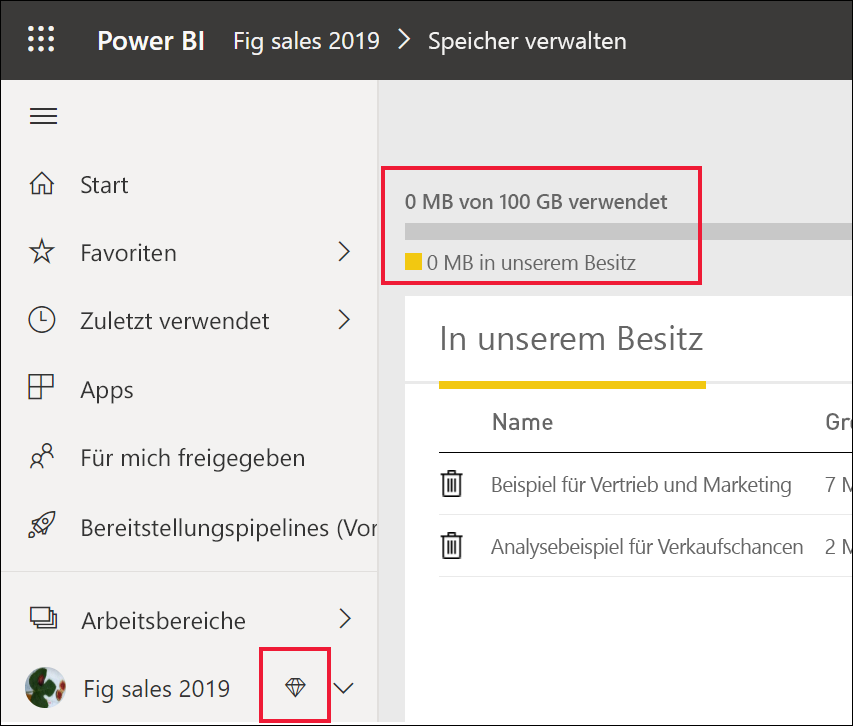

# Verwenden des Power BI-Dienst als *Anwender*

[!INCLUDE[consumer-appliesto-ynnn](../includes/consumer-appliesto-ynnn.md)]

[*Anwender*](end-user-consumer.md) verwenden den Power BI-Dienst zum Analysieren von Berichten und Dashboards, um fundierte, datengestützte Entscheidungen für ihr Unternehmen zu treffen. Wenn Sie schon Erfahrung im Umgang mit Power BI haben oder sich mit den *Designern* in Ihrem Unternehmen über dieses Tool unterhalten haben, ist Ihnen möglicherweise schon aufgefallen, dass es einige Features gibt, die nur mit bestimmten Lizenzen, Abonnements oder Berechtigungen funktionieren. 

Ihre Möglichkeiten im Power BI-Dienst hängen von den drei folgenden Faktoren ab:
-    verwendete Lizenz- und Abonnementtypen
-    Speicherort der Inhalte
-    die Ihnen zugewiesenen Rollen und Berechtigungen

In diesem Artikel werden die Funktionen der einzelnen Lizenztypen beschrieben. Außerdem wird erläutert, *wie und wo Inhalte gespeichert* werden und *wie Sie mit diesen arbeiten können*. Außerdem erfahren Sie, wie Sie Ihre Lizenz und Ihr Abonnement überprüfen und ermitteln können, wo Ihre Inhalte gespeichert sind. Weitere Informationen zu Rollen und Berechtigungen finden Sie unter [Arbeitsbereichrollen](end-user-workspaces.md).

## Lizenzen

Jeder Benutzer des Power BI-Diensts verwendet entweder eine *kostenlose* Lizenz oder eine *Pro*-Lizenz. Wenn Sie *Power BI-Anwender*sind, verwenden Sie wahrscheinlich eine kostenlose Lizenz, die von Ihrem Administrator verwaltet wird. 

Es ist möglich, mehr als eine Lizenz gleichzeitig zu besitzen.  Im Dienst können Sie immer den Umfang der höchsten Lizenz nutzen, die Sie aktuell besitzen. 

## Power BI Premium-Kapazität

Das Premium-Abonnement richtet sich an Unternehmen und bietet eine andere Möglichkeit zum Speichern von Inhalten: in einer dedizierten Kapazität. Mit Premium kann jeder Benutzer – innerhalb und außerhalb Ihrer Organisation – Ihre Power BI-Inhalte anzeigen, ohne Power BI Pro-Einzellizenzen erwerben zu müssen. 

Premium ermöglicht das weiträumige Verteilen von Inhalten durch Power BI Pro-Benutzer, und für Benutzer, die die Inhalte nur anzeigen, sind keine Pro-Lizenzen erforderlich. Pro-Lizenzen sind für Inhaltsdesigner erforderlich. Designer stellen Verbindungen mit Datenquellen her, modellieren Daten und erstellen Berichte und Dashboards, die als Arbeitsbereichs-Apps gepackt werden. Benutzer ohne Pro-Lizenz haben als Viewer dennoch Zugriff auf einen Arbeitsbereich, der zur Power BI Premium-Kapazität gehört.

Innerhalb dieser Arbeitsbereiche weisen Designer Rollen wie **Anzeigender Benutzer**, **Mitwirkender**, **Mitglieder**und **Administrator** zu, die festlegen, in welchem Umfang Kollegen mit dem Inhalt interagieren können. Weitere Informationen finden Sie unter [Arbeitsbereichberechtigungen und -rollen](end-user-workspaces.md). 

Weitere Informationen zur Premium-Kapazität finden Sie unter [Was ist Microsoft Power BI Premium?](../service-premium-what-is.md).

## Ermitteln Ihrer Lizenzen

Rufen Sie die [Microsoft-Seite **Mein Konto**](https://portal.office.com/account) auf, um nachzusehen, welche Lizenzen Ihnen zugewiesen sind.  Wählen Sie die Registerkarte **Abonnements** aus.

Der erste Benutzer, Pradtanna, verfügt über eine Office 365 E5-Lizenz, die eine Power BI Pro-Lizenz umfasst.

Dieser zweite Benutzer, Zalan, verfügt über eine Power BI Free-Lizenz. 

## Überprüfen des Zugriffs auf die Premium-Kapazität

Überprüfen Sie als Nächstes, ob Ihre Organisation die Premium-Kapazität nutzen kann. Alle oben genannten Benutzer, egal ob im Pro- oder im Free-Tarif, können einer Organisation mit einer Premium-Kapazität angehören.  Sehen wir uns den zweiten Benutzer, Zalan, genauer an.  

Sie können ermitteln, ob Zalans Organisation eine Premium-Kapazität besitzt, indem Sie die verfügbare Speichermenge nachschlagen. 

- Klicken Sie im Power BI-Dienst erst auf **Mein Arbeitsbereich** und dann in der oberen rechten Ecke auf das Zahnradsymbol. Klicken Sie auf **Persönlichen Speicher verwalten**.

    

    Wenn mehr als 10 GB angezeigt werden, sind Sie Mitglied einer Organisation mit einem Premium-Abonnement. Die folgende Abbildung zeigt, dass Zalans Organisation bis zu 100 GB Speicher nutzen kann.  

    

Beachten Sie, dass ein Pro-Benutzer bereits einen Arbeitsbereich für Zalan freigegeben hat. Das Diamantsymbol gibt an, dass dieser Arbeitsbereich in der Premium-Kapazität gespeichert ist. 

## Identifizieren von in der Premium-Kapazität gehosteten Inhalten

Sie können auch herausfinden, ob Ihre Organisation eine Premium-Kapazität besitzt, indem Sie nach Apps und App-Arbeitsbereichen mit Diamantsymbol suchen. Der Diamant gibt an, dass der Inhalt in der Premium-Kapazität gespeichert ist. 

Auf der folgenden Abbildung sind drei Apps in Premium-Kapazität gespeichert.

    
Als *Anwender* können Sie, solange der *Designer* den Arbeitsbereich in der dedizierten Premium-Kapazität speichert, **innerhalb dieses Arbeitsbereichs** freigegebene Inhalte anzeigen, mit Kollegen zusammenarbeiten, mit App-Dashboards und -Berichten arbeiten und vieles mehr. Der Berechtigungsumfang wird vom Power BI-Administrator und vom Inhaltsdesigner festgelegt. 

   

## Zusammenfügen des Gesamtbilds

Wenn eine Organisation ein Premium-Abonnement erwirbt, weist der Administrator in der Regel allen Mitarbeitern, die in der Premium-Kapazität arbeiten, um Inhalte zu erstellen und zu teilen, eine Pro-Lizenz zu. Außerdem weist der Administrator allen Benutzern, die die Inhalte verwenden, Free-Lizenzen zu. Die Pro-Benutzer erstellen [App-Arbeitsbereiche](end-user-workspaces.md) und fügen diesen Arbeitsbereichen Inhalte (Dashboards, Berichte, Apps) hinzu. Damit Free-Benutzer in diesen Arbeitsbereichen zusammenarbeiten können, weist der Administrator oder Pro-Benutzer die Arbeitsbereiche in einer *dedizierten Kapazität* zu.    
 

|Lizenztyp  |Gemeinsam genutzte Kapazität  |Dedizierte Kapazität  |
|---------|---------|---------|
|**Free**     |  Diese können Sie als persönliche Sandbox nutzen, in der Sie Inhalte für sich erstellen und mit diesen interagieren können. Diese stellt eine gute Möglichkeit dar, den Power BI-Dienst zu testen. Sie können keinen Inhalt von anderen Benutzern verwenden oder Ihre Inhalte für andere Benutzer freigeben.1     |   Interagieren Sie mit Inhalten, die der dedizierten Kapazität zugewiesen und für Sie freigegeben wurden. Free- und Pro-Benutzer können zusammenarbeiten, ohne dass die Free-Benutzer ein Pro-Konto benötigen.      |
|**Pro**     |  Arbeiten Sie mit anderen Pro-Benutzern zusammen, indem Sie Inhalte erstellen und freigeben.        |  Arbeiten Sie mit Free- und Pro-Benutzern zusammen, indem Sie Inhalte erstellen und freigeben.       |

1 Weitere Informationen: [Zu beachtende Aspekte und Problembehandlung](#considerations-and-troubleshooting) 

In der Abbildung unten stellt die linke Seite Pro-Benutzer dar, die Inhalte in App-Arbeitsbereichen erstellen und freigeben. 

- **Arbeitsbereich A** wurde in einer Organisation erstellt, die keine Premium-Kapazität besitzt. 

- **Arbeitsbereich B** wurde in einer Organisation mit Premium-Abonnement erstellt, und der Arbeitsbereich wurde in der dedizierten Kapazität gespeichert. Dieser Arbeitsbereich wird durch ein Diamantsymbol gekennzeichnet.  

    

Der *Power BI Pro-Designer* kann mit anderen Pro-Benutzern, die einen der drei Arbeitsbereiche verwenden, zusammenarbeiten und Informationen für diese freigeben. Die einzige Möglichkeit, mit der Power BI Pro-Benutzer und Free-Benutzer zusammenarbeiten und Inhalte füreinander freigeben können, besteht in der Nutzung von Arbeitsbereich B, der sich in der dedizierten Premium-Kapazität befindet.  Innerhalb des Arbeitsbereichs weist der Designer den Mitarbeitern Rollen zu. Ihre Rolle bestimmt, welche Aktionen in Ihrem Arbeitsbereich möglich sind. Power BI-*Consumern* wird in der Regel die Rolle *Anzeigender Benutzer* zugewiesen. Weitere Informationen zu Rollen finden Sie unter [Arbeitsbereiche für Power BI-Anwender](end-user-workspaces.md).

## Zu beachtende Aspekte und Problembehandlung
- Es ist möglich, mehr als eine Power BI-Lizenz zu besitzen. Im Power BI-Dienst können Sie immer den Umfang der höchsten Lizenz nutzen, die Sie aktuell besitzen. Wenn Sie z. B. eine Pro- und eine Free-Lizenz besitzen, verwendet der Power BI-Dienst die Pro-Lizenz.

- Wenn Sie Inhalte (Dashboards, Berichte, Apps) freigeben und erstellen möchten, sind Sie möglicherweise keine *Power BI-Anwender*, sondern ein *Designer*. Wechseln Sie ggf. zu einer Pro-Benutzerlizenz. Sie können sich für eine kostenlose 60-tägige Testversion von Power BI Pro registrieren, indem Sie das Upgradedialogfeld auswählen, das im Power BI-Dienst angezeigt wird, wenn Sie versuchen, ein Pro-Feature zu verwenden.

    

  Wenn die 60-tägige Testversion abläuft, ändert sich Ihre Lizenz wieder in eine Power BI Free-Lizenz. Danach haben Sie keinen Zugriff mehr auf Features, die eine Power BI Pro-Lizenz erfordern. Wenn Sie weiterhin die Pro-Lizenz nutzen möchten, wenden Sie sich an Ihren Administrator, der eine Power BI Pro-Lizenz erwerben kann. Rufen Sie die [Power BI-Preisseite](https://powerbi.microsoft.com/pricing/) auf, wenn es keinen Administrator gibt.     

- Wenn Sie sich für eine kostenlose Lizenz registriert haben, läuft diese nie ab. Wenn Sie also ein Upgrade auf eine Pro-Testversion durchführen, Ihre Organisation eine Pro-Lizenz bereitstellt und die Testversion endet oder Ihre Organisation Ihre Pro-Lizenz entfernt, können Sie weiterhin die kostenlose Lizenz nutzen, sofern Sie oder ein Administrator diese nicht kündigen. 

- 1 Eine kostenlose Benutzerlizenz für den Power BI-Dienst eignet sich am besten für Benutzer, die den Inhalt nur über **Mein Arbeitsbereich** anzeigen oder für persönliche Datenanalysen und Visualisierungen einsetzen. Ein Free-Benutzer kann Power BI nicht zur Zusammenarbeit mit Kollegen verwenden. Benutzer mit Free-Lizenzen können keine von anderen Benutzern freigegebenen Inhalte abrufen oder ihre eigenen Inhalte mit anderen Power BI-Benutzern teilen. 

    

## Nächste Schritte
- [Bin ich ein Power BI-*Anwender*?](end-user-consumer.md)    
- [Grundlegendes zu Arbeitsbereichen](end-user-workspaces.md)    
- [Anzeigen der Power BI-Anwenderfeatures nach Lizenztyp](end-user-features.md)
