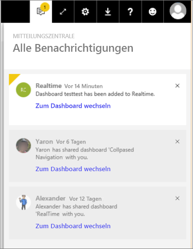

# Anzeigen von Power BI-Benachrichtigungen

[!INCLUDE[consumer-appliesto-yynn](../includes/consumer-appliesto-yynn.md)]

[!INCLUDE [power-bi-service-new-look-include](../includes/power-bi-service-new-look-include.md)]

Die Mitteilungszentrale ist ein fortlaufender Feed von Informationen zu Ihrer Nutzung von Power BI. Öffnen Sie die Mitteilungszentrale, um Nachrichten über neue Dashboards, die mit Ihnen geteilt wurden, sowie Informationen über Power BI-Ereignisse und -Meetings, Warnungen, die Sie eingerichtet haben, und vieles mehr anzuzeigen. Sie können [Warnungen im Power BI-Dienst festlegen](end-user-alerts.md) wie auch in den mobilen Power BI-Apps.

Sehen Sie sich an, wie Amanda Benachrichtigungen überprüft, verwaltet und beantwortet. Befolgen Sie anschließend die Anleitung unter dem Video, um es selbst auszuprobieren.    

> [!NOTE]
> In diesem Video wird eine ältere Version des Power BI-Diensts verwendet. 

<iframe width="560" height="315" src="https://www.youtube.com/embed/bZMSv5KAlcE" frameborder="0" allowfullscreen></iframe>

## Anzeigen Ihrer Benachrichtigungen
1. Wenn Sie sich bei Power BI anmelden, werden dem Feed alle neuen Benachrichtigungen hinzugefügt, die an Sie gesendet wurden, während Sie offline waren. Wenn neue Benachrichtigungen für Sie vorhanden sind, wird eine gelbe Blase mit der Anzahl neuer Elemente in Power BI angezeigt.
   
   
2. Wählen Sie in der Power BI-Menüleiste das Symbol **Benachrichtigungen** aus.
   
   
3. Die neuesten Benachrichtigungen werden immer ganz oben angezeigt und die ungelesenen hervorgehoben. Benachrichtigungen werden 90 Tage lang aufbewahrt, es sei denn, Sie löschen sie vorher oder erreichen das zulässige Maximum von 100 Benachrichtigungen.
   
   
4. Um eine Benachrichtigung zu schließen, klicken Sie auf das Symbol „X“.

## Weitere Schritte
* [Datenwarnungen im Power BI-Dienst](end-user-alerts.md)
* [Festlegen von Datenwarnungen in der iPhone-App (Power BI für iOS)](mobile/mobile-set-data-alerts-in-the-mobile-apps.md)
* [Festlegen von Datenwarnungen in der mobilen Power BI-App für Windows 10](mobile/mobile-set-data-alerts-in-the-mobile-apps.md)
* Weitere Fragen? [Wenden Sie sich an die Power BI-Community](https://community.powerbi.com/)

