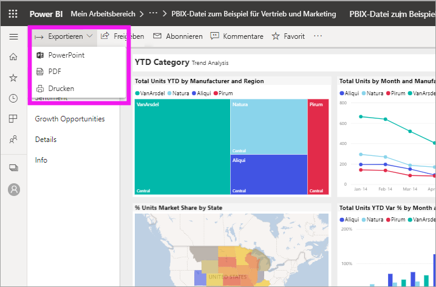
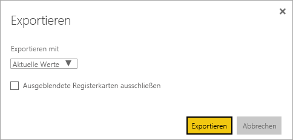
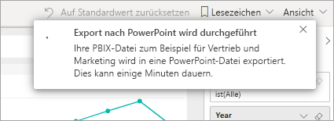

# Exportieren von Berichten in PowerPoint

[!INCLUDE[consumer-appliesto-yyny](../includes/consumer-appliesto-yyny.md)]

Mit dem Power BI-Dienst (app.powerbi.com) können Sie Berichte in Microsoft PowerPoint veröffentlichen und auf Basis eines Power BI-Berichts einfach eine Präsentation erstellen. Beim Export nach PowerPoint geschieht Folgendes:

* Jede Seite im Power BI-Bericht entspricht einer einzelnen Folie in PowerPoint.
* Jede Seite im Power BI-Bericht wird beim Export in ein einzelnes hochauflösendes Bild in PowerPoint umgewandelt.
* Sie können die Filter- und Slicereinstellungen beibehalten, die Sie dem Bericht hinzugefügt haben.
* In PowerPoint wird ein Link zum Power BI-Bericht erstellt.

**Power BI-Berichte** lassen sich ganz schnell nach **PowerPoint** exportieren. Befolgen Sie dazu die Schritte im nächsten Abschnitt.

Sie können auch jeweils ein Visual aus dem Power BI-Dienst kopieren und in PowerPoint (oder ein anderes Programm, das Einfügen unterstützt) einfügen. Wählen Sie das Symbol **Als Bild kopieren** aus, um das visuelle Element in die Zwischenablage zu kopieren. Öffnen Sie dann PowerPoint, und fügen Sie das visuelle Element ein. Weitere Informationen finden Sie unter [Kopieren von Visuals als statische Bilder](../visuals/power-bi-visualization-copy-paste.md).

## Exportieren eines Power BI-Berichts nach PowerPoint
Wählen Sie im **Power BI-Dienst** einen Bericht aus, der im Zeichenbereich angezeigt werden soll. Sie können auch einen Bericht auf der Seite **Home**, aus **Apps** oder einem anderen Container im Navigationsbereich auswählen.

[!INCLUDE [power-bi-service-new-look-include](../includes/power-bi-service-new-look-include.md)]

Sobald der Bericht, den Sie nach PowerPoint exportieren möchten, im Zeichenbereich angezeigt wird, wählen Sie in der Menüleiste **Exportieren** > **PowerPoint** aus.

Es wird ein Popupfenster angezeigt, in dem Sie die Option zur Auswahl von **Aktuelle Werte** oder **Standardwerte** haben. **Aktuelle Werte** exportiert den Bericht im aktuellen Zustand. Dazu gehören die aktiven Änderungen, die Sie an Datenschnitt- und Filterwerten vorgenommen haben.  Die meisten Benutzer wählen diese Option aus. Wenn Sie gescrollt haben, enthält **Aktuelle Werte** nicht den Scrollstatus des Visuals, sondern exportiert stattdessen den oberen Teil der Daten. Alternativ können Sie auf **Standardwerte** klicken, wodurch der Bericht im ursprünglichen Zustand exportiert wird (wie er vom *Designer* freigegeben wurde). Änderungen am ursprünglichen Zustand werden nicht dargestellt.

 
Darüber hinaus können Sie über das Kontrollkästchen auswählen, ob die ausgeblendeten Registerkarten eines Berichts exportiert werden sollen. Aktivieren Sie einfach das Kontrollkästchen, wenn Sie nur die Registerkarten des Berichts exportieren möchten, die Ihnen im Browser angezeigt werden. Wenn Sie alle ausgeblendeten Registerkarten im Exportvorgang enthalten möchten, lassen Sie das Kontrollkästchen deaktiviert. Wenn das Kontrollkästchen ausgegraut ist, enthält der Bericht keine ausgeblendeten Registerkarten. Ein Beispiel für eine ausgeblendete Registerkarte ist beispielsweise eine QuickInfo-Registerkarte. [Benutzerdefinierte QuickInfos](../create-reports/desktop-tooltips.md) werden von *Berichts-Designern* erstellt und im Power BI-Dienst für *Verbraucher* nicht als Berichtsregisterkarten angezeigt. 

Sobald Sie Ihre Auswahl vorgenommen haben, wählen Sie **Exportieren** aus, um fortzufahren. Rechts oben im Browserfenster des Power BI-Diensts wird ein Benachrichtigungsbanner mit der Information angezeigt, dass ein Export nach PowerPoint ausgeführt wird. 

Der Exportvorgang kann einige Minuten dauern. Zu den Faktoren, die die benötigte Zeit beeinflussen, zählen die Struktur des Berichts sowie die jeweils aktuelle Auslastung des Power BI-Diensts. Während der Bericht exportiert wird, können Sie in Power BI weiterarbeiten.

Nachdem der Power BI-Dienst den Export abgeschlossen hat, werden Sie darüber über das Banner informiert. Ihre Datei ist dann dort verfügbar, wo Ihr Browser heruntergeladene Dateien speichert. In der folgenden Abbildung wird die Datei als Downloadbanner unten im Browserfenster angezeigt.

Das war schon alles. Sie können die Datei herunterladen, in PowerPoint öffnen und wie jeden anderen PowerPoint-Stapel bearbeiten oder erweitern.

## Öffnen der PowerPoint-Datei
Wenn Sie die aus Power BI exportierte PowerPoint-Datei öffnen, werden Sie einige nützliche Elemente entdecken. Sehen Sie sich die folgende Abbildung an, und betrachten Sie die nummerierten Elemente, in denen einige dieser Features beschrieben werden. Seiten werden in PowerPoint immer mit dem Standardseitenverhältnis von 9:16 erstellt, unabhängig von den ursprünglichen Seitengrößen oder -abmessungen im Power BI-Bericht.

1. Die erste Seite der Foliengruppe enthält den Namen des Berichts sowie einen Link, über den Sie den Bericht, auf dem die Foliengruppe basiert, **in Power BI anzeigen** können.
2. Zudem erhalten Sie nützliche Informationen zum Bericht. **Letzte Datenaktualisierung** zeigt das Datum und die Uhrzeit an, auf denen der exportierte Bericht basiert. **Heruntergeladen am** zeigt das Datum und die Uhrzeit des Exports des Power BI-Berichts in eine PowerPoint-Datei. Die Uhrzeit von **Heruntergeladen um** ist auf die Zeitzone Ihres Computers zum Zeitpunkt des Exports festgelegt.

3. Jeder Berichtsseite entspricht eine eigene Folie, wie im Navigationsbereich zu sehen. 
4. Ihr veröffentlichter Bericht wird in der Sprache gerendert, die in Ihren Power BI-Einstellungen oder in den Gebietsschemaeinstellungen Ihres Browsers angegeben ist. Sie können die Spracheinstellung anzeigen oder festlegen, indem Sie das Zahnradsymbol  > **Einstellungen** > **Allgemein** > **Sprache** auswählen. Weitere Informationen zu Gebietsschemas finden Sie unter [Unterstützte Sprachen und Länder oder Regionen für Power BI](../fundamentals/supported-languages-countries-regions.md).

Wenn Sie eine einzelne Folie betrachten, sehen Sie, dass jede Berichtsseite als unabhängiges Bild enthalten ist. Scrollen ist in PowerPoint nicht möglich, da jede Folie ein statisches Bild ist.

Wie Sie mit dem PowerPoint-Stapel und den hochauflösenden Bildern weiter verfahren möchten, liegt ganz bei Ihnen.

## Zu beachtende Aspekte und Problembehandlung
Bei der Arbeit mit der Funktion **Nach PowerPoint exportieren** sind einige Aspekte und Einschränkungen zu beachten.
 

* [URL-Filter](../collaborate-share/service-url-filters.md) werden zurzeit nicht beachtet, wenn Sie **Aktuelle Werte** für Ihren Export auswählen.

* Wenn der Bericht beim Export in PowerPoint eine benutzerdefinierte Schriftart hat, wird diese durch eine Standardschriftart ersetzt.

* Die folgenden Visualtypen werden nicht unterstützt und nicht in PowerPoint exportiert:
   - [Nicht zertifizierte benutzerdefinierte Visuals](../developer/visuals/power-bi-custom-visuals-certified.md) werden nicht unterstützt. 
   - Das visuelle Element [ESRI ArcGIS](../visuals/power-bi-visualizations-arcgis.md) wird nicht unterstützt.
   - R- und Python-Visuals werden nicht unterstützt.
   - Hintergrundbilder werden an der Begrenzung des Diagramms abgeschnitten. Es wird empfohlen, Hintergrundbilder vor dem Export als PowerPoint-Datei zu entfernen.

* Einige Berichte können nicht exportiert werden. Dazu gehören:
    - Berichte, die ein Benutzer außerhalb Ihrer Power BI-Mandantendomäne besitzt (beispielsweise ein Bericht im Besitz einer Person außerhalb Ihrer Organisation, die ihn für Sie freigegeben hat).
    - Wenn Sie ein Dashboard für Personen außerhalb Ihrer Organisation freigeben (und damit für einen Benutzer, der nicht Ihrem Power BI-Mandanten angehört), kann der betreffende Benutzer die zugehörigen Berichte des freigegebenen Dashboards nicht als PowerPoint-Datei exportieren. Wenn Sie beispielsweise aaron@contoso.com sind, können Sie Berichte für david@cohowinery.com freigeben. david@cohowinery.com kann jedoch die zugehörigen Berichte nicht nach PowerPoint exportieren.
    - Berichte mit mehr als 30 Seiten. Nur die ersten 30 Seiten werden exportiert.
    - Berichte, die in ältere Versionen von PowerPoint exportiert werden.

* Wenn das Menüelement **Nach PowerPoint exportieren** im Power BI-Dienst nicht verfügbar ist, hat der Administrator Ihres Mandanten diese Funktion wahrscheinlich deaktiviert. Wenden Sie sich an den Mandantenadministrator, um Einzelheiten zu erfahren.
* Der Power BI-Dienst verwendet Ihre Power BI-Spracheinstellung, um die Sprache für den PowerPoint-Export festzulegen. Sie können die Spracheinstellung anzeigen oder festlegen, indem Sie das Zahnradsymbol  > **Einstellungen** > **Allgemein** > **Sprache** auswählen.

## Nächste Schritte
[Kopieren von visuellen Elementen als statische Bilder](../visuals/power-bi-visualization-copy-paste.md)    
[Drucken eines Berichts](end-user-print.md)
