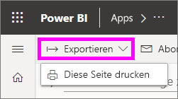
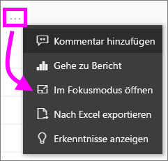

# Drucken im Power BI-Dienst

[!INCLUDE[consumer-appliesto-yynn](../includes/consumer-appliesto-yynn.md)]
## Was gedruckt werden kann
[!INCLUDE [power-bi-service-new-look-include](../includes/power-bi-service-new-look-include.md)]

Drucken Sie im Power BI-Dienst ein ganzes Dashboard, eine Dashboardkachel, eine Berichtseite oder ein Berichtsvisual. Wenn der Bericht mehr als eine Seite enthält, müssen Sie jede Seite separat drucken. 

## Überlegungen zum Drucken

Die meisten Power BI-Dashboards und -Berichte werden von *Berichts-Designern* erstellt, um online verwendet und auf einer Vielzahl von Geräten angezeigt zu werden. Wenn Sie einen Bericht drucken, wird die Anzeige des Inhalts auf dem Papier durch Ihren Browser gesteuert. 

Es gibt Browsereinstellungen, mit denen Sie den Ausdruck anpassen können, aber auch dann erhalten Sie möglicherweise noch nicht das gewünschte Ergebnis. Sie sollten zuerst [in ein PDF-Format exportieren](end-user-pdf.md) und stattdessen die PDF-Datei drucken. 

## Anpassen der Druckeinstellungen des Browsers
Wenn Sie in Power BI drucken, öffnet Ihr Browser ein Druckfenster. Das Druckfenster ist je nach Browser unterschiedlich. Sie werden jedoch feststellen, dass alle über ähnliche Optionen verfügen, mit denen Sie das Aussehen Ihres Ausdrucks anpassen können. 

Hier finden Sie einige kurze Tipps, die Sie zum Formatieren Ihres Ausdrucks verwenden können.

   > 
1. Wenn das Dashboard, der Bericht oder das Visual breiter als hoch ist, sollten Sie das Layout **Querformat** verwenden. 

   

2. Passen Sie die Ränder und Skalierung an, um mehr auf eine gedruckte Seite zu bekommen. 

    

Experimentieren Sie mit den Einstellungen Ihres jeweiligen Browsers, bis Sie das gewünschte Ergebnis erhalten. Einige Browser haben sogar Optionen zum Drucken von Hintergrundgrafiken. 

## Drucken eines Dashboards
1. Öffnen Sie das Dashboard, das Sie drucken möchten.
2. Wählen Sie in der oberen linken Ecke die Option „Exportieren“ aus, und klicken Sie auf **Diese Seite drucken**.
   
    

3. Das Fenster „Drucken“ wird im Browser geöffnet. Wählen Sie die Einstellungen aus. Wenn Ihr Dashboard z. B. breiter als lang ist, sollten Sie das Layout in **Querformat** ändern. Klicken Sie auf **Drucken**.
   
    

## Drucken einer Dashboardkachel
1. Öffnen Sie das Dashboard im [Vollbildmodus](end-user-focus.md), indem Sie in der oberen Menüleiste auf das  klicken.

3. [Öffnen Sie die Kachel im Fokusmodus](end-user-focus.md), indem Sie mit dem Mauszeiger auf **Weitere Optionen** (...) zeigen und anschließend auf die Option **Im Fokusmodus öffnen** oder auf das  klicken.
   
    

4. Zeigen Sie auf die Kachel, um das Menü „Optionen“ anzuzeigen.
   
    

4. Wählen Sie das Drucksymbol aus. .     

5. Das Fenster „Drucken“ wird im Browser geöffnet. Wählen Sie die Einstellungen aus. Wenn die Kachel z. B. nicht auf die Seite passt, sollten Sie die Skalierung auf 75 % ändern. Klicken Sie auf **Drucken**.

     

> [!TIP]
> Wenn Sie alle diese Schritte befolgt haben und Ihre Kachel immer noch nicht wie gewünscht angezeigt wird, versuchen Sie Folgendes:
> 1. Öffnen Sie das Fenster „Drucken“, und nehmen Sie die Änderungen an den Druckeinstellungen vor, die zum besten Ausdruck führen. Ändern Sie z. B Layout, Ränder und Skalierung. 
> 2. Wählen Sie jedoch anstelle von „Drucken“ **Abbrechen** aus. 
> 3. Führen Sie die Schritte 1 bis 5 nochmals durch. Die Kachel wird an die neuen Einstellungen des Fensters „Drucken“ angepasst und kann gedruckt werden.

## Drucken einer Berichtsseite
Berichte können seitenweise gedruckt werden.

1. Öffnen Sie den Bericht, und klicken Sie auf **Exportieren** > **Drucken**, um die aktuelle Berichtseite zu drucken.
   
    
2. Das Fenster „Drucken“ wird im Browser geöffnet.

3. Führen Sie die oben bei **Drucken eines Dashboards** aufgeführten Schritte zum Drucken aus.
   

## Drucken einer Berichtsvisualisierung
1. [Öffnen Sie das visuelle Element im Fokusmodus](end-user-focus.md), indem Sie mit dem Mauszeiger auf die Kachel zeigen und rechts oben auf das Fokussymbol  klicken.

2. Klicken Sie in der oberen linken Ecke auf **Exportieren** > **Drucken**, um das Visual zu drucken.

    

3. Führen Sie die oben bei **Drucken eines Dashboards** aufgeführten Schritte zum Drucken aus.

## Zu beachtende Aspekte und Problembehandlung

* F: Ich kann nicht alle Berichtseiten auf einmal drucken.    
* A: Das ist richtig. Berichte können nur seitenweise gedruckt werden.
* F: Ich kann den Bericht nicht als PDF-Datei drucken.    
* A: Diese Option wird nur angezeigt, wenn Sie bereits den PDF-Treiber in Ihrem Browser konfiguriert haben.    
* F: Wenn ich **Drucken** auswähle, wird etwas anderes als hier angezeigt.    
* A: Der Druckbildschirm variiert je nach Browser und Softwareversion.
* F: Mein Ausdruck ist nicht richtig skaliert.  Das Dashboard passt nicht auf die Seite. Weitere Fragen zur Skalierung und Ausrichtung.    
* A: Wir können nicht garantieren, dass das gedruckte Exemplar genau der Anzeige im Power BI-Dienst entspricht. Funktionen wie die Skalierung, Ränder, visuelle Details, die Ausrichtung und die Größe werden nicht von Power BI gesteuert. Passen Sie die Druckeinstellungen für Ihren Browser an. Einige der oben genannten Vorschläge sind für die Seitenausrichtung (Hoch- oder Querformat), Randgröße und Skalierung. Wenn diese nicht hilfreich sind, finden Sie weitere Informationen in der Dokumentation Ihres Browsers.      
* F: Beim Drucken im Vollbildmodus wird die Option „Drucken“ nicht angezeigt, wenn ich mit dem Mauszeiger auf das Visual zeige.   
* A: Wechseln Sie zurück zum Dashboard oder Bericht in der Standardansicht, und öffnen Sie das Visual noch mal im Fokusmodus und anschließend im Vollbildmodus. 

## Nächste Schritte
[Freigeben von Dashboards und Berichten für Kollegen und andere Personen](../service-share-dashboards.md)

Weitere Fragen? [Wenden Sie sich an die Power BI-Community](https://community.powerbi.com/)

