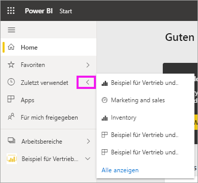

# Suchen von **zuletzt verwendeten** Inhalten im Power BI-Dienst
Die zuletzt verwendeten Inhalte sind die letzten Elemente, die Sie im Power BI-Dienst geöffnet haben (maximal 20 Elemente).  Dazu gehören: Dashboards, Berichte, Apps und Arbeitsmappen.

Lassen Sie sich von Amanda zeigen, wie im Power BI-Dienst Inhaltslisten des Typs **Zuletzt verwendet** aufgefüllt werden, und befolgen Sie dann die detaillierten Anweisungen unter dem Video, um es selbst ausprobieren.

<iframe width="560" height="315" src="https://www.youtube.com/embed/G26dr2PsEpk" frameborder="0" allowfullscreen></iframe>

> [!NOTE]
> In diesem Video wird eine ältere Version des Power BI-Diensts verwendet.

## Anzeigen von zuletzt verwendeten Inhalten
Um die letzten fünf besuchten Elemente anzuzeigen, wählen Sie im Navigationsbereich den Pfeil rechts neben **Zuletzt verwendet** aus.  Hier können Sie zuletzt verwendeten Inhalt auswählen, um ihn zu öffnen. Es werden nur die letzten fünf verwendeten Elemente aufgeführt.

Wenn mehr als fünf zuletzt besuchte Elemente vorhanden sind, wählen Sie **Alle anzeigen** aus, um den Bildschirm „Zuletzt verwendet“ zu öffnen. Sie können auch im Navigationsbereich auf **Zuletzt verwendet** oder das Symbol „Zuletzt verwendet“  klicken.

## Aktionen, die über die Inhaltsliste **zuletzt verwendet** verfügbar sind
Die Aktionen, die Ihnen zur Verfügung stehen, hängen von den Einstellungen ab, die vom *Designer* der Inhalte festgelegt wurden. Sie haben unter anderem folgende Optionen:
* Wählen Sie das Sternsymbol aus, um [ein Dashboard, einen Bericht oder eine App als Favoriten hinzuzufügen](end-user-favorite.md) .
* Manche Dashboards und Berichte können erneut geteilt werden  .
* [Öffnen Sie den Bericht in Excel](end-user-export.md)  
* [Zeigen Sie Erkenntnis an](end-user-insights.md), die Power BI in den Daten findet .
* Wenn Ihre Listen sehr umfangreich werden, können Sie zudem [das Suchfeld und die Sortierfunktion verwenden, um das Gewünschte zu suchen](end-user-search-sort.md). Um herauszufinden, ob eine Spalte sortiert werden kann, zeigen Sie mit dem Cursor darauf, um zu sehen, ob ein Pfeil erscheint. In diesem Beispiel wird auf **Letzter Zugriff** gezeigt, und ein Pfeil wird angezeigt, was bedeutet, dass die neuesten Inhalte nach Zugriffsdatum sortiert werden können. 

    

## Nächste Schritte
[Apps im Power BI-Dienst](end-user-apps.md)

Weitere Fragen? [Wenden Sie sich an die Power BI-Community](https://community.powerbi.com/)

