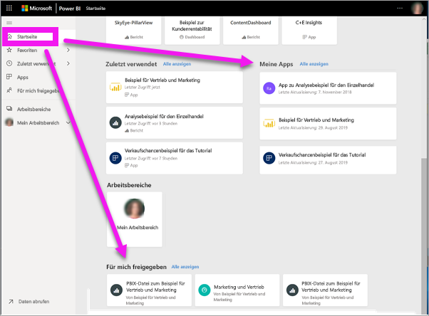
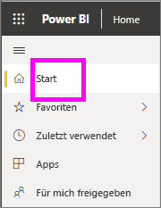
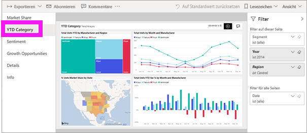
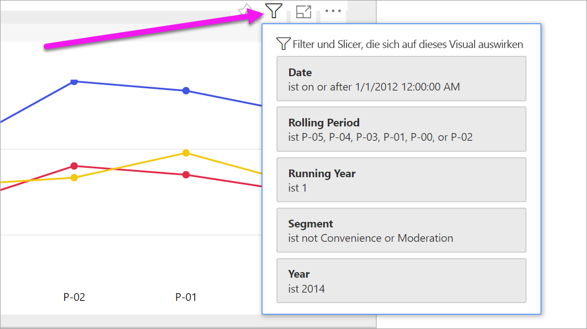
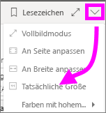
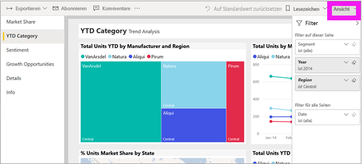
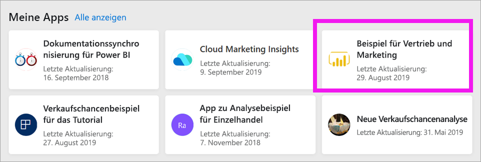
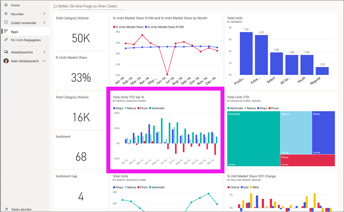
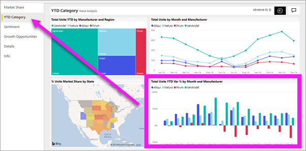

# Anzeigen eines Berichts im Power BI-Dienst für *Kunden*

[!INCLUDE[consumer-appliesto-yyny](../includes/consumer-appliesto-yyny.md)]

[!INCLUDE [power-bi-service-new-look-include](../includes/power-bi-service-new-look-include.md)]

Ein Bericht besteht aus einer oder mehreren Seiten mit visuellen Elementen. Berichte werden von *Power BI-Designern* erstellt und entweder [direkt für *Benutzer* freigegeben](end-user-shared-with-me.md), oder als Teil einer [App](end-user-apps.md). 

Es gibt viele verschiedene Möglichkeiten zum Öffnen eines Berichts, und wir zeigen Ihnen zwei davon: Öffnen über die Seite „Home“ und Öffnen aus einem Dashboard. 

<!-- add art-->

## Öffnen eines Berichts über die Seite „Home“ in Power BI
Lassen Sie uns zuerst einen Bericht öffnen, der direkt mit Ihnen geteilt wurde, und dann einen Bericht, der als Teil einer App geteilt wurde.

   

### Öffnen eines Berichts, der mit Ihnen geteilt wurde
Power BI-*Designer* können einen einzelnen Bericht direkt über einen Link in einer E-Mail freigeben oder indem Sie ihn automatisch Ihrem Power BI-Inhalt hinzufügen. Auf diese Weise geteilte Berichte werden im Container **Für mich freigegeben** im Navigationsbereich und im Abschnitt **Für mich freigegeben** auf der Seite „Start“ angezeigt.

1. Öffnen Sie den Power BI-Dienst („app.powerbi.com“).

2. Wählen Sie **Start** in der Navigationsleiste aus, um die Seite „Start“ anzuzeigen.  

   
   
3. Scrollen Sie nach unten, bis Sie **Für mich freigegeben** sehen. Suchen Sie nach dem Berichtssymbol . In diesem Screenshot wird ein Dashboard und ein Bericht angezeigt. Der Bericht heißt *Beispiel für Vertrieb und Marketing*. 
   
   

4. Wählen Sie einfach die *Berichtskarte* aus, um den Bericht zu öffnen.

   

5. Beachten Sie die Registerkarten auf der linken Seite.  Jede Registerkarte stellt eine *Seite* des Berichts dar. Momentan ist die Seite *Growth Opportunity* geöffnet. Klicken Sie auf die Registerkarte *YTD Category*, um stattdessen diese Berichtsseite zu öffnen. 

   

6. Beachten Sie den Bereich **Filter** auf der rechten Seite. Filter, die auf diese Berichtsseite oder den gesamten Bericht angewendet wurden, werden hier angezeigt.

7. Wenn Sie mit dem Mauszeiger auf ein Berichtsvisual zeigen, werden mehrere Symbole und **Weitere Optionen** (...) angezeigt. Um die auf ein bestimmtes Visual angewendeten Filter anzuzeigen, wählen Sie das Filtersymbol aus. Hier haben wir das Filtersymbol für das Liniendiagramm *Gesamtanzahl der Einheiten nach laufendem Zeitraum und Region* ausgewählt.

   

6. Momentan wird die gesamte Berichtsseite angezeigt. Wählen Sie das Dropdownmenü „Ansicht“ oben rechts aus, und klicken Sie auf **Tatsächliche Größe**, um die Anzeige (den Zoom) der Seite zu ändern.

   

   

Es gibt viele Möglichkeiten, wie Sie mit einem Bericht interagieren können, um Einblicke zu gewinnen und Geschäftsentscheidungen zu treffen.  Verwenden Sie das Inhaltsverzeichnis auf der linken Seite, um andere Artikel zu Power BI-Berichten zu lesen. 

### Öffnen eines Bericht, der Teil einer App ist
Wenn Sie von Kollegen oder aus AppSource Apps erhalten haben, sind diese Apps über die Seite „Start“ und den **Apps**-Container im Navigationsbereich verfügbar. Eine [App](end-user-apps.md) ist eine Sammlung von Dashboards und Berichten, die von einem Power BI-*Designer* für Sie gebündelt wurden.

### Voraussetzungen
Um teilzunehmen, laden Sie die „Sales and Marketing“-App herunter.
1. Navigieren Sie in Ihrem Browser zu „appsource.microsoft.com“.
1. Suchen Sie nach „Sales and Marketing“, und wählen Sie **Microsoft sample – Sales & Marketing** aus.
1. Wählen Sie **Jetzt anfordern** > **Fortfahren** > **Installieren** aus, um die App in Ihrem Apps-Container zu installieren. 

Sie können die App von Ihrem Apps-Container oder von der Startseite aus öffnen.
1. Wechseln Sie zurück zur Seite „Start“, indem Sie in der Navigationsleiste auf **Start** klicken.

7. Scrollen Sie nach unten, bis Sie **Meine Apps** sehen.

   

8. Wählen Sie Ihre neue *Sales and Marketing*-App aus, um sie zu öffnen. Abhängig von den Optionen, die vom App-*Designer* festgelegt wurden, öffnet die App entweder ein Dashboard oder einen Bericht. Diese App öffnet ein Dashboard.  

## Öffnen eines Berichts aus einem Dashboard
Berichte können aus einem Dashboard geöffnet werden. Die meisten [Dashboardkacheln](end-user-tiles.md) sind aus Berichten *angeheftet*. Das Auswählen einer Kachel öffnet den Bericht, mit dem diese Kachel erstellt wurde. 

1. Wählen Sie im Dashboard eine Kachel aus. In diesem Beispiel wurde die Kachel *Total Units YTD...* in einem Säulendiagramm ausgewählt.

    

2.  Der entsprechende Bericht wird geöffnet. Beachten Sie, dass die Seite *YTD Category* angezeigt wird. Dies ist die Berichtseite, die das im Dashboard ausgewählte Säulendiagramm enthält.

    

> [!NOTE]
> Nicht alle Kacheln führen zu einem Bericht. Wenn Sie eine Kachel auswählen, die [mit Q&A erstellt wurde](end-user-q-and-a.md), wird der Q&A-Bildschirm geöffnet. Wenn Sie eine Kachel auswählen, die [mit dem Widget **Kachel hinzufügen** erstellt](../create-reports/service-dashboard-add-widget.md) wurde, kann dies verschiedene Folgen haben: ein Video könnte abgespielt werden, eine Website geöffnet werden und vieles mehr.  

##  Weitere Möglichkeiten zum Öffnen eines Berichts
Wie Sie mit der Navigation im Power BI-Dienst besser vertraut sind, werden Sie feststellen, welche Arbeitsabläufe für Sie am besten geeignet sind. Weitere Möglichkeiten zum Zugriff auf Berichte:
- Über den Navigationsbereich mithilfe der Optionen [Favoriten](end-user-favorite.md) und [Zuletzt verwendet](end-user-recent.md)    
- Mit [Verwandte Inhalte anzeigen](end-user-related.md)    
- Über eine E-Mail, wenn jemand [einen Bericht für Sie freigibt](../collaborate-share/service-share-reports.md) oder Sie [eine Benachrichtigung](end-user-alerts.md) festgelegt haben.    
- Über die [Mitteilungszentrale](end-user-notification-center.md)    
- Aus einem Arbeitsbereich
- usw.

## Nächste Schritte
[Öffnen und Anzeigen eines Dashboards](end-user-dashboard-open.md)    
[Berichtsfilter](end-user-report-filter.md)

