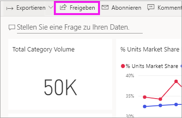
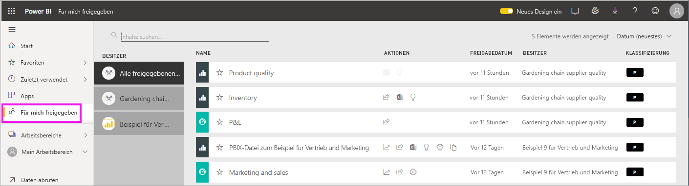
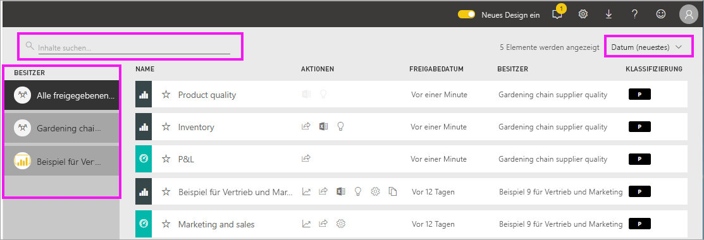

# Anzeigen der Dashboards und Berichte, die mit mir geteilt wurden

[!INCLUDE[consumer-appliesto-ynny](../includes/consumer-appliesto-ynny.md)]

[!INCLUDE [power-bi-service-new-look-include](../includes/power-bi-service-new-look-include.md)]

Wenn ein Kollege Inhalte mit Ihnen teilt und dazu die Schaltfläche **Freigeben** verwendet, werden diese in Ihrem Container **Für mich freigegeben** angezeigt. Das Dashboard oder der Bericht ist nur über **Für mich freigegeben** und nicht über **Apps** verfügbar.

Sehen Sie sich an, wie Amanda die Inhaltsliste **Für mich freigegeben** erläutert und veranschaulicht, wie Sie durch die Liste navigieren und sie filtern. Befolgen Sie dann die schrittweisen Anleitungen unter dem Video, um es selbst ausprobieren. Damit Sie Dashboards anzeigen können, die für Sie freigegeben sind, benötigen Sie eine Power BI Pro-Lizenz. Weitere Informationen finden Sie unter [Welche Lizenz habe ich?](end-user-license.md).
    

> [!NOTE]
> In diesem Video wird eine ältere Version des Power BI-Diensts verwendet.
    

<iframe width="560" height="315" src="https://www.youtube.com/embed/G26dr2PsEpk" frameborder="0" allowfullscreen></iframe>

## Interagieren mit freigegebenen Inhalten

Sie erhalten Möglichkeiten zum Interagieren mit den freigegebenen Dashboards und Berichten, je nach den Berechtigungen, die Ihnen der *Designer* erteilt. Hierzu zählt die Fähigkeit zum Kopieren des Dashboards, zum Öffnen des Berichts [in der Leseansicht](end-user-reading-view.md) und zum erneuten Freigeben für andere Kollegen.

### Im Container **Für mich freigegeben** verfügbare Aktionen
Die Aktionen, die Ihnen zur Verfügung stehen, hängen von den Einstellungen ab, die vom *Designer* der Inhalte festgelegt wurden. Sie haben unter anderem folgende Optionen:
* Wählen Sie das Sternsymbol aus, um [ein Dashboard oder einen Bericht als Favoriten hinzuzufügen](end-user-favorite.md) .
* Entfernen eines Dashboards oder Berichts  .
* Manche Dashboards und Berichte können erneut geteilt werden  .
* [Öffnen Sie den Bericht in Excel](end-user-export.md) . 
* [Zeigen Sie Erkenntnis an](end-user-insights.md), die Power BI in den Daten findet .
  
  > [!NOTE]
  > Um Informationen zu EGRC-Klassifizierungen zu erhalten, wählen Sie die **Klassifizierungsschaltfläche** aus, oder besuchen Sie [Datenklassifizierung für Dashboards](../service-data-classification.md).
  > 

## Freigegebene Dashboards „Suchen“ und „Sortieren“
Wenn Ihre Inhaltsliste lang ist, haben Sie mehrere Optionen, um das zu finden, was Sie brauchen. Sie können das Suchfeld verwenden, nach Datum sortieren oder aus der Spalte **Besitzer** auswählen.    

