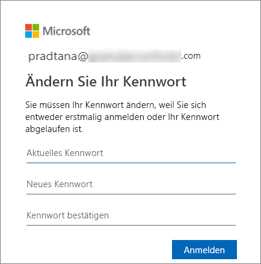
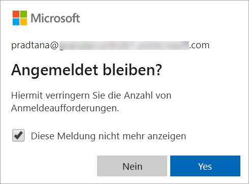
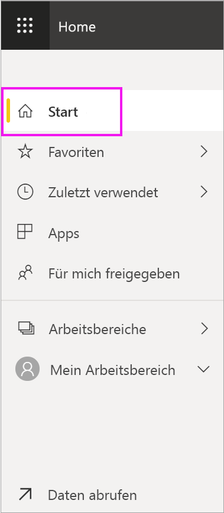

# Anmelden beim Power BI-Dienst

[!INCLUDE[consumer-appliesto-yyny](../includes/consumer-appliesto-yyny.md)]

## Power BI-Konten
Bevor Sie sich bei Power BI anmelden können, benötigen Sie ein Konto. Es gibt zwei Möglichkeiten, ein Power BI-Konto zu erhalten. Die Erste besteht darin, dass Ihr Unternehmen Power BI-Lizenzen für die Mitarbeiter erwirbt. Die Zweite besteht darin, dass Sie sich für eine kostenlose Testversion oder persönliche Lizenz registrieren. In diesem Artikel wird das erste Szenario behandelt.

## Erstmaliges Anmelden

### Schritt 1: Öffnen eines Browsers
Der Power BI-Dienst wird in einem Browser ausgeführt.  Also ist der erste Schritt, den Browser Ihrer Wahl zu öffnen und **app.powerbi.com** einzugeben.

### Schritt 2: Eingeben der E-Mail-Adresse
Bei der ersten Anmeldung werden Sie aufgefordert, Ihre E-Mail-Adresse einzugeben.  Diese E-Mail-Adresse ist das Geschäfts-, Schul- oder Unikonto, das für die Registrierung bei Power BI verwendet wurde.  

Suchen Sie in Ihrem Posteingang nach einer E-Mail von Ihrem Power BI-Administrator. Die meisten Administratoren senden Ihnen eine Willkommens-E-Mail, in der Sie Ihr temporäres Kennwort finden. Verwenden Sie dieses E-Mail-Konto für die Anmeldung. 

 
### Schritt 3: Erstellen eines neuen Kennworts
Wenn Ihr Power BI-Administrator Ihnen ein temporäres Kennwort gesendet hat, geben Sie es in das Feld **Aktuelles Kennwort** ein. Wenn Sie kein Kennwort erhalten haben, wenden Sie sich an Ihren Power BI-Administrator.

Wenn sich Power BI Ihre Anmeldeinformationen merken soll, wählen Sie **Ja** aus. 

### Schritt 4: Überprüfen der Startseite „Home“
Bei Ihrem ersten Besuch wird Ihre Power BI-Startseite **Home** geöffnet. Wenn **Home** nicht geöffnet wird, wählen Sie diese Seite im Navigationsbereich aus. 

Auf der Startseite „Home“ werden alle Inhalte angezeigt, für die Sie über Berechtigungen verfügen. Zunächst wird nicht viel Inhalt angezeigt. Das ändert sich jedoch mit der Zeit, wenn Sie und Ihre Kollegen Power BI verwenden. 

Wenn Sie nicht möchten, dass Power BI die Startseite „Home“ öffnet, können Sie [festlegen, dass stattdessen ein **ausgewähltes** Dashboard oder ein Bericht](end-user-featured.md) geöffnet wird. 

## Sicheres Interagieren mit Inhalten
Als ***Benutzer*** geben andere ihre Inhalte für Sie frei, und Sie interagieren mit diesen Inhalten, um die Daten zu untersuchen und Geschäftsentscheidungen zu treffen.  Während Sie in Power BI arbeiten (Filtern, Aufteilen, Abonnieren, Exportieren und Skalieren), wirken sich Ihre Änderungen nicht auf das zugrundeliegende Dataset oder den ursprünglichen freigegebenen Inhalt aus (Dashboards und Berichte). Sie müssen sich also keine Gedanken machen, dass Sie etwas kaputt machen könnten. In Power BI können Sie problemlos herum experimentieren. Das bedeutet nicht, dass Sie Ihre Änderungen nicht speichern können. Allerdings wirken sich die gespeicherten Änderungen nur auf **Ihre** Ansicht des Inhalts aus. Zum Wiederherstellen der ursprünglichen Standardansicht müssen Sie lediglich auf eine Schaltfläche klicken.

## Abmelden vom Power BI-Dienst
Wenn Sie Power BI schließen oder sich abmelden, werden Ihre Änderungen gespeichert, damit Sie genau dort weitermachen können, wo Sie aufgehört haben.

Schließen Sie die entsprechende Registerkarte im Browser, um Power BI zu schließen. 

 

Wenn Sie Ihren Computer mit jemandem teilen, wird empfohlen, dass Sie sich jedes Mal abmelden, wenn Sie Power BI schließen.  Klicken Sie zum Abmelden auf Ihr Profilbild in der oberen rechten Ecke, und wählen Sie **Abmelden** aus. Andernfalls können Sie die Registerkarte schließen, wenn Sie fertig sind.

 

## Problembehandlung und Überlegungen
- Wenn Sie sich bei Power BI als Einzelperson registriert haben, melden Sie sich mit der E-Mail-Adresse an, die Sie beim Registrieren verwendet haben.

- Einige Benutzer verwenden Power BI mit mehreren Konten. Wenn dies der Fall ist, werden Sie bei der Anmeldung aufgefordert, ein Konto aus einer Liste auszuwählen. 

## Nächste Schritte
[Installieren und Verwenden von Apps mit Dashboards und Berichten in Power BI](end-user-app-view.md)
