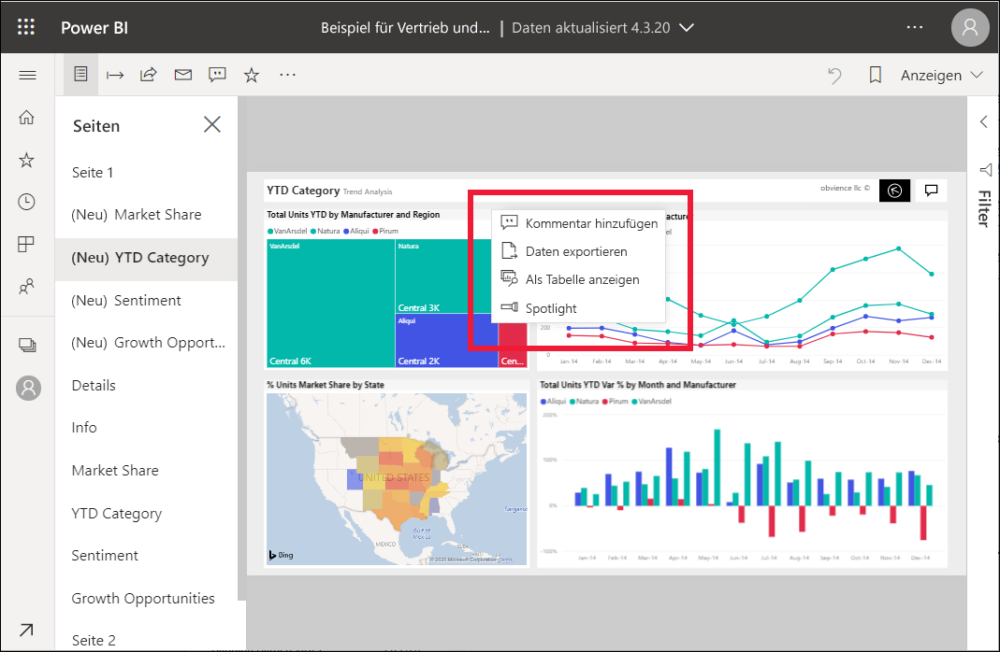
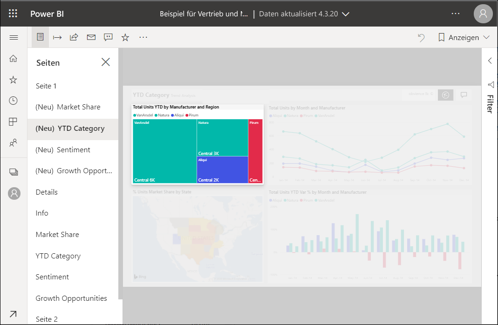

# Hinzufügen von Spotlights zu Power BI-Berichten

[!INCLUDE[consumer-appliesto-yyny](../includes/consumer-appliesto-yyny.md)]

Mit einem Spotlight können Sie die Aufmerksamkeit auf ein bestimmtes Visual auf einer Berichtsseite lenken.  Wenn beim Hinzufügen eines Lesezeichens der Spotlight-Modus ausgewählt ist, wird dieser Modus im Lesezeichen beibehalten.

## Hinzufügen eines Spotlights

1. Öffnen Sie im [Power BI-Dienst](end-user-report-open.md) einen Bericht.

2. Bestimmen Sie, welches Visual auf der Berichtsseite hervorgehoben werden soll. Wählen Sie das Dropdownfeld **Weitere Aktionen (...)** aus.  

    

3. Wählen Sie die Option **Spotlight** aus. Das ausgewählte Visual wird hervorgehoben. Zugleich werden alle anderen Visuals auf der Seite nahezu transparent ausgeblendet. 

    

## Weitere Schritte

* [Anzeigen einer Dashboardkachel oder eines Berichtsvisuals im Fokusmodus](end-user-focus.md)

