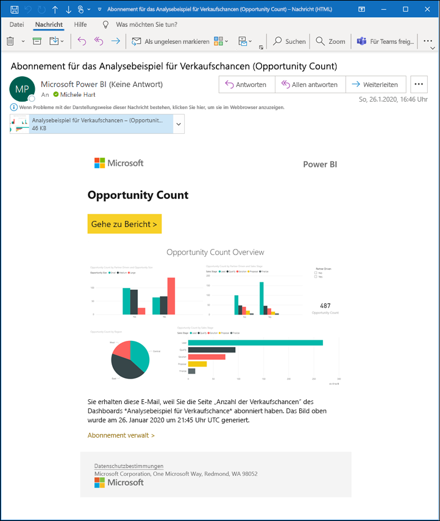
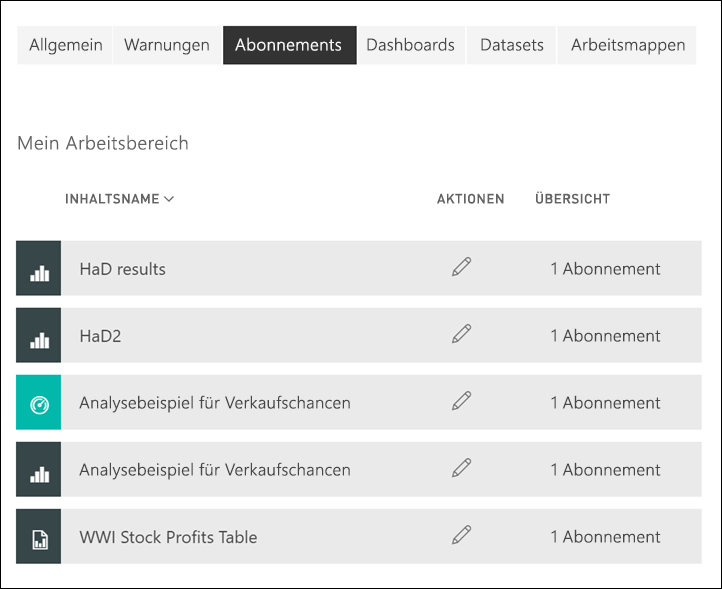

# Abonnieren eines Berichts oder Dashboards im Power BI-Dienst 

[!INCLUDE[consumer-appliesto-ynny](../includes/consumer-appliesto-ynny.md)]

[!INCLUDE [power-bi-service-new-look-include](../includes/power-bi-service-new-look-include.md)]

Es war noch nie so einfach, bei den wichtigsten Dashboards und Berichten auf dem aktuellen Stand zu bleiben. Wenn Sie die Berichtsseiten und Dashboards abonnieren, die für Sie am wichtigsten sind, erhalten Sie von Power BI per E-Mail eine Momentaufnahme. Sie geben an, wie oft Sie E-Mails von Power BI erhalten möchten: täglich, wöchentlich oder wenn die Daten aktualisiert werden. Sie können sogar eine spezifische Uhrzeit festlegen, zu der Power BI die E-Mails sendet, oder die Ausführung sofort starten.  Insgesamt können Sie bis zu 24 verschiedene Abonnements pro Bericht oder Dashboard einrichten.

Für E-Mails und Momentaufnahmen wird die Sprache verwendet, die in den Power BI-Einstellungen festgelegt ist. Weitere Informationen finden Sie unter [Unterstützte Sprachen und Länder/Regionen für Power BI](../supported-languages-countries-regions.md). Wenn keine Sprache definiert ist, verwendet Power BI die Sprache, die der Gebietsschemaeinstellung Ihres aktuellen Browsers entspricht. Sie können die Spracheinstellung anzeigen bzw. festlegen, indem Sie zuerst auf das Zahnradsymbol  >  **und dann auf Einstellungen > Allgemein > Sprache** klicken. 

Die E-Mail, die Sie erhalten, enthält einen Link, mit dem Sie zum Bericht/Dashboard wechseln können. Wenn Sie diesen Link auf mobilen Geräten auswählen, auf denen Power BI-Apps installiert sind, wird die App gestartet (statt die Standardaktion auszuführen, d.h. den Bericht oder das Dashboard auf der Power BI-Website zu öffnen).

## Anforderungen
Zum **Erstellen** eines Abonnements für Sie selbst ist eine bestimmte [Lizenz](end-user-license.md) erforderlich. Sollten Sie kein Abonnement erstellen können, wenden Sie sich an Ihren Power BI-Administrator. **Abonnieren für andere** ist nur für den Besitzer des Dashboards oder Berichts verfügbar. Das Abonnieren von paginierten Berichten unterscheidet sich etwas. Details finden Sie unter [Abonnieren eines paginierten Berichts im Power BI-Dienst für sich selbst und andere](paginated-reports-subscriptions.md). 

## Abonnieren eines Berichts oder Dashboards
Unabhängig davon, ob Sie ein Dashboard oder einen Bericht abonnieren, ist der Vorgang ähnlich. Sie können Dashboards und Berichte im Power BI-Dienst über dieselbe Schaltfläche abonnieren.
 
.

1. Öffnen Sie das Dashboard oder den Bericht.
2. Klicken Sie in der oberen Menüleiste auf **Abonnieren**, oder klicken Sie auf das Briefumschlagsymbol .
   

   
    
    Die linke Anzeige wird angezeigt, wenn Sie in einem Dashboard auf **Abonnieren** klicken. Die rechte Anzeige wird angezeigt, wenn Sie auf einer Berichtsseite auf **Abonnieren** klicken. 
    
    a. Klicken Sie auf **Weiteres Abonnement hinzufügen**, und wählen Sie eine weitere Seite in der Dropdownliste oben aus, um mehrere Seiten in einem Bericht zu abonnieren.

    b. Mithilfe des gelben Schiebereglers können Sie das Abonnement aktivieren und deaktivieren.  Wenn Sie den Schieberegler auf „Aus“ stellen, wird das Abonnement nicht gelöscht. Verwenden Sie zum Löschen des Abonnements das Papierkorbsymbol.

    c. Fügen Sie optional einen Betreff und E-Mail-Adressinformationen hinzu. 

    d. Wählen Sie eine Option für **Häufigkeit** für Ihr Abonnement aus.  Ihnen stehen folgende Optionen zur Verfügung: Täglich, Wöchentlich und Nach Datenaktualisierung (einmal täglich).  Wenn Sie die E-Mail des Abonnements nur an bestimmten Tagen erhalten möchten, können Sie **Wöchentlich** und dann die konkreten Tage auswählen.  Wenn Sie die E-Mail des Abonnements zum Beispiel nur an Werktagen erhalten möchten, können Sie **Wöchentlich** für die Häufigkeit auswählen und die Kontrollkästchen bei „Sa“ und „So“ deaktivieren. Wenn Sie **Monthly** (Monatlich) auswählen, geben Sie den Tag oder die Tage des Monats ein, an dem oder denen Sie die E-Mail des Abonnements erhalten möchten.   

    e. Wenn Sie „Täglich“, „Stündlich“, „Monatlich“ oder „Wöchentlich“ auswählen, können Sie auch eine geplante Zeit für das Abonnement angeben. Sie müssen es zur vollen Stunde oder zur Minute 15, 30 oder 45 ausführen. Wählen Sie Vormittag (AM) oder Nachmittag/Abend (PM) aus. Sie können auch die Zeitzone angeben. Wenn Sie „Stündlich“ auswählen, müssen Sie auch die geplante Zeit festlegen, zu der das Abonnement gestartet werden soll. Anschließend wird es stündlich ausgeführt.  

    f. Legen Sie das Start- und Enddatum fest, indem Sie die Datumsangaben in die Datumsfelder eingeben. Der Startzeitpunkt Ihres Abonnements ist standardmäßig das Datum, an dem Sie es erstellt haben, und das Enddatum ist standardmäßig ein Jahr später. Sie können es zu einem beliebigen Zeitpunkt vor dem Ablauf des Abonnements in ein beliebiges Datum in der Zukunft (bis zum Jahr 9999) ändern. Wenn ein Abonnement ein Enddatum erreicht, wird es deaktiviert, bis Sie es erneut aktivieren.  Vor dem geplanten Enddatum werden Sie per Benachrichtigung(en) gefragt, ob Sie das Abonnement verlängern möchten.     

    B. Klicken Sie auf **Jetzt ausführen**, um Ihr Abonnement zu überprüfen und auszuprobieren.  Dadurch wird Ihnen die E-Mail sofort gesendet. 

3. Wenn alles in Ordnung ist, klicken Sie auf **Speichern und schließen**, um das Abonnement zu speichern. Sie erhalten eine E-Mail und eine Momentaufnahme des Dashboards oder Berichts gemäß des festgelegten Zeitplans. Für alle Abonnements, für die die Häufigkeit **Nach Datenaktualisierung** festgelegt ist, werden E-Mails erst nach der ersten geplanten Aktualisierung des Tages versendet.
   
   
   
    Durch das Aktualisieren der Berichtsseite wird nicht das Dataset aktualisiert. Nur der Besitzer des Datasets kann ein Dataset manuell aktualisieren. Klicken Sie auf das Dropdownmenü in der oberen Menüleiste, oder suchen Sie nach der ursprünglichen Abonnement-E-Mail, um den Besitzernamen des zugrunde liegenden Datasets herauszufinden.
   
    

## Verwalten Ihrer Abonnements
Sie können nur Abonnements verwalten, die Sie erstellen. Klicken Sie erneut auf **Abonnieren**, und klicken Sie dann in der unteren linken Ecke auf **Alle Abonnements verwalten** (siehe Screenshots oben). Welche Abonnements hier angezeigt werden, hängt vom aktiven Arbeitsbereich ab. Wenn Sie alle Ihre Abonnements für alle Arbeitsbereiche anzeigen möchten, muss **Mein Arbeitsbereich** aktiv sein. Grundlegende Informationen zu Arbeitsbereichen finden Sie unter [Arbeitsbereiche in Power BI](end-user-workspaces.md). 

Ein Abonnement wird beendet, wenn die Pro-Lizenz abläuft, das Dashboard oder der Bericht vom Besitzer gelöscht wird oder das zum Erstellen des Abonnements verwendete Benutzerkonto gelöscht wird.

## Zu beachtende Aspekte und Problembehandlung
* Fügen Sie den Power BI-E-Mail-Alias (no-reply-powerbi@microsoft.com) zu Ihren Kontakten hinzu, um zu verhindern, dass Abonnement-E-Mails in Ihren Spamordner gelangen. Wenn Sie Microsoft Outlook verwenden, klicken Sie mit der rechten Maustaste auf den Alias, und wählen Sie **Zu Outlook-Kontakten hinzufügen** aus. 
* Dashboards mit mehr als 25 angehefteten Kacheln oder vier angehefteten Berichtsseiten werden in an Benutzer gesendeten Abonnement-E-Mails möglicherweise nicht vollständig dargestellt. Es wird empfohlen, dass Sie sich an den Dashboard-Designer wenden und ihn bitten, die Anzahl der angehefteten Kacheln auf unter 25 und der angehefteten Liveberichte auf unter vier reduzieren, um sicherzustellen, dass die E-Mails ordnungsgemäß dargestellt werden.  
* Wenn auf Kacheln Sicherheit auf Zeilenebene (Row Level Security, RLS) angewendet wurde, werden diese Kacheln bei Dashboard-E-Mail-Abonnements nicht angezeigt.  
* Wenn die Links (zum Inhalt) in Ihrer E-Mail nicht mehr funktionieren, ist es möglich, dass der Inhalt gelöscht wurde. In der E-Mail können Sie unterhalb des Screenshots sehen, ob Sie selbst ein Abonnement für sich erstellt haben oder ob es von einem anderen Benutzer für Sie erstellt wurde. Falls es jemand anderes war, bitten Sie den Kollegen, entweder die E-Mails abzubestellen oder erneut ein Abonnement für Sie zu erstellen.
* Für Abonnements von Dashboards werden bestimmte Typen von Kacheln noch nicht unterstützt. Dazu zählen Streamingkacheln, Videokacheln und benutzerdefinierte Kacheln mit Webinhalten. 
* Abonnements von Berichtseiten sind mit dem Namen der Berichtseite verknüpft. Wenn Sie eine Berichtsseite abonnieren und diese umbenannt wird, müssen Sie Ihr Abonnement erneut erstellen.
* Wenn Sie das Abonnementfeature nicht verwenden können, wenden Sie sich an Ihren Systemadministrator. Ihre Organisation hat dieses Feature möglicherweise deaktiviert.  
* E-Mail-Abonnements bieten keine Unterstützung für die meisten [benutzerdefinierten Visuals](../developer/visuals/power-bi-custom-visuals.md).  Die einzige Ausnahme sind benutzerdefinierte Power BI-Visuals, die [zertifiziert](../developer/visuals/power-bi-custom-visuals-certified.md) wurden.    
* E-Mail-Abonnements werden mit Standardzuständen für Filter und Slicer des Berichts gesendet. Alle Änderungen der Standardwerte, die Sie nach dem Abonnieren vornehmen, werden nicht in der E-Mail angezeigt. Paginierte Berichte unterstützen diese Funktion und ermöglichen es Ihnen, die spezifischen Parameterwerte für jedes Abonnement festzulegen.  
* E-Mail-Abonnements bieten aktuell keine Unterstützung für R-gestützte Power BI-Visuals.  
* Insbesondere für Abonnements von Dashboards werden bestimmte Typen von Kacheln noch nicht unterstützt.  Dazu zählen Streamingkacheln, Videokacheln und benutzerdefinierte Kacheln mit Webinhalten.     
* Aufgrund der Beschränkungen für die E-Mail-Größe können Dashboards oder Berichte mit extrem großen Bildern möglicherweise nicht abonniert werden.    
* Die Aktualisierung von Datasets, die mit Dashboards und Berichten verknüpft sind und seit mehr als zwei Monaten nicht besucht wurden, wird von Power BI automatisch ausgesetzt.  Wenn Sie jedoch einem Dashboard oder Bericht ein Abonnement hinzufügen, wird die Aktualisierung nicht ausgesetzt, auch wenn das Dashboard oder der Bericht längere Zeit nicht besucht wurde.
* In seltenen Fällen kann es länger als 15 Minuten dauern, bis E-Mail-Abonnements an ihre Empfänger übermittelt werden.  In diesem Fall empfehlen wir, Ihre Datenaktualisierung und Ihr E-Mail-Abonnement zu verschiedenen Zeiten auszuführen, um eine zeitnahe Übermittlung sicherzustellen.  Wenn das Problem weiterhin besteht, wenden Sie sich an den Power BI-Support.

## Nächste Schritte

[Suchen und Sortieren von Inhalten](end-user-search-sort.md)
