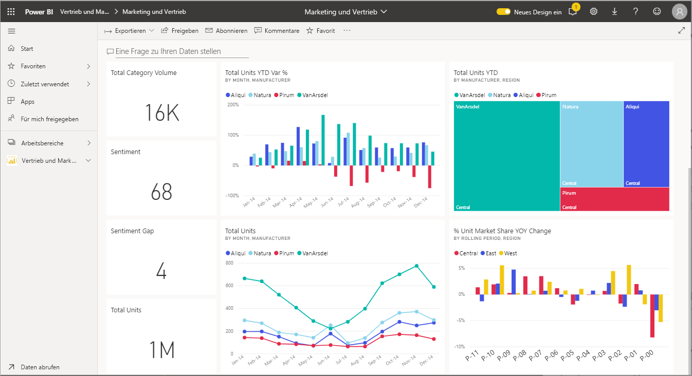
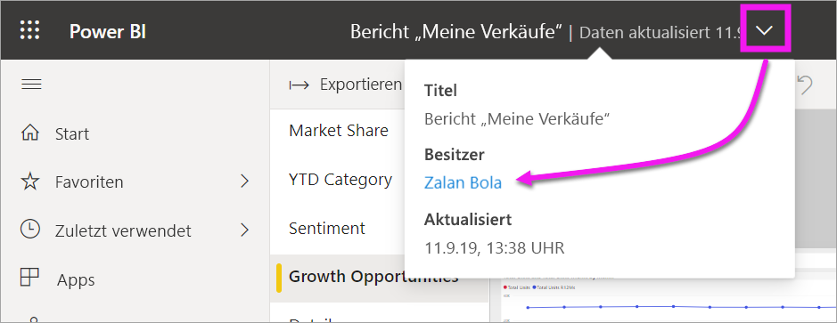

# Interagieren mit Visuals in Berichten, Dashboards und Apps

In ihrer einfachsten Form ist eine ***Visualisierung*** (oder ein *visuelles Element*) eine Art von Diagramm, das von einem Power BI-*Designer* mithilfe der Daten in Berichten und Datasets erstellt wurde. 

Visuals werden in Dashboards und in Berichten gefunden und können mit Power BI Q&A dynamisch erstellt werden. Wenn ein Designer ein Visual in einem Bericht erstellt, kann er dieses Visual an ein Dashboard *anheften*. Ein [Visual auf einem Dashboard wird als *Kachel* bezeichnet](end-user-tiles.md). Dieses Dashboard verfügt über acht Kacheln. 

> [!TIP]
> Es wird empfohlen, zunächst das Übersichtsthema [Power BI – Grundkonzepte für *Benutzer*](end-user-basic-concepts.md) zu lesen, bevor Sie diese detaillierteren Inhalte lesen.

## Wofür kann ich visuelle Elemente verwenden?

Visuelle Elemente werden von Berichts- und Dashboard-*Designern* erstellt und mit *Benutzern* geteilt. Als Benutzer haben Sie viele Möglichkeiten zur Interaktion mit visuellen Elementen, um Einblicke zu erhalten und datenbasierte Geschäftsentscheidungen zu treffen. Die meisten dieser Optionen sind in der folgenden Tabelle zusammen mit Links zu ausführlichen Anweisungen aufgeführt.

Für viele dieser Optionen kann Ihr Administrator oder der *Designer* die Möglichkeit deaktivieren, diese Features anzuzeigen oder zu verwenden. Einige dieser Features funktionieren nur für bestimmte Visuals.  Falls Sie Fragen haben, wenden Sie sich an Ihren Administrator oder den Besitzer des Berichts oder Dashboards. Wählen Sie die Dashboard- oder Bericht-Dropdownliste aus, um den Besitzer zu suchen. 

> [!IMPORTANT]
> Aber zuerst ein Wort zu Q&A. Q&A ist das natürlichsprachliche Suchtool von Power BI. Sie geben eine Frage in natürlicher Sprache ein, und Q&A beantwortet die Frage in Form eines visuellen Elements. Q&A ist eine Möglichkeit für Benutzer, um ihre eigenen visuellen Elemente zu erstellen. Die visuellen Elemente, die Sie mit Q&A erstellen, lassen sich jedoch nicht speichern. Wenn Sie aber etwas bestimmtes aus den Daten erfahren möchten, und der Designer hat es nicht in einen Bericht oder ein Dashboard aufgenommen, ist Q&A eine hervorragende Option. Weitere Informationen zu Q&A finden Sie unter [Q&A für Benutzer](end-user-q-and-a.md).

|Aufgabe  |In einem Dashboard  |In einem Bericht  | In Q&A
|---------|---------|---------|--------|
|[Fügen Sie einem visuellen Element für sich selbst Kommentare hinzu, oder beginnen Sie ein Gespräch mit Kollegen über das visuelle Element](end-user-comment.md).     |  Ja       |   Ja      |  Nein  |
|[Öffnen und erkunden Sie den Bericht, in dem das visuelle Element erstellt wurde](end-user-tiles.md).     |    Ja     |   NV      |  Nein |
|[Zeigen Sie eine Liste der Filter und Slicer an, die sich auf das Visual auswirken](end-user-report-filter.md).     |    Nein     |   Ja      |  Ja |
|[Öffnen und erkunden Sie ein Visual in Q&A (wenn der *Designer* das Visual mit Q&A erstellt hat)](end-user-q-and-a.md).     |   Ja      |   NV      |  NV  |
|[Erstellen Sie ein Visual in Q&A (zur Untersuchung können Sie es nicht speichern)](end-user-q-and-a.md).     |   Ja      |   Wenn der Designer Q&A dem Bericht hinzugefügt hat      |  Ja  |
|[Lassen Sie Power BI für Sie in den Daten des visuellen Elements nach interessanten Fakten oder Trends ](end-user-insights.md) zu suchen.  Diese automatisch generierten Visuals werden *Erkenntnisse* genannt.     |    Ja     |  Für den ganzen Bericht, nicht pro Visual       | Nein   |
|[Zeigen Sie immer nur ein visuelles Element gleichzeitig an, indem Sie den *Fokus*modus](end-user-focus.md) verwenden.     | Ja        |   Ja      | NV  |
|[Suchen Sie den Zeitpunkt, zu dem das Visual zum letzten Mal aktualisiert wurde](end-user-fresh.md).     |  Ja       |    Ja     | NV  |
|[Zeigen Sie immer nur ein Visual gleichzeitig ohne Ränder oder Navigationsleisten an, indem Sie den *Vollbild-* oder *Fokusmodus* verwenden](end-user-focus.md).     |   Ja      |  Ja       | Standardmäßig  |
|[Drucken](end-user-print.md).     |  Ja       |   Ja      | Nein  |
|[Untersuchen Sie das visuelle Element, indem Sie visuelle Filter hinzufügen und ändern.](end-user-report-filter.md)     |    Nein     |   Ja      | Nein  |
|Zeigen Sie auf ein visuelles Element, um zusätzliche Details und QuickInfos anzuzeigen.     |    Ja     |   Ja      | Ja  |
|[Kreuzfiltern Sie andere visuelle Elemente auf der Seite, oder heben Sie sie hervor.](end-user-interactions.md)    |   Nein      |   Ja      | NV  |
|[Zeigen Sie die zum Erstellen des visuellen Elements verwendeten Daten an](end-user-show-data.md).     |  Nein       |   Ja      | Nein  |
| [Ändern Sie die Art, in der das visuelle Element sortiert ist](end-user-change-sort.md). | Nein  | Ja  | Sortierung kann durch Umformulieren der Frage geändert werden  |
| Fügen Sie einem visuellen Element ein Spotlight hinzu. | Nein  | Ja  |  Nein |
| [Exportieren Sie nach Excel.](end-user-export.md) | Ja | Ja | Nein|
| [Erstellen Sie eine Warnung](end-user-alerts.md), um Sie zu benachrichtigen, wenn ein Wert einen von Ihnen festgelegten Schwellenwert überschreitet.  | Ja  | Nein  | Nein |
| [Führen Sie an den anderen Visuals auf der Seite eine Kreuzfilterung und übergreifende Hervorhebung aus](end-user-report-filter.md).  | Nein      | Ja  | Nein  |
| [Führen Sie ein Drillup an einem Visual mit einer Hierarchie aus](end-user-drill.md).  | Nein  | Ja   | Nein |

## Nächste Schritte
Zurück zu [Grundlegende Konzepte für Benutzer](end-user-basic-concepts.md)    
[Auswählen eines visuellen Elements zum Öffnen eines Berichts](end-user-report-open.md)    
[In Power BI verfügbare Typen visueller Elemente](end-user-visual-type.md)