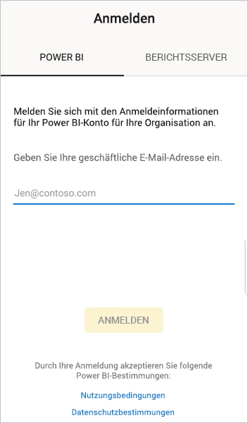
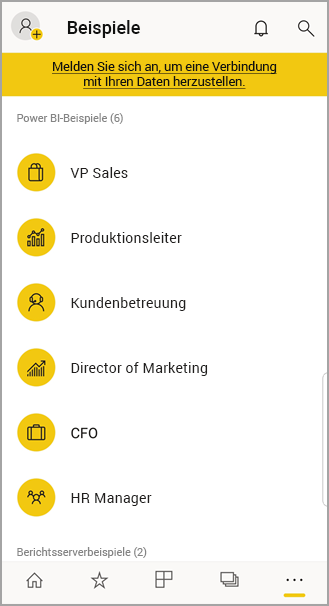

# Erste Schritte mit der mobilen Power BI-App auf Android-Geräten
Die Android-App für Microsoft Power BI bietet Ihnen die mobile BI-Umgebung für Power BI, Power BI-Berichtsserver und Reporting Services. Mit dem touchfähigen, mobilen Livezugriff auf lokale Server und die Cloud können Sie Ihre Unternehmensdashboards überall anzeigen und mit ihnen interagieren. Untersuchen Sie die Daten in Dashboards, und geben Sie diese dann über eine E-Mail oder SMS für Kollegen frei. 

Sie erstellen Power BI-Berichte in Power BI Desktop und veröffentlichen sie:

* [Veröffentlichen Sie sie im Power BI-Dienst](../../fundamentals/power-bi-overview.md), und erstellen Sie Dashboards.
* [Veröffentlichen Sie sie lokal auf dem Power BI-Berichtsserver](../../report-server/quickstart-create-powerbi-report.md).

In der Power BI-App für Android interagieren Sie anschließend mit Ihren Dashboards und Berichten, die sich auf lokalen Servern oder in der Cloud befinden können.

Machen Sie sich [mit den Neuerungen bei mobilen Power BI-Apps](../../mobile-whats-new-in-the-mobile-apps.md) vertraut.

## Voraussetzungen

### Abrufen der App

[Laden Sie die Power BI für Android-App von Google Play herunter](https://go.microsoft.com/fwlink/?LinkID=544867).
  
Power BI kann auf verschiedenen Android-Geräten mit dem Betriebssystem Android 5.0 oder höher ausgeführt werden. Um Ihr Gerät zu überprüfen, wechseln Sie zu **Einstellungen** > **Geräteinformationen** > **Android-Version**. 

**Starten beim Öffnen der App**    
Auch ohne Registrierung oder Anmeldung können Sie nach dem Öffnen der App die Anmeldeseiten durchlaufen, um sich einen schnellen Überblick über die Aufgaben zu verschaffen, die Sie mit der Power BI-App auf Ihrem Android-Gerät erledigen können. Tippen Sie auf **Überspringen** , um die Beispiele anzuzeigen und zu untersuchen und sich mit der App vertraut zu machen. Sie können auf der Startseite des Dashboards nach Belieben [zurück zu den Beispielen](mobile-android-app-get-started.md#try-the-power-bi-and-reporting-services-samples) navigieren.

Machen Sie sich [mit den Neuerungen bei mobilen Power BI-Apps](../../mobile-whats-new-in-the-mobile-apps.md) vertraut.

## Registrieren beim Power BI-Dienst im Web
Wenn Sie sich noch nicht registriert haben, wechseln Sie zum [Power BI-Dienst](https://powerbi.com/), um sich für ein eigenes Konto zum Erstellen und Speichern von Dashboards und Berichten und zum Zusammenführen Ihrer Daten zu registrieren. Melden Sie sich dann auf Ihrem Android-Gerät bei Power BI an, um die eigenen Dashboards von überall aus anzeigen zu können.

1. Tippen Sie im Power BI-Dienst auf [Registrieren](https://go.microsoft.com/fwlink/?LinkID=513879), um ein Power BI-Konto zu erstellen.
2. Beginnen Sie mit dem [Erstellen eigener Dashboards und Berichte](../../service-get-started.md).

## Erste Schritte mit der Power BI-App auf Ihrem Gerät
1. Öffnen Sie auf dem Startbildschirm Ihres Android-Geräts die Power BI für Android-App.
   
   
2. Zum Anmelden bei Power BI tippen Sie auf die Registerkarte **Power BI**, und geben Sie Ihre Anmeldeinformationen ein.

    Wenn eine Meldung angezeigt wird, dass Sie nicht bei Power BI angemeldet werden können, finden Sie unter [Meldung mit dem Hinweis, dass keine Anmeldung möglich ist](mobile-android-app-error-corporate-ssl-account-is-untrusted.md) ausführliche Informationen zur Behebung des Problems.

   Wenn Sie sich bei Ihren mobilen Berichten und KPIs von Reporting Services anmelden möchten, tippen Sie auf die Registerkarte **Berichtsserver**, und geben Sie Ihre Anmeldeinformationen ein.
   
   

## Testen der Power BI- und Reporting Services-Beispiele
Sie können die Power BI- und Reporting Services-Beispiele auch ohne Registrierung anzeigen und mit ihnen interagieren.

Tippen Sie auf der Navigationsleiste auf **Weitere Optionen** (...), und wählen Sie **Beispiele** aus, um auf die Beispiele zuzugreifen.

Auf eine Reihe von Power BI-Beispielen folgen mehrere Berichtsserverbeispiele.
   
   

   
   > [!NOTE]
   > In den Beispielen sind nicht alle Features verfügbar. Beispielsweise können Sie die Beispielberichte nicht anzeigen, die den Dashboards zugrunde liegen, Sie können die Beispiele nicht für andere Benutzer freigeben, und Sie können sie nicht als Favoriten festlegen. 
   > 
   >

## Suchen von Inhalten in Dashboards in mobilen Power BI-Apps

Tippen Sie in der Kopfzeile auf das Vergrößerungsglas, um mit der Suche nach Power BI-Inhalt zu beginnen.

## Anzeigen Ihrer als Favoriten gespeicherten Dashboards und Berichte
Tippen Sie auf der Navigationsleiste auf **Favoriten** (), um die Seite mit den Favoriten anzuzeigen. 

Weitere Informationen zu [Favoriten in den mobilen Power BI-Apps](mobile-apps-favorites.md).

## Unterstützung für die mobilen Power BI-Apps in Unternehmen
Unternehmen können Microsoft Intune verwenden, um Geräte und Anwendungen, einschließlich der mobilen Power BI-Apps für Android und iOS, zu verwalten.

Mit Microsoft Intune können Unternehmen Einstellungen steuern, z.B. eine Zugriffs-PIN anfordern, festlegen, wie Daten von der Anwendung verarbeitet werden, und sogar Anwendungsdaten verschlüsseln, wenn die App nicht genutzt wird.

> [!NOTE]
> Wenn Sie die mobile Power BI-App auf einem Android-Gerät verwenden und Ihr Unternehmen Microsoft Intune MAM konfiguriert hat, ist die Datenaktualisierung im Hintergrund deaktiviert. Power BI aktualisiert die Daten über den Power BI-Dienst im Web, wenn Sie das nächste Mal die App aufrufen.
> 
> 

Erfahren Sie mehr über das [Konfigurieren der mobilen Power BI-Apps mit Microsoft Intune](../../service-admin-mobile-intune.md). 

## Nächste Schritte
Hier finden Sie weitere Möglichkeiten, die die Android-Geräte-App für Power BI für Dashboards und Berichte in Power BI sowie für Berichte und KPIs im Webportal von Power BI-Berichtsserver und Reporting Services bietet.

### Power BI- Dashboards und -Berichte
* Zeigen Sie [Ihre Apps](../../service-create-distribute-apps.md) an.
* Zeigen Sie Ihre [Dashboards](../../mobile-apps-view-dashboard.md) an.
* Untersuchen Sie die [Kacheln auf Ihren Dashboards](../../mobile-tiles-in-the-mobile-apps.md).
* Öffnen der [Power BI-Berichte](../../mobile-reports-in-the-mobile-apps.md).
* Zeigen Sie [Ihre Apps](../../service-create-distribute-apps.md) an.
* [Kommentieren und teilen Sie Kacheln](mobile-annotate-and-share-a-tile-from-the-mobile-apps.md).
* Geben Sie [Dashboards](../../mobile-share-dashboard-from-the-mobile-apps.md) frei.
* [Scannen Sie einen Power BI-QR-Code](../../mobile-apps-qr-code.md) mit Ihrem Android-Smartphone, um das zugehörige Dashboard oder die zugehörige Kachel zu öffnen. 
* Zeigen Sie [Benachrichtigungen über Aktualisierungen Ihres Power BI-Kontos](../../mobile-apps-notification-center.md) an, z. B. Dashboards, die Kollegen für Sie freigegeben haben.

### Berichte und KPIs im Webportal von Power BI-Berichtsserver und Reporting Services
* [Zeigen Sie Berichte und KPIs im Webportal](mobile-app-ssrs-kpis-mobile-on-premises-reports.md) in der mobilen Power BI-App für Android-Geräte an.
* Erstellen Sie [KPIs im Webportal](https://docs.microsoft.com/sql/reporting-services/working-with-kpis-in-reporting-services).
* Erstellen Sie [Berichte in Power BI Desktop, und veröffentlichen Sie sie im Webportal von Power BI-Berichtsserver](../../report-server/quickstart-create-powerbi-report.md).

### Siehe auch
* [Herunterladen der Android-App](https://go.microsoft.com/fwlink/?LinkID=544867) aus dem Android App Store.
* [Was ist Power BI?](../../fundamentals/power-bi-overview.md)
* Haben Sie Fragen? [Stellen Sie Ihre Frage in der Power BI-Community.](https://community.powerbi.com/)

