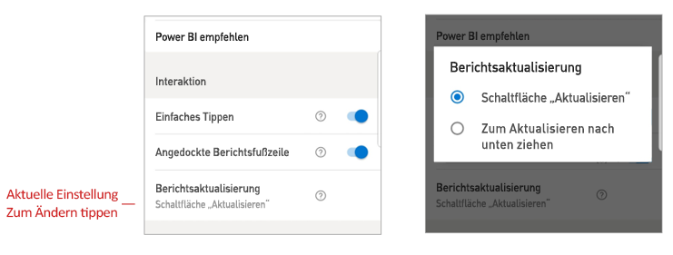

# Konfigurieren der Interaktionseinstellungen für Berichte

## Overview

Die mobile Power BI-App verfügt über mehrere konfigurierbare Interaktionseinstellungen, mit denen Sie steuern können, wie Sie mit Ihren Daten interagieren, und mit denen Sie das Verhalten einiger Elemente der mobilen Power BI-App definieren können. Die folgende Tabelle zeigt die derzeit verfügbaren Interaktionseinstellungen und die Geräte mit diesen Einstellungen.

|| Android-Smartphone | iPhone | Android-Tablet  | iPad |
|-|:-:|:-:|:-:|:-:|
| [Interaktionen durch einfaches Tippen oder Doppeltippen in Berichtsvisuals](#single-tap) |✔|✔|||
| [Mehrfachauswahl im Vergleich zur Einzelauswahl von Datenpunkten in Berichtsvisuals](#multi-select) |✔|✔|✔|✔|
| [Angedockte im Vergleich zu dynamischen Berichtsfußzeilen](#docked-report-footer) |✔|✔|||
| [Aktualisierung von Berichten entweder per Klick auf die Schaltfläche oder durch Ziehen nach unten](#report-refresh) |✔||||
|

Damit Sie zu den Interaktionseinstellungen gelangen, tippen Sie auf Ihr Profilbild, um die [Seitenleiste](./mobile-apps-home-page.md#header) zu öffnen, wählen Sie dann **Einstellungen** aus, und suchen Sie den Abschnitt **Interaktion**.

Die Interaktionseinstellungen werden in den folgenden Abschnitten beschrieben.

## Interaktionseinstellungen

### Einfaches Tippen
Wenn Sie die mobile Power BI-App herunterladen, ist hierfür die Interaktion durch einfaches Tippen festgelegt. Das bedeutet, wenn Sie auf ein Visual tippen, um eine Aktion durchzuführen (z. B. die Auswahl eines Datenschnittelements, die übergreifende Hervorhebung, das Klicken auf einen Link oder eine Schaltfläche usw.), dass dann durch das Tippen sowohl das Visual ausgewählt und auch die gewünschte Aktion ausgeführt wird.

Wenn Sie möchten, können Sie die Interaktion durch einfaches Tippen deaktivieren. Sie müssen dann mit der Interaktion durch Doppeltippen arbeiten. Bei der Interaktion durch Doppeltippen tippen Sie zuerst auf das Visual, das Sie auswählen möchten, und dann in das Visual, um Ihre gewünschte Aktion auszuführen.

### Mehrfachauswahl

Die Mehrfachauswahloption ermöglicht die Auswahl mehrerer Datenpunkte auf einer Berichtsseite. Wenn die Mehrfachauswahl aktiviert ist, wird jeder Datenpunkt, auf den Sie tippen, den anderen ausgewählten Datenpunkten hinzugefügt. Die kombinierten Ergebnisse werden anschließend automatisch in allen Visuals auf der Seite hervorgehoben. Wenn Sie bei deaktivierter Mehrfachauswahl tippen, um einen Datenpunkt auszuwählen, ersetzt die neue Auswahl die derzeitige.

Um die Auswahl eines Datenpunkts aufzuheben, tippen Sie erneut auf ihn.

>[!NOTE]
>Für Power BI-Visuals wird die Mehrfachauswahl nicht unterstützt.
>
>In der nächste Version von Power BI-Berichtsserver wird der Mehrfachauswahlmodus unterstützt.

### Angedockte Berichtsfußzeile

Die Einstellung zur angedockten Berichtsfußzeile bestimmt, ob die Berichtsfußzeile unten im Bericht angedockt bleibt (z. B. verankert und immer sichtbar), oder ob diese basierend auf Ihren Aktionen (z. B. Scrollen) im Bericht ausgeblendet wird oder nochmals eingeblendet wird.

Auf Android-Smartphones ist die Einstellung für die angedockte Berichtsfußzeile standardmäßig **on** (eingeschaltet), was bedeutet, dass die Berichtsfußzeile angedockt ist und unten im Bericht immer sichtbar ist. Legen Sie die Einstellung auf **off** (ausgeschaltet) fest, falls Sie eine dynamische Berichtsfußzeile haben möchten, die je nach Ihren Aktionen im Bericht ein- und ausgeblendet wird.

### Berichtsaktualisierung

Die Einstellung zur Aktualisierung des Berichts definiert, wie Sie Ihre Aktualisierungen der Berichte initiieren. Sie können entweder eine Schaltfläche zum Aktualisieren in allen Berichtskopfzeilen wählen, oder Sie können die Aktion „Zum Aktualisieren nach unten ziehen“ (einfaches Ziehen von oben nach unten) auf der Berichtsseite verwenden, um den Bericht zu aktualisieren. Die untere Abbildung zeigt die beiden Alternativen. 

Auf Android-Smartphones ist die Schaltfläche „Aktualisieren“ standardmäßig hinzugefügt.

Navigieren Sie zum Symbol zum Aktualisieren des Berichts in den Interaktionseinstellungen, um die Einstellung zum Aktualisieren des Berichts zu ändern. Die aktuelle Einstellung wird dann angezeigt. Tippen Sie auf den Wert, um ein Popupfenster zu öffnen, in dem Sie einen neuen Wert auswählen können.

## Remotekonfiguration

Interaktionen können auch remote durch einen Administrator konfiguriert werden, indem ein MDM-Tool mit einer App-Konfigurationsdatei verwendet wird. Somit ist es möglich, die Interaktionseinstellungen für Berichte in der Organisation oder für spezifische Benutzergruppen der Organisation zu standardisieren. Weitere Informationen finden Sie unter [Konfigurieren der Interaktion mithilfe der mobilen Geräteverwaltung](./mobile-app-configuration.md).

## Weitere Schritte
* [Interagieren mit Berichten](./mobile-reports-in-the-mobile-apps.md#interact-with-reports)
* [Konfigurieren der Interaktion mithilfe der mobilen Geräteverwaltung](./mobile-app-configuration.md)
