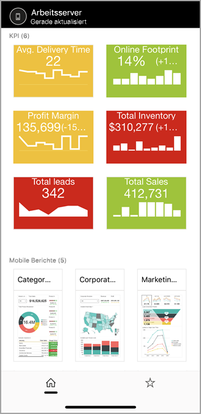
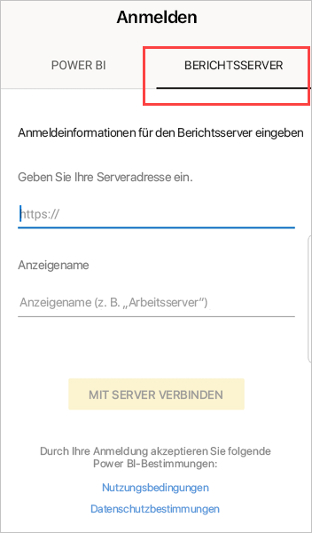
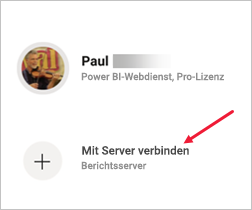
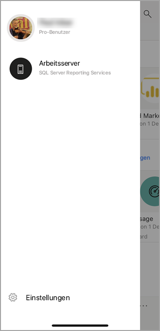
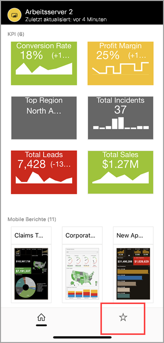
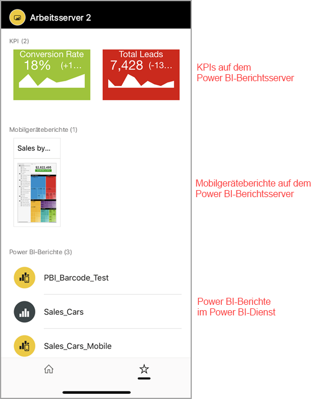

# Anzeigen lokaler Berichte und KPIs eines Berichtsservers in den mobilen Power BI-Apps

Die mobilen Power BI-Apps bieten touchfähigen, mobilen Livezugriff auf Ihre lokalen Geschäftsdaten in Power BI-Berichtsserver und SQL Server 2016 Reporting Services (SSRS).

Gilt für:

|  |  |  |  |
|:--- |:--- |:--- |:--- |
| iPhones |iPads |Android-Telefone |Android-Tablets |

## Das Wichtigste zuerst
**Die mobilen Apps dienen zum Anzeigen von Power BI-Inhalten und nicht zu deren Erstellung.**

* Sie und andere Berichtersteller in Ihrer Organisation können [Power BI-Berichte mit Power BI Desktop erstellen und dann im Webportal von Power BI-Berichtsserver veröffentlichen](../../report-server/quickstart-create-powerbi-report.md). 
* Sie können [KPIs direkt im Webportal](https://docs.microsoft.com/sql/reporting-services/working-with-kpis-in-reporting-services) erstellen, sie mithilfe von Ordnern organisieren und als Favoriten markieren, damit Sie sie später einfach wiederfinden. 
* [Erstellen Sie mobile Reporting Services-Berichte](https://docs.microsoft.com/sql/reporting-services/mobile-reports/create-mobile-reports-with-sql-server-mobile-report-publisher) mit dem SQL Server 2016 Enterprise Edition Mobile Report Publisher, und veröffentlichen Sie sie im [Reporting Services-Webportal](https://docs.microsoft.com/sql/reporting-services/web-portal-ssrs-native-mode).  

Stellen Sie dann in den mobilen Power BI-Apps eine Verbindung mit bis zu fünf Berichtsservern her, um die Power BI-Berichte und KPIs in Ordnern organisiert oder als Favoriten zusammengestellt anzuzeigen. 

## Untersuchen von Beispielen in den mobilen Apps ohne Serververbindung
Auch wenn Sie keinen Zugriff auf ein Reporting Services-Webportal haben, können Sie trotzdem die Features von mobilen Reporting Services-Berichten und KPIs untersuchen. 

1. Tippen Sie auf die globale Navigationsschaltfläche  in der linken oberen Ecke, und tippen Sie anschließend rechts oben auf das Zahnradsymbol .
2. Tippen Sie auf **Reporting Services-Beispiele**, und durchsuchen Sie diese, um mit den beispielhaften KPIs und mobilen Berichten zu interagieren.
   
   

## Herstellen einer Verbindung mit einem lokalen Berichtsserver
In den mobilen Power BI-Apps können Sie lokale Power BI-Berichte, mobile Reporting Services-Berichte und KPIs anzeigen. 

1. Öffnen Sie auf Ihrem Mobilgerät die Power BI-App.
2. Wenn Sie sich noch nicht bei Power BI angemeldet haben, tippen Sie auf **Berichtsserver**.
   
   
   
   Wenn Sie sich bereits bei der Power BI-App angemeldet haben, tippen Sie auf die globale Navigationsschaltfläche , und tippen Sie anschließend auf das Zahnradsymbol  in der rechten oberen Ecke.
3. Tippen Sie auf **Mit Server verbinden**.
   
    

     Die mobile App muss irgendwie auf den Server zugreifen können. Hierzu gibt es verschiedene Möglichkeiten:

    - Am einfachsten ist es, wenn sie sich im gleichen Netzwerk befindet oder über VPN verbunden ist.
    - Für eine Verbindung von außerhalb der Organisation kann auch ein Webanwendungsproxy verwendet werden. Weitere Informationen finden Sie unter [Herstellen einer Verbindung mit Reporting Services mithilfe von OAuth](mobile-oauth-ssrs.md). 
    - Öffnen Sie in der Firewall eine Verbindung (Port).

1. Geben Sie die Adresse des Servers sowie Ihren Benutzernamen und das Kennwort ein. Verwenden Sie dieses Format für die Adresse des Servers:
   
     `http://<servername>/reports`
   
     OR
   
     `https://<servername>/reports`
   
   Geben Sie vor der Verbindungszeichenfolge **http** oder **https** ein.
   
    
5. (Optional) Unter **Erweiterte Optionen** können Sie einen Anzeigenamen für den Server eingeben.
6. Jetzt wird auf der linken Navigationsleiste der Server angezeigt – in diesem Beispiel lautet dessen Name „power bi report server“.
   
   

## Herstellen einer Verbindung mit einem lokalen Berichtsserver in iOS

Wenn Sie Power BI in der mobilen iOS-App anzeigen, hat Ihr IT-Administrator womöglich eine App-Konfigurationsrichtlinie definiert. Falls dies der Fall ist, wird die Verbindung mit dem Berichtsserver optimiert, und Sie müssen nicht mehr so viele Informationen bereitstellen, wenn Sie eine Verbindung zu einem Berichtsserver herstellen. 

1. Es wird eine Meldung angezeigt, die besagt, dass Ihre mobile App mit einem Berichtsserver konfiguriert ist. Tippen Sie auf **Anmelden**.

    

2.  Auf der Seite **Mit Server verbinden** sind die Berichtsserverdetails bereits ausgefüllt. Tippen Sie auf **Verbinden**.

    

3. Geben Sie zur Authentifizierung ein Kennwort ein, tippen Sie dann auf **Anmelden**. 

    

Sie können nun KPIs und Power BI-Berichte, die auf dem Berichtsserver gespeichert sind, anzeigen und mit diesen interagieren.

## Anzeigen von Power BI-Berichten und KPIs in der Power BI-App
Power BI-Berichte, mobile Reporting Services-Berichte und KPIs werden in den gleichen Ordnern wie im Reporting Services-Webportal angezeigt. 

* Tippen Sie auf einen Power BI-Bericht . Er wird im Querformat geöffnet, und Sie können in der Power BI-App mit ihm interagieren.

    > [!NOTE]
  > Die Ausführung eines Drilldowns und Drillups ist derzeit in Power BI-Berichten auf einem Power BI-Berichtsserver nicht aktiviert.
  
    
* In Power BI Desktop können die Besitzer von Berichten [einen Bericht für die mobilen Power BI-Apps optimieren](../../desktop-create-phone-report.md). Auf dem Mobiltelefon sind optimierte Berichte mit einem speziellen Symbol,  gekennzeichnet, und sie weisen ein besonderes Layout auf.
  
    
* Tippen Sie auf einen KPI, um diesen im Fokusmodus anzuzeigen.
  
    

## Anzeigen Ihrer bevorzugten KPIs und Berichte
Sie können KPIs und Berichte im Webportal als Favoriten markieren und dann bequem neben den als Favoriten gespeicherten Power BI-Dashboards in einem Ordner auf Ihrem Mobilgerät anzeigen.

* Tippen Sie auf **Favoriten**.
  
   
  
   Ihre bevorzugten KPIs und Berichte aus dem Webportal befinden sich zusammen mit Power BI-Dashboards im Power BI-Dienst alle auf dieser Seite:
  
   

## Entfernen einer Verbindung mit einem Berichtsserver
1. Tippen Sie unten auf der linken Navigationsleiste auf **Einstellungen**.
2. Tippen Sie auf den Servernamen, dessen Verbindung Sie trennen möchten.
3. Tippen Sie auf **Server entfernen**.

## Nächste Schritte
* [Was ist Power BI?](../../power-bi-overview.md)  
* Haben Sie Fragen? [Stellen Sie Ihre Frage in der Power BI-Community.](http://community.powerbi.com/)

