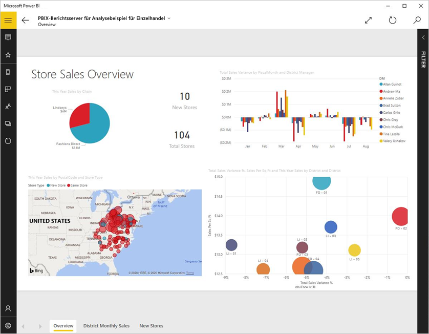
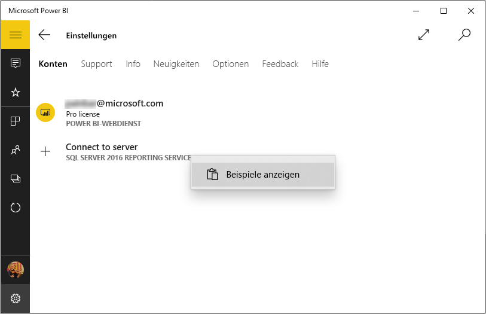
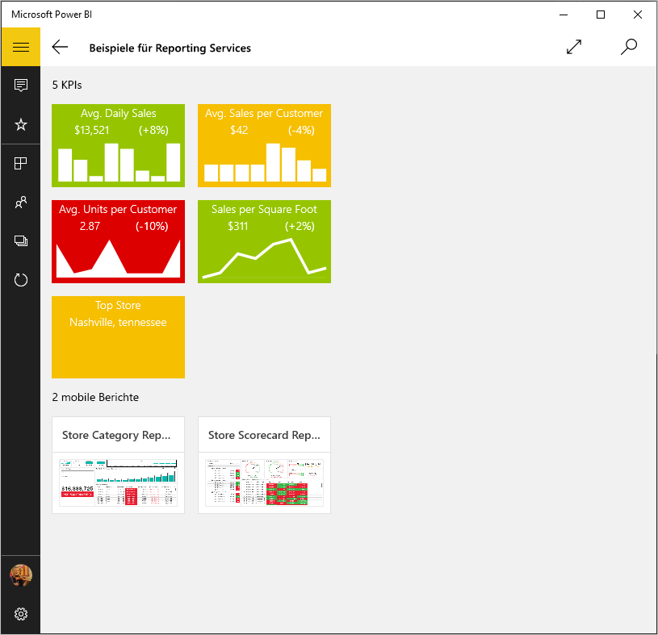
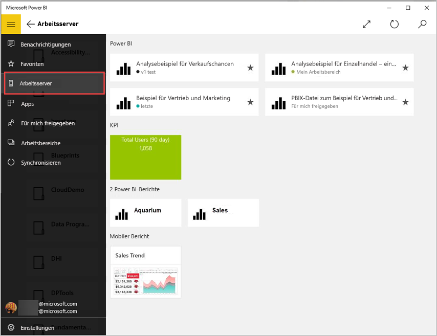
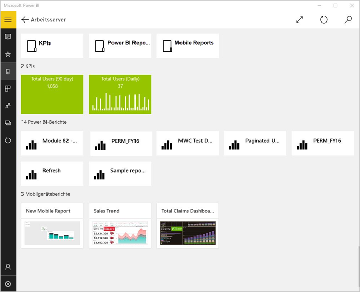
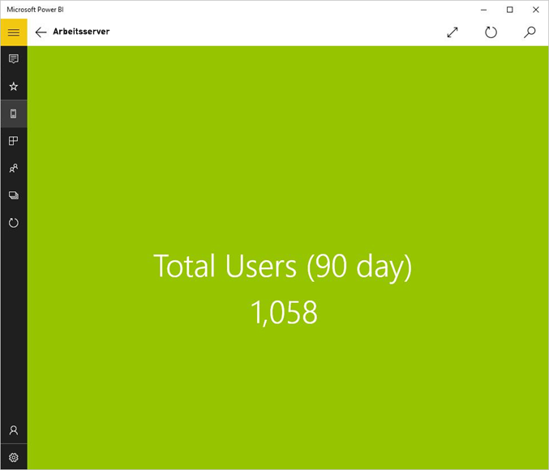
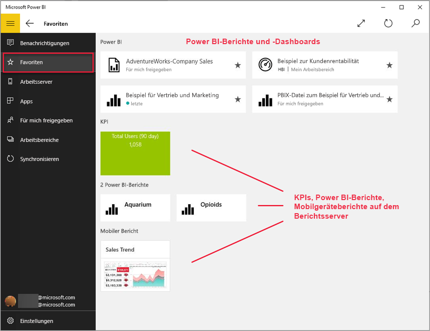
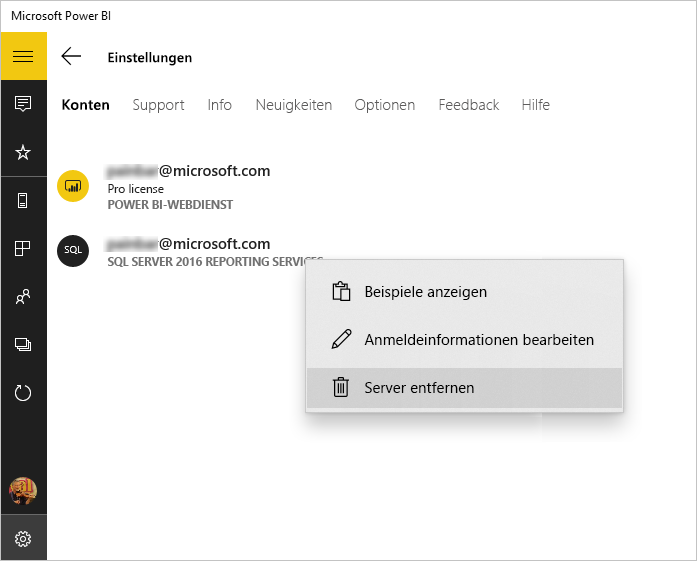

# Anzeigen lokaler Berichte und KPIs in der Power BI-Windows-App
Die Power BI-App für Windows 10 bietet touchfähigen, mobilen Livezugriff auf Ihre wichtigen lokalen Geschäftsdaten in SQL Server 2016 Reporting Services. 

## Das Wichtigste zuerst
[Erstellen Sie mobile Reporting Services-Berichte](https://msdn.microsoft.com/library/mt652547.aspx) mit dem SQL Server 2016 Enterprise Edition Mobile Report Publisher, und veröffentlichen Sie sie im [Reporting Services-Webportal](https://msdn.microsoft.com/library/mt637133.aspx). Erstellen Sie KPIs direkt im Webportal. Organisieren Sie sie in Ordnern, und markieren Sie Ihre Favoriten, damit Sie sie leicht finden können. 

Zeigen Sie dann in der Power BI-App für Windows 10 die KPIs, mobilen und Power BI-Berichte in Ordnern organisiert oder als Favoriten zusammengestellt an. 

> [!NOTE]
> Auf Ihrem Gerät muss Windows 10 ausgeführt werden. Die App funktioniert am besten auf Geräten mit mindestens 1 GB RAM und 8 GB internem Speicher.

>[!NOTE]
>Die Unterstützung für die mobile Power BI-App für **Smartphones mit Windows 10 Mobile** wird am 16. März 2021 eingestellt. [Weitere Informationen](https://go.microsoft.com/fwlink/?linkid=2121400)

## Erkunden von Beispielen ohne einen SQL Server 2016 Reporting Services-Server
Auch wenn Sie keinen Zugriff auf ein Reporting Services-Webportal haben, können Sie trotzdem die Funktionen von mobilen Reporting Services-Berichten untersuchen.

1. Öffnen Sie auf Ihrem Windows 10-Gerät die Power BI-App.
2. Tippen Sie auf die globale Navigationsschaltfläche  in der linken oberen Ecke.
3. Tippen Sie auf das Symbol **Einstellungen**, klicken Sie mit der rechten Maustaste auf **Mit Server verbinden** (oder halten Sie diese Option gedrückt), und tippen Sie dann auf **Beispiele anzeigen**.
   
   
4. Öffnen Sie dann den Ordner „Retail Reports“ oder „Sales Reports“, um die zugehörigen KPIs und mobilen Berichte auszuwählen.
   
   

Durchsuchen Sie die Beispiele, um mit KPIs und mobilen Berichten zu interagieren.

## Verbinden mit einem Reporting Services-Berichtsserver
1. Tippen Sie unten im Navigationsbereich auf **Einstellungen** .
2. Tippen Sie auf **Mit Server verbinden**.
3. Geben Sie die Adresse des Servers sowie Ihren Benutzernamen und das Kennwort ein. Verwenden Sie dieses Format für die Adresse des Servers:
   
     `https://<servername>/reports` ODER `https://<servername>/reports`
   
   > [!NOTE]
   > Geben Sie am Anfang der Verbindungszeichenfolge **http** oder **https** ein.
   > 
   > 
   
    Tippen Sie optional auf **Erweiterte Optionen**, um einen Namen für den Server einzugeben.
4. Tippen Sie auf das Häkchen, um die Verbindung herzustellen. 
   
   Der Server wird jetzt im Navigationsbereich angezeigt.
   
   
   
   >[!TIP]
   >Durch Tippen auf die globale Navigationsschaltfläche  können Sie jederzeit zwischen mobilen Reporting Services-Berichten und Ihren Dashboards im Power BI-Dienst wechseln. 
   > 

## Anzeigen von Reporting Services-KPIs und mobilen Berichten in der Power BI-App
Reporting Services-KPIs sowie mobile und Power BI-Berichte (Vorschau) werden in denselben Ordnern angezeigt, in denen sie sich im Reporting Services-Webportal befinden.

* Tippen Sie auf einen KPI, um diesen im Fokusmodus anzuzeigen.
  
    
* Tippen Sie auf einen mobilen Bericht, um ihn in der Power BI-App zu öffnen und mit ihm zu interagieren.
  
    

## Anzeigen Ihrer bevorzugten KPIs und Berichte
Sie können KPIs sowie mobile und Power BI-Berichte in Ihrem Reporting Services-Webportal als Favoriten markieren und dann bequem neben den als Favoriten gespeicherten Dashboards und Berichten in einem Ordner auf Ihrem Windows 10-Gerät anzeigen.

* Tippen Sie auf **Favoriten**.
  
   
  
   Ihre Favoriten vom Webportal werden alle auf dieser Seite angezeigt.
  
Weitere Informationen zu [Favoriten in den mobilen Power BI-Apps](mobile-apps-favorites.md).

## Entfernen einer Verbindung mit einem Berichtsserver
In der mobilen Power BI-App ist jeweils nur eine Verbindung mit einem Berichtsserver möglich. Wenn Sie eine Verbindung mit einem anderen Server herstellen möchten, müssen Sie erst die Verbindung mit dem aktuellen Server trennen.

1. Tippen Sie unten im Navigationsbereich auf **Einstellungen** .
2. Tippen Sie auf den Servernamen, dessen Verbindung Sie trennen möchten, und halten Sie ihn gedrückt.
3. Tippen Sie auf **Server entfernen**.
   
    

## Erstellen von mobilen Reporting Services-Berichten und KPIs
Reporting Services KPIs und mobile Berichte werden nicht in der mobilen Power BI-App erstellt. Sie werden im Publisher für mobile Berichte von SQL Server und im SQL Server 2016 Reporting Services-Webportal erstellt.

* [Erstellen Sie eigene mobile Reporting Services-Berichte](https://msdn.microsoft.com/library/mt652547.aspx), und veröffentlichen Sie sie in einem Reporting Services-Webportal.
* Erstellen Sie [KPIs in einem Reporting Services-Webportal](https://msdn.microsoft.com/library/mt683632.aspx).

## Weitere Schritte
* [Erste Schritte mit der mobilen Power BI-App für Windows 10](mobile-windows-10-phone-app-get-started.md)  
* [Was ist Power BI?](../../fundamentals/power-bi-overview.md)  
* Fragen? [Stellen Sie Ihre Frage in der Power BI-Community.](https://community.powerbi.com/)

